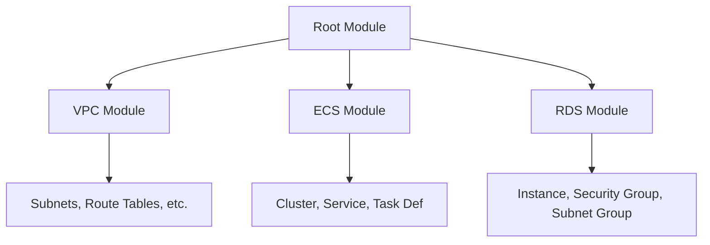

# How to Use Terraform Modules for Reusable AWS Infrastructure

Author: [nawazdhandala](https://github.com/nawazdhandala)

Tags: AWS, Terraform, Modules, Infrastructure

Description: Master Terraform modules to create reusable, composable AWS infrastructure components with proper input variables, outputs, versioning, and module composition.

---

Writing the same Terraform configuration over and over for each environment is tedious and error-prone. Modules fix this by packaging infrastructure into reusable components. Define a VPC once, parameterize it, and reuse it across dev, staging, and production with different settings.

This guide covers how to create, use, and manage Terraform modules effectively for AWS infrastructure.

## What's a Module?

A Terraform module is just a directory containing `.tf` files. Every Terraform configuration is technically a module - the one you run `terraform apply` in is called the "root module." When you call another module from your root module, that's a "child module."

The key concept is encapsulation. A module takes inputs (variables), creates resources, and exposes outputs. The caller doesn't need to know the implementation details.



## Module Structure

A well-organized module follows this structure.

```
modules/
  vpc/
    main.tf          # Resource definitions
    variables.tf     # Input variables
    outputs.tf       # Output values
    versions.tf      # Provider requirements
    README.md        # Documentation
```

## Creating a Simple Module

Let's build a module that creates a standard VPC for AWS workloads.

Define the input variables.

```hcl
# modules/vpc/variables.tf

variable "name" {
  description = "Name prefix for VPC resources"
  type        = string
}

variable "cidr_block" {
  description = "CIDR block for the VPC"
  type        = string
  default     = "10.0.0.0/16"
}

variable "azs" {
  description = "Availability zones to use"
  type        = list(string)
}

variable "private_subnet_cidrs" {
  description = "CIDR blocks for private subnets"
  type        = list(string)
}

variable "public_subnet_cidrs" {
  description = "CIDR blocks for public subnets"
  type        = list(string)
}

variable "enable_nat_gateway" {
  description = "Whether to create a NAT gateway"
  type        = bool
  default     = true
}

variable "tags" {
  description = "Tags to apply to all resources"
  type        = map(string)
  default     = {}
}
```

Define the resources.

```hcl
# modules/vpc/main.tf

resource "aws_vpc" "this" {
  cidr_block           = var.cidr_block
  enable_dns_hostnames = true
  enable_dns_support   = true

  tags = merge(var.tags, {
    Name = "${var.name}-vpc"
  })
}

resource "aws_subnet" "public" {
  count = length(var.public_subnet_cidrs)

  vpc_id                  = aws_vpc.this.id
  cidr_block              = var.public_subnet_cidrs[count.index]
  availability_zone       = var.azs[count.index]
  map_public_ip_on_launch = true

  tags = merge(var.tags, {
    Name = "${var.name}-public-${var.azs[count.index]}"
    Tier = "Public"
  })
}

resource "aws_subnet" "private" {
  count = length(var.private_subnet_cidrs)

  vpc_id            = aws_vpc.this.id
  cidr_block        = var.private_subnet_cidrs[count.index]
  availability_zone = var.azs[count.index]

  tags = merge(var.tags, {
    Name = "${var.name}-private-${var.azs[count.index]}"
    Tier = "Private"
  })
}

resource "aws_internet_gateway" "this" {
  vpc_id = aws_vpc.this.id

  tags = merge(var.tags, {
    Name = "${var.name}-igw"
  })
}

resource "aws_eip" "nat" {
  count  = var.enable_nat_gateway ? 1 : 0
  domain = "vpc"

  tags = merge(var.tags, {
    Name = "${var.name}-nat-eip"
  })
}

resource "aws_nat_gateway" "this" {
  count = var.enable_nat_gateway ? 1 : 0

  allocation_id = aws_eip.nat[0].id
  subnet_id     = aws_subnet.public[0].id

  tags = merge(var.tags, {
    Name = "${var.name}-nat"
  })
}

# Route tables
resource "aws_route_table" "public" {
  vpc_id = aws_vpc.this.id

  route {
    cidr_block = "0.0.0.0/0"
    gateway_id = aws_internet_gateway.this.id
  }

  tags = merge(var.tags, {
    Name = "${var.name}-public-rt"
  })
}

resource "aws_route_table" "private" {
  vpc_id = aws_vpc.this.id

  dynamic "route" {
    for_each = var.enable_nat_gateway ? [1] : []
    content {
      cidr_block     = "0.0.0.0/0"
      nat_gateway_id = aws_nat_gateway.this[0].id
    }
  }

  tags = merge(var.tags, {
    Name = "${var.name}-private-rt"
  })
}

resource "aws_route_table_association" "public" {
  count          = length(var.public_subnet_cidrs)
  subnet_id      = aws_subnet.public[count.index].id
  route_table_id = aws_route_table.public.id
}

resource "aws_route_table_association" "private" {
  count          = length(var.private_subnet_cidrs)
  subnet_id      = aws_subnet.private[count.index].id
  route_table_id = aws_route_table.private.id
}
```

Expose the outputs.

```hcl
# modules/vpc/outputs.tf

output "vpc_id" {
  description = "ID of the VPC"
  value       = aws_vpc.this.id
}

output "vpc_cidr_block" {
  description = "CIDR block of the VPC"
  value       = aws_vpc.this.cidr_block
}

output "public_subnet_ids" {
  description = "IDs of the public subnets"
  value       = aws_subnet.public[*].id
}

output "private_subnet_ids" {
  description = "IDs of the private subnets"
  value       = aws_subnet.private[*].id
}

output "nat_gateway_id" {
  description = "ID of the NAT gateway"
  value       = var.enable_nat_gateway ? aws_nat_gateway.this[0].id : null
}
```

## Using the Module

Call the module from your root configuration.

```hcl
# main.tf

module "vpc" {
  source = "./modules/vpc"

  name     = "production"
  cidr_block = "10.0.0.0/16"
  azs      = ["us-east-1a", "us-east-1b"]

  public_subnet_cidrs  = ["10.0.1.0/24", "10.0.2.0/24"]
  private_subnet_cidrs = ["10.0.10.0/24", "10.0.11.0/24"]

  enable_nat_gateway = true

  tags = {
    Environment = "production"
    ManagedBy   = "terraform"
  }
}

# Reference module outputs
resource "aws_security_group" "app" {
  vpc_id = module.vpc.vpc_id
  # ...
}
```

## Module Sources

Modules can come from several places.

```hcl
# Local path
module "vpc" {
  source = "./modules/vpc"
}

# Terraform Registry
module "vpc" {
  source  = "terraform-aws-modules/vpc/aws"
  version = "5.5.0"
}

# GitHub
module "vpc" {
  source = "github.com/myorg/terraform-modules//vpc?ref=v1.2.0"
}

# S3 bucket
module "vpc" {
  source = "s3::https://my-bucket.s3.amazonaws.com/modules/vpc.zip"
}
```

For production use, always pin module versions. An unversioned module reference means you'll get whatever's latest, which could include breaking changes.

## Module Composition

Compose bigger modules from smaller ones.

```hcl
# modules/web-app/main.tf
# A higher-level module that combines VPC, ECS, and RDS

module "vpc" {
  source = "../vpc"
  name   = var.app_name
  # ... vpc variables
}

module "database" {
  source    = "../rds"
  vpc_id    = module.vpc.vpc_id
  subnet_ids = module.vpc.private_subnet_ids
  # ... rds variables
}

module "service" {
  source     = "../ecs"
  vpc_id     = module.vpc.vpc_id
  subnet_ids = module.vpc.private_subnet_ids
  db_endpoint = module.database.endpoint
  # ... ecs variables
}
```

## Module Best Practices

Keep modules focused on a single concern. A VPC module creates a VPC and its networking components. It shouldn't also create databases or compute resources.

Always validate your inputs. Terraform 1.x supports validation blocks in variables.

```hcl
variable "cidr_block" {
  type        = string
  description = "CIDR block for the VPC"

  validation {
    condition     = can(cidrnetmask(var.cidr_block))
    error_message = "Must be a valid CIDR block."
  }
}
```

Use consistent naming. Prefix resource names with the module's purpose to avoid collisions.

For community modules, the Terraform AWS modules on the registry are battle-tested. Check out our guides on the [VPC module](https://oneuptime.com/blog/post/2026-02-12-terraform-aws-vpc-module/view) and [RDS module](https://oneuptime.com/blog/post/2026-02-12-terraform-aws-rds-module/view) for examples.

## Wrapping Up

Modules are what make Terraform scalable. Start by extracting repeated patterns into local modules, then consider publishing shared modules for your organization. Keep them focused, well-documented, and version-pinned for production use.

For creating your own modules, see our guide on [building custom Terraform modules for AWS](https://oneuptime.com/blog/post/2026-02-12-create-custom-terraform-module-for-aws/view).
