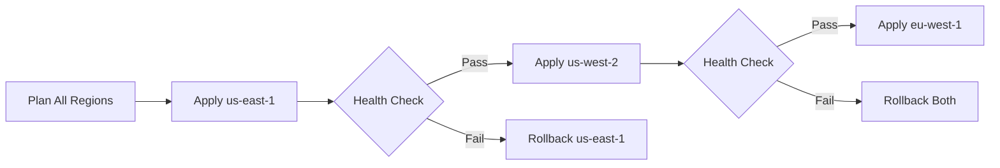

# How to Use Terraform Stacks for Multi-Region Deployments

Author: [nawazdhandala](https://github.com/nawazdhandala)

Tags: AWS, Terraform, Multi-Region, DevOps

Description: Learn how to use Terraform Stacks to manage and coordinate multi-region AWS deployments with consistent configurations and orchestrated rollouts.

---

Deploying infrastructure across multiple AWS regions introduces a coordination challenge that single-region Terraform doesn't prepare you for. You need the same resources in each region, but with region-specific differences like AMI IDs, endpoint URLs, and failover configurations. Terraform Stacks, introduced in Terraform 1.7+, provide a native solution for orchestrating these multi-region deployments.

## What Are Terraform Stacks?

Terraform Stacks sit above regular Terraform configurations. A Stack defines a set of components (each being a Terraform root module), deployment targets, and the orchestration logic that ties them together. Think of it as a way to deploy the same infrastructure across multiple regions or accounts with coordinated planning and applying.

The key concepts are:

- **Components**: Individual Terraform root modules that deploy specific infrastructure
- **Deployments**: Instances of your stack in different environments or regions
- **Orchestration rules**: Logic that controls rollout order and dependencies

## Project Structure

Here's what a multi-region Terraform Stack looks like:

```
stack/
  components/
    networking/
      main.tf
      variables.tf
      outputs.tf
    compute/
      main.tf
      variables.tf
      outputs.tf
    data/
      main.tf
      variables.tf
      outputs.tf
  deployments.tfdeploy.hcl
  components.tfstack.hcl
```

## Defining Components

Each component is a standard Terraform configuration. The networking component, for example:

```hcl
# stack/components/networking/main.tf
variable "region" {
  type = string
}

variable "cidr_block" {
  type = string
}

variable "environment" {
  type = string
}

provider "aws" {
  region = var.region
}

resource "aws_vpc" "main" {
  cidr_block           = var.cidr_block
  enable_dns_hostnames = true
  enable_dns_support   = true

  tags = {
    Name        = "${var.environment}-vpc"
    Environment = var.environment
    Region      = var.region
  }
}

resource "aws_subnet" "private" {
  count             = 3
  vpc_id            = aws_vpc.main.id
  cidr_block        = cidrsubnet(var.cidr_block, 4, count.index)
  availability_zone = data.aws_availability_zones.available.names[count.index]

  tags = {
    Name = "${var.environment}-private-${count.index}"
    Tier = "private"
  }
}

data "aws_availability_zones" "available" {
  state = "available"
}

output "vpc_id" {
  value = aws_vpc.main.id
}

output "private_subnet_ids" {
  value = aws_subnet.private[*].id
}
```

## Stack Configuration

The stack configuration file defines which components exist and how they relate:

```hcl
# stack/components.tfstack.hcl

# Variables that each deployment provides
variable "region" {
  type = string
}

variable "environment" {
  type = string
}

variable "cidr_block" {
  type = string
}

variable "role_arn" {
  type = string
}

# AWS provider configuration
provider "aws" "this" {
  config {
    region = var.region

    assume_role_with_web_identity {
      role_arn = var.role_arn
    }
  }
}

# Networking component
component "networking" {
  source = "./components/networking"

  providers = {
    aws = provider.aws.this
  }

  inputs = {
    region      = var.region
    environment = var.environment
    cidr_block  = var.cidr_block
  }
}

# Compute component - depends on networking
component "compute" {
  source = "./components/compute"

  providers = {
    aws = provider.aws.this
  }

  inputs = {
    region             = var.region
    environment        = var.environment
    vpc_id             = component.networking.vpc_id
    private_subnet_ids = component.networking.private_subnet_ids
  }
}
```

## Deployment Configuration

The deployment file defines where your stack gets deployed:

```hcl
# stack/deployments.tfdeploy.hcl

# Identity token for OIDC authentication
identity_token "aws" {
  audience = ["terraform-stacks"]
}

# Primary region deployment
deployment "us_east_1" {
  inputs = {
    region      = "us-east-1"
    environment = "prod"
    cidr_block  = "10.0.0.0/16"
    role_arn    = "arn:aws:iam::111111111111:role/terraform-stacks"
  }
}

# Secondary region deployment
deployment "us_west_2" {
  inputs = {
    region      = "us-west-2"
    environment = "prod"
    cidr_block  = "10.1.0.0/16"
    role_arn    = "arn:aws:iam::111111111111:role/terraform-stacks"
  }
}

# EU region deployment
deployment "eu_west_1" {
  inputs = {
    region      = "eu-west-1"
    environment = "prod"
    cidr_block  = "10.2.0.0/16"
    role_arn    = "arn:aws:iam::111111111111:role/terraform-stacks"
  }
}
```

## Orchestration Rules

Orchestration rules control the rollout order. You can deploy regions sequentially to limit blast radius:

```hcl
# stack/deployments.tfdeploy.hcl

# Deploy US East first as canary
orchestrate "auto_approve" "canary" {
  check {
    condition = context.plan.deployment == deployment.us_east_1
    reason    = "US East 1 is the canary region and auto-approves"
  }
}

# Deploy remaining regions after canary succeeds
orchestrate "auto_approve" "remaining" {
  check {
    condition = context.plan.deployment != deployment.us_east_1
    reason    = "Non-canary regions deploy after canary success"
  }

  depends_on = [
    orchestrate.auto_approve.canary
  ]
}
```

## Region-Specific Differences

Real multi-region deployments have region-specific variations. Handle these with locals in your components:

```hcl
# stack/components/compute/main.tf
variable "region" {
  type = string
}

# AMI IDs vary by region
locals {
  ami_map = {
    "us-east-1" = "ami-0abcdef1234567890"
    "us-west-2" = "ami-0fedcba0987654321"
    "eu-west-1" = "ami-0112233445566778899"
  }
}

resource "aws_instance" "app" {
  ami           = local.ami_map[var.region]
  instance_type = "t3.medium"
  subnet_id     = var.private_subnet_ids[0]

  tags = {
    Name   = "app-server"
    Region = var.region
  }
}
```

## Cross-Region Dependencies

Some resources need to reference resources in other regions. Route 53 failover routing is a common example:

```hcl
# Global DNS component that references regional ALBs
component "dns" {
  source = "./components/dns"

  providers = {
    aws = provider.aws.this
  }

  inputs = {
    primary_alb_dns   = component.compute.alb_dns_name
    primary_alb_zone  = component.compute.alb_zone_id
    region            = var.region
    environment       = var.environment
  }
}
```

## State Management

Each deployment within a Stack gets its own state file automatically. The state structure looks like:

```
stacks/
  us_east_1/
    networking.tfstate
    compute.tfstate
    data.tfstate
  us_west_2/
    networking.tfstate
    compute.tfstate
    data.tfstate
  eu_west_1/
    networking.tfstate
    compute.tfstate
    data.tfstate
```

This isolation means a failure in one region's deployment doesn't affect another region's state.

## Rolling Updates

One of the biggest advantages of Stacks is controlled rollouts. Instead of deploying everywhere simultaneously, you can:

1. Deploy to the canary region
2. Run health checks
3. Deploy to remaining regions one at a time
4. Roll back if any region fails



## Comparison with Other Approaches

Before Stacks, teams used several patterns for multi-region:

**Workspaces**: Simple but limited. All regions share the same configuration, making region-specific differences awkward.

**Terragrunt**: Powerful and mature, but adds another tool to manage. Dependencies between regions require careful configuration.

**Separate root modules per region**: Maximum flexibility but lots of code duplication.

Stacks give you the coordination benefits of Terragrunt with native Terraform support and built-in orchestration.

## Monitoring Multi-Region Deployments

After deploying across regions, you need visibility into what's running where. For monitoring your multi-region infrastructure, consider setting up centralized observability. Check out [structuring Terraform projects for large AWS deployments](https://oneuptime.com/blog/post/2026-02-12-structure-terraform-projects-large-aws-deployments/view) for more on organizing complex infrastructure.

## Summary

Terraform Stacks solve the real coordination problem of multi-region deployments. Instead of running Terraform separately in each region and hoping everything stays in sync, Stacks give you a single plan that covers all regions, orchestrated rollouts that limit blast radius, and isolated state per deployment. If you're managing AWS infrastructure across three or more regions, Stacks are worth evaluating as a replacement for ad-hoc scripting or Terragrunt.
