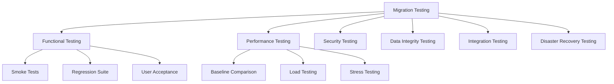

# How to Test Migrated Applications on AWS

Author: [nawazdhandala](https://github.com/nawazdhandala)

Tags: AWS, Migration, Testing, QA, Performance Testing

Description: Comprehensive testing strategies for applications migrated to AWS including functional, performance, security, and data integrity validation approaches.

---

You have migrated your application to AWS. The servers are running, the data is transferred, and everything looks fine on the surface. But "looks fine" is not the same as "works correctly." Testing migrated applications requires a structured approach that covers functionality, performance, security, and data integrity.

## Why Migration Testing is Different

Testing a migrated application is not the same as testing a new deployment. You are not looking for bugs in the code - you are looking for differences in behavior caused by the new environment. Different networking, different storage characteristics, different DNS resolution, and different OS configurations can all cause subtle issues that standard test suites miss.



## Phase 1: Smoke Testing

Before you run your full test suite, make sure the basics work. Smoke tests should take 15-30 minutes and give you a go/no-go on whether deeper testing is worth starting.

```bash
#!/bin/bash
# Quick smoke test script for migrated application

BASE_URL="https://app.example.com"
PASS=0
FAIL=0

# Test function that checks HTTP status
test_endpoint() {
    local name=$1
    local url=$2
    local expected_status=$3

    actual_status=$(curl -s -o /dev/null -w "%{http_code}" "$url")

    if [ "$actual_status" = "$expected_status" ]; then
        echo "PASS: $name (expected $expected_status, got $actual_status)"
        PASS=$((PASS + 1))
    else
        echo "FAIL: $name (expected $expected_status, got $actual_status)"
        FAIL=$((FAIL + 1))
    fi
}

# Core endpoint checks
test_endpoint "Health check" "$BASE_URL/health" "200"
test_endpoint "Login page" "$BASE_URL/login" "200"
test_endpoint "API status" "$BASE_URL/api/v1/status" "200"
test_endpoint "Static assets" "$BASE_URL/static/app.js" "200"
test_endpoint "Auth required" "$BASE_URL/api/v1/users" "401"

echo ""
echo "Results: $PASS passed, $FAIL failed"
```

## Phase 2: Functional Testing

Run your existing automated test suite against the AWS environment. But also add migration-specific test cases that check for environment-dependent behavior.

### Things That Commonly Break

**File paths**: If your application writes to /opt/data on Linux or C:\Data on Windows, verify those paths exist and have correct permissions on the new instances.

**DNS resolution**: Internal hostnames that resolved on-premises may not resolve in your VPC. Check every hostname your application connects to.

```python
# Test internal DNS resolution for all known dependencies
import socket
import json

dependencies = {
    "database": "orderdb.internal.example.com",
    "cache": "redis.internal.example.com",
    "queue": "rabbitmq.internal.example.com",
    "api_gateway": "api-internal.example.com",
    "ldap": "ldap.internal.example.com"
}

results = {}
for name, hostname in dependencies.items():
    try:
        ip = socket.gethostbyname(hostname)
        results[name] = {"hostname": hostname, "ip": ip, "status": "resolved"}
    except socket.gaierror:
        results[name] = {"hostname": hostname, "ip": None, "status": "FAILED"}

# Print results
for name, result in results.items():
    status_marker = "OK" if result["status"] == "resolved" else "FAIL"
    print(f"[{status_marker}] {name}: {result['hostname']} -> {result['ip']}")
```

**Timezone and locale**: AWS instances default to UTC. If your application assumes a local timezone, timestamps will be wrong.

**Environment variables**: Check that all required environment variables are set on the new instances.

```bash
# Compare environment variables between source and target
# Run on source, save output
env | sort > /tmp/source_env.txt

# On target
env | sort > /tmp/target_env.txt

# Compare (run where both files are accessible)
diff /tmp/source_env.txt /tmp/target_env.txt
```

**Certificate trust**: If your application makes HTTPS calls to internal services with private CA certificates, the new instances need those CA certs installed in their trust store.

## Phase 3: Performance Testing

This is where migrations often reveal problems. Different storage performance, network latency, and instance sizing can all affect response times.

### Establish a Baseline

Before you can say "performance is good on AWS," you need to know what "good" looked like on-premises.

```python
# Simple performance comparison tool
import requests
import time
import statistics

def benchmark_endpoint(url, num_requests=100):
    """
    Measure response times for an endpoint.
    Run this against both source and target environments.
    """
    latencies = []
    errors = 0

    for i in range(num_requests):
        try:
            start = time.time()
            response = requests.get(url, timeout=10)
            elapsed = (time.time() - start) * 1000  # ms

            if response.status_code == 200:
                latencies.append(elapsed)
            else:
                errors += 1
        except requests.exceptions.RequestException:
            errors += 1

    if latencies:
        return {
            "p50": statistics.median(latencies),
            "p95": sorted(latencies)[int(len(latencies) * 0.95)],
            "p99": sorted(latencies)[int(len(latencies) * 0.99)],
            "avg": statistics.mean(latencies),
            "errors": errors,
            "total": num_requests
        }
    return {"error": "All requests failed"}

# Compare source vs target
print("=== Source Environment ===")
source = benchmark_endpoint("https://source-app.example.com/api/v1/orders")
print(f"p50: {source['p50']:.1f}ms, p95: {source['p95']:.1f}ms, p99: {source['p99']:.1f}ms")

print("\n=== Target (AWS) Environment ===")
target = benchmark_endpoint("https://target-app.example.com/api/v1/orders")
print(f"p50: {target['p50']:.1f}ms, p95: {target['p95']:.1f}ms, p99: {target['p99']:.1f}ms")
```

### Load Testing

Use a tool like k6, Locust, or JMeter to simulate production traffic patterns against the AWS environment.

```javascript
// k6 load test script for migrated application
import http from 'k6/http';
import { check, sleep } from 'k6';

export let options = {
    stages: [
        { duration: '2m', target: 50 },   // ramp up to 50 users
        { duration: '5m', target: 50 },   // hold at 50
        { duration: '2m', target: 100 },  // ramp to 100
        { duration: '5m', target: 100 },  // hold at 100
        { duration: '2m', target: 0 },    // ramp down
    ],
    thresholds: {
        http_req_duration: ['p(95)<500'],  // 95% of requests under 500ms
        http_req_failed: ['rate<0.01'],    // less than 1% errors
    },
};

export default function () {
    // Simulate typical user journey
    let res = http.get('https://app.example.com/api/v1/products');
    check(res, { 'products loaded': (r) => r.status === 200 });
    sleep(1);

    res = http.get('https://app.example.com/api/v1/orders?limit=10');
    check(res, { 'orders loaded': (r) => r.status === 200 });
    sleep(2);
}
```

## Phase 4: Data Integrity Testing

After migration, verify that your data arrived intact. This is especially critical for database migrations.

```sql
-- Row count comparison queries
-- Run on both source and target databases

-- Table-level row counts
SELECT 'orders' as table_name, COUNT(*) as row_count FROM orders
UNION ALL
SELECT 'customers', COUNT(*) FROM customers
UNION ALL
SELECT 'products', COUNT(*) FROM products
UNION ALL
SELECT 'order_items', COUNT(*) FROM order_items;

-- Checksum comparison for critical tables
SELECT MD5(STRING_AGG(
    CONCAT(id::text, customer_id::text, total::text, status),
    ',' ORDER BY id
)) as orders_checksum
FROM orders;
```

For a deeper dive into data validation techniques, see our post on [validating data integrity after AWS migration](https://oneuptime.com/blog/post/2026-02-12-validate-data-integrity-after-aws-migration/view).

## Phase 5: Integration Testing

Your application does not live in isolation. Test every integration point.

```markdown
## Integration Test Checklist
- [ ] Database read/write operations
- [ ] Cache read/write/eviction
- [ ] Message queue publish/subscribe
- [ ] Email sending (SMTP or SES)
- [ ] File upload/download (S3 or EFS)
- [ ] External API calls (third-party services)
- [ ] Authentication (LDAP, SAML, OAuth)
- [ ] Logging pipeline (CloudWatch, ELK)
- [ ] Monitoring agents reporting data
- [ ] Backup jobs executing successfully
```

## Phase 6: Disaster Recovery Testing

Do not wait for a real disaster to find out if your DR plan works on AWS.

```bash
# Verify RDS automated backups are working
aws rds describe-db-instances \
    --db-instance-identifier orderdb \
    --query 'DBInstances[0].{BackupRetention:BackupRetentionPeriod,LatestBackup:LatestRestorableTime}'

# Test snapshot restore
aws rds restore-db-instance-from-db-snapshot \
    --db-instance-identifier orderdb-restore-test \
    --db-snapshot-identifier rds:orderdb-2026-02-12-00-00 \
    --db-instance-class db.m5.large

# Verify the restored instance is accessible and data is intact
```

## Building Your Test Report

Document everything. Your test report is evidence that the migration was successful.

```markdown
## Migration Test Report - Order Processing System
**Date**: 2026-02-12
**Environment**: Production (us-east-1)

### Summary
| Category | Total | Passed | Failed | Blocked |
|----------|-------|--------|--------|---------|
| Smoke | 10 | 10 | 0 | 0 |
| Functional | 245 | 243 | 2 | 0 |
| Performance | 8 | 7 | 1 | 0 |
| Data Integrity | 15 | 15 | 0 | 0 |
| Integration | 12 | 12 | 0 | 0 |
| DR | 3 | 3 | 0 | 0 |

### Failed Tests
1. **FUNC-087**: PDF export timeout - known issue, tracked as JIRA-456
2. **FUNC-192**: Legacy API endpoint returns 404 - deprecated, not migrated
3. **PERF-003**: p99 latency 12% higher than baseline - under investigation
```

## Conclusion

Testing a migrated application is about proving equivalence with your on-premises environment, not just checking that it starts up. Take the time to test systematically across all dimensions - functional, performance, data integrity, integration, and disaster recovery. The cost of thorough testing is a fraction of the cost of discovering issues in production after cutover.
