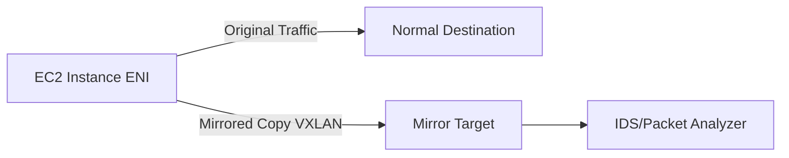

# How to Set Up Traffic Mirroring for Network Inspection

Author: [nawazdhandala](https://github.com/nawazdhandala)

Tags: AWS, VPC, Security, Networking, Monitoring

Description: Learn how to configure VPC Traffic Mirroring in AWS to copy network traffic from EC2 instances to inspection tools for security analysis, troubleshooting, and compliance monitoring.

---

VPC Traffic Mirroring lets you copy network traffic from the elastic network interface of an EC2 instance and send it to out-of-band security and monitoring appliances for inspection. Think of it as a virtual network TAP - you get a copy of the actual packets (not just flow metadata like VPC Flow Logs provide) without affecting the original traffic flow.

This is useful for intrusion detection systems, packet analysis, forensics, and compliance monitoring where you need to see the full packet contents, not just connection-level metadata.

## How Traffic Mirroring Works

Traffic Mirroring has three components:

1. **Mirror Source** - The network interface you want to copy traffic from
2. **Mirror Target** - Where the copied traffic goes (a network interface, a Network Load Balancer, or a Gateway Load Balancer endpoint)
3. **Mirror Filter** - Rules that determine which traffic to copy (to avoid overwhelming your target with unnecessary data)

The mirrored traffic is encapsulated in VXLAN and sent to the target. Your inspection tool needs to be able to decapsulate VXLAN to see the original packets.



## Creating a Mirror Target

First, set up where the mirrored traffic will go. The most common approach is sending it to a Network Load Balancer that distributes traffic across a fleet of inspection instances.

```bash
# Create a mirror target pointing to a Network Load Balancer
aws ec2 create-traffic-mirror-target \
  --network-load-balancer-arn arn:aws:elasticloadbalancing:us-east-1:123456789012:loadbalancer/net/inspection-nlb/abc123 \
  --description "IDS inspection fleet" \
  --tag-specifications 'ResourceType=traffic-mirror-target,Tags=[{Key=Name,Value=ids-target}]'
```

You can also use a single ENI as the target for simpler setups.

```bash
# Create a mirror target pointing to a single instance's ENI
aws ec2 create-traffic-mirror-target \
  --network-interface-id eni-inspection-instance \
  --description "Single inspection instance" \
  --tag-specifications 'ResourceType=traffic-mirror-target,Tags=[{Key=Name,Value=inspection-target}]'
```

## Creating Mirror Filters

Filters control which traffic gets mirrored. Without filters, you'd mirror everything, which generates a lot of data and network overhead. Typically you want to focus on specific ports or protocols.

```bash
# Create a mirror filter
aws ec2 create-traffic-mirror-filter \
  --description "Inspect web and database traffic" \
  --tag-specifications 'ResourceType=traffic-mirror-filter,Tags=[{Key=Name,Value=web-db-filter}]'
```

Now add rules to the filter. Each rule specifies a direction (inbound or outbound), traffic characteristics, and whether to accept (mirror) or reject (don't mirror) matching traffic.

```bash
# Mirror inbound HTTP traffic
aws ec2 create-traffic-mirror-filter-rule \
  --traffic-mirror-filter-id tmf-0123456789abcdef0 \
  --traffic-direction ingress \
  --rule-number 100 \
  --rule-action accept \
  --protocol 6 \
  --destination-port-range FromPort=80,ToPort=80 \
  --source-cidr-block 0.0.0.0/0 \
  --destination-cidr-block 0.0.0.0/0

# Mirror inbound HTTPS traffic
aws ec2 create-traffic-mirror-filter-rule \
  --traffic-mirror-filter-id tmf-0123456789abcdef0 \
  --traffic-direction ingress \
  --rule-number 110 \
  --rule-action accept \
  --protocol 6 \
  --destination-port-range FromPort=443,ToPort=443 \
  --source-cidr-block 0.0.0.0/0 \
  --destination-cidr-block 0.0.0.0/0

# Mirror inbound database traffic (PostgreSQL)
aws ec2 create-traffic-mirror-filter-rule \
  --traffic-mirror-filter-id tmf-0123456789abcdef0 \
  --traffic-direction ingress \
  --rule-number 120 \
  --rule-action accept \
  --protocol 6 \
  --destination-port-range FromPort=5432,ToPort=5432 \
  --source-cidr-block 0.0.0.0/0 \
  --destination-cidr-block 0.0.0.0/0

# Don't mirror SSH traffic (reduce noise)
aws ec2 create-traffic-mirror-filter-rule \
  --traffic-mirror-filter-id tmf-0123456789abcdef0 \
  --traffic-direction ingress \
  --rule-number 50 \
  --rule-action reject \
  --protocol 6 \
  --destination-port-range FromPort=22,ToPort=22 \
  --source-cidr-block 0.0.0.0/0 \
  --destination-cidr-block 0.0.0.0/0

# Mirror all other inbound TCP traffic
aws ec2 create-traffic-mirror-filter-rule \
  --traffic-mirror-filter-id tmf-0123456789abcdef0 \
  --traffic-direction ingress \
  --rule-number 200 \
  --rule-action accept \
  --protocol 6 \
  --source-cidr-block 0.0.0.0/0 \
  --destination-cidr-block 0.0.0.0/0
```

Like NACLs, filter rules are evaluated in order by rule number. The SSH reject rule at 50 is evaluated before the catch-all accept at 200, so SSH traffic won't be mirrored.

## Creating Mirror Sessions

The mirror session connects a source ENI to a target through a filter.

```bash
# Create a traffic mirror session
aws ec2 create-traffic-mirror-session \
  --traffic-mirror-target-id tmt-0123456789abcdef0 \
  --network-interface-id eni-source-instance \
  --traffic-mirror-filter-id tmf-0123456789abcdef0 \
  --session-number 1 \
  --description "Mirror web server traffic" \
  --tag-specifications 'ResourceType=traffic-mirror-session,Tags=[{Key=Name,Value=webserver-mirror}]'
```

The `session-number` is used when you have multiple mirror sessions on the same source ENI. Lower numbers have higher priority if there's contention for bandwidth.

You can also truncate mirrored packets to reduce bandwidth usage.

```bash
# Create a session that only captures the first 128 bytes of each packet
aws ec2 create-traffic-mirror-session \
  --traffic-mirror-target-id tmt-0123456789abcdef0 \
  --network-interface-id eni-source-instance \
  --traffic-mirror-filter-id tmf-0123456789abcdef0 \
  --session-number 1 \
  --packet-length 128
```

Capturing just the headers (first 128 bytes) is often enough for protocol analysis and IDS signatures while dramatically reducing the bandwidth impact.

## Setting Up the Inspection Instance

Your inspection instance needs to handle VXLAN-encapsulated traffic. Here's a basic setup using tcpdump to verify traffic is arriving.

```bash
# On the inspection instance: install and configure VXLAN decapsulation
# First, verify you're receiving mirrored traffic
sudo tcpdump -i eth0 -n port 4789

# Create a VXLAN interface to see the inner packets
sudo ip link add vxlan0 type vxlan id 1234 dev eth0 local 10.0.3.5 dstport 4789
sudo ip link set vxlan0 up

# Now capture the decapsulated traffic
sudo tcpdump -i vxlan0 -n
```

For a production setup, you'd typically run Suricata, Zeek (formerly Bro), or another network security monitoring tool on the inspection instance.

```bash
# Example Suricata configuration for receiving mirrored traffic
# /etc/suricata/suricata.yaml (relevant section)
af-packet:
  - interface: eth0
    cluster-id: 99
    cluster-type: cluster_flow
    defrag: yes
    use-mmap: yes
```

## Terraform Configuration

```hcl
resource "aws_ec2_traffic_mirror_filter" "main" {
  description = "Mirror web traffic"

  tags = {
    Name = "web-traffic-filter"
  }
}

resource "aws_ec2_traffic_mirror_filter_rule" "http_in" {
  traffic_mirror_filter_id = aws_ec2_traffic_mirror_filter.main.id
  traffic_direction        = "ingress"
  rule_number              = 100
  rule_action              = "accept"
  protocol                 = 6
  destination_port_range {
    from_port = 80
    to_port   = 80
  }
  source_cidr_block      = "0.0.0.0/0"
  destination_cidr_block = "0.0.0.0/0"
}

resource "aws_ec2_traffic_mirror_target" "nlb" {
  network_load_balancer_arn = aws_lb.inspection.arn
}

resource "aws_ec2_traffic_mirror_session" "web" {
  traffic_mirror_filter_id = aws_ec2_traffic_mirror_filter.main.id
  traffic_mirror_target_id = aws_ec2_traffic_mirror_target.nlb.id
  network_interface_id     = aws_instance.web.primary_network_interface_id
  session_number           = 1
}
```

## Limitations and Considerations

- Traffic mirroring is supported on Nitro-based instance types only
- Each ENI can be the source for a limited number of mirror sessions
- Mirrored traffic counts toward your network bandwidth, so budget accordingly
- VXLAN overhead adds about 50 bytes per packet
- Cross-AZ mirroring incurs data transfer charges

For flow-level analysis without full packet capture, VPC Flow Logs might be sufficient and more cost-effective. See https://oneuptime.com/blog/post/enable-and-analyze-vpc-flow-logs/view for details.

Traffic Mirroring is one of those tools you set up before you need it. When a security incident happens, having packet-level visibility into what's crossing your network can be the difference between a fast resolution and weeks of guessing.
