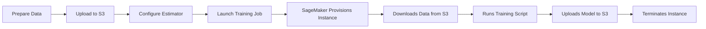

# How to Train a Machine Learning Model with SageMaker

Author: [nawazdhandala](https://github.com/nawazdhandala)

Tags: AWS, SageMaker, Machine Learning, Model Training

Description: A complete guide to training machine learning models on Amazon SageMaker, covering data preparation, training jobs, and best practices for efficient model training.

---

Training machine learning models on your local machine works fine until it doesn't. Maybe you've got a dataset that won't fit in memory, or training takes 12 hours on your laptop. That's where Amazon SageMaker comes in. It lets you spin up powerful training instances, run your job, and tear them down automatically when it's done. You only pay for what you use.

This guide walks through the entire training workflow on SageMaker - from getting your data ready to launching training jobs and retrieving your trained model.

## The SageMaker Training Workflow

Before diving into code, let's understand how SageMaker training works at a high level.



The key insight is that SageMaker training jobs are ephemeral. SageMaker spins up a fresh instance, downloads your data and code, trains the model, saves the artifacts to S3, and shuts everything down. No lingering instances eating your budget.

## Preparing Your Data

SageMaker expects training data in S3. Let's prepare a dataset and upload it.

```python
import pandas as pd
import numpy as np
import sagemaker
import boto3
from sklearn.model_selection import train_test_split

# Create a SageMaker session
session = sagemaker.Session()
bucket = session.default_bucket()
prefix = 'training-demo'

# For this example, we'll create a synthetic classification dataset
from sklearn.datasets import make_classification

X, y = make_classification(
    n_samples=10000,
    n_features=20,
    n_informative=15,
    n_redundant=3,
    random_state=42
)

# Split into train and validation sets
X_train, X_val, y_train, y_val = train_test_split(
    X, y, test_size=0.2, random_state=42
)

# SageMaker's built-in algorithms expect CSV with the target in the first column
train_data = pd.DataFrame(np.column_stack([y_train, X_train]))
val_data = pd.DataFrame(np.column_stack([y_val, X_val]))

# Save locally first
train_data.to_csv('train.csv', header=False, index=False)
val_data.to_csv('validation.csv', header=False, index=False)

# Upload to S3
train_path = session.upload_data('train.csv', bucket=bucket, key_prefix=f'{prefix}/train')
val_path = session.upload_data('validation.csv', bucket=bucket, key_prefix=f'{prefix}/validation')

print(f"Training data: {train_path}")
print(f"Validation data: {val_path}")
```

## Training with a Built-In Algorithm

The fastest way to get started is with SageMaker's built-in algorithms. They're optimized for distributed training and don't require you to write any training code.

Let's use XGBoost, one of the most popular algorithms for tabular data.

```python
import sagemaker
from sagemaker import image_uris
from sagemaker.inputs import TrainingInput

session = sagemaker.Session()
role = sagemaker.get_execution_role()
region = session.boto_region_name

# Get the XGBoost container image URI
xgb_image = image_uris.retrieve(
    framework='xgboost',
    region=region,
    version='1.7-1'  # Use a recent stable version
)

# Create an Estimator - this configures your training job
xgb_estimator = sagemaker.estimator.Estimator(
    image_uri=xgb_image,
    role=role,
    instance_count=1,
    instance_type='ml.m5.xlarge',
    output_path=f's3://{bucket}/{prefix}/output',
    sagemaker_session=session,
    max_run=3600,  # Maximum training time in seconds
    tags=[
        {'Key': 'Project', 'Value': 'training-demo'},
        {'Key': 'Team', 'Value': 'data-science'}
    ]
)

# Set hyperparameters for XGBoost
xgb_estimator.set_hyperparameters(
    objective='binary:logistic',
    num_round=200,
    max_depth=6,
    eta=0.1,
    subsample=0.8,
    colsample_bytree=0.8,
    eval_metric='auc'
)

# Define the data channels
train_input = TrainingInput(
    s3_data=train_path,
    content_type='text/csv'
)

val_input = TrainingInput(
    s3_data=val_path,
    content_type='text/csv'
)

# Launch the training job
xgb_estimator.fit(
    inputs={
        'train': train_input,
        'validation': val_input
    },
    job_name='xgb-training-demo',
    wait=True,  # Set to False to run asynchronously
    logs='All'  # Stream training logs to your notebook
)
```

When you call `.fit()`, SageMaker does several things behind the scenes: it provisions the ml.m5.xlarge instance you specified, pulls the XGBoost container, copies your training data from S3, runs the algorithm with your hyperparameters, evaluates against the validation set, and uploads the trained model artifact back to S3.

## Training with Your Own Script

Built-in algorithms are great, but most real projects need custom training code. SageMaker supports "Script Mode" where you provide your own training script and SageMaker handles the infrastructure.

First, create your training script.

```python
# train_script.py - This runs on the SageMaker training instance

import argparse
import os
import pandas as pd
import numpy as np
import joblib
from sklearn.ensemble import RandomForestClassifier
from sklearn.metrics import accuracy_score, roc_auc_score

def parse_args():
    """Parse hyperparameters passed by SageMaker."""
    parser = argparse.ArgumentParser()

    # Hyperparameters
    parser.add_argument('--n-estimators', type=int, default=100)
    parser.add_argument('--max-depth', type=int, default=10)
    parser.add_argument('--min-samples-split', type=int, default=2)

    # SageMaker-specific environment variables
    parser.add_argument('--model-dir', type=str, default=os.environ.get('SM_MODEL_DIR'))
    parser.add_argument('--train', type=str, default=os.environ.get('SM_CHANNEL_TRAIN'))
    parser.add_argument('--validation', type=str, default=os.environ.get('SM_CHANNEL_VALIDATION'))

    return parser.parse_args()

def load_data(data_dir):
    """Load CSV files from the specified directory."""
    # SageMaker copies S3 data to the channel directories
    files = [os.path.join(data_dir, f) for f in os.listdir(data_dir) if f.endswith('.csv')]
    df = pd.concat([pd.read_csv(f, header=None) for f in files])

    # First column is the target
    y = df.iloc[:, 0].values
    X = df.iloc[:, 1:].values
    return X, y

if __name__ == '__main__':
    args = parse_args()

    print(f"Training with n_estimators={args.n_estimators}, max_depth={args.max_depth}")

    # Load training and validation data
    X_train, y_train = load_data(args.train)
    X_val, y_val = load_data(args.validation)

    print(f"Training samples: {len(X_train)}, Validation samples: {len(X_val)}")

    # Train the model
    model = RandomForestClassifier(
        n_estimators=args.n_estimators,
        max_depth=args.max_depth,
        min_samples_split=args.min_samples_split,
        random_state=42,
        n_jobs=-1
    )
    model.fit(X_train, y_train)

    # Evaluate
    train_acc = accuracy_score(y_train, model.predict(X_train))
    val_acc = accuracy_score(y_val, model.predict(X_val))
    val_auc = roc_auc_score(y_val, model.predict_proba(X_val)[:, 1])

    print(f"Train accuracy: {train_acc:.4f}")
    print(f"Validation accuracy: {val_acc:.4f}")
    print(f"Validation AUC: {val_auc:.4f}")

    # Save the model - SageMaker uploads this directory to S3
    joblib.dump(model, os.path.join(args.model_dir, 'model.joblib'))
    print("Model saved successfully")
```

Now launch the training job using the SKLearn estimator.

```python
from sagemaker.sklearn import SKLearn

# Create a scikit-learn estimator
sklearn_estimator = SKLearn(
    entry_point='train_script.py',
    source_dir='./scripts',  # Directory containing your training script
    role=role,
    instance_count=1,
    instance_type='ml.m5.xlarge',
    framework_version='1.2-1',
    py_version='py3',
    hyperparameters={
        'n-estimators': 200,
        'max-depth': 15,
        'min-samples-split': 5
    },
    output_path=f's3://{bucket}/{prefix}/sklearn-output',
    sagemaker_session=session
)

# Kick off training
sklearn_estimator.fit({
    'train': train_path,
    'validation': val_path
})
```

## Distributed Training

When your dataset is large or your model is complex, you can distribute training across multiple instances. SageMaker handles the distributed computing setup for you.

```python
from sagemaker.pytorch import PyTorch

# PyTorch distributed training example
pytorch_estimator = PyTorch(
    entry_point='distributed_train.py',
    source_dir='./scripts',
    role=role,
    instance_count=4,  # Train across 4 instances
    instance_type='ml.p3.2xlarge',  # GPU instances
    framework_version='2.0',
    py_version='py310',
    distribution={
        'torch_distributed': {
            'enabled': True  # Enables PyTorch's DistributedDataParallel
        }
    },
    hyperparameters={
        'epochs': 50,
        'batch-size': 64,
        'learning-rate': 0.001
    }
)

pytorch_estimator.fit({
    'train': f's3://{bucket}/{prefix}/train',
    'validation': f's3://{bucket}/{prefix}/validation'
})
```

## Monitoring Training Jobs

Once a training job is running, you can monitor it from multiple places. The SageMaker console shows real-time metrics, and you can also check programmatically.

```python
# Check the status of your training job
client = boto3.client('sagemaker')

job_name = xgb_estimator.latest_training_job.name

response = client.describe_training_job(TrainingJobName=job_name)

print(f"Job Status: {response['TrainingJobStatus']}")
print(f"Instance Type: {response['ResourceConfig']['InstanceType']}")
print(f"Training Time: {response.get('TrainingTimeInSeconds', 'Still running')} seconds")

# Get the final metrics
if 'FinalMetricDataList' in response:
    for metric in response['FinalMetricDataList']:
        print(f"{metric['MetricName']}: {metric['Value']:.4f}")
```

For production training jobs, it's worth setting up monitoring through a platform like [OneUptime](https://oneuptime.com/blog/post/aws-cloudwatch-alerting/view) so you get alerted if jobs fail or take longer than expected.

## Retrieving Your Trained Model

After training completes, SageMaker stores the model artifact in S3. You can download it or use it directly for deployment.

```python
# Get the S3 location of the trained model
model_artifact = xgb_estimator.model_data
print(f"Model artifact: {model_artifact}")

# Download the model locally if you need to inspect it
import boto3

s3 = boto3.client('s3')
s3.download_file(
    bucket,
    f'{prefix}/output/xgb-training-demo/output/model.tar.gz',
    'model.tar.gz'
)

# Extract and inspect
import tarfile
with tarfile.open('model.tar.gz', 'r:gz') as tar:
    tar.extractall('model_output')
```

## Best Practices

Here are some things I've learned from running lots of training jobs on SageMaker:

- **Tag everything** - Use tags on training jobs so you can track costs by project and team
- **Start small** - Test your training script on a small instance with a subset of data before scaling up
- **Use managed spot training** - You can save up to 90% on training costs by using spot instances (see our post on [reducing SageMaker costs with spot instances](https://oneuptime.com/blog/post/reduce-sagemaker-training-costs-spot-instances/view))
- **Set max_run limits** - Always set a maximum training time to avoid runaway jobs
- **Version your data** - Keep training data versioned in S3 so you can reproduce results

## Wrapping Up

SageMaker takes the infrastructure headaches out of model training. Whether you're using built-in algorithms for quick experiments or bringing your own training scripts for custom models, the workflow stays consistent: prepare data, configure an estimator, call fit, get your model. The real power comes when you combine training with SageMaker's other features like [experiment tracking](https://oneuptime.com/blog/post/sagemaker-experiments-tracking/view) and [model registry](https://oneuptime.com/blog/post/sagemaker-model-registry/view) to build a proper MLOps workflow.
