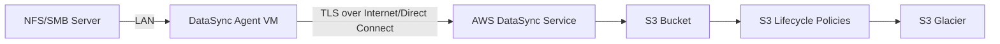

# How to Transfer Data Between On-Premises and S3 with DataSync

Author: [nawazdhandala](https://github.com/nawazdhandala)

Tags: AWS, DataSync, S3, Data Migration, On-Premises

Description: Step-by-step walkthrough of using AWS DataSync to transfer data from on-premises NFS or SMB storage to Amazon S3, with filtering, scheduling, and verification.

---

Getting large amounts of data from your data center into S3 is one of the most common use cases for AWS DataSync. Whether you're doing a one-time migration or setting up ongoing replication, DataSync makes the process significantly easier than rolling your own scripts with the AWS CLI. It handles parallel transfers, automatic retries, integrity checks, and can preserve file metadata as S3 object tags.

This guide focuses specifically on the on-premises-to-S3 workflow, covering everything from agent setup to filtering and post-transfer verification.

## Architecture Overview

The data flow looks like this: your on-premises storage (NFS or SMB) connects to a DataSync agent running as a VM in your data center. The agent securely transfers data over TLS to the DataSync service, which writes it to your S3 bucket.



## Step 1: Prepare Your S3 Bucket

Set up the destination bucket with the right configuration:

```bash
# Create the S3 bucket
aws s3api create-bucket \
  --bucket my-onprem-migration \
  --region us-east-1

# Enable versioning for safety
aws s3api put-bucket-versioning \
  --bucket my-onprem-migration \
  --versioning-configuration Status=Enabled

# Set up server-side encryption
aws s3api put-bucket-encryption \
  --bucket my-onprem-migration \
  --server-side-encryption-configuration '{
    "Rules": [{
      "ApplyServerSideEncryptionByDefault": {
        "SSEAlgorithm": "aws:kms",
        "KMSMasterKeyID": "alias/s3-encryption-key"
      },
      "BucketKeyEnabled": true
    }]
  }'
```

Enabling bucket keys reduces KMS costs by using a bucket-level key instead of making a KMS API call for every object.

## Step 2: Create the IAM Role for DataSync

DataSync needs an IAM role that grants it access to your S3 bucket:

```bash
# Create the trust policy
aws iam create-role \
  --role-name DataSyncS3AccessRole \
  --assume-role-policy-document '{
    "Version": "2012-10-17",
    "Statement": [{
      "Effect": "Allow",
      "Principal": {"Service": "datasync.amazonaws.com"},
      "Action": "sts:AssumeRole"
    }]
  }'

# Attach a policy scoped to the specific bucket
aws iam put-role-policy \
  --role-name DataSyncS3AccessRole \
  --policy-name S3BucketAccess \
  --policy-document '{
    "Version": "2012-10-17",
    "Statement": [
      {
        "Effect": "Allow",
        "Action": [
          "s3:GetBucketLocation",
          "s3:ListBucket",
          "s3:ListBucketMultipartUploads"
        ],
        "Resource": "arn:aws:s3:::my-onprem-migration"
      },
      {
        "Effect": "Allow",
        "Action": [
          "s3:AbortMultipartUpload",
          "s3:DeleteObject",
          "s3:GetObject",
          "s3:ListMultipartUploadParts",
          "s3:PutObject",
          "s3:GetObjectTagging",
          "s3:PutObjectTagging"
        ],
        "Resource": "arn:aws:s3:::my-onprem-migration/*"
      }
    ]
  }'
```

## Step 3: Deploy and Activate the Agent

If you haven't already deployed a DataSync agent, do so now. For detailed agent deployment steps, check our [DataSync setup guide](https://oneuptime.com/blog/post/set-up-aws-datasync-data-transfer/view).

```bash
# Activate the agent (after deploying the VM)
curl -s "http://AGENT_IP/?activationRegion=us-east-1&redirect_type=TEXT"

aws datasync create-agent \
  --activation-key "YOUR-ACTIVATION-KEY" \
  --agent-name "dc-east-agent"
```

## Step 4: Create the Source Location

Define your on-premises NFS share as the source:

```bash
# Create NFS source location
aws datasync create-location-nfs \
  --server-hostname "nas01.corp.example.com" \
  --subdirectory "/vol/data" \
  --on-prem-config '{
    "AgentArns": ["arn:aws:datasync:us-east-1:123456789012:agent/agent-01234567890abcdef"]
  }' \
  --mount-options '{
    "Version": "NFS4_0"
  }'
```

For SMB shares, use `create-location-smb` instead:

```bash
# Create SMB source location
aws datasync create-location-smb \
  --server-hostname "fileserver.corp.example.com" \
  --subdirectory "/Department/Finance" \
  --user "CORP\\svc-datasync" \
  --password "ServiceAccountPassword!" \
  --agent-arns '["arn:aws:datasync:us-east-1:123456789012:agent/agent-01234567890abcdef"]' \
  --mount-options '{
    "Version": "SMB3"
  }'
```

Use SMB3 when possible - it provides encryption in transit between the file server and the agent.

## Step 5: Create the S3 Destination Location

```bash
# Create S3 destination location
aws datasync create-location-s3 \
  --s3-bucket-arn "arn:aws:s3:::my-onprem-migration" \
  --s3-storage-class "STANDARD" \
  --subdirectory "/dc-east" \
  --s3-config '{
    "BucketAccessRoleArn": "arn:aws:iam::123456789012:role/DataSyncS3AccessRole"
  }'
```

The `subdirectory` acts as a prefix in S3. A file at `/vol/data/reports/q1.pdf` on your NFS server would become `dc-east/reports/q1.pdf` in S3.

## Step 6: Create and Configure the Task with Filters

Now the interesting part - creating the task with filtering to control exactly what gets transferred:

```bash
# Create the transfer task with include/exclude filters
aws datasync create-task \
  --source-location-arn "arn:aws:datasync:us-east-1:123456789012:location/loc-src001" \
  --destination-location-arn "arn:aws:datasync:us-east-1:123456789012:location/loc-dst002" \
  --name "onprem-to-s3-finance" \
  --options '{
    "VerifyMode": "ONLY_FILES_TRANSFERRED",
    "OverwriteMode": "ALWAYS",
    "Atime": "BEST_EFFORT",
    "Mtime": "PRESERVE",
    "Uid": "NONE",
    "Gid": "NONE",
    "PreserveDeletedFiles": "PRESERVE",
    "PreserveDevices": "NONE",
    "PosixPermissions": "NONE",
    "BytesPerSecond": -1,
    "TaskQueueing": "ENABLED",
    "LogLevel": "TRANSFER",
    "TransferMode": "CHANGED",
    "ObjectTags": "PRESERVE"
  }' \
  --includes '[
    {"FilterType": "SIMPLE_PATTERN", "Value": "*.pdf|*.xlsx|*.docx|*.csv"}
  ]' \
  --excludes '[
    {"FilterType": "SIMPLE_PATTERN", "Value": "*.tmp|*.bak|~$*|Thumbs.db"}
  ]' \
  --cloud-watch-log-group-arn "arn:aws:logs:us-east-1:123456789012:log-group:/aws/datasync:*"
```

The filters use simple glob patterns. Includes and excludes work together - only files matching the includes AND not matching the excludes get transferred. If you don't specify includes, everything is included by default.

Setting `ObjectTags` to PRESERVE stores file metadata (permissions, timestamps) as S3 object tags, which is useful if you ever need to restore files back to a file system.

## Step 7: Execute the Transfer

Kick off the first transfer:

```bash
# Start the task execution
EXEC_ARN=$(aws datasync start-task-execution \
  --task-arn "arn:aws:datasync:us-east-1:123456789012:task/task-0123456789abcdef0" \
  --query 'TaskExecutionArn' \
  --output text)

echo "Execution started: $EXEC_ARN"

# Monitor progress
watch -n 30 aws datasync describe-task-execution \
  --task-execution-arn "$EXEC_ARN" \
  --query '{
    Status: Status,
    BytesTransferred: BytesTransferred,
    FilesTransferred: FilesTransferred,
    BytesWritten: BytesWritten
  }'
```

For large transfers, the task goes through phases: PREPARING (scanning source and destination), TRANSFERRING (actually moving data), and VERIFYING (checking integrity).

## Step 8: Verify the Transfer

After the transfer completes, verify everything made it:

```bash
# Get the execution report
aws datasync describe-task-execution \
  --task-execution-arn "$EXEC_ARN" \
  --query '{
    Status: Status,
    FilesTransferred: Result.TransferredFiles,
    BytesTransferred: Result.TransferredBytes,
    FilesVerified: Result.VerifiedFiles,
    PrepareStatus: Result.PrepareDuration,
    TransferDuration: Result.TransferDuration,
    VerifyDuration: Result.VerifyDuration
  }'

# Check CloudWatch logs for any errors
aws logs filter-log-events \
  --log-group-name "/aws/datasync" \
  --filter-pattern "ERROR" \
  --start-time $(date -d '24 hours ago' +%s000)
```

## Handling Large-Scale Migrations

For petabyte-scale migrations, here are some tips:

1. **Run a test with a small subset first** to estimate transfer speeds and work out any issues.

2. **Use multiple agents** for parallel transfers if your source supports it:

```bash
# Create location with multiple agents for parallelism
aws datasync create-location-nfs \
  --server-hostname "nas01.corp.example.com" \
  --subdirectory "/vol/data" \
  --on-prem-config '{
    "AgentArns": [
      "arn:aws:datasync:us-east-1:123456789012:agent/agent-001",
      "arn:aws:datasync:us-east-1:123456789012:agent/agent-002",
      "arn:aws:datasync:us-east-1:123456789012:agent/agent-003"
    ]
  }'
```

3. **Split by directory** to run multiple tasks in parallel on different parts of your data.

4. **Schedule transfers during off-hours** when network bandwidth is available:

```bash
# Set up EventBridge schedule for nightly transfers
aws events put-rule \
  --name "NightlySync-Finance" \
  --schedule-expression "cron(0 22 * * ? *)" \
  --state ENABLED
```

## Cost Considerations

DataSync pricing is straightforward: you pay per GB of data transferred. As of writing, it's $0.0125 per GB for data copied. There's no charge for the agent itself, and standard S3 storage and request charges apply at the destination.

For a one-time migration of 10 TB, you'd pay about $125 in DataSync fees. Compare that to the engineering time of building and maintaining a custom transfer solution, and it's a pretty easy call.

DataSync is the kind of service that earns its keep quickly - especially once you've seen it reliably move terabytes without needing babysitting.
