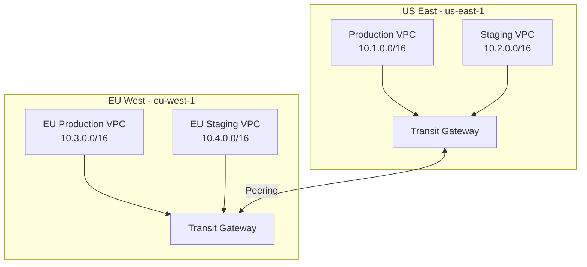

# How to Configure Transit Gateway Inter-Region Peering

Author: [nawazdhandala](https://github.com/nawazdhandala)

Tags: AWS, Transit Gateway, Networking, Multi-Region

Description: Set up AWS Transit Gateway inter-region peering to connect VPCs across multiple AWS regions with centralized routing and network management.

---

When your infrastructure spans multiple AWS regions, connecting VPCs across those regions becomes a real challenge. VPC peering works for simple point-to-point connections, but it doesn't scale - with 10 VPCs across 3 regions, you'd need 45 peering connections. Transit Gateway inter-region peering solves this by letting you connect transit gateways in different regions, creating a hub-and-spoke network that scales cleanly.

Each region gets its own transit gateway. VPCs in that region attach to their local transit gateway. The transit gateways peer with each other across regions, and routing tables control traffic flow. Let's set it up.

## Architecture Overview

Here's what we're building:



Traffic from a VPC in us-east-1 reaches a VPC in eu-west-1 by going through the local transit gateway, across the peering connection, through the remote transit gateway, and into the destination VPC. The entire path is on the AWS backbone network - it never touches the public internet.

## Step 1: Create Transit Gateways in Each Region

First, create a transit gateway in each region:

```bash
# Create Transit Gateway in us-east-1
aws ec2 create-transit-gateway \
  --region us-east-1 \
  --description "US East Transit Gateway" \
  --options '{
    "AmazonSideAsn": 64512,
    "AutoAcceptSharedAttachments": "enable",
    "DefaultRouteTableAssociation": "enable",
    "DefaultRouteTablePropagation": "enable",
    "DnsSupport": "enable",
    "VpnEcmpSupport": "enable"
  }' \
  --tag-specifications 'ResourceType=transit-gateway,Tags=[{Key=Name,Value=us-east-tgw}]'

# Create Transit Gateway in eu-west-1
aws ec2 create-transit-gateway \
  --region eu-west-1 \
  --description "EU West Transit Gateway" \
  --options '{
    "AmazonSideAsn": 64513,
    "AutoAcceptSharedAttachments": "enable",
    "DefaultRouteTableAssociation": "enable",
    "DefaultRouteTablePropagation": "enable",
    "DnsSupport": "enable",
    "VpnEcmpSupport": "enable"
  }' \
  --tag-specifications 'ResourceType=transit-gateway,Tags=[{Key=Name,Value=eu-west-tgw}]'
```

Important: each transit gateway needs a unique ASN. The default is 64512, so use different values for each region.

## Step 2: Attach VPCs to Their Local Transit Gateway

Attach each VPC to the transit gateway in its region:

```bash
# Attach Production VPC in us-east-1
aws ec2 create-transit-gateway-vpc-attachment \
  --region us-east-1 \
  --transit-gateway-id tgw-us-east-abc123 \
  --vpc-id vpc-prod-east \
  --subnet-ids subnet-private-1a subnet-private-1b \
  --tag-specifications 'ResourceType=transit-gateway-attachment,Tags=[{Key=Name,Value=prod-vpc-attachment}]'

# Attach Staging VPC in us-east-1
aws ec2 create-transit-gateway-vpc-attachment \
  --region us-east-1 \
  --transit-gateway-id tgw-us-east-abc123 \
  --vpc-id vpc-staging-east \
  --subnet-ids subnet-staging-1a subnet-staging-1b \
  --tag-specifications 'ResourceType=transit-gateway-attachment,Tags=[{Key=Name,Value=staging-vpc-attachment}]'

# Attach EU Production VPC in eu-west-1
aws ec2 create-transit-gateway-vpc-attachment \
  --region eu-west-1 \
  --transit-gateway-id tgw-eu-west-def456 \
  --vpc-id vpc-prod-eu \
  --subnet-ids subnet-eu-private-1a subnet-eu-private-1b \
  --tag-specifications 'ResourceType=transit-gateway-attachment,Tags=[{Key=Name,Value=eu-prod-vpc-attachment}]'
```

## Step 3: Create the Peering Connection

Now create the peering attachment between the two transit gateways:

```bash
# Request peering from us-east-1 to eu-west-1
aws ec2 create-transit-gateway-peering-attachment \
  --region us-east-1 \
  --transit-gateway-id tgw-us-east-abc123 \
  --peer-transit-gateway-id tgw-eu-west-def456 \
  --peer-region eu-west-1 \
  --peer-account-id 123456789012 \
  --tag-specifications 'ResourceType=transit-gateway-attachment,Tags=[{Key=Name,Value=us-to-eu-peering}]'
```

The peering attachment needs to be accepted from the peer side:

```bash
# Accept the peering request from eu-west-1
aws ec2 accept-transit-gateway-peering-attachment \
  --region eu-west-1 \
  --transit-gateway-attachment-id tgw-attach-peering-xyz789
```

Wait for the attachment state to change to "available" before proceeding:

```bash
# Check the peering attachment status
aws ec2 describe-transit-gateway-peering-attachments \
  --region us-east-1 \
  --transit-gateway-attachment-ids tgw-attach-peering-xyz789
```

## Step 4: Configure Route Tables

This is where most people get tripped up. You need to add routes in both directions.

In the us-east-1 transit gateway route table, add routes for the EU CIDR blocks:

```bash
# Get the route table ID for us-east-1 TGW
aws ec2 describe-transit-gateway-route-tables \
  --region us-east-1 \
  --filters Name=transit-gateway-id,Values=tgw-us-east-abc123

# Add route to EU production VPC via peering attachment
aws ec2 create-transit-gateway-route \
  --region us-east-1 \
  --transit-gateway-route-table-id tgw-rtb-us-east \
  --destination-cidr-block "10.3.0.0/16" \
  --transit-gateway-attachment-id tgw-attach-peering-xyz789

# Add route to EU staging VPC via peering attachment
aws ec2 create-transit-gateway-route \
  --region us-east-1 \
  --transit-gateway-route-table-id tgw-rtb-us-east \
  --destination-cidr-block "10.4.0.0/16" \
  --transit-gateway-attachment-id tgw-attach-peering-xyz789
```

Now do the reverse in eu-west-1:

```bash
# Add route to US production VPC via peering attachment
aws ec2 create-transit-gateway-route \
  --region eu-west-1 \
  --transit-gateway-route-table-id tgw-rtb-eu-west \
  --destination-cidr-block "10.1.0.0/16" \
  --transit-gateway-attachment-id tgw-attach-peering-abc123

# Add route to US staging VPC via peering attachment
aws ec2 create-transit-gateway-route \
  --region eu-west-1 \
  --transit-gateway-route-table-id tgw-rtb-eu-west \
  --destination-cidr-block "10.2.0.0/16" \
  --transit-gateway-attachment-id tgw-attach-peering-abc123
```

## Step 5: Update VPC Route Tables

The VPCs themselves also need routes to reach the remote CIDRs:

```bash
# In us-east-1 production VPC, add route to EU via transit gateway
aws ec2 create-route \
  --region us-east-1 \
  --route-table-id rtb-prod-private \
  --destination-cidr-block "10.3.0.0/16" \
  --transit-gateway-id tgw-us-east-abc123

aws ec2 create-route \
  --region us-east-1 \
  --route-table-id rtb-prod-private \
  --destination-cidr-block "10.4.0.0/16" \
  --transit-gateway-id tgw-us-east-abc123
```

## CDK Implementation

Here's how to set this up with CDK. Since peering spans regions, you'll need stacks in both:

```typescript
// lib/transit-gateway-stack.ts - Transit gateway with VPC attachments
import * as cdk from 'aws-cdk-lib';
import * as ec2 from 'aws-cdk-lib/aws-ec2';
import { Construct } from 'constructs';

export interface TransitGatewayStackProps extends cdk.StackProps {
  asn: number;
  vpcCidr: string;
  tgwName: string;
}

export class TransitGatewayStack extends cdk.Stack {
  public readonly transitGateway: ec2.CfnTransitGateway;
  public readonly vpc: ec2.Vpc;

  constructor(scope: Construct, id: string, props: TransitGatewayStackProps) {
    super(scope, id, props);

    // Create VPC
    this.vpc = new ec2.Vpc(this, 'Vpc', {
      ipAddresses: ec2.IpAddresses.cidr(props.vpcCidr),
      maxAzs: 2,
      natGateways: 1,
      subnetConfiguration: [
        {
          name: 'Public',
          subnetType: ec2.SubnetType.PUBLIC,
          cidrMask: 24,
        },
        {
          name: 'Private',
          subnetType: ec2.SubnetType.PRIVATE_WITH_EGRESS,
          cidrMask: 24,
        },
      ],
    });

    // Create Transit Gateway
    this.transitGateway = new ec2.CfnTransitGateway(this, 'TGW', {
      amazonSideAsn: props.asn,
      autoAcceptSharedAttachments: 'enable',
      defaultRouteTableAssociation: 'enable',
      defaultRouteTablePropagation: 'enable',
      dnsSupport: 'enable',
      tags: [{ key: 'Name', value: props.tgwName }],
    });

    // Attach VPC to Transit Gateway
    const privateSubnets = this.vpc.selectSubnets({
      subnetType: ec2.SubnetType.PRIVATE_WITH_EGRESS,
    });

    new ec2.CfnTransitGatewayAttachment(this, 'VpcAttachment', {
      transitGatewayId: this.transitGateway.ref,
      vpcId: this.vpc.vpcId,
      subnetIds: privateSubnets.subnetIds,
      tags: [{ key: 'Name', value: `${props.tgwName}-vpc-attachment` }],
    });

    // Output TGW ID for peering
    new cdk.CfnOutput(this, 'TransitGatewayId', {
      value: this.transitGateway.ref,
      exportName: `${props.tgwName}-id`,
    });
  }
}
```

Deploy the stack in each region:

```typescript
// bin/app.ts - Deploy transit gateways in multiple regions
import { App } from 'aws-cdk-lib';
import { TransitGatewayStack } from '../lib/transit-gateway-stack';

const app = new App();
const account = '123456789012';

const usEastTgw = new TransitGatewayStack(app, 'USEastTGW', {
  env: { account, region: 'us-east-1' },
  asn: 64512,
  vpcCidr: '10.1.0.0/16',
  tgwName: 'us-east-tgw',
});

const euWestTgw = new TransitGatewayStack(app, 'EUWestTGW', {
  env: { account, region: 'eu-west-1' },
  asn: 64513,
  vpcCidr: '10.3.0.0/16',
  tgwName: 'eu-west-tgw',
});
```

## Monitoring the Peering Connection

Monitor data transfer and connection health:

```bash
# Check Transit Gateway metrics
aws cloudwatch get-metric-statistics \
  --region us-east-1 \
  --namespace "AWS/TransitGateway" \
  --metric-name "BytesOut" \
  --dimensions Name=TransitGateway,Value=tgw-us-east-abc123 \
  --start-time $(date -u -d '1 hour ago' +%Y-%m-%dT%H:%M:%S) \
  --end-time $(date -u +%Y-%m-%dT%H:%M:%S) \
  --period 300 \
  --statistics Sum
```

Set up CloudWatch alarms for packet loss and other metrics:

```typescript
// CloudWatch alarm for Transit Gateway packet loss
import * as cloudwatch from 'aws-cdk-lib/aws-cloudwatch';

const packetLossAlarm = new cloudwatch.Alarm(this, 'TGWPacketLoss', {
  metric: new cloudwatch.Metric({
    namespace: 'AWS/TransitGateway',
    metricName: 'PacketDropCountNoRoute',
    dimensionsMap: {
      TransitGateway: transitGateway.ref,
    },
    statistic: 'Sum',
    period: cdk.Duration.minutes(5),
  }),
  threshold: 100,
  evaluationPeriods: 3,
  alarmDescription: 'Transit Gateway dropping packets due to no route',
});
```

## Network Segmentation with Route Tables

For more control, use separate route tables to isolate traffic. Production VPCs shouldn't necessarily reach staging VPCs across regions:

```bash
# Create a separate route table for production traffic
aws ec2 create-transit-gateway-route-table \
  --region us-east-1 \
  --transit-gateway-id tgw-us-east-abc123 \
  --tag-specifications 'ResourceType=transit-gateway-route-table,Tags=[{Key=Name,Value=production-routes}]'

# Associate production VPC attachment with the production route table
aws ec2 associate-transit-gateway-route-table \
  --region us-east-1 \
  --transit-gateway-route-table-id tgw-rtb-prod \
  --transit-gateway-attachment-id tgw-attach-prod-vpc

# Only add routes to production CIDRs in other regions
aws ec2 create-transit-gateway-route \
  --region us-east-1 \
  --transit-gateway-route-table-id tgw-rtb-prod \
  --destination-cidr-block "10.3.0.0/16" \
  --transit-gateway-attachment-id tgw-attach-peering-xyz789
```

## Cost Considerations

Transit Gateway peering isn't free. You're paying for:

- **Hourly charge** per transit gateway attachment (VPC and peering)
- **Data processing** per GB transferred through the transit gateway
- **Inter-region data transfer** for traffic crossing the peering connection

For high-volume data transfer between regions, consider whether you actually need real-time connectivity or if asynchronous replication (S3, DynamoDB global tables) would work instead.

## Troubleshooting

Common issues and how to fix them:

**Traffic not flowing**: Check route tables at every level - VPC route tables, transit gateway route tables, and security groups. Missing routes at any layer will break connectivity.

**Asymmetric routing**: Make sure routes exist in both directions. Traffic from A to B takes one path, but the return traffic from B to A needs its own route.

**CIDR conflicts**: Every VPC CIDR must be unique across all regions. Overlapping CIDRs make routing impossible. Plan your IP addressing before building.

For securing the traffic flowing across regions, consider adding [WAF rules](https://oneuptime.com/blog/post/waf-rules-cdk/view) at each region's entry points. If you're connecting VPN users who need cross-region access, see [AWS Client VPN with mutual authentication](https://oneuptime.com/blog/post/aws-client-vpn-mutual-authentication/view).

## Wrapping Up

Transit Gateway inter-region peering gives you a scalable, manageable way to connect infrastructure across AWS regions. The setup requires careful attention to routing at multiple layers, but once configured, it provides reliable, low-latency connectivity over the AWS backbone. Start with two regions, get the routing right, and expand from there. The most common mistake is incomplete routing - always verify connectivity from both sides after making changes.
