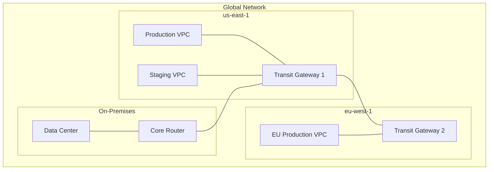

# How to Set Up Transit Gateway Network Manager

Author: [nawazdhandala](https://github.com/nawazdhandala)

Tags: AWS, Transit Gateway, Networking, Cloud Infrastructure

Description: Learn how to set up AWS Transit Gateway Network Manager to visualize, monitor, and manage your global network from a single dashboard.

---

If you're running workloads across multiple VPCs and AWS regions, things get complicated fast. You've got transit gateways scattered around, VPN connections to on-premises data centers, and maybe even some Direct Connect links thrown in for good measure. Keeping track of all this in your head - or worse, in a spreadsheet - just doesn't scale.

That's where Transit Gateway Network Manager comes in. It gives you a single pane of glass for your entire global network. You can visualize your topology, monitor connection health, and get alerts when something goes sideways. Let's walk through setting it up from scratch.

## What Is Transit Gateway Network Manager?

Transit Gateway Network Manager is a free service that lets you register your transit gateways, Site-to-Site VPN connections, and SD-WAN devices into a single global network. Once registered, you get a topology map, event-based monitoring, and metric dashboards - all without deploying any additional infrastructure.

The key concepts you need to understand are:

- **Global Network**: The top-level container for everything. Think of it as a logical grouping of all your networking resources.
- **Sites**: Physical locations like data centers or branch offices.
- **Devices**: Networking equipment at those sites (routers, firewalls, SD-WAN appliances).
- **Links**: The WAN connections between your sites and AWS (internet links, MPLS circuits, etc.).

## Creating Your Global Network

First things first - you need a global network. This is straightforward through the AWS CLI.

Here's how to create a global network resource:

```bash
# Create the global network
aws networkmanager create-global-network \
  --description "Production Global Network" \
  --tags Key=Environment,Value=Production

# Note the GlobalNetworkId from the output - you'll need it everywhere
```

You can also do this through CloudFormation if you prefer infrastructure as code.

Here's the CloudFormation template for the global network and transit gateway registration:

```yaml
AWSTemplateFormatVersion: '2010-09-09'
Description: Transit Gateway Network Manager Setup

Resources:
  GlobalNetwork:
    Type: AWS::NetworkManager::GlobalNetwork
    Properties:
      Description: Production Global Network
      Tags:
        - Key: Environment
          Value: Production

  TransitGatewayRegistration:
    Type: AWS::NetworkManager::TransitGatewayRegistration
    Properties:
      GlobalNetworkId: !Ref GlobalNetwork
      TransitGatewayArn: !Sub "arn:aws:ec2:${AWS::Region}:${AWS::AccountId}:transit-gateway/tgw-0123456789abcdef0"
```

## Registering Transit Gateways

You'll want to register every transit gateway in your environment. This is what populates the topology map and enables monitoring.

Register each transit gateway with your global network:

```bash
# Register a transit gateway in us-east-1
aws networkmanager register-transit-gateway \
  --global-network-id global-network-0123456789abcdef0 \
  --transit-gateway-arn arn:aws:ec2:us-east-1:123456789012:transit-gateway/tgw-0123456789abcdef0

# Register another in eu-west-1
aws networkmanager register-transit-gateway \
  --global-network-id global-network-0123456789abcdef0 \
  --transit-gateway-arn arn:aws:ec2:eu-west-1:123456789012:transit-gateway/tgw-abcdef0123456789a

# Check registration status
aws networkmanager get-transit-gateway-registrations \
  --global-network-id global-network-0123456789abcdef0
```

Registration takes a couple of minutes. The status will go from `PENDING` to `AVAILABLE` once it's done. If it fails, double-check that the transit gateway exists and that your IAM permissions include `networkmanager:RegisterTransitGateway` and `ec2:DescribeTransitGateways`.

## Defining Sites and Devices

Sites represent your physical locations. Even if you don't have on-premises equipment, defining sites helps organize your network topology visually.

Create a site representing a physical data center:

```bash
# Create a site for your primary data center
aws networkmanager create-site \
  --global-network-id global-network-0123456789abcdef0 \
  --description "Primary Data Center - Virginia" \
  --location Latitude=38.9,Longitude=-77.0,Address="Ashburn, VA"

# Create a device at that site
aws networkmanager create-device \
  --global-network-id global-network-0123456789abcdef0 \
  --site-id site-0123456789abcdef0 \
  --description "Core Router" \
  --type "Cisco ISR 4451" \
  --vendor "Cisco" \
  --model "ISR 4451-X"
```

Next, create links to represent your WAN connections.

Define the WAN link connecting your site to AWS:

```bash
# Create a link representing your internet connection
aws networkmanager create-link \
  --global-network-id global-network-0123456789abcdef0 \
  --site-id site-0123456789abcdef0 \
  --description "Primary Internet - 1Gbps" \
  --type "Broadband" \
  --bandwidth UploadSpeedMbps=1000,DownloadSpeedMbps=1000 \
  --provider "ISP Provider"
```

## Associating VPN Connections

Here's where it all comes together. You associate your Site-to-Site VPN connections with devices and links. This tells Network Manager how traffic flows between your on-premises network and AWS.

Associate a VPN connection with a device and link:

```bash
# Associate the customer gateway with your device
aws networkmanager associate-customer-gateway \
  --global-network-id global-network-0123456789abcdef0 \
  --customer-gateway-arn arn:aws:ec2:us-east-1:123456789012:customer-gateway/cgw-0123456789abcdef0 \
  --device-id device-0123456789abcdef0 \
  --link-id link-0123456789abcdef0
```

Once associated, Network Manager can track the health of the entire path from your on-premises device through the VPN tunnel to the transit gateway.

## Setting Up CloudWatch Integration

Network Manager automatically publishes events to CloudWatch Events (EventBridge). You should set up rules to catch important topology changes and connectivity issues.

Here's a CloudWatch Events rule for network change notifications:

```json
{
  "source": ["aws.networkmanager"],
  "detail-type": [
    "Network Manager Topology Change",
    "Network Manager Status Update",
    "Network Manager Routing Update"
  ]
}
```

You can route these events to SNS for email alerts or to Lambda for automated remediation.

Create an SNS-based alerting setup with CloudFormation:

```yaml
  NetworkManagerEventRule:
    Type: AWS::Events::Rule
    Properties:
      Description: Catch Network Manager topology changes
      EventPattern:
        source:
          - aws.networkmanager
        detail-type:
          - "Network Manager Topology Change"
      Targets:
        - Arn: !Ref AlertTopic
          Id: NetworkAlerts

  AlertTopic:
    Type: AWS::SNS::Topic
    Properties:
      TopicName: network-manager-alerts
      Subscription:
        - Endpoint: ops-team@example.com
          Protocol: email
```

## Monitoring with the Network Manager Console

The AWS console for Network Manager is genuinely useful. The topology map shows your entire global network with color-coded connection states. Green means healthy, yellow means degraded, and red means down. You can click on any resource to drill into metrics like tunnel state, bytes in/out, and packet loss.

The route analyzer is another killer feature. You can test reachability between any two points in your network without sending actual traffic. It traces the route through your transit gateways and shows you exactly which route tables and attachments are involved.

## Network Topology Visualization

Here's a simplified view of what your topology might look like:



## IAM Permissions

You'll need appropriate IAM permissions. Here's a policy that covers the basics.

IAM policy for Network Manager administration:

```json
{
  "Version": "2012-10-17",
  "Statement": [
    {
      "Effect": "Allow",
      "Action": [
        "networkmanager:*",
        "ec2:DescribeTransitGateways",
        "ec2:DescribeTransitGatewayAttachments",
        "ec2:DescribeVpnConnections",
        "ec2:DescribeCustomerGateways",
        "ec2:DescribeRegions"
      ],
      "Resource": "*"
    }
  ]
}
```

For production, you'd want to scope this down to specific global network ARNs.

## Tips from the Trenches

A few things I've learned from running Network Manager in production:

1. **Register everything.** If a transit gateway isn't registered, it's invisible to Network Manager. Don't leave gaps in your visibility.

2. **Keep site information accurate.** The geo-coordinates matter for the topology map. Wrong coordinates make the map confusing.

3. **Use tags consistently.** Network Manager supports tags on all resources. Use them for cost tracking, team ownership, and environment classification.

4. **Set up event rules early.** Don't wait for an outage to realize you're not getting notifications. The CloudWatch Events integration is there from day one - use it.

5. **Check the route analyzer regularly.** It's great for validating routing changes before and after maintenance windows.

Transit Gateway Network Manager won't cost you a dime - it's free to use with your existing transit gateways. There's really no reason not to set it up. If you're managing multi-region or hybrid networks on AWS, this tool should be in your operational toolkit.

For more on monitoring your infrastructure, check out our guide on [AWS CloudWatch monitoring best practices](https://oneuptime.com/blog/post/aws-cloudwatch-monitoring/view).
