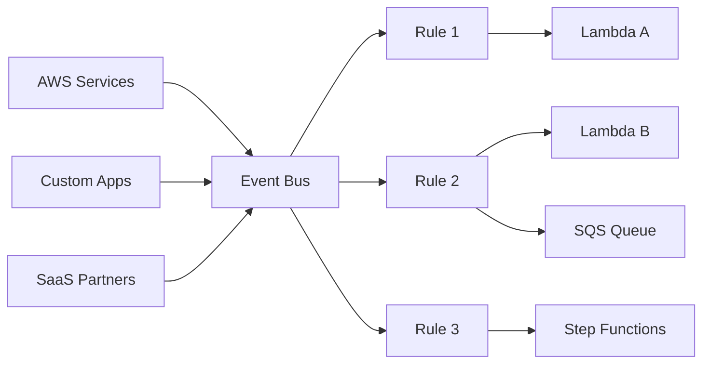

# How to Trigger Lambda Functions from EventBridge Rules

Author: [nawazdhandala](https://github.com/nawazdhandala)

Tags: AWS, Lambda, EventBridge, Event-Driven Architecture

Description: Step-by-step guide to using Amazon EventBridge rules to trigger Lambda functions based on events from AWS services, custom applications, and SaaS integrations.

---

EventBridge is the central event bus for AWS. It receives events from over 100 AWS services, your own applications, and third-party SaaS providers. With EventBridge rules, you can filter those events and route matching ones to Lambda functions. It's more powerful than direct service integrations because you can match on any combination of event fields using pattern matching.

If you want to react to EC2 instance state changes, CodePipeline deployments, S3 object creations, or your own custom events - EventBridge is usually the cleanest way to do it.

## How EventBridge Works

Events flow through an event bus. The default event bus receives events from AWS services automatically. You can also create custom event buses for your application events and partner event buses for SaaS integrations.

Rules evaluate events against patterns. When an event matches a rule's pattern, EventBridge routes it to the rule's targets. A single rule can have up to 5 targets, and you can have hundreds of rules per event bus.



## Setting Up with AWS CDK

Let's create rules for common event patterns.

This CDK stack creates EventBridge rules that trigger Lambda functions based on different event patterns:

```typescript
import * as cdk from 'aws-cdk-lib';
import * as events from 'aws-cdk-lib/aws-events';
import * as targets from 'aws-cdk-lib/aws-events-targets';
import * as lambda from 'aws-cdk-lib/aws-lambda';
import { Construct } from 'constructs';

export class EventBridgeStack extends cdk.Stack {
  constructor(scope: Construct, id: string, props?: cdk.StackProps) {
    super(scope, id, props);

    // Lambda function to handle EC2 state changes
    const ec2Handler = new lambda.Function(this, 'EC2StateHandler', {
      runtime: lambda.Runtime.NODEJS_20_X,
      handler: 'index.handler',
      code: lambda.Code.fromAsset('lambda/ec2-handler'),
      timeout: cdk.Duration.seconds(30),
    });

    // Rule: Trigger on EC2 instance state changes
    new events.Rule(this, 'EC2StateChangeRule', {
      ruleName: 'ec2-state-changes',
      description: 'Capture EC2 instance state changes',
      eventPattern: {
        source: ['aws.ec2'],
        detailType: ['EC2 Instance State-change Notification'],
        detail: {
          state: ['stopped', 'terminated'],
        },
      },
      targets: [new targets.LambdaFunction(ec2Handler)],
    });

    // Lambda function for custom order events
    const orderHandler = new lambda.Function(this, 'OrderHandler', {
      runtime: lambda.Runtime.NODEJS_20_X,
      handler: 'index.handler',
      code: lambda.Code.fromAsset('lambda/order-handler'),
    });

    // Custom event bus for application events
    const appBus = new events.EventBus(this, 'AppEventBus', {
      eventBusName: 'my-application',
    });

    // Rule on custom bus: Trigger on high-value orders
    new events.Rule(this, 'HighValueOrderRule', {
      ruleName: 'high-value-orders',
      eventBus: appBus,
      eventPattern: {
        source: ['com.myapp.orders'],
        detailType: ['OrderCreated'],
        detail: {
          total: [{ numeric: ['>=', 1000] }],
        },
      },
      targets: [new targets.LambdaFunction(orderHandler)],
    });
  }
}
```

## Event Pattern Syntax

EventBridge patterns support rich filtering. Here are the most useful pattern types.

### Exact Match

```json
{
  "source": ["aws.ec2"],
  "detail-type": ["EC2 Instance State-change Notification"],
  "detail": {
    "state": ["running", "stopped"]
  }
}
```

### Prefix Match

```json
{
  "detail": {
    "key": [{ "prefix": "uploads/" }]
  }
}
```

### Numeric Matching

```json
{
  "detail": {
    "amount": [{ "numeric": [">", 100, "<=", 1000] }]
  }
}
```

### Exists/Not Exists

```json
{
  "detail": {
    "errorCode": [{ "exists": true }]
  }
}
```

### Anything-But

```json
{
  "detail": {
    "status": [{ "anything-but": ["test", "draft"] }]
  }
}
```

These patterns are evaluated server-side, so your Lambda function only gets invoked for events that truly match. No wasted invocations.

## Publishing Custom Events

To trigger rules on your custom event bus, publish events from your application.

This code publishes custom events to an EventBridge event bus:

```javascript
const { EventBridgeClient, PutEventsCommand } = require('@aws-sdk/client-eventbridge');

const eventBridge = new EventBridgeClient({});

async function publishOrderEvent(order) {
  const result = await eventBridge.send(new PutEventsCommand({
    Entries: [
      {
        Source: 'com.myapp.orders',
        DetailType: 'OrderCreated',
        Detail: JSON.stringify({
          orderId: order.id,
          customerId: order.customerId,
          total: order.total,
          items: order.items,
          region: order.shippingRegion,
        }),
        EventBusName: 'my-application',
      },
    ],
  }));

  if (result.FailedEntryCount > 0) {
    console.error('Failed to publish events:', result.Entries);
    throw new Error('Event publication failed');
  }

  console.log(`Published OrderCreated event for order ${order.id}`);
}
```

You can publish up to 10 events per `PutEvents` call, and each event can be up to 256 KB.

## Writing the Lambda Handler

The EventBridge event payload wraps the original event in a standard envelope.

This handler processes EventBridge events and routes them based on the event type:

```javascript
exports.handler = async (event) => {
  console.log('EventBridge event:', JSON.stringify(event, null, 2));

  const source = event.source;
  const detailType = event['detail-type'];
  const detail = event.detail;

  console.log(`Source: ${source}, Type: ${detailType}`);

  // Route based on event type
  if (source === 'aws.ec2' && detailType === 'EC2 Instance State-change Notification') {
    return handleEC2StateChange(detail);
  }

  if (source === 'com.myapp.orders' && detailType === 'OrderCreated') {
    return handleNewOrder(detail);
  }

  console.warn(`Unhandled event: ${source} / ${detailType}`);
};

async function handleEC2StateChange(detail) {
  const instanceId = detail['instance-id'];
  const state = detail.state;

  console.log(`EC2 instance ${instanceId} changed to ${state}`);

  if (state === 'terminated') {
    // Clean up resources, update inventory, send alert
    await sendAlert(`EC2 instance ${instanceId} was terminated`);
  }
}

async function handleNewOrder(detail) {
  const { orderId, total, customerId } = detail;
  console.log(`High-value order: ${orderId}, total: $${total}`);

  // Send to VIP processing, alert sales team, etc.
  await notifyVIPTeam(orderId, customerId, total);
}
```

## Common AWS Event Patterns

Here are rules for common AWS events you might want to react to.

### CodePipeline Failures

```typescript
new events.Rule(this, 'PipelineFailureRule', {
  eventPattern: {
    source: ['aws.codepipeline'],
    detailType: ['CodePipeline Pipeline Execution State Change'],
    detail: {
      state: ['FAILED'],
    },
  },
  targets: [new targets.LambdaFunction(alertHandler)],
});
```

### CloudWatch Alarm State Changes

```typescript
new events.Rule(this, 'AlarmRule', {
  eventPattern: {
    source: ['aws.cloudwatch'],
    detailType: ['CloudWatch Alarm State Change'],
    detail: {
      state: { value: ['ALARM'] },
    },
  },
  targets: [new targets.LambdaFunction(incidentHandler)],
});
```

### S3 Object Created (via EventBridge)

```typescript
new events.Rule(this, 'S3UploadRule', {
  eventPattern: {
    source: ['aws.s3'],
    detailType: ['Object Created'],
    detail: {
      bucket: { name: ['my-data-bucket'] },
      object: { key: [{ prefix: 'data/' }] },
    },
  },
  targets: [new targets.LambdaFunction(dataProcessor)],
});
```

Note: S3 events via EventBridge require enabling EventBridge notifications on the bucket. See our post on [triggering Lambda from S3 events](https://oneuptime.com/blog/post/2026-02-12-trigger-lambda-s3-events/view) for setup details.

## Input Transformation

You don't have to pass the entire event to your Lambda function. EventBridge supports input transformation to extract just the fields you need.

This CDK configuration transforms the EventBridge event before sending it to Lambda:

```typescript
new events.Rule(this, 'TransformedRule', {
  eventPattern: {
    source: ['com.myapp.orders'],
    detailType: ['OrderCreated'],
  },
  targets: [
    new targets.LambdaFunction(orderHandler, {
      event: events.RuleTargetInput.fromObject({
        orderId: events.EventField.fromPath('$.detail.orderId'),
        total: events.EventField.fromPath('$.detail.total'),
        timestamp: events.EventField.fromPath('$.time'),
      }),
    }),
  ],
});
```

Your Lambda function receives a clean, minimal payload instead of the full EventBridge envelope.

## Retry and DLQ Configuration

EventBridge retries failed Lambda invocations for up to 24 hours with exponential backoff. You can configure this per target:

```typescript
new targets.LambdaFunction(handler, {
  retryAttempts: 3,
  maxEventAge: cdk.Duration.hours(1),
  deadLetterQueue: dlq, // SQS queue for events that exhaust retries
})
```

The DLQ here is for the EventBridge-to-Lambda delivery, separate from any DLQ on the Lambda function itself. For Lambda-level error handling, check our post on [configuring Dead Letter Queues for Lambda](https://oneuptime.com/blog/post/2026-02-12-configure-dead-letter-queues-lambda-functions/view).

## EventBridge vs. SNS

Both can fan out events to Lambda. The key differences:

- EventBridge has richer content-based filtering (numeric, prefix, exists, anything-but)
- EventBridge integrates with 100+ AWS services natively
- SNS is simpler for basic pub/sub
- SNS supports more subscriber types (email, SMS, HTTP)
- EventBridge has built-in schema registry and event replay

For new architectures, EventBridge is generally the better choice for service-to-service communication.

## Wrapping Up

EventBridge rules give you a flexible, decoupled way to trigger Lambda functions from virtually any event source. The pattern matching is powerful enough to filter precisely the events you care about, so your functions only run when they should. Start with AWS service events on the default bus, and add custom events as your architecture grows.
