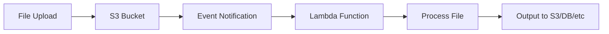

# How to Trigger Lambda Functions from S3 Events

Author: [nawazdhandala](https://github.com/nawazdhandala)

Tags: AWS, Lambda, S3, Event-Driven Architecture

Description: Complete guide to configuring S3 event notifications to trigger Lambda functions for automated file processing, image handling, and data pipelines.

---

Dropping a file into an S3 bucket and having it automatically trigger a Lambda function is one of the most satisfying patterns in serverless architecture. Upload an image, and it gets resized. Drop a CSV, and it gets loaded into a database. Push a log file, and it gets parsed and indexed. S3 event notifications make all of this possible without any polling or intermediary services.

Let's walk through how to set this up, handle different event types, and avoid the common gotchas that trip people up.

## How S3 Event Notifications Work

When something happens in an S3 bucket - an object is created, deleted, or restored - S3 can send a notification to one of three targets: Lambda, SQS, or SNS. For Lambda, S3 invokes your function asynchronously with an event payload containing the bucket name, object key, event type, and other metadata.

The flow looks like this:



Because the invocation is asynchronous, Lambda handles retries automatically. If your function fails, Lambda retries it twice. You can also configure a [Dead Letter Queue](https://oneuptime.com/blog/post/2026-02-12-configure-dead-letter-queues-lambda-functions/view) to capture events that fail all retry attempts.

## Supported Event Types

S3 supports a variety of event types you can filter on:

- `s3:ObjectCreated:*` - any object creation (Put, Post, Copy, CompleteMultipartUpload)
- `s3:ObjectCreated:Put` - specifically PUT operations
- `s3:ObjectRemoved:*` - any object deletion
- `s3:ObjectRemoved:Delete` - permanent deletes
- `s3:ObjectRemoved:DeleteMarkerCreated` - versioned delete markers
- `s3:ObjectRestore:Post` - restore initiated from Glacier
- `s3:ObjectRestore:Completed` - restore from Glacier completed

For most file processing use cases, you'll want `s3:ObjectCreated:*`.

## Setting Up with AWS CDK

CDK makes S3-to-Lambda triggers straightforward.

This CDK stack creates an S3 bucket that triggers a Lambda function when objects are created:

```typescript
import * as cdk from 'aws-cdk-lib';
import * as s3 from 'aws-cdk-lib/aws-s3';
import * as lambda from 'aws-cdk-lib/aws-lambda';
import * as s3n from 'aws-cdk-lib/aws-s3-notifications';
import { Construct } from 'constructs';

export class S3TriggerStack extends cdk.Stack {
  constructor(scope: Construct, id: string, props?: cdk.StackProps) {
    super(scope, id, props);

    // Create the processing Lambda function
    const processor = new lambda.Function(this, 'ImageProcessor', {
      runtime: lambda.Runtime.NODEJS_20_X,
      handler: 'index.handler',
      code: lambda.Code.fromAsset('lambda/processor'),
      timeout: cdk.Duration.minutes(5),
      memorySize: 1024,
      environment: {
        OUTPUT_BUCKET: 'processed-images-bucket',
      },
    });

    // Create the S3 bucket
    const uploadBucket = new s3.Bucket(this, 'UploadBucket', {
      bucketName: 'raw-uploads-bucket',
      removalPolicy: cdk.RemovalPolicy.RETAIN,
    });

    // Add event notification - trigger on object creation
    uploadBucket.addEventNotification(
      s3.EventType.OBJECT_CREATED,
      new s3n.LambdaDestination(processor),
      { prefix: 'images/', suffix: '.jpg' }  // only trigger for JPGs in images/
    );

    // Grant the Lambda function read access to the upload bucket
    uploadBucket.grantRead(processor);
  }
}
```

The `prefix` and `suffix` filters are powerful. You can scope your trigger to specific folders or file types, which prevents your function from firing on every single object in the bucket.

## Setting Up with the AWS CLI

If you prefer CLI-based configuration, here's the manual approach.

First, grant S3 permission to invoke your Lambda function:

```bash
# Add permission for S3 to invoke Lambda
aws lambda add-permission \
  --function-name image-processor \
  --statement-id s3-trigger \
  --action lambda:InvokeFunction \
  --principal s3.amazonaws.com \
  --source-arn arn:aws:s3:::raw-uploads-bucket \
  --source-account 123456789012
```

Then configure the bucket notification:

```bash
# Configure the S3 event notification
aws s3api put-bucket-notification-configuration \
  --bucket raw-uploads-bucket \
  --notification-configuration '{
    "LambdaFunctionConfigurations": [
      {
        "Id": "ImageUploadTrigger",
        "LambdaFunctionArn": "arn:aws:lambda:us-east-1:123456789012:function:image-processor",
        "Events": ["s3:ObjectCreated:*"],
        "Filter": {
          "Key": {
            "FilterRules": [
              {"Name": "prefix", "Value": "images/"},
              {"Name": "suffix", "Value": ".jpg"}
            ]
          }
        }
      }
    ]
  }'
```

## Writing the Lambda Handler

The S3 event payload contains information about every object that triggered the function. Note that a single invocation can contain multiple records if objects are created in rapid succession.

This handler processes S3 events and downloads each uploaded file:

```javascript
const { S3Client, GetObjectCommand, PutObjectCommand } = require('@aws-sdk/client-s3');
const sharp = require('sharp');

const s3 = new S3Client({});
const OUTPUT_BUCKET = process.env.OUTPUT_BUCKET;

exports.handler = async (event) => {
  console.log('Received S3 event:', JSON.stringify(event, null, 2));

  // Process each record (there can be multiple)
  const results = await Promise.all(
    event.Records.map(async (record) => {
      const bucket = record.s3.bucket.name;
      // Object keys are URL-encoded in the event
      const key = decodeURIComponent(record.s3.object.key.replace(/\+/g, ' '));
      const size = record.s3.object.size;
      const eventType = record.eventName;

      console.log(`Processing ${eventType}: ${bucket}/${key} (${size} bytes)`);

      try {
        // Download the original image
        const getResult = await s3.send(new GetObjectCommand({
          Bucket: bucket,
          Key: key,
        }));

        const imageBuffer = Buffer.from(await getResult.Body.transformToByteArray());

        // Create a thumbnail
        const thumbnail = await sharp(imageBuffer)
          .resize(200, 200, { fit: 'cover' })
          .jpeg({ quality: 80 })
          .toBuffer();

        // Upload the thumbnail
        const thumbnailKey = key.replace('images/', 'thumbnails/');
        await s3.send(new PutObjectCommand({
          Bucket: OUTPUT_BUCKET,
          Key: thumbnailKey,
          Body: thumbnail,
          ContentType: 'image/jpeg',
        }));

        console.log(`Created thumbnail: ${OUTPUT_BUCKET}/${thumbnailKey}`);
        return { key, status: 'success' };
      } catch (error) {
        console.error(`Failed to process ${key}:`, error);
        throw error;  // let Lambda retry
      }
    })
  );

  return { processed: results.length };
};
```

Important: always URL-decode the object key. S3 URL-encodes special characters (spaces become `+`, etc.) in the event payload. If you skip this step, you'll get "NoSuchKey" errors on files with spaces or special characters in their names.

## Filtering Events with S3 Event Notifications

You can set up multiple notification configurations on the same bucket, each with different filters and targets.

This CloudFormation snippet shows multiple triggers with different filters:

```yaml
NotificationConfiguration:
  LambdaConfigurations:
    - Event: s3:ObjectCreated:*
      Filter:
        S3Key:
          Rules:
            - Name: prefix
              Value: images/
            - Name: suffix
              Value: .jpg
      Function: !GetAtt ImageProcessorFunction.Arn

    - Event: s3:ObjectCreated:*
      Filter:
        S3Key:
          Rules:
            - Name: prefix
              Value: data/
            - Name: suffix
              Value: .csv
      Function: !GetAtt CsvProcessorFunction.Arn

    - Event: s3:ObjectRemoved:*
      Function: !GetAtt CleanupFunction.Arn
```

One constraint: you can't have overlapping prefix/suffix combinations for the same event type pointing to different targets. S3 will reject the configuration.

## Avoiding the Infinite Loop

This is the classic S3-Lambda gotcha. If your Lambda function writes output back to the same bucket that triggers it, you create an infinite loop. Function fires, writes a file, which fires the function again, which writes another file, and so on. Your AWS bill will not be happy.

Prevent this by:

1. **Using a separate output bucket** (recommended)
2. **Using prefix filters** to separate input and output paths
3. **Checking the object key in your handler** before processing

Here's the prefix filter approach:

```typescript
// Trigger only on uploads/ prefix
uploadBucket.addEventNotification(
  s3.EventType.OBJECT_CREATED,
  new s3n.LambdaDestination(processor),
  { prefix: 'uploads/' }
);

// Lambda writes to processed/ prefix - no trigger
```

## Using S3 Event Notifications with EventBridge

Starting in 2023, S3 can send events to EventBridge instead of (or in addition to) Lambda directly. This gives you more powerful filtering and routing.

Enable EventBridge notifications on your bucket:

```bash
aws s3api put-bucket-notification-configuration \
  --bucket raw-uploads-bucket \
  --notification-configuration '{
    "EventBridgeConfiguration": {}
  }'
```

Then create an EventBridge rule to route to Lambda. For more on this pattern, see our guide on [triggering Lambda from EventBridge rules](https://oneuptime.com/blog/post/2026-02-12-trigger-lambda-eventbridge-rules/view).

## Performance Considerations

S3 can invoke your Lambda function thousands of times per second. Make sure your function can handle the concurrency:

- Set a reserved concurrency limit to prevent overwhelming downstream services
- Use provisioned concurrency if cold starts are a concern for latency-sensitive processing
- Consider routing S3 events through SQS first if you need to control the processing rate

For high-volume workloads, the SQS approach gives you built-in buffering and controlled concurrency. Check our post on [triggering Lambda from SQS queues](https://oneuptime.com/blog/post/2026-02-12-trigger-lambda-sqs-queues/view) for that pattern.

## Wrapping Up

S3 event notifications to Lambda are the backbone of countless serverless data processing pipelines. They're simple to set up, scale automatically, and require zero infrastructure management. Just remember to URL-decode your keys, avoid infinite loops, and set appropriate concurrency limits. The rest takes care of itself.
