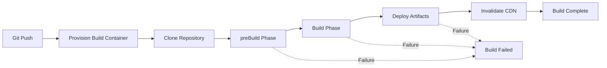

# How to Troubleshoot Amplify Build Failures

Author: [nawazdhandala](https://github.com/nawazdhandala)

Tags: AWS, Amplify, Troubleshooting, CI/CD, Debugging, Build Errors, DevOps

Description: Diagnose and fix the most common AWS Amplify build failures including dependency issues, memory limits, and configuration errors

---

There is nothing more frustrating than pushing code and watching the Amplify build turn red. Build failures in Amplify can be cryptic, and the logs do not always point you to the root cause. After years of working with Amplify deployments, I have seen the same failure patterns over and over. This guide catalogs the most common build failures and their fixes.

## How Amplify Builds Work

Understanding the build pipeline helps you diagnose where things go wrong:



Each phase runs in a Docker container. The container has a specific Node.js version, memory limit, and disk space. Failures can happen at any phase.

## Failure Category 1: Dependency Installation Errors

**Symptom**: Build fails during `npm ci` or `npm install` in the preBuild phase.

### Fix: Node.js Version Mismatch

The most common dependency failure. Your local machine runs Node 20, but Amplify defaults to Node 16.

```yaml
# amplify.yml - Specify the Node.js version
version: 1
frontend:
  phases:
    preBuild:
      commands:
        # Set the Node.js version before installing dependencies
        - nvm install 18
        - nvm use 18
        - node --version
        - npm ci
    build:
      commands:
        - npm run build
```

Alternatively, use the `_LIVE_UPDATES` environment variable:

```json
[{"pkg":"node","type":"nvm","version":"18"}]
```

Set this in the Amplify console under Environment Variables.

### Fix: Package Lock Out of Sync

If your `package-lock.json` is out of sync with `package.json`, `npm ci` will fail.

```bash
# Locally, regenerate the lock file
rm -rf node_modules package-lock.json
npm install

# Commit the updated lock file
git add package-lock.json
git commit -m "Update package-lock.json"
git push
```

### Fix: Private Package Registry

If your project uses private npm packages, configure the registry in the build:

```yaml
preBuild:
  commands:
    # Configure npm to use your private registry
    - echo "//registry.npmjs.org/:_authToken=${NPM_TOKEN}" > .npmrc
    - npm ci
```

Set `NPM_TOKEN` as an environment variable in the Amplify console.

## Failure Category 2: Build Phase Errors

**Symptom**: Dependencies install fine, but `npm run build` fails.

### Fix: Out of Memory

This is extremely common with large React/Next.js applications. The default Amplify build container has limited memory.

```yaml
build:
  commands:
    # Increase Node.js memory limit
    - NODE_OPTIONS=--max-old-space-size=4096 npm run build
```

If that is still not enough, increase the build compute type in the Amplify console. Under "Build settings," change the compute type from "Standard" to "Large."

### Fix: Missing Environment Variables

Your build might reference environment variables that are not set in Amplify:

```yaml
build:
  commands:
    # Print environment variables to debug (remove after fixing)
    - echo "API_URL is: $API_URL"
    - echo "NODE_ENV is: $NODE_ENV"
    - npm run build
```

Check the Amplify console to make sure all required variables are set. Remember that variables are case-sensitive and branch-specific.

### Fix: TypeScript Compilation Errors

If your build works locally but TypeScript fails in Amplify, the likely cause is different TypeScript or dependency versions:

```yaml
preBuild:
  commands:
    - npm ci
    # Verify TypeScript version matches expectations
    - npx tsc --version
build:
  commands:
    # Run type checking separately to get clearer error messages
    - npx tsc --noEmit || true
    - npm run build
```

### Fix: Next.js SSR Build Failures

Next.js SSR builds can fail if server-side code imports browser-only modules:

```javascript
// This will fail during SSR build because 'window' does not exist on the server
// BAD:
import someLibrary from 'browser-only-library';

// GOOD: Dynamic import with no SSR
import dynamic from 'next/dynamic';
const SomeComponent = dynamic(() => import('browser-only-library'), {
  ssr: false,
});
```

## Failure Category 3: Timeout Errors

**Symptom**: Build runs for 30 minutes and then fails with a timeout.

### Fix: Increase Build Timeout

The default timeout is 30 minutes. For large apps, increase it:

1. Go to the Amplify console
2. Navigate to "Build settings"
3. Set the build timeout to 60 or 120 minutes

### Fix: Optimize Build Speed

Rather than increasing the timeout, make the build faster:

```yaml
# Use caching to speed up builds
cache:
  paths:
    - node_modules/**/*
    - .next/cache/**/*
    - .cache/**/*

preBuild:
  commands:
    # Use npm ci instead of npm install for faster installs
    - npm ci

build:
  commands:
    # Skip source maps in production to speed up builds
    - GENERATE_SOURCEMAP=false npm run build
```

### Fix: Reduce Bundle Size

If the build takes too long because the bundle is huge:

```bash
# Analyze your bundle locally
npx next build --debug
# or
npx webpack-bundle-analyzer stats.json
```

Remove unused dependencies, use dynamic imports for large libraries, and consider code splitting.

## Failure Category 4: Deployment Phase Errors

**Symptom**: Build succeeds but deployment fails.

### Fix: Artifact Size Limit

Amplify has limits on deployment artifact size. For SSR apps, the Lambda deployment package cannot exceed 50MB.

```bash
# Check your build output size locally
du -sh .next/
du -sh .next/standalone/
```

To reduce size:
- Remove dev dependencies from the Lambda function
- Use external modules that are provided by the Lambda runtime
- Exclude large files from the deployment

### Fix: Incorrect Artifact Configuration

Make sure your `amplify.yml` points to the correct build output directory:

```yaml
# For a standard React app (Create React App)
artifacts:
  baseDirectory: build
  files:
    - '**/*'

# For a Next.js app
artifacts:
  baseDirectory: .next
  files:
    - '**/*'

# For a Vite app
artifacts:
  baseDirectory: dist
  files:
    - '**/*'
```

## Failure Category 5: Custom Build Image Issues

If you are using a custom Docker image for builds:

```yaml
# amplify.yml with custom image
version: 1
frontend:
  phases:
    preBuild:
      commands:
        # Verify the custom image has required tools
        - node --version
        - npm --version
        - python3 --version
```

Make sure your custom image includes all tools your build needs. Missing tools like Python (needed for some native npm modules) or Git LFS can cause silent failures.

## Debugging Techniques

### Read the Full Build Log

The Amplify console shows a summarized log by default. Click "Download" to get the full build log, which often contains the actual error message buried in the output.

### Reproduce Locally

Amplify publishes the Docker images used for builds. Run your build in the same environment:

```bash
# Pull the Amplify build image
docker pull public.ecr.aws/aws-amplify/amplify-linux2:latest

# Run your build locally in the same container
docker run -it \
  -v $(pwd):/app \
  -w /app \
  public.ecr.aws/aws-amplify/amplify-linux2:latest \
  /bin/bash

# Inside the container, run your build commands
npm ci
npm run build
```

### Add Debug Output

Temporarily add verbose logging to your build:

```yaml
preBuild:
  commands:
    - set -x  # Enable command tracing
    - env | sort  # Print all environment variables
    - node --version
    - npm --version
    - cat package.json | head -20
    - npm ci --verbose
build:
  commands:
    - npm run build 2>&1 | tee build.log
```

Remove the debug output once you have found the issue.

### Check Amplify System Status

Sometimes build failures are caused by AWS outages. Check the [AWS Service Health Dashboard](https://health.aws.amazon.com/) before spending hours debugging.

## Prevention Strategies

Prevent build failures before they reach Amplify:

1. **Run builds in CI before pushing**: Use GitHub Actions or similar to run `npm ci && npm run build` on every PR
2. **Pin dependency versions**: Use exact versions in `package.json` to prevent surprise updates
3. **Test with the same Node.js version**: Use `.nvmrc` to ensure local and CI environments match
4. **Monitor build times**: Set up alerts for builds that take longer than expected, using [CloudWatch monitoring](https://oneuptime.com/blog/post/monitor-amplify-hosting-with-cloudwatch/view)

## Wrapping Up

Most Amplify build failures fall into a handful of categories: wrong Node.js version, missing environment variables, out of memory, and incorrect artifact paths. Once you learn to recognize the patterns, debugging becomes much faster. Keep your `amplify.yml` well-documented, pin your dependency versions, and always test builds locally before pushing. Your future self will thank you the next time a build turns red.
