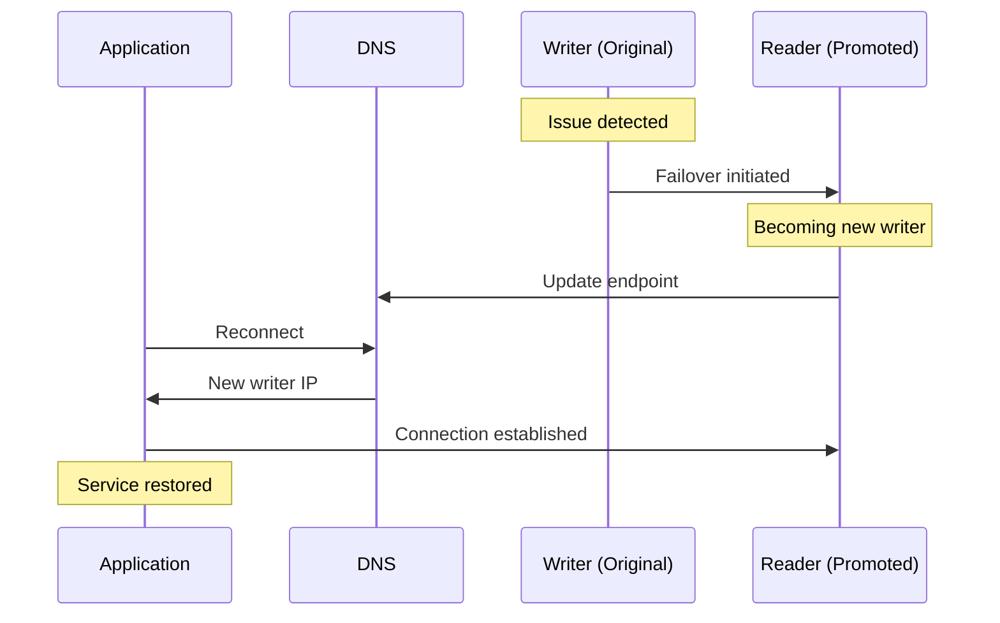

# How to Troubleshoot Aurora Failover Events

Author: [nawazdhandala](https://github.com/nawazdhandala)

Tags: AWS, Aurora, Failover, Troubleshooting, RDS

Description: Learn how to diagnose and troubleshoot Aurora failover events, understand why failovers happen, reduce their impact, and prevent unnecessary failovers.

---

You get the page at 2 AM: your Aurora cluster failed over. Your application had a brief outage. Users saw errors. Now you need to figure out what happened, why, and how to prevent it from happening again.

Aurora failovers are a normal part of database operations - they're a safety mechanism. But understanding why they happen and minimizing their impact is essential for running a reliable production database.

## Understanding Aurora Failover

When Aurora detects a problem with the writer instance, it promotes a reader to become the new writer. The old writer endpoint DNS record updates to point to the new writer. This whole process typically takes 15-30 seconds, but the actual application impact depends on how your application handles connections.



## Finding Out What Happened

### Check RDS Events

The first place to look is RDS events. They'll tell you exactly when the failover happened and give you hints about why:

```bash
# Get recent events for the Aurora cluster
aws rds describe-events \
  --source-identifier my-aurora-cluster \
  --source-type db-cluster \
  --duration 1440 \
  --query 'Events[*].{Date:Date,Message:Message}' \
  --output table
```

Also check instance-level events, which often have more detail:

```bash
# Get events for all instances in the cluster
aws rds describe-events \
  --source-type db-instance \
  --duration 1440 \
  --query 'Events[?contains(SourceIdentifier, `my-aurora`)].{Date:Date,Source:SourceIdentifier,Message:Message}' \
  --output table
```

Common event messages and what they mean:

| Event Message | Meaning |
|---------------|---------|
| "A new writer was promoted" | Failover completed |
| "DB instance restarted" | Instance was restarted (possible cause of failover) |
| "Recovery of the DB instance has started" | Instance crash recovery |
| "Multi-AZ failover started" | Failover was initiated |
| "DB instance shutdown" | Instance was intentionally stopped |

### Check CloudWatch Logs

If enhanced monitoring is enabled, check the OS-level metrics leading up to the failover:

```bash
# Check enhanced monitoring data (requires Enhanced Monitoring enabled)
aws logs filter-log-events \
  --log-group-name RDSOSMetrics \
  --log-stream-name-prefix my-aurora-writer \
  --start-time $(date -d '2 hours ago' +%s000) \
  --end-time $(date +%s000)
```

### Check Key Metrics Before the Failover

Look at CloudWatch metrics from the 30-60 minutes before the failover to spot the trigger:

```bash
# Check CPU utilization before the failover
aws cloudwatch get-metric-statistics \
  --namespace AWS/RDS \
  --metric-name CPUUtilization \
  --dimensions Name=DBInstanceIdentifier,Value=my-aurora-writer \
  --start-time "2026-02-12T00:00:00Z" \
  --end-time "2026-02-12T03:00:00Z" \
  --period 60 \
  --statistics Average Maximum

# Check freeable memory
aws cloudwatch get-metric-statistics \
  --namespace AWS/RDS \
  --metric-name FreeableMemory \
  --dimensions Name=DBInstanceIdentifier,Value=my-aurora-writer \
  --start-time "2026-02-12T00:00:00Z" \
  --end-time "2026-02-12T03:00:00Z" \
  --period 60 \
  --statistics Average Minimum

# Check database connections
aws cloudwatch get-metric-statistics \
  --namespace AWS/RDS \
  --metric-name DatabaseConnections \
  --dimensions Name=DBInstanceIdentifier,Value=my-aurora-writer \
  --start-time "2026-02-12T00:00:00Z" \
  --end-time "2026-02-12T03:00:00Z" \
  --period 60 \
  --statistics Maximum
```

## Common Failover Causes

### Cause 1: Out of Memory (OOM)

The writer ran out of memory, causing the OS or Aurora to kill the process.

**Indicators:** FreeableMemory dropped to near zero before the failover. Enhanced Monitoring shows memory exhaustion.

**Fix:**
```bash
# Scale up the instance to get more memory
aws rds modify-db-instance \
  --db-instance-identifier my-aurora-writer \
  --db-instance-class db.r5.2xlarge \
  --apply-immediately

# Also review these parameters that affect memory usage
aws rds describe-db-cluster-parameters \
  --db-cluster-parameter-group-name my-aurora-params \
  --query 'Parameters[?ParameterName==`innodb_buffer_pool_size` || ParameterName==`max_connections` || ParameterName==`table_open_cache`].{Name:ParameterName,Value:ParameterValue}'
```

**Long-term fix:** Reduce `max_connections` or use [RDS Proxy](https://oneuptime.com/blog/post/set-up-aurora-with-rds-proxy/view) to manage connections more efficiently.

### Cause 2: CPU Exhaustion

A runaway query or connection storm pushed CPU to 100%, making the instance unresponsive.

**Indicators:** CPUUtilization at 100% in the period before failover.

**Fix:** Identify and optimize the problem queries:

```sql
-- After failover, check for long-running queries on the new writer
SELECT
    id,
    user,
    db,
    TIME as seconds,
    state,
    LEFT(info, 200) as query
FROM information_schema.processlist
WHERE command != 'Sleep'
AND TIME > 10
ORDER BY TIME DESC;
```

Set up query-level monitoring:

```sql
-- Enable the performance schema to track query statistics
UPDATE performance_schema.setup_instruments
SET ENABLED = 'YES', TIMED = 'YES'
WHERE NAME LIKE 'statement/%';

-- Find the most resource-intensive queries
SELECT
    DIGEST_TEXT,
    COUNT_STAR as exec_count,
    ROUND(AVG_TIMER_WAIT/1000000000, 2) as avg_time_ms,
    ROUND(SUM_TIMER_WAIT/1000000000, 2) as total_time_ms,
    SUM_ROWS_EXAMINED as rows_examined
FROM performance_schema.events_statements_summary_by_digest
ORDER BY SUM_TIMER_WAIT DESC
LIMIT 20;
```

### Cause 3: Storage Issues

While rare with Aurora's distributed storage, storage-level issues can trigger a failover.

**Indicators:** DMLLatency or CommitLatency spiked before the failover. `VolumeBytesUsed` approaching limits.

```bash
# Check storage-related metrics
aws cloudwatch get-metric-statistics \
  --namespace AWS/RDS \
  --metric-name CommitLatency \
  --dimensions Name=DBClusterIdentifier,Value=my-aurora-cluster \
  --start-time "2026-02-12T00:00:00Z" \
  --end-time "2026-02-12T03:00:00Z" \
  --period 60 \
  --statistics Average Maximum
```

### Cause 4: Planned Maintenance

AWS performs maintenance on Aurora instances (OS patching, minor engine updates). If you haven't configured your maintenance window properly, this can catch you off guard.

**Indicators:** Event message mentions "maintenance" or "patching."

**Fix:** Schedule maintenance during your lowest-traffic period:

```bash
# Set the preferred maintenance window
aws rds modify-db-cluster \
  --db-cluster-identifier my-aurora-cluster \
  --preferred-maintenance-window sun:04:00-sun:04:30
```

### Cause 5: Manual Failover

Someone on your team triggered a failover, either intentionally or accidentally.

**Indicators:** Event message says "A failover was requested by the customer."

**Fix:** Check CloudTrail for who initiated the failover:

```bash
# Check CloudTrail for the failover API call
aws cloudtrail lookup-events \
  --lookup-attributes AttributeKey=EventName,AttributeValue=FailoverDBCluster \
  --start-time "2026-02-12T00:00:00Z" \
  --end-time "2026-02-12T03:00:00Z" \
  --query 'Events[*].{Time:EventTime,User:Username,Event:EventName}'
```

## Reducing Failover Impact

Even when failovers are necessary, you can minimize the blast radius.

### Set Failover Priority

Tell Aurora which reader should be promoted first:

```bash
# Set a reader as the preferred failover target (tier 0 = highest priority)
aws rds modify-db-instance \
  --db-instance-identifier my-aurora-reader-1 \
  --promotion-tier 0 \
  --apply-immediately

# Set another reader as backup failover target
aws rds modify-db-instance \
  --db-instance-identifier my-aurora-reader-2 \
  --promotion-tier 1 \
  --apply-immediately
```

Make sure your tier-0 reader is the same instance class as your writer, so there's no performance degradation after failover.

### Implement Connection Retry Logic

Your application should handle transient connection failures gracefully:

```python
import pymysql
import time
import logging

logger = logging.getLogger(__name__)

class ResilientConnection:
    def __init__(self, host, user, password, database, max_retries=5):
        self.config = {
            'host': host,
            'user': user,
            'password': password,
            'database': database,
            'connect_timeout': 5,
            'read_timeout': 30
        }
        self.max_retries = max_retries
        self.connection = None

    def get_connection(self):
        for attempt in range(self.max_retries):
            try:
                if self.connection is None or not self.connection.open:
                    self.connection = pymysql.connect(**self.config)
                # Test the connection
                self.connection.ping(reconnect=True)
                return self.connection
            except pymysql.OperationalError as e:
                wait = min(2 ** attempt, 30)
                logger.warning(
                    f"Connection attempt {attempt + 1} failed: {e}. "
                    f"Retrying in {wait}s..."
                )
                self.connection = None
                time.sleep(wait)

        raise Exception(f"Failed to connect after {self.max_retries} attempts")

    def execute(self, query, params=None):
        conn = self.get_connection()
        cursor = conn.cursor()
        cursor.execute(query, params)
        return cursor
```

### Use Short DNS TTLs

When Aurora fails over, the cluster endpoint DNS updates. If your application caches DNS too long, it'll keep connecting to the old (now-down) instance:

```python
# In Java, set the DNS cache TTL
# Add to JVM arguments:
# -Dsun.net.inetaddr.ttl=30

# In Python, the socket library doesn't cache by default
# But if using a connection pool, ensure it validates connections:
import pymysql
pool = pymysql.connect(
    host='my-cluster.cluster-abc123.us-east-1.rds.amazonaws.com',
    # This forces a connection check before each use
    ping=True
)
```

## Setting Up Failover Alerts

Don't find out about failovers from users. Set up proactive alerting:

```bash
# Create an SNS topic for failover alerts
aws sns create-topic --name aurora-failover-alerts

# Create an RDS event subscription for failover events
aws rds create-event-subscription \
  --subscription-name aurora-failover-alerts \
  --sns-topic-arn arn:aws:sns:us-east-1:123456789012:aurora-failover-alerts \
  --source-type db-cluster \
  --source-ids my-aurora-cluster \
  --event-categories "failover"
```

## Wrapping Up

Most Aurora failovers come down to resource exhaustion - memory, CPU, or connections. The fix is a combination of right-sizing your instances, optimizing your queries, and building resilient connection handling into your application. Set up monitoring and alerts so you know about failovers immediately, and always investigate the root cause so you can prevent recurrence.

For proactive monitoring of your Aurora infrastructure, check out how to [troubleshoot reader instance lag](https://oneuptime.com/blog/post/troubleshoot-aurora-reader-instance-lag/view) as an early warning sign, and consider [configuring auto scaling](https://oneuptime.com/blog/post/configure-aurora-auto-scaling-for-read-replicas/view) to handle load spikes automatically.
