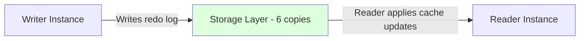

# How to Troubleshoot Aurora Reader Instance Lag

Author: [nawazdhandala](https://github.com/nawazdhandala)

Tags: AWS, Aurora, Troubleshooting, Replication Lag, Database

Description: Practical troubleshooting guide for Aurora reader instance lag, covering how to diagnose causes, interpret CloudWatch metrics, and resolve common lag issues.

---

Aurora's sub-millisecond replication lag is one of its biggest selling points. So when you check your monitoring and see lag creeping up to seconds or even minutes, something's definitely wrong. The good news is that Aurora replication lag has a relatively small set of root causes, and they're all diagnosable.

Let's walk through how to identify what's causing the lag and how to fix it.

## Understanding Aurora Replication

Before troubleshooting, it helps to understand how Aurora replication actually works. Unlike standard RDS where replication uses binary log shipping (a relatively slow process), Aurora readers share the same storage layer as the writer. Readers see new data once the storage layer has committed it.

So where does lag come from? The lag metric (`AuroraReplicaLag`) measures the delay between when data is committed in storage and when a reader instance has applied the changes to its in-memory buffer cache. The storage already has the data - the reader just needs to process the redo log entries to update its cached pages.



## Checking Current Lag

Start by measuring the current lag across all reader instances.

Using CloudWatch:

```bash
# Check replica lag for all reader instances
aws cloudwatch get-metric-statistics \
  --namespace AWS/RDS \
  --metric-name AuroraReplicaLag \
  --dimensions Name=DBClusterIdentifier,Value=my-aurora-cluster \
  --start-time $(date -u -d '1 hour ago' +%Y-%m-%dT%H:%M:%S) \
  --end-time $(date -u +%Y-%m-%dT%H:%M:%S) \
  --period 60 \
  --statistics Average Maximum \
  --output table
```

You can also check from within the database. For Aurora MySQL:

```sql
-- Check replication lag from inside Aurora MySQL
SELECT
    server_id,
    session_id,
    last_update_timestamp,
    replica_lag_in_msec,
    CASE
        WHEN replica_lag_in_msec < 20 THEN 'GOOD'
        WHEN replica_lag_in_msec < 100 THEN 'ACCEPTABLE'
        WHEN replica_lag_in_msec < 1000 THEN 'ELEVATED'
        ELSE 'CRITICAL'
    END as status
FROM mysql.ro_replica_status;
```

For Aurora PostgreSQL:

```sql
-- Check replication lag in Aurora PostgreSQL
SELECT
    server_id,
    replica_lag_in_msec,
    last_update_timestamp
FROM aurora_replica_status();
```

## Common Causes and Fixes

### Cause 1: Reader Instance Under-Provisioned

The most common cause of lag. If the reader instance doesn't have enough CPU or memory to process the redo log entries fast enough, lag builds up.

**How to diagnose:**

```bash
# Check CPU utilization on the reader
aws cloudwatch get-metric-statistics \
  --namespace AWS/RDS \
  --metric-name CPUUtilization \
  --dimensions Name=DBInstanceIdentifier,Value=my-aurora-reader-1 \
  --start-time $(date -u -d '1 hour ago' +%Y-%m-%dT%H:%M:%S) \
  --end-time $(date -u +%Y-%m-%dT%H:%M:%S) \
  --period 60 \
  --statistics Average Maximum

# Check freeable memory
aws cloudwatch get-metric-statistics \
  --namespace AWS/RDS \
  --metric-name FreeableMemory \
  --dimensions Name=DBInstanceIdentifier,Value=my-aurora-reader-1 \
  --start-time $(date -u -d '1 hour ago' +%Y-%m-%dT%H:%M:%S) \
  --end-time $(date -u +%Y-%m-%dT%H:%M:%S) \
  --period 60 \
  --statistics Average Minimum
```

**Fix:** Scale up the reader instance class or add more readers to distribute the query load:

```bash
# Scale up the reader instance
aws rds modify-db-instance \
  --db-instance-identifier my-aurora-reader-1 \
  --db-instance-class db.r5.xlarge \
  --apply-immediately
```

Consider setting up [auto scaling for read replicas](https://oneuptime.com/blog/post/configure-aurora-auto-scaling-for-read-replicas/view) so this adjusts automatically.

### Cause 2: Heavy Queries on the Reader

Long-running analytical queries or poorly optimized queries on a reader can consume all the CPU, leaving no resources for processing replication updates.

**How to diagnose:**

```sql
-- Find long-running queries on the reader instance
SELECT
    id,
    user,
    db,
    command,
    TIME as seconds_running,
    state,
    LEFT(info, 100) as query_preview
FROM information_schema.processlist
WHERE command != 'Sleep'
AND TIME > 5
ORDER BY TIME DESC;
```

**Fix:** Kill problematic queries and optimize them:

```sql
-- Kill a long-running query
KILL 12345;
```

A better long-term fix is to use [custom endpoints](https://oneuptime.com/blog/post/configure-aurora-endpoints-writer-reader-custom/view) to separate analytical queries from OLTP reads, so heavy queries don't impact your application readers.

### Cause 3: High Write Throughput on the Writer

If the writer is generating redo log entries faster than readers can apply them, lag increases. This happens during bulk data loads, large batch updates, or migration scripts.

**How to diagnose:**

```bash
# Check write throughput on the writer
aws cloudwatch get-metric-statistics \
  --namespace AWS/RDS \
  --metric-name WriteThroughput \
  --dimensions Name=DBInstanceIdentifier,Value=my-aurora-writer \
  --start-time $(date -u -d '1 hour ago' +%Y-%m-%dT%H:%M:%S) \
  --end-time $(date -u +%Y-%m-%dT%H:%M:%S) \
  --period 60 \
  --statistics Average Maximum
```

**Fix:** If the lag is from a temporary operation like a bulk load, just wait for it to catch up. If it's ongoing, consider:

- Batching writes in smaller transactions
- Spreading bulk operations over time
- Scaling up reader instances to process faster

### Cause 4: Buffer Pool Pressure on the Reader

When the reader's buffer pool is full and it needs to evict pages to apply new redo entries, lag increases. This is a memory issue.

**How to diagnose:**

```sql
-- Check buffer pool statistics on the reader
SHOW STATUS LIKE 'Innodb_buffer_pool%';

-- Key metrics to look at:
-- Innodb_buffer_pool_read_requests vs Innodb_buffer_pool_reads
-- A high ratio of reads to read_requests means lots of cache misses
```

```bash
# Check buffer pool cache hit ratio via CloudWatch
aws cloudwatch get-metric-statistics \
  --namespace AWS/RDS \
  --metric-name BufferCacheHitRatio \
  --dimensions Name=DBInstanceIdentifier,Value=my-aurora-reader-1 \
  --start-time $(date -u -d '1 hour ago' +%Y-%m-%dT%H:%M:%S) \
  --end-time $(date -u +%Y-%m-%dT%H:%M:%S) \
  --period 60 \
  --statistics Average
```

**Fix:** Increase the instance class to get a bigger buffer pool, or optimize queries to touch fewer pages.

### Cause 5: Network Issues

While uncommon with Aurora (since replication is storage-level), network issues between the compute instance and storage layer can contribute to lag.

**How to diagnose:**

```bash
# Check network throughput on the reader
aws cloudwatch get-metric-statistics \
  --namespace AWS/RDS \
  --metric-name NetworkReceiveThroughput \
  --dimensions Name=DBInstanceIdentifier,Value=my-aurora-reader-1 \
  --start-time $(date -u -d '1 hour ago' +%Y-%m-%dT%H:%M:%S) \
  --end-time $(date -u +%Y-%m-%dT%H:%M:%S) \
  --period 60 \
  --statistics Average Maximum
```

**Fix:** If you're hitting network bandwidth limits, upgrade to a larger instance class with more network bandwidth.

## Setting Up Lag Alerts

Don't wait for lag to become a problem. Set up CloudWatch alarms to alert you early:

```bash
# Create a CloudWatch alarm for replica lag
aws cloudwatch put-metric-alarm \
  --alarm-name aurora-replica-lag-warning \
  --alarm-description "Aurora replica lag exceeds 100ms" \
  --metric-name AuroraReplicaLag \
  --namespace AWS/RDS \
  --statistic Average \
  --period 300 \
  --threshold 100 \
  --comparison-operator GreaterThanThreshold \
  --dimensions Name=DBClusterIdentifier,Value=my-aurora-cluster \
  --evaluation-periods 3 \
  --alarm-actions arn:aws:sns:us-east-1:123456789012:db-alerts

# Create a critical alarm for high lag
aws cloudwatch put-metric-alarm \
  --alarm-name aurora-replica-lag-critical \
  --alarm-description "Aurora replica lag exceeds 1 second" \
  --metric-name AuroraReplicaLag \
  --namespace AWS/RDS \
  --statistic Maximum \
  --period 60 \
  --threshold 1000 \
  --comparison-operator GreaterThanThreshold \
  --dimensions Name=DBClusterIdentifier,Value=my-aurora-cluster \
  --evaluation-periods 2 \
  --alarm-actions arn:aws:sns:us-east-1:123456789012:db-alerts-critical
```

## A Diagnostic Script

Here's a comprehensive script that checks all the common lag causes at once:

```python
import boto3
from datetime import datetime, timedelta, timezone

def diagnose_lag(cluster_id, region='us-east-1'):
    """Run a comprehensive lag diagnostic for an Aurora cluster."""
    rds = boto3.client('rds', region_name=region)
    cw = boto3.client('cloudwatch', region_name=region)

    now = datetime.now(timezone.utc)
    start = now - timedelta(hours=1)

    # Get all instances in the cluster
    instances = rds.describe_db_instances(
        Filters=[{'Name': 'db-cluster-id', 'Values': [cluster_id]}]
    )['DBInstances']

    for inst in instances:
        inst_id = inst['DBInstanceIdentifier']
        is_writer = inst.get('DBInstanceRole', '') == 'writer'
        role = 'WRITER' if is_writer else 'READER'

        print(f"\n{'='*60}")
        print(f"Instance: {inst_id} ({role}) - {inst['DBInstanceClass']}")
        print(f"{'='*60}")

        metrics = {
            'CPUUtilization': '%',
            'FreeableMemory': 'bytes',
            'AuroraReplicaLag': 'ms',
            'DatabaseConnections': 'count',
            'BufferCacheHitRatio': '%'
        }

        for metric, unit in metrics.items():
            try:
                data = cw.get_metric_statistics(
                    Namespace='AWS/RDS',
                    MetricName=metric,
                    Dimensions=[{'Name': 'DBInstanceIdentifier', 'Value': inst_id}],
                    StartTime=start,
                    EndTime=now,
                    Period=300,
                    Statistics=['Average', 'Maximum']
                )
                if data['Datapoints']:
                    latest = sorted(data['Datapoints'], key=lambda x: x['Timestamp'])[-1]
                    avg = latest.get('Average', 'N/A')
                    mx = latest.get('Maximum', 'N/A')
                    if isinstance(avg, float):
                        avg = f"{avg:.2f}"
                    if isinstance(mx, float):
                        mx = f"{mx:.2f}"
                    print(f"  {metric}: avg={avg} max={mx} ({unit})")
            except Exception as e:
                print(f"  {metric}: error - {e}")

diagnose_lag("my-aurora-cluster")
```

## Wrapping Up

Aurora replica lag usually comes down to one of four things: under-provisioned reader instances, heavy queries hogging CPU, extreme write throughput on the writer, or buffer pool pressure. Start with the CloudWatch metrics to narrow down the cause, then apply the appropriate fix.

Set up monitoring and alarms before lag becomes a problem. A reader with consistently elevated lag can cause stale reads in your application, which leads to bugs that are incredibly hard to track down. For more Aurora operational guidance, check out the guide on [troubleshooting Aurora failover events](https://oneuptime.com/blog/post/troubleshoot-aurora-failover-events/view).
