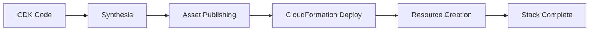

# How to Troubleshoot CDK Deployment Failures

Author: [nawazdhandala](https://github.com/nawazdhandala)

Tags: AWS, CDK, Debugging, DevOps

Description: Practical troubleshooting guide for common AWS CDK deployment failures, covering synthesis errors, CloudFormation rollbacks, permission issues, and stuck stacks.

---

CDK deployments fail. It happens to everyone, whether you're a beginner or you've deployed hundreds of stacks. The good news is that most failures fall into predictable categories, and once you know the patterns, you can diagnose and fix them quickly.

This guide covers the most common CDK deployment failures, from synthesis problems to CloudFormation rollbacks to stuck stacks that won't update or delete.

## The Deployment Pipeline

Understanding where failures happen helps you fix them faster. CDK deployment goes through several phases.



Each phase has its own failure modes. Let's go through them.

## Phase 1: Synthesis Failures

Synthesis failures happen before anything touches AWS. Your CDK code can't be converted to a CloudFormation template.

### TypeScript Compilation Errors

The most basic failures. TypeScript catches them.

```bash
# You'll see errors like:
# error TS2345: Argument of type 'string' is not assignable to parameter of type 'number'

# Fix: Run the TypeScript compiler to get clear error messages
npx tsc --noEmit
```

### Missing Context

CDK sometimes needs to look up information from your AWS account during synthesis - VPC IDs, availability zones, AMI IDs.

```bash
# Error: Cannot determine value of context key vpc-provider:account=123...
# This means CDK can't look up the VPC

# Fix: Make sure your AWS credentials are configured
aws sts get-caller-identity

# Or provide context explicitly
cdk synth -c vpcId=vpc-12345
```

### Circular Dependencies

CDK detects circular dependencies between constructs and refuses to synthesize.

```bash
# Error: 'Stack' depends on 'Stack' via ...

# This usually means two resources reference each other
# Fix: Break the cycle by using a different reference pattern
```

Here's a common circular dependency and its fix.

```typescript
// PROBLEM: Security group A references B, B references A
const sgA = new ec2.SecurityGroup(this, 'SgA', { vpc });
const sgB = new ec2.SecurityGroup(this, 'SgB', { vpc });
sgA.addIngressRule(sgB, ec2.Port.tcp(5432));
sgB.addIngressRule(sgA, ec2.Port.tcp(3000));
// This won't cause a circular dep in CDK, but similar patterns with
// cross-stack references can.

// FIX: Use connections instead, or put both in the same stack
sgA.connections.allowFrom(sgB, ec2.Port.tcp(5432));
sgB.connections.allowFrom(sgA, ec2.Port.tcp(3000));
```

## Phase 2: Asset Publishing Failures

After synthesis, CDK uploads assets (Lambda code, Docker images) to the bootstrap bucket and ECR repository.

### Bootstrap Not Found

```bash
# Error: CDKToolkit stack is not found or does not have the required outputs

# Fix: Bootstrap your account
cdk bootstrap aws://123456789012/us-east-1
```

### Docker Build Failures

If your stack includes Docker assets (like Fargate tasks), CDK builds them locally.

```bash
# Error: docker build failed with exit code 1

# Fix: Check your Dockerfile locally first
docker build -t test ./path/to/dockerfile

# Common causes:
# - Missing files in .dockerignore
# - npm install failing due to network or permissions
# - Wrong base image platform (ARM vs x86)
```

### S3 Upload Failures

```bash
# Error: Access Denied when publishing assets

# Fix: Check that the CDK execution role has S3 access
# to the bootstrap bucket (cdk-hnb659fds-assets-ACCOUNT-REGION)
aws s3 ls s3://cdk-hnb659fds-assets-123456789012-us-east-1/
```

## Phase 3: CloudFormation Deployment Failures

This is where most failures happen. CloudFormation tries to create, update, or delete resources and something goes wrong.

### Reading the Error

First, get the actual error message. The CDK output is often truncated.

```bash
# Get detailed events from the failed stack
aws cloudformation describe-stack-events \
  --stack-name MyStack \
  --query "StackEvents[?ResourceStatus=='CREATE_FAILED' || ResourceStatus=='UPDATE_FAILED']" \
  --output table

# Or filter for just the failure reasons
aws cloudformation describe-stack-events \
  --stack-name MyStack \
  --query "StackEvents[?contains(ResourceStatus, 'FAILED')].{Resource: LogicalResourceId, Status: ResourceStatus, Reason: ResourceStatusReason}" \
  --output table
```

### Common CloudFormation Errors

**Resource already exists:**

```bash
# Error: my-bucket-name already exists in stack arn:aws:cloudformation:...

# This happens when you hardcode resource names and the name is taken
# Fix: Remove the explicit name and let CloudFormation generate one
# Or import the existing resource

# Bad - hardcoded name
new s3.Bucket(this, 'Bucket', { bucketName: 'my-bucket-name' });

# Good - let CloudFormation name it
new s3.Bucket(this, 'Bucket');
```

**Resource limit exceeded:**

```bash
# Error: You have exceeded the limit for the number of...

# Fix: Request a service limit increase
aws service-quotas request-service-quota-increase \
  --service-code ec2 \
  --quota-code L-1216C47A \
  --desired-value 10
```

**IAM permission denied:**

```bash
# Error: API: ec2:CreateSecurityGroup You are not authorized to perform this operation

# Fix: The CloudFormation execution role needs the required permissions
# Check what policies are attached to the CDK execution role
aws iam list-attached-role-policies \
  --role-name cdk-hnb659fds-cfn-exec-role-123456789012-us-east-1
```

### Rollback Failures

When a deployment fails, CloudFormation tries to rollback to the previous state. Sometimes the rollback itself fails, leaving the stack in `UPDATE_ROLLBACK_FAILED` state.

```bash
# Check the stack status
aws cloudformation describe-stacks --stack-name MyStack \
  --query "Stacks[0].StackStatus"

# If stuck in UPDATE_ROLLBACK_FAILED, try continuing the rollback
# while skipping the problematic resources
aws cloudformation continue-update-rollback \
  --stack-name MyStack \
  --resources-to-skip LogicalResourceId1 LogicalResourceId2
```

## Phase 4: Stuck Stacks

The most frustrating situation is a stack that won't update, won't delete, and won't rollback.

### DELETE_FAILED Stacks

```bash
# First, try a normal delete
aws cloudformation delete-stack --stack-name MyStack

# If it fails, find out which resources can't be deleted
aws cloudformation describe-stack-events --stack-name MyStack \
  --query "StackEvents[?ResourceStatus=='DELETE_FAILED']"

# Common causes:
# - S3 bucket is not empty
# - Security group is in use by another resource
# - Lambda function is attached to a VPC ENI that's still cleaning up

# Delete with resource retention (skip the problematic resources)
aws cloudformation delete-stack --stack-name MyStack \
  --retain-resources LogicalResourceId1
```

### S3 Bucket Not Empty

The most common delete failure. CloudFormation won't delete a bucket that has objects in it.

```bash
# Empty the bucket first, then retry the stack deletion
aws s3 rm s3://my-bucket-name --recursive

# For versioned buckets, you also need to delete versions
aws s3api list-object-versions --bucket my-bucket-name \
  --query '{Objects: Versions[].{Key:Key,VersionId:VersionId}}' \
  --output json > delete.json
aws s3api delete-objects --bucket my-bucket-name --delete file://delete.json
```

In CDK, you can prevent this by enabling auto-deletion.

```typescript
// This adds a custom resource that empties the bucket before deletion
new s3.Bucket(this, 'Bucket', {
  removalPolicy: cdk.RemovalPolicy.DESTROY,
  autoDeleteObjects: true, // Empties bucket on stack deletion
});
```

## Debugging Techniques

### Verbose CDK Output

```bash
# Get detailed CDK output
cdk deploy --verbose  # or -v
cdk deploy -vv        # Even more verbose
cdk deploy -vvv       # Maximum verbosity
```

### CloudFormation Console

Sometimes the console gives you information that the CLI doesn't. Go to the CloudFormation console, find your stack, and look at the Events tab. Filter by "Failed" to see what went wrong.

### CloudTrail

For permission-related failures, CloudTrail shows exactly what API calls were denied.

```bash
# Look up recent denied API calls
aws cloudtrail lookup-events \
  --lookup-attributes AttributeKey=EventName,AttributeValue=CreateSecurityGroup \
  --query "Events[?contains(CloudTrailEvent, 'AccessDenied')]" \
  --max-results 5
```

## Preventing Failures

Run `cdk diff` before every deployment. If the diff shows resource replacements you didn't expect, investigate before deploying. See our guide on [synthesizing and diffing CDK changes](https://oneuptime.com/blog/post/synthesize-and-diff-cdk-changes-before-deployment/view).

Use [CDK Nag](https://oneuptime.com/blog/post/use-cdk-nag-for-security-best-practice-checks/view) to catch misconfigurations before deployment.

Set up monitoring with [OneUptime](https://oneuptime.com/blog/post/aws-cloudwatch-alternatives/view) so you catch deployment-related issues quickly if something does slip through.

## Wrapping Up

CDK deployment failures are annoying but usually fixable. The key is knowing where in the pipeline the failure happened and having the right debugging commands at your fingertips. Keep this guide bookmarked, and you'll spend a lot less time staring at cryptic error messages.
