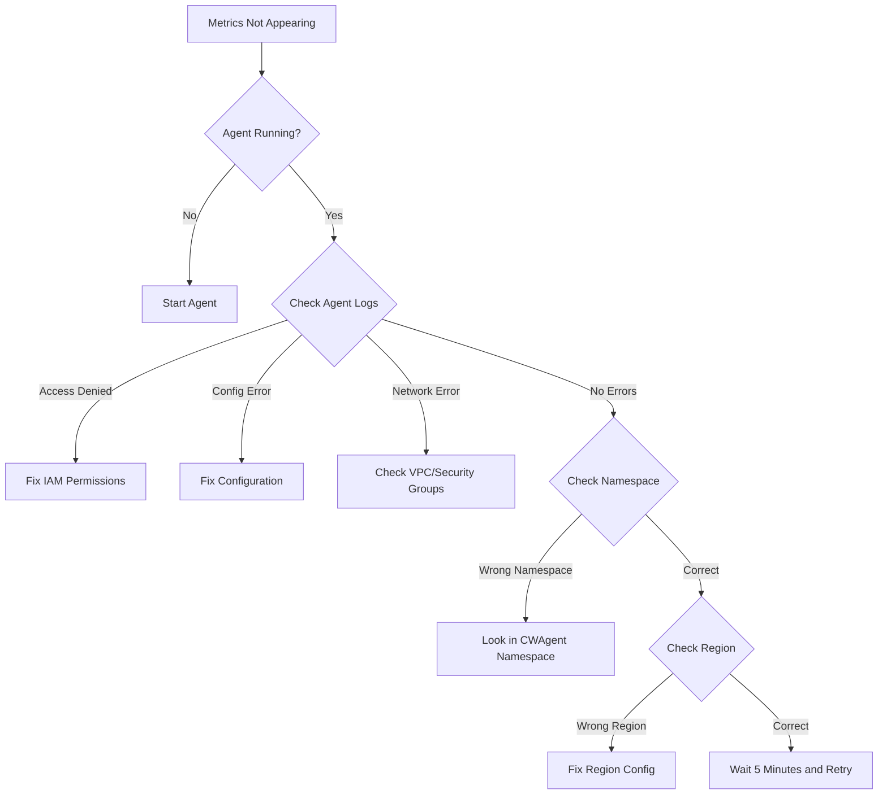

# How to Troubleshoot CloudWatch Agent Not Sending Metrics

Author: [nawazdhandala](https://github.com/nawazdhandala)

Tags: AWS, CloudWatch, Troubleshooting, CloudWatch Agent, Monitoring

Description: A systematic troubleshooting guide for diagnosing and fixing issues when the CloudWatch agent isn't sending metrics to CloudWatch on EC2, ECS, or EKS.

---

You installed the CloudWatch agent, configured it, started it, and... nothing. The metrics you expected in CloudWatch aren't there. This is one of the most frustrating monitoring issues because everything looks like it should work, but some invisible problem is blocking the data flow.

I've debugged this exact problem more times than I care to count. The cause is almost always one of a handful of issues: IAM permissions, configuration errors, network problems, or the agent not actually running. Let's go through each systematically.

## Step 1: Is the Agent Actually Running?

This seems obvious, but always start here:

```bash
# Check agent status on Linux
sudo /opt/aws/amazon-cloudwatch-agent/bin/amazon-cloudwatch-agent-ctl \
  -a status
```

The output should show:

```json
{
  "status": "running",
  "starttime": "2026-02-12T10:00:00Z",
  "configstatus": "configured",
  "cwoc_status": "running"
}
```

If it shows `stopped` or `not_configured`, there's your problem.

On Windows:

```powershell
# Check agent status on Windows
& "C:\Program Files\Amazon\AmazonCloudWatchAgent\amazon-cloudwatch-agent-ctl.ps1" -a status
```

For containers:

```bash
# Check agent pod/container status on EKS
kubectl get pods -n amazon-cloudwatch -l app=cloudwatch-agent

# Check container status on ECS
aws ecs describe-tasks \
  --cluster my-cluster \
  --tasks <task-arn> \
  --query "tasks[0].containers[?name=='cloudwatch-agent'].lastStatus"
```

## Step 2: Check the Agent Logs

The agent logs are your best friend for troubleshooting. They usually tell you exactly what's wrong:

```bash
# View agent logs on Linux
sudo cat /opt/aws/amazon-cloudwatch-agent/logs/amazon-cloudwatch-agent.log | tail -100

# View configuration validation log
sudo cat /opt/aws/amazon-cloudwatch-agent/logs/configuration-validation.log
```

Common error messages and what they mean:

**"AccessDeniedException"** - IAM permissions are missing. Jump to Step 3.

**"NoCredentialProviders"** - The agent can't find AWS credentials. Check the instance profile, ECS task role, or environment variables.

**"RequestError: send request failed"** - Network connectivity issue. Jump to Step 5.

**"Config validation error"** - Your configuration file has syntax or logical errors. Jump to Step 4.

**"Permission denied"** on a file path - The agent doesn't have OS-level permission to read the metrics source (like `/proc` or specific log files).

## Step 3: Verify IAM Permissions

The CloudWatch agent needs specific IAM permissions to publish metrics and logs.

For EC2, check the instance profile:

```bash
# Check which IAM role is attached to the instance
curl -s http://169.254.169.254/latest/meta-data/iam/security-credentials/

# Check if the role has the right policies
aws iam list-attached-role-policies --role-name <role-name-from-above>
```

The agent needs these permissions at minimum:

```json
// Minimum IAM policy for CloudWatch agent
{
  "Version": "2012-10-17",
  "Statement": [
    {
      "Effect": "Allow",
      "Action": [
        "cloudwatch:PutMetricData",
        "ec2:DescribeVolumes",
        "ec2:DescribeTags",
        "logs:PutLogEvents",
        "logs:DescribeLogStreams",
        "logs:DescribeLogGroups",
        "logs:CreateLogStream",
        "logs:CreateLogGroup",
        "logs:PutRetentionPolicy"
      ],
      "Resource": "*"
    },
    {
      "Effect": "Allow",
      "Action": [
        "ssm:GetParameter"
      ],
      "Resource": "arn:aws:ssm:*:*:parameter/AmazonCloudWatch-*"
    }
  ]
}
```

Or simply attach the managed policy `CloudWatchAgentServerPolicy`:

```bash
# Attach the managed policy to the role
aws iam attach-role-policy \
  --role-name EC2-CloudWatch-Role \
  --policy-arn arn:aws:iam::aws:policy/CloudWatchAgentServerPolicy
```

For ECS, check the task role (not the execution role - the agent uses the task role):

```bash
# Check the ECS task definition for the correct role
aws ecs describe-task-definition \
  --task-definition cloudwatch-agent \
  --query "taskDefinition.taskRoleArn"
```

## Step 4: Validate the Configuration

A broken config is one of the most common causes. Validate it:

```bash
# Validate the agent configuration
sudo /opt/aws/amazon-cloudwatch-agent/bin/amazon-cloudwatch-agent-ctl \
  -a fetch-config \
  -m ec2 \
  -s \
  -c file:/opt/aws/amazon-cloudwatch-agent/etc/amazon-cloudwatch-agent.json
```

Here's a working baseline configuration to compare against:

```json
// Working CloudWatch agent configuration for EC2
{
  "agent": {
    "metrics_collection_interval": 60,
    "run_as_user": "root",
    "debug": false
  },
  "metrics": {
    "namespace": "CWAgent",
    "metrics_collected": {
      "cpu": {
        "resources": ["*"],
        "measurement": [
          "cpu_usage_idle",
          "cpu_usage_user",
          "cpu_usage_system"
        ],
        "totalcpu": true,
        "metrics_collection_interval": 60
      },
      "disk": {
        "resources": ["/"],
        "measurement": [
          "disk_used_percent",
          "disk_free"
        ],
        "metrics_collection_interval": 60
      },
      "mem": {
        "measurement": [
          "mem_used_percent",
          "mem_available_percent"
        ],
        "metrics_collection_interval": 60
      }
    },
    "append_dimensions": {
      "InstanceId": "${aws:InstanceId}",
      "InstanceType": "${aws:InstanceType}"
    }
  }
}
```

Common configuration mistakes:

- **Missing `metrics_collected` section** - nothing to collect means nothing to send
- **Wrong metric names** - the names must exactly match what the agent supports
- **Invalid JSON** - missing commas, extra commas, unmatched braces. Use a JSON validator.
- **Wrong `run_as_user`** - if set to a non-root user, the agent might not have permission to read system metrics

Enable debug logging to get more detail:

```json
// Enable debug mode in agent configuration
{
  "agent": {
    "debug": true,
    "logfile": "/opt/aws/amazon-cloudwatch-agent/logs/amazon-cloudwatch-agent.log"
  }
}
```

Restart the agent after changing the config:

```bash
# Restart the agent with new config
sudo /opt/aws/amazon-cloudwatch-agent/bin/amazon-cloudwatch-agent-ctl \
  -a fetch-config \
  -m ec2 \
  -s \
  -c file:/opt/aws/amazon-cloudwatch-agent/etc/amazon-cloudwatch-agent.json
```

## Step 5: Check Network Connectivity

The agent needs to reach CloudWatch endpoints. If you're in a private subnet without a NAT gateway or VPC endpoints, the agent can't send data.

Test connectivity:

```bash
# Test connectivity to CloudWatch endpoint
curl -v https://monitoring.us-east-1.amazonaws.com 2>&1 | head -20

# Test connectivity to CloudWatch Logs endpoint
curl -v https://logs.us-east-1.amazonaws.com 2>&1 | head -20

# Check if you can reach the EC2 metadata service
curl -s http://169.254.169.254/latest/meta-data/instance-id
```

If these fail, you need either:

1. A NAT gateway in your VPC
2. VPC endpoints for CloudWatch:

```bash
# Create a VPC endpoint for CloudWatch monitoring
aws ec2 create-vpc-endpoint \
  --vpc-id vpc-abc123 \
  --service-name com.amazonaws.us-east-1.monitoring \
  --vpc-endpoint-type Interface \
  --subnet-ids subnet-xyz789 \
  --security-group-ids sg-123456

# Create a VPC endpoint for CloudWatch Logs
aws ec2 create-vpc-endpoint \
  --vpc-id vpc-abc123 \
  --service-name com.amazonaws.us-east-1.logs \
  --vpc-endpoint-type Interface \
  --subnet-ids subnet-xyz789 \
  --security-group-ids sg-123456
```

Also check security group rules. The agent needs outbound HTTPS (port 443) access.

## Step 6: Check the Correct Namespace

A common "it's not there" scenario is actually "it's in a different namespace than I expected." Custom metrics from the CloudWatch agent go to the `CWAgent` namespace by default, not `AWS/EC2`.

```bash
# List metrics in the CWAgent namespace
aws cloudwatch list-metrics --namespace CWAgent

# If you set a custom namespace in the config, check that instead
aws cloudwatch list-metrics --namespace "MyCustomNamespace"
```

## Step 7: Check Region Mismatch

The agent sends metrics to the region it's configured for. If your agent is configured for `us-east-1` but you're looking in `us-west-2`, you won't find anything.

```bash
# Check which region the agent is using
grep -i region /opt/aws/amazon-cloudwatch-agent/etc/amazon-cloudwatch-agent.toml
```

The agent determines the region from (in order):
1. Agent configuration
2. EC2 instance metadata
3. AWS config file
4. Environment variable `AWS_REGION`

## Step 8: Wait for Data

New metrics can take up to 5 minutes to appear in CloudWatch after the agent starts sending them. If you just started the agent, give it a few minutes before panicking.

Also check the `metrics_collection_interval`. If it's set to 300 (5 minutes), you won't see data for at least 5 minutes.

## Step 9: Check for Disk Space

The agent buffers data locally before sending. If the disk is full, it can't buffer:

```bash
# Check disk space
df -h /opt/aws/amazon-cloudwatch-agent/

# Check agent temp files
ls -la /opt/aws/amazon-cloudwatch-agent/var/
```

## Troubleshooting Flowchart



## Quick Reference: Agent Commands

```bash
# Start the agent
sudo /opt/aws/amazon-cloudwatch-agent/bin/amazon-cloudwatch-agent-ctl -a start

# Stop the agent
sudo /opt/aws/amazon-cloudwatch-agent/bin/amazon-cloudwatch-agent-ctl -a stop

# Check status
sudo /opt/aws/amazon-cloudwatch-agent/bin/amazon-cloudwatch-agent-ctl -a status

# Apply new config and restart
sudo /opt/aws/amazon-cloudwatch-agent/bin/amazon-cloudwatch-agent-ctl \
  -a fetch-config -m ec2 -s \
  -c file:/opt/aws/amazon-cloudwatch-agent/etc/amazon-cloudwatch-agent.json

# Get the running config
sudo /opt/aws/amazon-cloudwatch-agent/bin/amazon-cloudwatch-agent-ctl -a get-config
```

## Wrapping Up

In 90% of cases, CloudWatch agent issues come down to one of three things: IAM permissions, configuration mistakes, or network connectivity. Work through the steps in order - verify the agent is running, check the logs, confirm IAM, validate the config, and test network access. The agent logs almost always contain the answer; you just have to read them.

If you're also missing log data alongside metrics, check out our guide on [troubleshooting missing CloudWatch Logs](https://oneuptime.com/blog/post/2026-02-12-troubleshoot-missing-cloudwatch-logs/view).
