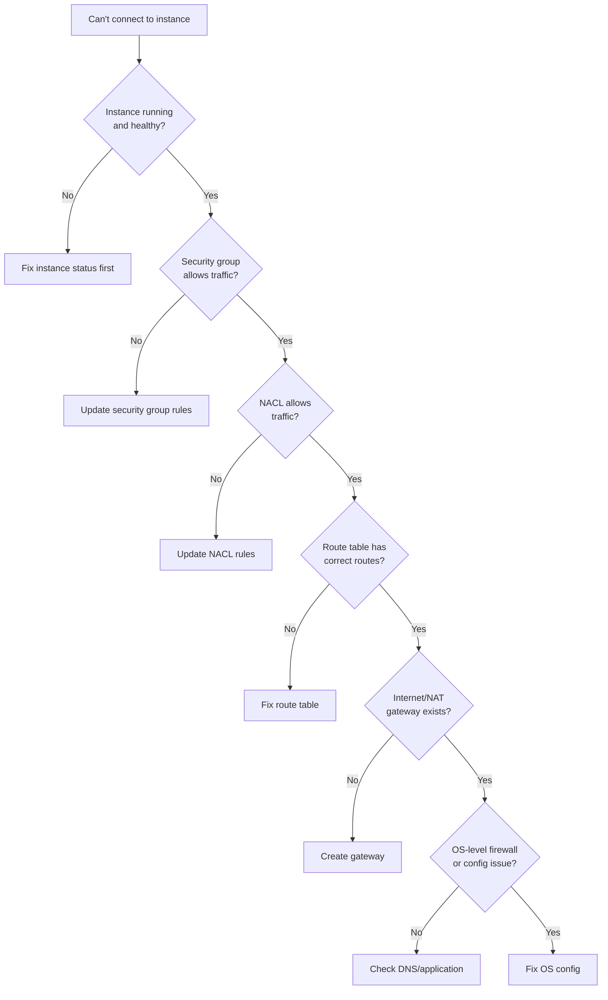

# How to Troubleshoot EC2 Network Connectivity Issues

Author: [nawazdhandala](https://github.com/nawazdhandala)

Tags: AWS, EC2, Networking, Troubleshooting, VPC, Security Groups, Debugging

Description: Systematically diagnose and fix EC2 network connectivity problems including security groups, NACLs, routing, DNS, and VPC configuration issues.

---

"I can't connect to my instance" is probably the most common EC2 support request. Network connectivity issues on AWS have many possible causes - security groups, NACLs, route tables, internet gateways, NAT gateways, DNS, and the instance's own configuration. The good news is there's a systematic approach to debugging. Work through the layers from the outside in, and you'll find the problem.

## The Debugging Framework

Network issues on AWS fall into layers. Check them in order:



## Step 1: Verify the Instance Is Running

Before debugging networking, confirm the instance is actually running and healthy:

```bash
# Check instance state and status checks
aws ec2 describe-instance-status \
  --instance-ids i-0abc123 \
  --query 'InstanceStatuses[0].{
    State: InstanceState.Name,
    SystemStatus: SystemStatus.Status,
    InstanceStatus: InstanceStatus.Status
  }'
```

If status checks are failing, that's a different problem - see [troubleshooting status check failures](https://oneuptime.com/blog/post/troubleshoot-ec2-instance-status-check-failures/view).

## Step 2: Check Security Groups

Security groups are the most common cause of connectivity issues. They're stateful (return traffic is automatically allowed), but only for traffic that was allowed inbound in the first place.

```bash
# List all security groups attached to the instance
aws ec2 describe-instances \
  --instance-ids i-0abc123 \
  --query 'Reservations[0].Instances[0].SecurityGroups'

# Check inbound rules for each security group
aws ec2 describe-security-groups \
  --group-ids sg-abc123 \
  --query 'SecurityGroups[0].IpPermissions[*].{
    Protocol: IpProtocol,
    FromPort: FromPort,
    ToPort: ToPort,
    Sources: IpRanges[*].CidrIp
  }' --output table
```

Common security group problems:

**SSH blocked:**
```bash
# Add SSH access from your IP
MY_IP=$(curl -s https://checkip.amazonaws.com)
aws ec2 authorize-security-group-ingress \
  --group-id sg-abc123 \
  --protocol tcp \
  --port 22 \
  --cidr "${MY_IP}/32"
```

**Application port not open:**
```bash
# Open port 443 for HTTPS
aws ec2 authorize-security-group-ingress \
  --group-id sg-abc123 \
  --protocol tcp \
  --port 443 \
  --cidr 0.0.0.0/0
```

**Wrong source reference:**
```bash
# If you're connecting from another instance, use the security group as source
aws ec2 authorize-security-group-ingress \
  --group-id sg-target \
  --protocol tcp \
  --port 5432 \
  --source-group sg-source
```

## Step 3: Check Network ACLs

NACLs are stateless (unlike security groups), which means you need explicit rules for both inbound AND outbound traffic, including return traffic on ephemeral ports.

```bash
# Find which NACL applies to the instance's subnet
SUBNET_ID=$(aws ec2 describe-instances \
  --instance-ids i-0abc123 \
  --query 'Reservations[0].Instances[0].SubnetId' --output text)

aws ec2 describe-network-acls \
  --filters "Name=association.subnet-id,Values=$SUBNET_ID" \
  --query 'NetworkAcls[0].{
    InboundRules: Entries[?Egress==`false`],
    OutboundRules: Entries[?Egress==`true`]
  }' --output json
```

The most common NACL issue: forgetting the outbound ephemeral port rule. When a client connects to port 80, the return traffic goes out on a random ephemeral port (1024-65535). If the NACL doesn't allow outbound traffic on those ports, the response never reaches the client.

```bash
# Add an outbound rule allowing ephemeral ports (needed for return traffic)
aws ec2 create-network-acl-entry \
  --network-acl-id acl-abc123 \
  --rule-number 100 \
  --protocol tcp \
  --port-range From=1024,To=65535 \
  --cidr-block 0.0.0.0/0 \
  --egress \
  --rule-action allow
```

## Step 4: Check Route Tables

The subnet's route table determines where traffic goes. A missing or incorrect route means traffic has no path.

```bash
# Check the route table for the instance's subnet
aws ec2 describe-route-tables \
  --filters "Name=association.subnet-id,Values=$SUBNET_ID" \
  --query 'RouteTables[0].Routes[*].{
    Destination: DestinationCidrBlock,
    Target: GatewayId || NatGatewayId || TransitGatewayId,
    State: State
  }' --output table
```

**For public subnets**, you should see a route like:
```
Destination: 0.0.0.0/0  ->  Target: igw-abc123 (Internet Gateway)
```

**For private subnets**, you should see:
```
Destination: 0.0.0.0/0  ->  Target: nat-abc123 (NAT Gateway)
```

If the 0.0.0.0/0 route is missing, the instance has no path to the internet:

```bash
# Add a route to the internet gateway (public subnet)
aws ec2 create-route \
  --route-table-id rtb-abc123 \
  --destination-cidr-block 0.0.0.0/0 \
  --gateway-id igw-abc123

# Or add a route to NAT gateway (private subnet)
aws ec2 create-route \
  --route-table-id rtb-def456 \
  --destination-cidr-block 0.0.0.0/0 \
  --nat-gateway-id nat-abc123
```

## Step 5: Check Internet Gateway

If the route points to an internet gateway, verify it exists and is attached:

```bash
# Check if the VPC has an internet gateway
VPC_ID=$(aws ec2 describe-subnets --subnet-ids $SUBNET_ID \
  --query 'Subnets[0].VpcId' --output text)

aws ec2 describe-internet-gateways \
  --filters "Name=attachment.vpc-id,Values=$VPC_ID" \
  --query 'InternetGateways[*].{
    Id: InternetGatewayId,
    State: Attachments[0].State
  }'
```

## Step 6: Verify the Instance Has a Public IP

For direct internet access (not through NAT), the instance needs a public IP or Elastic IP:

```bash
# Check for public IP
aws ec2 describe-instances \
  --instance-ids i-0abc123 \
  --query 'Reservations[0].Instances[0].{
    PublicIp: PublicIpAddress,
    PrivateIp: PrivateIpAddress,
    ElasticIp: NetworkInterfaces[0].Association.PublicIp
  }'
```

No public IP? Either assign an Elastic IP or make sure the instance is in a private subnet with a NAT gateway:

```bash
# Allocate and associate an Elastic IP
EIP_ALLOC=$(aws ec2 allocate-address --domain vpc --query 'AllocationId' --output text)
aws ec2 associate-address --allocation-id $EIP_ALLOC --instance-id i-0abc123
```

## Step 7: OS-Level Firewall

If the AWS networking is fine but you still can't connect, the problem might be inside the instance.

**Linux iptables/firewalld:**

```bash
# Check if iptables is blocking traffic (run on the instance)
sudo iptables -L -n

# Check firewalld status
sudo firewall-cmd --state
sudo firewall-cmd --list-all

# Temporarily disable firewalld for testing
sudo systemctl stop firewalld
```

**Check if the service is actually listening:**

```bash
# Verify the application is listening on the expected port
sudo ss -tlnp | grep :80
sudo ss -tlnp | grep :443

# If nothing is listening, the problem is the application, not the network
```

## Using VPC Reachability Analyzer

AWS has a built-in network debugging tool that traces the path between two endpoints:

```bash
# Create a reachability analysis
ANALYSIS_ID=$(aws ec2 create-network-insights-path \
  --source i-0abc123 \
  --destination i-0def456 \
  --protocol tcp \
  --destination-port 443 \
  --query 'NetworkInsightsPath.NetworkInsightsPathId' --output text)

# Start the analysis
aws ec2 start-network-insights-analysis \
  --network-insights-path-id $ANALYSIS_ID

# Get results (may take a minute)
aws ec2 describe-network-insights-analyses \
  --network-insights-analysis-ids nia-abc123 \
  --query 'NetworkInsightsAnalyses[0].{
    Status: Status,
    Reachable: NetworkPathFound,
    Explanations: Explanations
  }'
```

This tells you exactly which component in the path is blocking traffic.

## Common Scenarios and Quick Fixes

**Can SSH from one instance but not another:**
- Check the security group source - it probably only allows the first instance's IP or security group

**Can ping but not connect on specific port:**
- Security group or NACL is blocking the specific port
- Application isn't listening on that port

**Connection times out (no response):**
- Usually a routing or gateway issue
- Traffic is being sent but never arrives

**Connection refused (immediate rejection):**
- Network path is working but the application isn't listening
- OS firewall is rejecting the connection

**Works intermittently:**
- NACL issue (rules are evaluated in order, a deny might be winning)
- DNS resolution inconsistency
- NAT gateway bandwidth limits

## Quick Diagnostic Script

```bash
#!/bin/bash
# diagnose-connectivity.sh
# Quick network diagnosis for an EC2 instance

INSTANCE_ID=$1
PORT=${2:-22}

echo "=== Network Diagnosis for $INSTANCE_ID (port $PORT) ==="

# Get instance details
DETAILS=$(aws ec2 describe-instances --instance-ids $INSTANCE_ID \
  --query 'Reservations[0].Instances[0]')

STATE=$(echo $DETAILS | jq -r '.State.Name')
PUBLIC_IP=$(echo $DETAILS | jq -r '.PublicIpAddress // "none"')
PRIVATE_IP=$(echo $DETAILS | jq -r '.PrivateIpAddress')
SUBNET=$(echo $DETAILS | jq -r '.SubnetId')
VPC=$(echo $DETAILS | jq -r '.VpcId')
SG_IDS=$(echo $DETAILS | jq -r '.SecurityGroups[].GroupId')

echo "State: $STATE"
echo "Public IP: $PUBLIC_IP"
echo "Private IP: $PRIVATE_IP"
echo "Subnet: $SUBNET"
echo "VPC: $VPC"
echo "Security Groups: $SG_IDS"

# Check security group rules for the port
echo ""
echo "--- Security Group Rules for port $PORT ---"
for SG in $SG_IDS; do
  echo "SG: $SG"
  aws ec2 describe-security-groups --group-ids $SG \
    --query "SecurityGroups[0].IpPermissions[?FromPort<=\`$PORT\` && ToPort>=\`$PORT\`]" \
    --output json
done

# Check NACL
echo ""
echo "--- NACL Rules ---"
aws ec2 describe-network-acls \
  --filters "Name=association.subnet-id,Values=$SUBNET" \
  --query 'NetworkAcls[0].Entries[?!Egress]' --output json

# Check route table
echo ""
echo "--- Route Table ---"
aws ec2 describe-route-tables \
  --filters "Name=association.subnet-id,Values=$SUBNET" \
  --query 'RouteTables[0].Routes' --output table

echo ""
echo "=== Diagnosis complete ==="
```

Network connectivity issues have a lot of possible causes, but working through them systematically, layer by layer, narrows things down quickly. Start with the obvious (is it running? is the security group right?) before diving into the more obscure possibilities. Nine times out of ten, it's a security group rule.
