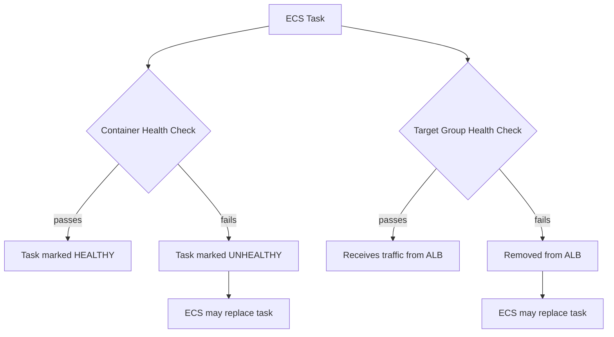

# How to Troubleshoot ECS Container Health Check Failures

Author: [nawazdhandala](https://github.com/nawazdhandala)

Tags: AWS, ECS, Troubleshooting, Docker, Health Checks

Description: A practical guide to diagnosing and fixing ECS container health check failures, covering both Docker health checks and ALB target group health checks.

---

Health checks are supposed to keep your services reliable. When they work correctly, unhealthy containers get replaced automatically and traffic only goes to healthy instances. But when health checks are misconfigured, they can make your service worse - constantly killing containers that are actually fine, or letting broken ones keep serving traffic.

ECS has two different health check mechanisms, and they interact in ways that can be confusing. Let's sort it all out.

## Two Types of Health Checks

There are two distinct health check systems at play in ECS:

1. **Container health checks** - Defined in the task definition (or Dockerfile). These run inside the container and determine if the ECS task is healthy.
2. **Target group health checks** - Defined on the ALB/NLB target group. These determine if the target should receive traffic.

They're independent systems that serve different purposes, but ECS uses both of them to make decisions about your tasks.



## Diagnosing Container Health Check Failures

Container health checks are commands that run inside your container at regular intervals. When they fail, the container's health status changes to UNHEALTHY.

First, check the current health status:

```bash
# Check health status of running tasks
aws ecs describe-tasks \
  --cluster production \
  --tasks $(aws ecs list-tasks --cluster production --service-name api-service --query "taskArns[0:3]" --output text) \
  --query "tasks[*].containers[*].{name:name, healthStatus:healthStatus, lastStatus:lastStatus}"
```

Then check the health check configuration:

```bash
# See the health check definition
aws ecs describe-task-definition \
  --task-definition api-service \
  --query "taskDefinition.containerDefinitions[*].{name:name, healthCheck:healthCheck}"
```

A typical health check looks like this:

```json
{
  "healthCheck": {
    "command": ["CMD-SHELL", "curl -f http://localhost:8080/health || exit 1"],
    "interval": 30,
    "timeout": 5,
    "retries": 3,
    "startPeriod": 60
  }
}
```

### Common Container Health Check Issues

**The health endpoint doesn't exist.** Your app doesn't have a `/health` endpoint, so curl returns a 404, and the health check fails.

Fix: Add a health endpoint to your application, or change the health check to hit an endpoint that does exist:

```python
# Simple health check endpoint in Flask
@app.route('/health')
def health():
    # Check dependencies if needed
    return {'status': 'healthy'}, 200
```

**curl isn't installed in the container.** Many minimal Docker images (like Alpine-based ones) don't include curl by default.

Fix: Either install curl in your Dockerfile or use a different command:

```json
{
  "healthCheck": {
    "command": ["CMD-SHELL", "wget -q --spider http://localhost:8080/health || exit 1"]
  }
}
```

Or for containers without any HTTP tools:

```json
{
  "healthCheck": {
    "command": ["CMD-SHELL", "test -f /tmp/healthy || exit 1"]
  }
}
```

Your application would create `/tmp/healthy` once it's ready to serve traffic.

**Start period is too short.** If your application takes 45 seconds to start but the start period is 10 seconds, the health check will fail before the app is ready. During the start period, failed health checks don't count against the retry limit.

```json
{
  "healthCheck": {
    "command": ["CMD-SHELL", "curl -f http://localhost:8080/health || exit 1"],
    "interval": 10,
    "timeout": 5,
    "retries": 3,
    "startPeriod": 120
  }
}
```

Set the `startPeriod` to at least 1.5x your application's expected startup time to account for slower starts under load.

**Timeout too aggressive.** If the health check endpoint is slow (because it checks database connections, for example) and the timeout is 2 seconds, it might fail intermittently:

```json
{
  "healthCheck": {
    "command": ["CMD-SHELL", "curl -f --max-time 10 http://localhost:8080/health || exit 1"],
    "interval": 30,
    "timeout": 15,
    "retries": 3,
    "startPeriod": 60
  }
}
```

## Diagnosing Target Group Health Check Failures

Target group health checks are run by the load balancer, hitting your container from outside. They're configured on the target group, not in the task definition.

Check the current health:

```bash
# Check target health with detailed reasons
aws elbv2 describe-target-health \
  --target-group-arn arn:aws:elasticloadbalancing:us-east-1:123456789012:targetgroup/api-tg/abc123
```

The response includes a reason code when targets are unhealthy:

| Reason | Description |
|--------|-------------|
| Elb.RegistrationInProgress | Target is still registering |
| Elb.InitialHealthChecking | Initial health checks in progress |
| Target.ResponseCodeMismatch | Response code doesn't match expected |
| Target.Timeout | Health check timed out |
| Target.FailedHealthChecks | Exceeded unhealthy threshold |
| Target.NotRegistered | Target was deregistered |

### Target.ResponseCodeMismatch

The most common issue. The load balancer expects a 200 response but gets something else.

Check the target group health check settings:

```bash
# View the health check configuration
aws elbv2 describe-target-groups \
  --target-group-arns arn:aws:elasticloadbalancing:us-east-1:123456789012:targetgroup/api-tg/abc123 \
  --query "TargetGroups[0].{path:HealthCheckPath, port:HealthCheckPort, protocol:HealthCheckProtocol, matcher:Matcher, interval:HealthCheckIntervalSeconds, timeout:HealthCheckTimeoutSeconds, healthy:HealthyThresholdCount, unhealthy:UnhealthyThresholdCount}"
```

If your app returns 204, 301, or any other non-200 code on the health endpoint, you need to update the matcher:

```bash
# Allow 200-299 range as healthy responses
aws elbv2 modify-target-group \
  --target-group-arn arn:aws:elasticloadbalancing:us-east-1:123456789012:targetgroup/api-tg/abc123 \
  --matcher "HttpCode=200-299"
```

### Target.Timeout

The health check request times out before getting a response. This can happen when:

- The container is overloaded and can't respond in time
- There's a network issue between the ALB and the container
- The security group blocks the traffic

Verify network connectivity:

```bash
# Check that the task's security group allows inbound from the ALB's security group
aws ec2 describe-security-groups \
  --group-ids sg-task-abc123 \
  --query "SecurityGroups[0].IpPermissions[?FromPort==\`8080\`]"
```

The task's security group must allow inbound traffic on the container port from the ALB's security group.

### Port Mismatches

A sneaky issue: the target group health check port doesn't match the container port.

```bash
# Check the container port in the task definition
aws ecs describe-task-definition \
  --task-definition api-service \
  --query "taskDefinition.containerDefinitions[0].portMappings"

# Compare with the target group port
aws elbv2 describe-target-groups \
  --target-group-arns arn:aws:elasticloadbalancing:us-east-1:123456789012:targetgroup/api-tg/abc123 \
  --query "TargetGroups[0].Port"
```

If these don't match, the health check will always fail.

## Health Check Grace Period

The health check grace period is an ECS service setting that tells ECS to ignore health check failures for a period after a task starts. This is critical for applications with long startup times.

```bash
# Check the current grace period
aws ecs describe-services \
  --cluster production \
  --services api-service \
  --query "services[0].healthCheckGracePeriodSeconds"

# Update it if needed
aws ecs update-service \
  --cluster production \
  --service api-service \
  --health-check-grace-period-seconds 120
```

Without a grace period, ECS might deregister and stop your task before it even finishes starting up. Set this to at least the time your application needs to become fully operational.

## Interaction Between Health Checks

Here's how ECS uses both health check types together:

1. The task starts and the container health check begin running
2. After the health check grace period, ECS starts considering both health check results
3. If the container health check fails, ECS marks the task as UNHEALTHY
4. If the target group health check fails, the ALB stops sending traffic
5. ECS may replace tasks that fail either type of health check

A task can be "healthy" from the container's perspective but "unhealthy" from the load balancer's perspective, or vice versa. Both need to pass for your service to work correctly.

## Testing Health Checks

Before deploying, test your health check locally:

```bash
# Run the same health check command that ECS will use
docker exec my-container curl -f http://localhost:8080/health

# Or test from outside the container (like the ALB would)
curl -f http://localhost:8080/health
```

Check the response code, response time, and response body. Make sure it consistently returns the expected result.

## Best Practices

A few things I've learned the hard way:

1. **Keep health check endpoints fast.** Don't check every dependency in your health endpoint. A simple "I'm alive" check is often better than a deep dependency check that takes 5 seconds and times out under load.

2. **Use separate endpoints for liveness and readiness.** A `/health` endpoint that returns 200 if the process is alive, and a `/ready` endpoint that checks dependencies. Use `/health` for the container health check and `/ready` for the load balancer.

3. **Log health check failures.** If your health check endpoint fails, log the reason. It's hard to debug health check issues after the fact if there's no trail.

4. **Don't make health checks too sensitive.** A momentary spike in database latency shouldn't cause your entire fleet to be marked unhealthy. Use retries and appropriate thresholds.

## Wrapping Up

Health check failures are one of the top causes of ECS deployment issues and service instability. Understanding the difference between container health checks and target group health checks, and configuring both correctly, will save you hours of debugging.

Start with generous timeouts and start periods, then tighten them as you learn your application's behavior. And always test your health checks locally before deploying to production. For related deployment troubleshooting, check out our guide on [troubleshooting ECS service deployment issues](https://oneuptime.com/blog/post/troubleshoot-ecs-service-deployment-issues/view).
