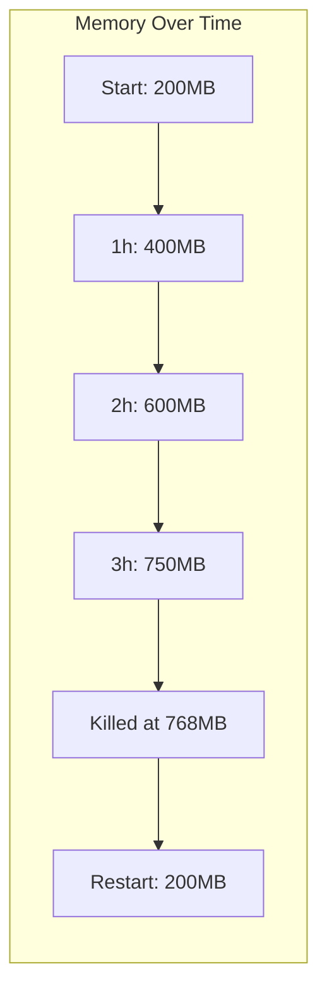

# How to Troubleshoot ECS Out-of-Memory Errors

Author: [nawazdhandala](https://github.com/nawazdhandala)

Tags: AWS, ECS, Troubleshooting, Docker, Memory

Description: A comprehensive guide to diagnosing and fixing out-of-memory (OOM) errors in Amazon ECS, including memory limits, leak detection, and right-sizing strategies.

---

Few things are more frustrating than ECS tasks dying with exit code 137. Your container was running fine, handling requests, doing its job - then suddenly it gets killed by the OOM (Out of Memory) killer with no warning. It restarts, runs for a while, gets killed again. If you're lucky, the service recovers. If you're not, tasks start cascading and your whole service goes down.

OOM errors in ECS have specific causes and specific fixes. Let's work through them systematically.

## Understanding Memory in ECS

ECS has multiple layers of memory management, and they interact in ways that aren't always obvious.

### Task-Level Memory (Fargate)

On Fargate, you set the total memory for the task. This is a hard limit - the task can't use more than this.

```json
{
  "family": "api-service",
  "requiresCompatibilities": ["FARGATE"],
  "cpu": "512",
  "memory": "1024"
}
```

Valid Fargate memory values depend on the CPU setting:

| CPU (vCPU) | Memory Options (MB) |
|------------|-------------------|
| 256 (.25) | 512, 1024, 2048 |
| 512 (.5) | 1024 - 4096 |
| 1024 (1) | 2048 - 8192 |
| 2048 (2) | 4096 - 16384 |
| 4096 (4) | 8192 - 30720 |

### Container-Level Memory

Each container can have its own memory limits:

- **memory** (hard limit) - The container will be killed if it exceeds this
- **memoryReservation** (soft limit) - The guaranteed minimum memory for the container

```json
{
  "containerDefinitions": [
    {
      "name": "api",
      "memory": 768,
      "memoryReservation": 512
    },
    {
      "name": "sidecar",
      "memory": 256,
      "memoryReservation": 128
    }
  ]
}
```

On Fargate, the sum of all container hard limits can't exceed the task-level memory. On EC2, it's more flexible since containers can share the instance's memory.

## Identifying OOM Kills

### Check the Exit Code

The fastest way to confirm an OOM kill:

```bash
# Describe stopped tasks and check for exit code 137
aws ecs describe-tasks \
  --cluster production \
  --tasks arn:aws:ecs:us-east-1:123456789012:task/production/abc123 \
  --query "tasks[0].containers[*].{name:name, exitCode:exitCode, reason:reason}"
```

Exit code 137 means the container received SIGKILL, which is what the OOM killer sends. The `reason` field might also say "OutOfMemoryError" or "Container killed due to memory".

### Check the Stopped Reason

```bash
# Get the task-level stop reason
aws ecs describe-tasks \
  --cluster production \
  --tasks arn:aws:ecs:us-east-1:123456789012:task/production/abc123 \
  --query "tasks[0].{stopCode:stopCode, stoppedReason:stoppedReason}"
```

If the `stoppedReason` includes "OutOfMemoryError" or "Essential container in task exited", and the container exit code is 137, you've confirmed an OOM kill.

### Check Container Insights Metrics

If you have Container Insights enabled, you can see the memory trajectory leading up to the kill:

```bash
# Query memory utilization over time
aws cloudwatch get-metric-statistics \
  --namespace "ECS/ContainerInsights" \
  --metric-name MemoryUtilized \
  --dimensions \
    Name=ClusterName,Value=production \
    Name=ServiceName,Value=api-service \
  --start-time "$(date -u -v-6H +%Y-%m-%dT%H:%M:%SZ)" \
  --end-time "$(date -u +%Y-%m-%dT%H:%M:%SZ)" \
  --period 60 \
  --statistics Average Maximum
```

A steadily increasing memory graph that suddenly drops to zero is the classic OOM pattern. The drop happens when the container is killed and replaced.



## Common Causes and Fixes

### Cause 1: Container Memory Limit Too Low

The simplest case - your application legitimately needs more memory than you've allocated.

How to tell: The application hits peak memory during normal operation (not due to a leak) and gets killed.

Fix: Increase the memory limit. But first, check what the application actually needs:

```bash
# Use CloudWatch Logs Insights to find peak memory usage
# Query the Container Insights performance log group
aws logs start-query \
  --log-group-name "/aws/ecs/containerinsights/production/performance" \
  --start-time $(date -u -v-24H +%s) \
  --end-time $(date -u +%s) \
  --query-string 'fields @timestamp, MemoryUtilized, MemoryReserved | filter Type = "Task" and ServiceName = "api-service" | stats max(MemoryUtilized) as peak_mb, avg(MemoryUtilized) as avg_mb'
```

Set the memory limit to about 1.5x the observed peak to give yourself headroom.

### Cause 2: Memory Leak

If memory grows continuously over time until the container is killed, you have a memory leak. The container works fine after restart but gradually consumes more and more memory.

For Node.js applications, you can expose heap statistics:

```javascript
// Add a diagnostic endpoint that reports memory usage
const v8 = require('v8');

app.get('/debug/memory', (req, res) => {
  const heapStats = v8.getHeapStatistics();
  const memUsage = process.memoryUsage();

  res.json({
    heapUsedMB: Math.round(memUsage.heapUsed / 1024 / 1024),
    heapTotalMB: Math.round(memUsage.heapTotal / 1024 / 1024),
    rssMB: Math.round(memUsage.rss / 1024 / 1024),
    externalMB: Math.round(memUsage.external / 1024 / 1024),
    heapSizeLimit: Math.round(heapStats.heap_size_limit / 1024 / 1024)
  });
});
```

For Java applications, monitor the JVM heap:

```java
// Expose JVM memory metrics
Runtime runtime = Runtime.getRuntime();
long usedMemory = runtime.totalMemory() - runtime.freeMemory();
long maxMemory = runtime.maxMemory();
double usagePercent = (double) usedMemory / maxMemory * 100;
```

Common sources of memory leaks:
- Event listeners that aren't removed
- Caches that grow without bounds
- Connection pools that don't release connections
- Large objects stored in session state
- Circular references preventing garbage collection

### Cause 3: JVM Heap Not Configured for Container Limits

This is a classic Java gotcha. The JVM decides its max heap size based on the system's total memory, not the container's memory limit. On a host with 16 GB of RAM, the JVM might try to allocate 4 GB of heap, even though the container only has 1 GB allocated.

Fix: Always set explicit JVM memory flags:

```dockerfile
# In your Dockerfile or entrypoint
ENV JAVA_OPTS="-XX:MaxRAMPercentage=75.0 -XX:InitialRAMPercentage=50.0"

# Or with explicit limits
ENV JAVA_OPTS="-Xmx512m -Xms256m"
```

The `-XX:MaxRAMPercentage=75.0` flag tells the JVM to use at most 75% of the container's memory limit for heap. This leaves room for non-heap memory (metaspace, thread stacks, native memory).

### Cause 4: Sidecar Containers Stealing Memory

If you're running sidecar containers (log routers, proxies, monitoring agents), they consume memory from the same task-level allocation.

Check how much memory each container is actually using:

```bash
# Query per-container memory usage from Container Insights
aws logs start-query \
  --log-group-name "/aws/ecs/containerinsights/production/performance" \
  --start-time $(date -u -v-1H +%s) \
  --end-time $(date -u +%s) \
  --query-string 'fields @timestamp, ContainerName, MemoryUtilized | filter Type = "Container" and ServiceName = "api-service" | stats avg(MemoryUtilized) as avg_mb, max(MemoryUtilized) as peak_mb by ContainerName'
```

You might discover that your Fluent Bit sidecar is using 200 MB instead of the expected 64 MB, leaving less memory for your main application.

Fix: Set explicit memory limits on all sidecar containers:

```json
{
  "name": "log-router",
  "memory": 128,
  "memoryReservation": 64
}
```

### Cause 5: Traffic Spikes

Under heavy load, your application may need more memory to handle concurrent requests. Each request might allocate buffers, parse request bodies, build responses, and hold database connections.

Fix: Combine memory headroom with autoscaling:

```bash
# Set up autoscaling based on memory utilization
aws application-autoscaling put-scaling-policy \
  --service-namespace ecs \
  --resource-id service/production/api-service \
  --scalable-dimension ecs:service:DesiredCount \
  --policy-name memory-target-tracking \
  --policy-type TargetTrackingScaling \
  --target-tracking-scaling-policy-configuration '{
    "TargetValue": 70.0,
    "PredefinedMetricSpecification": {
      "PredefinedMetricType": "ECSServiceAverageMemoryUtilization"
    },
    "ScaleInCooldown": 300,
    "ScaleOutCooldown": 60
  }'
```

This scales out when average memory hits 70%, distributing the load across more tasks before any individual task hits its limit.

## Prevention Strategies

### Set Up Memory Alarms

Don't wait for OOM kills. Alert when memory usage is high but before it's critical:

```bash
# Alert at 80% memory - gives you time to react
aws cloudwatch put-metric-alarm \
  --alarm-name "ecs-api-memory-warning" \
  --namespace "AWS/ECS" \
  --metric-name MemoryUtilization \
  --dimensions Name=ClusterName,Value=production Name=ServiceName,Value=api-service \
  --statistic Maximum \
  --period 300 \
  --threshold 80 \
  --comparison-operator GreaterThanThreshold \
  --evaluation-periods 2 \
  --alarm-actions "arn:aws:sns:us-east-1:123456789012:ops-alerts"
```

### Right-Size Your Tasks

Review your memory allocation regularly. Over-provisioning wastes money, and under-provisioning causes OOM kills. Look at the 99th percentile of memory usage over the past week and add 30-50% headroom.

### Use Memory-Efficient Patterns

In your application code:
- Stream large payloads instead of buffering them in memory
- Use pagination for database queries that return large result sets
- Implement connection pooling with bounded pool sizes
- Set cache eviction policies to prevent unbounded growth

## Wrapping Up

OOM errors in ECS usually come down to one of five things: limits too low, memory leaks, misconfigured JVM settings, sidecar memory consumption, or traffic spikes without autoscaling. Identify which category you're in using Container Insights metrics and stopped task information, then apply the appropriate fix.

The best defense is proactive monitoring. Set up memory alarms at 80% utilization, review memory trends weekly, and scale automatically based on memory pressure. For more on monitoring, see our [Container Insights guide](https://oneuptime.com/blog/post/2026-02-12-monitor-ecs-container-insights/view).
