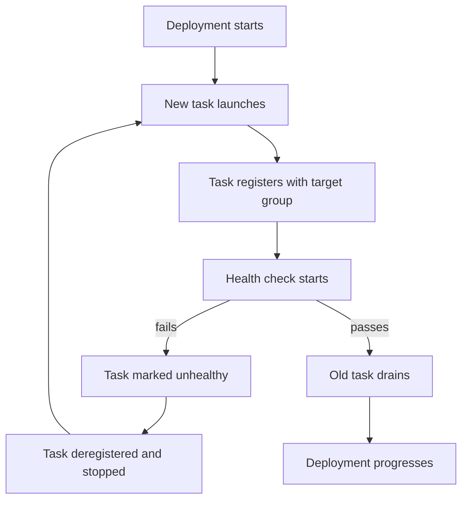

# How to Troubleshoot ECS Service Deployment Issues

Author: [nawazdhandala](https://github.com/nawazdhandala)

Tags: AWS, ECS, Troubleshooting, Deployments, DevOps

Description: Learn how to diagnose and fix common ECS service deployment issues including stuck deployments, rolling update failures, and task placement problems.

---

ECS deployments can fail in subtle ways. Sometimes the deployment just hangs - the new tasks won't start, the old ones won't drain, and the deployment sits there at 50% for what feels like forever. Other times, tasks start and immediately crash, triggering an endless loop of replacements. Either way, you need to figure out what's going wrong and fix it fast.

Let's go through the most common deployment issues and how to resolve each one.

## Understanding ECS Deployment Types

Before troubleshooting, it helps to know which deployment type you're using:

- **Rolling update** (default) - Replaces tasks gradually, maintaining minimum healthy percent
- **Blue/green (CODE_DEPLOY)** - Uses CodeDeploy to shift traffic between task sets
- **External** - You manage the deployment yourself

Most people use rolling updates, so that's where we'll focus. The same principles apply to blue/green deployments, with some additional CodeDeploy-specific considerations.

## Stuck Deployments

A stuck deployment is one where the new task definition has been applied, but the service isn't converging to the desired state. Tasks are either stuck in PENDING or cycling between RUNNING and STOPPED.

First, check the deployment status:

```bash
# Get detailed deployment info for the service
aws ecs describe-services \
  --cluster production \
  --services api-service \
  --query "services[0].{
    desiredCount:desiredCount,
    runningCount:runningCount,
    deployments:deployments[*].{
      id:id,
      status:status,
      taskDefinition:taskDefinition,
      desiredCount:desiredCount,
      runningCount:runningCount,
      rolloutState:rolloutState,
      rolloutStateReason:rolloutStateReason
    },
    events:events[0:10].message
  }"
```

The `events` field is gold. ECS logs service events that tell you exactly what's happening during a deployment. Look for messages like:

- "service api-service was unable to place a task because no container instance met all of its requirements"
- "service api-service (instance i-abc123) is unhealthy in target-group tg-xyz"
- "service api-service has reached a steady state"

## New Tasks Failing Health Checks

This is the single most common deployment issue. Your new task starts, but the load balancer health check fails, so ECS drains it and tries again. The deployment never progresses.

The flow looks like this:



To diagnose this, check the target group health:

```bash
# Check target health in the ALB target group
aws elbv2 describe-target-health \
  --target-group-arn arn:aws:elasticloadbalancing:us-east-1:123456789012:targetgroup/api-tg/abc123 \
  --query "TargetHealthDescriptions[*].{target:Target.Id, port:Target.Port, health:TargetHealth.State, reason:TargetHealth.Reason}"
```

Common causes:

1. **The app isn't listening on the right port.** Your task definition says port 8080, but your app listens on 3000. Check your container's port mapping matches your application.

2. **The health check path returns an error.** The ALB is hitting `/health` but your app doesn't have that endpoint, so it returns 404.

3. **The app takes too long to start.** The health check starts before the app is ready. Increase the health check grace period:

```bash
# Increase the health check grace period to 120 seconds
aws ecs update-service \
  --cluster production \
  --service api-service \
  --health-check-grace-period-seconds 120
```

4. **Security group blocks the health check.** The ALB's security group can reach the task, but the task's security group doesn't allow inbound traffic from the ALB.

```bash
# Verify the task's security group allows traffic from the ALB
aws ec2 describe-security-groups \
  --group-ids sg-task123 \
  --query "SecurityGroups[0].IpPermissions[*].{port:FromPort, source:UserIdGroupPairs[*].GroupId}"
```

## Insufficient Resources for New Tasks

During a rolling update, ECS needs to run both old and new tasks simultaneously. If your cluster doesn't have enough capacity, the new tasks can't start.

This is controlled by two deployment configuration parameters:

- **minimumHealthyPercent** - The minimum percentage of desired tasks that must stay running
- **maximumPercent** - The maximum percentage of desired tasks that can be running (including old + new)

For a service with 4 desired tasks and default settings (min 100%, max 200%):

```
During deployment:
- At least 4 tasks must be running (100% of 4)
- Up to 8 tasks can be running (200% of 4)
- So ECS needs capacity for 4 additional tasks
```

If your cluster can't fit those extra tasks, the deployment stalls. Solutions:

```bash
# Lower the minimum healthy percent to allow in-place replacement
aws ecs update-service \
  --cluster production \
  --service api-service \
  --deployment-configuration "minimumHealthyPercent=50,maximumPercent=200"
```

With `minimumHealthyPercent=50`, ECS can stop 2 old tasks first, then start 2 new ones, reducing the peak resource requirement.

## Task Placement Constraint Failures

If you're using placement constraints (like spreading across AZs or requiring specific instance types), those constraints might be preventing task placement:

```bash
# Check placement constraints and strategy
aws ecs describe-services \
  --cluster production \
  --services api-service \
  --query "services[0].{constraints:placementConstraints, strategy:placementStrategy}"
```

A constraint like `distinctInstance` means each task must run on a different container instance. If you have 4 instances and try to deploy 5 tasks, the 5th one will never be placed.

## Circuit Breaker Rollbacks

ECS has a deployment circuit breaker that automatically rolls back failed deployments. If you see a rollback happening, check the events:

```bash
# Look for circuit breaker events
aws ecs describe-services \
  --cluster production \
  --services api-service \
  --query "services[0].events[0:20].message" \
  --output text
```

The circuit breaker triggers when too many tasks fail to reach a steady state. By default, if a deployment fails to make progress after a certain number of task failures, ECS rolls back to the previous task definition.

You can configure or disable the circuit breaker:

```bash
# Deploy with circuit breaker enabled and rollback
aws ecs update-service \
  --cluster production \
  --service api-service \
  --deployment-configuration '{
    "deploymentCircuitBreaker": {
      "enable": true,
      "rollback": true
    },
    "minimumHealthyPercent": 100,
    "maximumPercent": 200
  }'
```

## Secrets and Configuration Failures

A new task definition might reference secrets or SSM parameters that don't exist or that the task execution role can't access:

```bash
# Check secrets referenced in the task definition
aws ecs describe-task-definition \
  --task-definition api-service:42 \
  --query "taskDefinition.containerDefinitions[*].secrets"

# Verify the execution role can access the secrets
aws iam simulate-principal-policy \
  --policy-source-arn arn:aws:iam::123456789012:role/ecsTaskExecutionRole \
  --action-names secretsmanager:GetSecretValue \
  --resource-arns arn:aws:secretsmanager:us-east-1:123456789012:secret:api-key-abc123
```

If a secret doesn't exist or the role lacks permission, the task will fail during startup before your application even begins running. The stopped task reason will mention the specific secret that couldn't be retrieved.

## Monitoring Deployments

You should actively monitor deployments rather than just waiting and hoping. Set up CloudWatch alarms for:

1. **Running task count dropping** - Indicates tasks are failing during deployment
2. **Error rate increasing** - Application errors from the new version
3. **Latency increasing** - Performance regression in the new version

```bash
# Watch deployment events in real-time
aws ecs wait services-stable \
  --cluster production \
  --services api-service
```

The `wait` command blocks until the service reaches a steady state or times out after 40 checks (10 minutes by default). It's useful in CI/CD pipelines to detect deployment failures.

For continuous monitoring, check out our guide on [monitoring ECS tasks with CloudWatch metrics](https://oneuptime.com/blog/post/monitor-ecs-tasks-cloudwatch-metrics/view).

## Debugging Checklist for Stuck Deployments

When a deployment is stuck, work through this list:

1. Check service events - `describe-services` with events
2. Check stopped task reasons - why are new tasks failing?
3. Check health check configuration - grace period, endpoint, port
4. Check security groups - ALB to task connectivity
5. Check cluster capacity - enough resources for old + new tasks?
6. Check placement constraints - can tasks be placed?
7. Check secrets/parameters - all referenced values accessible?
8. Check the container image - does the tag exist? Can ECS pull it?

## Prevention

The best debugging is the debugging you don't have to do. A few practices that prevent deployment issues:

- Always test new task definitions in a staging environment first
- Use container health checks to catch startup failures early
- Set an appropriate health check grace period
- Enable the deployment circuit breaker with rollback
- Use `aws ecs wait services-stable` in your CI/CD pipeline
- Monitor deployment progress through CloudWatch metrics

## Wrapping Up

ECS deployment issues are usually one of a few things: health check failures, resource constraints, or configuration errors. The service events tell you which category you're in, and then it's a matter of digging into the specifics. Keep this troubleshooting guide handy, and you'll cut your deployment debugging time significantly.
