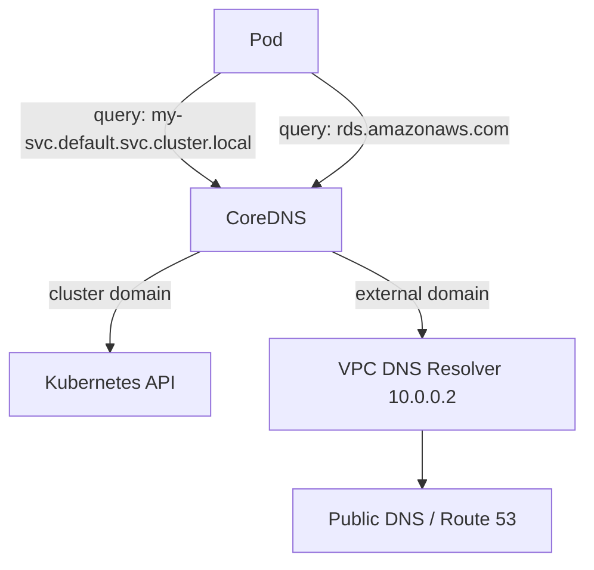

# How to Troubleshoot EKS DNS Resolution Issues

Author: [nawazdhandala](https://github.com/nawazdhandala)

Tags: AWS, EKS, Kubernetes, DNS, Troubleshooting

Description: A systematic guide to diagnosing and resolving DNS resolution issues in Amazon EKS clusters, covering CoreDNS, VPC DNS, and common misconfigurations.

---

DNS problems in Kubernetes are frustrating because they manifest as all kinds of seemingly unrelated failures. Services can't reach each other, pods can't pull images, external API calls time out, health checks fail. The root cause often comes down to DNS, but it doesn't always look that way at first glance.

On EKS, DNS resolution involves multiple layers: CoreDNS for cluster-internal names, the VPC DNS resolver for AWS resources, and upstream resolvers for the public internet. Issues at any layer can break your applications. This guide covers how to systematically diagnose and fix DNS problems.

## How DNS Works in EKS

When a pod makes a DNS query, here's what happens:



1. Pod sends DNS query to CoreDNS (at the ClusterIP, typically 10.100.0.10)
2. CoreDNS resolves cluster-internal names (services, pods) using the Kubernetes API
3. CoreDNS forwards external queries to the VPC DNS resolver (the .2 address of your VPC CIDR)
4. VPC resolver handles Route 53 private/public zones and upstream resolution

## Step 1: Identify the Symptom

Before diving in, figure out what exactly is failing:

```bash
# Test DNS from inside a pod
kubectl run dns-test --image=busybox:1.36 --rm -it --restart=Never -- sh

# Inside the pod, try different types of queries:
# Cluster service (internal)
nslookup kubernetes.default.svc.cluster.local

# Short service name (relies on search domains)
nslookup kubernetes

# External domain
nslookup google.com

# AWS service endpoint
nslookup s3.us-west-2.amazonaws.com
```

This tells you which layer is broken:
- Internal names fail -> CoreDNS issue
- External names fail -> upstream forwarding issue
- Everything fails -> CoreDNS is unreachable or down

## Step 2: Check CoreDNS Pods

CoreDNS runs as a Deployment in kube-system. Make sure it's healthy:

```bash
# Check CoreDNS pods
kubectl get pods -n kube-system -l k8s-app=kube-dns -o wide

# Check for restarts (high restart counts suggest OOM or crashes)
kubectl get pods -n kube-system -l k8s-app=kube-dns -o custom-columns=\
NAME:.metadata.name,\
READY:.status.containerStatuses[0].ready,\
RESTARTS:.status.containerStatuses[0].restartCount,\
NODE:.spec.nodeName

# Check CoreDNS logs for errors
kubectl logs -n kube-system -l k8s-app=kube-dns --tail=100
```

Common issues in CoreDNS logs:
- `i/o timeout` - can't reach upstream DNS
- `SERVFAIL` - upstream returned an error
- `connection refused` - can't connect to the Kubernetes API
- `plugin/loop: Loop detected` - DNS loop, usually a configuration issue

## Step 3: Verify the CoreDNS Service

Check that the CoreDNS Service has endpoints:

```bash
# Check the kube-dns service
kubectl get svc kube-dns -n kube-system

# Verify endpoints exist
kubectl get endpoints kube-dns -n kube-system
```

If endpoints are empty, CoreDNS pods aren't ready or the selector doesn't match.

## Step 4: Check the CoreDNS ConfigMap

The CoreDNS configuration lives in a ConfigMap:

```bash
# View the CoreDNS configuration
kubectl get configmap coredns -n kube-system -o yaml
```

A healthy default configuration looks like:

```
.:53 {
    errors
    health {
        lameduck 5s
    }
    ready
    kubernetes cluster.local in-addr.arpa ip6.arpa {
        pods insecure
        fallthrough in-addr.arpa ip6.arpa
        ttl 30
    }
    prometheus :9153
    forward . /etc/resolv.conf
    cache 30
    loop
    reload
    loadbalance
}
```

Watch out for:
- `forward` pointing to the wrong upstream
- Missing `kubernetes` plugin
- Custom zone entries with typos

## Step 5: Check Pod DNS Configuration

Pods should be configured to use CoreDNS:

```bash
# Check the resolv.conf inside a pod
kubectl exec my-pod -- cat /etc/resolv.conf
```

Expected output:

```
nameserver 10.100.0.10
search default.svc.cluster.local svc.cluster.local cluster.local us-west-2.compute.internal
options ndots:5
```

If `nameserver` doesn't point to the CoreDNS service IP, the pod's DNS policy might be wrong:

```yaml
# Check dnsPolicy in pod spec
spec:
  dnsPolicy: ClusterFirst  # This is the default, uses CoreDNS
```

Other dnsPolicy values:
- `Default` - uses the node's DNS (skips CoreDNS)
- `None` - requires manual dnsConfig
- `ClusterFirstWithHostNet` - for pods using host networking

## Step 6: ndots and DNS Query Amplification

The `ndots:5` setting means any domain with fewer than 5 dots gets the search domains appended first. So a query for `api.example.com` (2 dots, less than 5) generates these queries:

1. `api.example.com.default.svc.cluster.local`
2. `api.example.com.svc.cluster.local`
3. `api.example.com.cluster.local`
4. `api.example.com.us-west-2.compute.internal`
5. `api.example.com` (finally, the actual query)

This 5x amplification can overwhelm CoreDNS in high-traffic clusters. If your pods make lots of external DNS queries, reduce ndots:

```yaml
# Reduce DNS query amplification for external-heavy workloads
spec:
  dnsConfig:
    options:
      - name: ndots
        value: "2"
```

Or append a trailing dot to external domains in your application config (`api.example.com.`) to bypass the search domain expansion entirely.

## Step 7: Check VPC DNS

If cluster-internal DNS works but external resolution fails, the VPC DNS resolver might be the issue:

```bash
# From a node, check VPC DNS resolution
nslookup google.com 10.0.0.2  # Replace with your VPC's .2 address

# Verify VPC DNS settings
aws ec2 describe-vpc-attribute --vpc-id vpc-0abc123 --attribute enableDnsSupport
aws ec2 describe-vpc-attribute --vpc-id vpc-0abc123 --attribute enableDnsHostnames
```

Both `enableDnsSupport` and `enableDnsHostnames` should be true.

## Step 8: CoreDNS Scaling

If DNS queries are slow or timing out under load, CoreDNS might need more replicas:

```bash
# Check current CoreDNS resource usage
kubectl top pods -n kube-system -l k8s-app=kube-dns

# Scale CoreDNS
kubectl scale deployment coredns -n kube-system --replicas=5
```

For automatic scaling, enable the CoreDNS Horizontal Pod Autoscaler:

```yaml
# coredns-hpa.yaml - Auto-scale CoreDNS based on cluster size
apiVersion: autoscaling/v2
kind: HorizontalPodAutoscaler
metadata:
  name: coredns
  namespace: kube-system
spec:
  scaleTargetRef:
    apiVersion: apps/v1
    kind: Deployment
    name: coredns
  minReplicas: 2
  maxReplicas: 10
  metrics:
    - type: Resource
      resource:
        name: cpu
        target:
          type: Utilization
          averageUtilization: 60
```

Also consider using NodeLocal DNSCache, which runs a DNS cache on every node and reduces the load on CoreDNS:

```bash
# Install NodeLocal DNSCache
kubectl apply -f https://raw.githubusercontent.com/kubernetes/kubernetes/master/cluster/addons/dns/nodelocaldns/nodelocaldns.yaml
```

## Step 9: Common Fixes

**CoreDNS pods crashing with OOM:**

```bash
# Increase CoreDNS memory limits
kubectl patch deployment coredns -n kube-system --type json \
  -p '[{"op":"replace","path":"/spec/template/spec/containers/0/resources/limits/memory","value":"256Mi"}]'
```

**DNS loop detected:**

This happens when CoreDNS forwards to itself. Check that `/etc/resolv.conf` on the nodes points to the VPC DNS resolver, not to 127.0.0.1.

**Intermittent DNS failures:**

Often caused by conntrack table exhaustion on nodes. Check with:

```bash
# On the node, check conntrack usage
sudo sysctl net.netfilter.nf_conntrack_count
sudo sysctl net.netfilter.nf_conntrack_max
```

If count is near max, increase the limit or reduce DNS query volume.

**AWS service endpoints not resolving:**

Verify that VPC DNS is enabled and, for [private clusters](https://oneuptime.com/blog/post/set-up-private-eks-clusters/view), that VPC endpoints have private DNS enabled.

DNS issues are the kind of thing that seems mysterious until you understand the layers involved. Start from the pod (can it reach CoreDNS?), move to CoreDNS (is it running and configured correctly?), and then check upstream resolution (can the VPC resolver reach the internet?). At each layer, the diagnostic tools will point you in the right direction.
