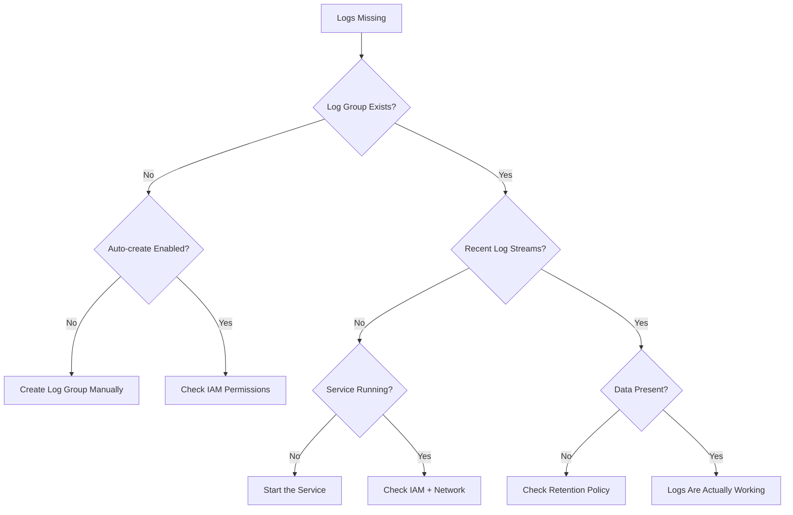

# How to Troubleshoot Missing CloudWatch Logs

Author: [nawazdhandala](https://github.com/nawazdhandala)

Tags: AWS, CloudWatch, Logs, Troubleshooting, Debugging

Description: A systematic guide to diagnosing and fixing missing CloudWatch Logs from EC2, Lambda, ECS, and other AWS services when log data isn't appearing as expected.

---

You set up logging, deployed your application, and went to check the logs in CloudWatch. The log group exists, but it's empty. Or the log group doesn't exist at all. Or the logs were there yesterday but stopped today. Missing CloudWatch Logs is a common headache with many possible causes, and the fix depends on where the logs are coming from.

Let's work through this systematically. We'll cover EC2 (CloudWatch agent), Lambda, ECS, and other AWS services, because each has its own set of failure modes.

## General Troubleshooting Steps

Regardless of the log source, start with these checks:

### 1. Verify the Log Group Exists

```bash
# Check if the log group exists
aws logs describe-log-groups \
  --log-group-name-prefix "/your/log/group" \
  --query "logGroups[].logGroupName"
```

If the log group doesn't exist, either it was never created or it was deleted. Some services create log groups automatically; others require you to create them manually.

### 2. Check the Log Group for Recent Streams

```bash
# List recent log streams in the group
aws logs describe-log-streams \
  --log-group-name "/your/log/group" \
  --order-by LastEventTime \
  --descending \
  --limit 5
```

If streams exist but haven't been updated recently, the problem started at a specific time. Check what changed around that time (deployments, IAM changes, network changes).

### 3. Check the Region

Logs are regional. If your resource is in `us-west-2` but you're looking in `us-east-1`, you won't find anything:

```bash
# List log groups in a specific region
aws logs describe-log-groups --region us-west-2
```

## EC2 / CloudWatch Agent Logs Missing

If you're using the CloudWatch agent on EC2 to send logs, check these:

### Agent Configuration

The agent config must include a `logs` section:

```json
// CloudWatch agent config with log collection
{
  "logs": {
    "logs_collected": {
      "files": {
        "collect_list": [
          {
            "file_path": "/var/log/app/application.log",
            "log_group_name": "/app/production/application",
            "log_stream_name": "{instance_id}",
            "timezone": "UTC",
            "retention_in_days": 30
          },
          {
            "file_path": "/var/log/nginx/access.log",
            "log_group_name": "/app/production/nginx-access",
            "log_stream_name": "{instance_id}"
          }
        ]
      }
    }
  }
}
```

Common config mistakes:

- **Wrong `file_path`** - the path must match exactly. Use `ls -la` to verify the file exists and the path is correct.
- **Glob patterns** - if you use wildcards like `/var/log/app/*.log`, make sure the pattern actually matches files.
- **File permissions** - the agent must be able to read the log file. If the agent runs as `cwagent` user but the log file is only readable by `root`, it won't work.

Check file permissions:

```bash
# Check who can read the log file
ls -la /var/log/app/application.log

# Check what user the agent runs as
ps aux | grep amazon-cloudwatch-agent
```

### Agent Log Errors

```bash
# Check the agent log for errors related to log collection
grep -i "error\|fail\|denied" /opt/aws/amazon-cloudwatch-agent/logs/amazon-cloudwatch-agent.log | tail -20
```

### State File

The agent keeps track of where it left off in each log file using a state file. If this gets corrupted, the agent might skip logs:

```bash
# Check the state directory
ls -la /opt/aws/amazon-cloudwatch-agent/var/

# If needed, delete the state file to force re-reading (may cause duplicate logs)
sudo rm /opt/aws/amazon-cloudwatch-agent/var/state_file_*
sudo systemctl restart amazon-cloudwatch-agent
```

### Log Rotation

If your application rotates logs (moves `app.log` to `app.log.1` and creates a new `app.log`), the agent needs to detect this. The agent handles standard log rotation, but custom rotation schemes might confuse it.

## Lambda Logs Missing

Lambda automatically sends logs to CloudWatch. If they're missing:

### Check the Execution Role

The Lambda execution role must include log permissions:

```bash
# Check the Lambda function's execution role
aws lambda get-function-configuration \
  --function-name my-function \
  --query "Role"

# Then check the role's policies
aws iam list-attached-role-policies --role-name <role-name>
```

Required permissions:

```json
// Minimum log permissions for Lambda
{
  "Version": "2012-10-17",
  "Statement": [
    {
      "Effect": "Allow",
      "Action": [
        "logs:CreateLogGroup",
        "logs:CreateLogStream",
        "logs:PutLogEvents"
      ],
      "Resource": "arn:aws:logs:*:*:*"
    }
  ]
}
```

If the execution role doesn't have `logs:CreateLogGroup`, you'll need to create the log group manually:

```bash
# Create the log group for a Lambda function
aws logs create-log-group \
  --log-group-name "/aws/lambda/my-function"
```

### VPC Lambda

If your Lambda function is in a VPC, it needs a route to the CloudWatch Logs endpoint. Either:

1. Add a NAT gateway to the VPC
2. Create a VPC endpoint for CloudWatch Logs:

```bash
# Create VPC endpoint for CloudWatch Logs
aws ec2 create-vpc-endpoint \
  --vpc-id vpc-abc123 \
  --service-name com.amazonaws.us-east-1.logs \
  --vpc-endpoint-type Interface \
  --subnet-ids subnet-xyz789 \
  --security-group-ids sg-123456
```

### Function Isn't Running

If the Lambda function isn't being invoked, there are no logs to send. Check:

```bash
# Check recent invocations
aws lambda get-function \
  --function-name my-function \
  --query "Configuration.LastModified"

# Check CloudWatch metrics for invocation count
aws cloudwatch get-metric-statistics \
  --namespace AWS/Lambda \
  --metric-name Invocations \
  --dimensions Name=FunctionName,Value=my-function \
  --start-time $(date -u -d '1 hour ago' +%Y-%m-%dT%H:%M:%S) \
  --end-time $(date -u +%Y-%m-%dT%H:%M:%S) \
  --period 300 \
  --statistics Sum
```

## ECS Logs Missing

For ECS tasks using the `awslogs` log driver:

### Check Task Definition

The log configuration must be correct in the container definition:

```json
// ECS container definition with correct log configuration
{
  "name": "my-app",
  "image": "my-app:latest",
  "logConfiguration": {
    "logDriver": "awslogs",
    "options": {
      "awslogs-group": "/ecs/my-app",
      "awslogs-region": "us-east-1",
      "awslogs-stream-prefix": "ecs",
      "awslogs-create-group": "true"
    }
  }
}
```

Note the `awslogs-create-group` option. If this is `false` or missing, the log group must already exist. If it doesn't, the task will fail to start or start but silently drop logs.

### Check the ECS Task Execution Role

The task **execution role** (not the task role) needs log permissions:

```json
// ECS task execution role permissions for logging
{
  "Version": "2012-10-17",
  "Statement": [
    {
      "Effect": "Allow",
      "Action": [
        "logs:CreateLogStream",
        "logs:PutLogEvents",
        "logs:CreateLogGroup"
      ],
      "Resource": "arn:aws:logs:*:*:*"
    }
  ]
}
```

### Check if the Task is Running

```bash
# Check for stopped tasks and their stop reasons
aws ecs list-tasks \
  --cluster my-cluster \
  --desired-status STOPPED \
  --query "taskArns" \
  --output text | head -5 | while read task; do
    aws ecs describe-tasks \
      --cluster my-cluster \
      --tasks "$task" \
      --query "tasks[0].{reason:stoppedReason,status:lastStatus}"
done
```

If tasks are stopping with log-related errors, the issue is usually the execution role or the log group not existing.

## Other AWS Service Logs Missing

### API Gateway Execution Logs

API Gateway doesn't send logs by default. You need to enable them:

```bash
# Enable API Gateway execution logging
aws apigateway update-stage \
  --rest-api-id abc123 \
  --stage-name prod \
  --patch-operations \
    op=replace,path=/accessLogSetting/destinationArn,value=arn:aws:logs:us-east-1:123456789012:log-group:/apigateway/prod \
    op=replace,path=/*/*/logging/loglevel,value=INFO
```

API Gateway also needs a CloudWatch role ARN at the account level:

```bash
# Set the API Gateway CloudWatch role
aws apigateway update-account \
  --patch-operations op=replace,path=/cloudwatchRoleArn,value=arn:aws:iam::123456789012:role/APIGatewayCloudWatchRole
```

### VPC Flow Logs

```bash
# Check if flow logs are enabled
aws ec2 describe-flow-logs \
  --filter Name=resource-id,Values=vpc-abc123

# Enable flow logs if missing
aws ec2 create-flow-logs \
  --resource-type VPC \
  --resource-ids vpc-abc123 \
  --traffic-type ALL \
  --log-destination-type cloud-watch-logs \
  --log-group-name "/vpc/flow-logs" \
  --deliver-logs-permission-arn arn:aws:iam::123456789012:role/FlowLogsRole
```

## Log Group Retention and Deletion

If logs existed before but are gone now:

```bash
# Check if the log group has a retention policy that may have expired old data
aws logs describe-log-groups \
  --log-group-name "/your/log/group" \
  --query "logGroups[0].retentionInDays"
```

If retention is set to a short period (like 1 day), older logs will be automatically deleted. Set a more appropriate retention:

```bash
# Set log retention to 30 days
aws logs put-retention-policy \
  --log-group-name "/your/log/group" \
  --retention-in-days 30
```

Also check CloudTrail for log group deletion events:

```bash
# Check CloudTrail for log group deletions
aws cloudtrail lookup-events \
  --lookup-attributes AttributeKey=EventName,AttributeValue=DeleteLogGroup \
  --start-time $(date -u -d '7 days ago' +%Y-%m-%dT%H:%M:%S) \
  --end-time $(date -u +%Y-%m-%dT%H:%M:%S)
```

## Troubleshooting Checklist



## Quick Fixes Summary

| Problem | Fix |
|---------|-----|
| Log group doesn't exist | Create it or enable auto-creation |
| Permission denied | Add `logs:CreateLogStream`, `logs:PutLogEvents` to the IAM role |
| VPC connectivity | Add NAT gateway or VPC endpoint for logs |
| Agent not collecting files | Verify `file_path` in config and file permissions |
| Wrong region | Check resource region matches CloudWatch console region |
| Retention expired | Set a longer retention period |
| Lambda in VPC | Add VPC endpoint for CloudWatch Logs service |

For issues with the CloudWatch agent not sending metrics (which often accompanies log issues), see our guide on [troubleshooting the CloudWatch agent](https://oneuptime.com/blog/post/2026-02-12-troubleshoot-cloudwatch-agent-not-sending-metrics/view).

## Wrapping Up

Missing CloudWatch Logs almost always comes down to one of three problems: permissions, network access, or configuration errors. The troubleshooting process is the same regardless of the source - verify the log group exists, check IAM permissions, confirm network connectivity, and look at the source-specific configuration. Once you've been through this a few times, you can usually diagnose the issue in under 5 minutes.
