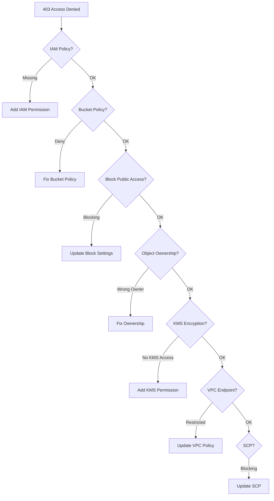

# How to Troubleshoot S3 403 Forbidden Access Denied Errors

Author: [nawazdhandala](https://github.com/nawazdhandala)

Tags: AWS, S3, Troubleshooting, Security

Description: Systematic guide to diagnosing and fixing S3 403 Forbidden and Access Denied errors, covering IAM policies, bucket policies, KMS permissions, VPC endpoints, and common pitfalls.

---

Getting a 403 Access Denied from S3 is frustrating because the error message tells you almost nothing about why access was denied. There are at least a dozen different reasons you might get this error, and the fix depends on which one applies. Let's go through them systematically.

## The Troubleshooting Checklist

When you hit a 403, work through these checks in order. The issue is almost always one of these.



## Check 1: IAM Policy

The most common cause. The IAM user or role making the request doesn't have the right S3 permissions.

Verify what permissions the identity has.

```bash
# Check which policies are attached to a user
aws iam list-attached-user-policies --user-name myuser
aws iam list-user-policies --user-name myuser

# Check which policies are attached to a role
aws iam list-attached-role-policies --role-name myrole
aws iam list-role-policies --role-name myrole
```

A common mistake is granting object-level permissions but forgetting the bucket-level ListBucket permission. These require different resource ARNs.

```json
{
  "Version": "2012-10-17",
  "Statement": [
    {
      "Effect": "Allow",
      "Action": "s3:ListBucket",
      "Resource": "arn:aws:s3:::my-bucket"
    },
    {
      "Effect": "Allow",
      "Action": [
        "s3:GetObject",
        "s3:PutObject"
      ],
      "Resource": "arn:aws:s3:::my-bucket/*"
    }
  ]
}
```

Notice: `ListBucket` targets the bucket ARN (no `/*`), while `GetObject` targets the object ARN (with `/*`). Mix these up and you'll get 403s.

## Check 2: Bucket Policy

Even if the IAM policy allows access, a bucket policy deny statement overrides it.

```bash
# View the bucket policy
aws s3api get-bucket-policy --bucket my-bucket --output text | python3 -m json.tool
```

Look for explicit deny statements. Any deny in any policy beats any allow anywhere else.

Common deny patterns that cause issues.

```json
{
  "Sid": "DenyNonSSLRequests",
  "Effect": "Deny",
  "Principal": "*",
  "Action": "s3:*",
  "Resource": "arn:aws:s3:::my-bucket/*",
  "Condition": {
    "Bool": {
      "aws:SecureTransport": "false"
    }
  }
}
```

This denies all non-HTTPS requests. If your application is using HTTP, it'll get 403.

Another common one.

```json
{
  "Sid": "DenyOutsideVPC",
  "Effect": "Deny",
  "Principal": "*",
  "Action": "s3:*",
  "Resource": ["arn:aws:s3:::my-bucket", "arn:aws:s3:::my-bucket/*"],
  "Condition": {
    "StringNotEquals": {
      "aws:sourceVpce": "vpce-abc123"
    }
  }
}
```

This blocks all access except from a specific VPC endpoint. If you're accessing from the console or CLI outside that VPC, you'll get denied.

## Check 3: Block Public Access Settings

S3 Block Public Access can prevent access even when policies explicitly allow it.

```bash
# Check bucket-level block public access
aws s3api get-public-access-block --bucket my-bucket

# Check account-level block public access
aws s3control get-public-access-block --account-id 123456789012
```

If `BlockPublicPolicy` is true and your bucket policy grants access to `"Principal": "*"`, the policy gets overridden.

## Check 4: Object Ownership and ACLs

If the bucket was set up before ownership controls, objects uploaded by other accounts might be owned by those accounts.

```bash
# Check ownership controls
aws s3api get-bucket-ownership-controls --bucket my-bucket

# Check ACL of a specific object
aws s3api get-object-acl --bucket my-bucket --key problematic-file.txt
```

If the object is owned by a different account and ACLs don't grant you access, you'll get 403. The fix is to copy the object back to itself with the proper ownership, or switch to [bucket owner enforced](https://oneuptime.com/blog/post/s3-bucket-ownership-controls/view).

## Check 5: KMS Encryption

This one catches people off guard. If objects are encrypted with SSE-KMS, you need permission on the KMS key in addition to S3 permissions.

```bash
# Check the encryption of an object
aws s3api head-object --bucket my-bucket --key encrypted-file.txt
```

If you see `ServerSideEncryption: aws:kms` and a `SSEKMSKeyId`, check that your IAM identity has permission to use that key.

```json
{
  "Version": "2012-10-17",
  "Statement": [
    {
      "Effect": "Allow",
      "Action": [
        "kms:Decrypt",
        "kms:GenerateDataKey"
      ],
      "Resource": "arn:aws:kms:us-east-1:123456789012:key/KEY_ID"
    }
  ]
}
```

Also check the KMS key policy itself.

```bash
# Check KMS key policy
aws kms get-key-policy --key-id KEY_ID --policy-name default
```

## Check 6: VPC Endpoint Policy

If you're accessing S3 through a VPC endpoint, the endpoint might have a restrictive policy.

```bash
# Check VPC endpoint policy
aws ec2 describe-vpc-endpoints \
  --filters Name=service-name,Values=com.amazonaws.us-east-1.s3 \
  --query 'VpcEndpoints[*].{Id:VpcEndpointId,Policy:PolicyDocument}'
```

A default VPC endpoint allows all S3 access. But if someone restricted it to specific buckets, you'll get 403 on other buckets.

## Check 7: Service Control Policies (SCPs)

If you're in an AWS Organization, SCPs from parent OUs can restrict S3 access even if the IAM policy allows it.

```bash
# List SCPs affecting the account
aws organizations list-policies-for-target \
  --target-id ACCOUNT_ID \
  --filter SERVICE_CONTROL_POLICY
```

## Check 8: Requester Pays

If the bucket has requester pays enabled and you're not including the right header, you'll get 403.

```bash
# Check if requester pays is enabled
aws s3api get-bucket-request-payment --bucket my-bucket
```

If it says `Requester`, you need to include the requester pays header.

```bash
# Access a requester pays bucket
aws s3 cp s3://requester-pays-bucket/file.txt . --request-payer requester
```

## Using the IAM Policy Simulator

When you can't figure it out by inspection, use the IAM Policy Simulator to test specific actions.

```bash
# Simulate an S3 GetObject call for a specific user
aws iam simulate-principal-policy \
  --policy-source-arn arn:aws:iam::123456789012:user/testuser \
  --action-names s3:GetObject \
  --resource-arns arn:aws:s3:::my-bucket/test-file.txt
```

The simulator tells you which policy statement resulted in the allow or deny decision.

## Using CloudTrail for Diagnosis

CloudTrail logs every S3 API call, including the error code. This is your definitive diagnostic tool.

```bash
# Search CloudTrail for access denied events
aws cloudtrail lookup-events \
  --lookup-attributes AttributeKey=EventName,AttributeValue=GetObject \
  --max-results 10 \
  --query 'Events[?contains(CloudTrailEvent, `AccessDenied`)]'
```

The CloudTrail event includes:
- Which IAM identity made the request
- Which bucket and key were targeted
- The error code (AccessDenied, etc.)
- Source IP address

## Quick Fixes

If you need to grant access quickly while you investigate the root cause.

```bash
# Temporarily attach full S3 access (for testing only!)
aws iam attach-user-policy \
  --user-name testuser \
  --policy-arn arn:aws:iam::aws:policy/AmazonS3FullAccess

# Don't leave this in place - use it only to confirm the issue
# is IAM-related, then create a proper scoped policy
```

For ongoing monitoring of 403 errors and other access issues, set up [OneUptime](https://oneuptime.com) to alert on spikes in S3 access denied errors. This helps you catch permission issues before they escalate into production incidents.

If slow performance rather than access denied is your issue, check out our guide on [troubleshooting S3 slow upload speeds](https://oneuptime.com/blog/post/troubleshoot-s3-slow-upload-speeds/view).
