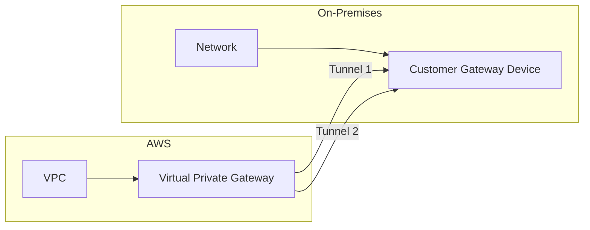

# How to Troubleshoot Site-to-Site VPN Connectivity Issues

Author: [nawazdhandala](https://github.com/nawazdhandala)

Tags: AWS, VPN, Networking, Troubleshooting

Description: Systematic approach to diagnosing and fixing AWS Site-to-Site VPN connectivity problems including tunnel status, routing, and configuration mismatches.

---

Site-to-Site VPN connectivity between AWS and your on-premises network breaks in frustrating ways. Tunnels show "DOWN" for no obvious reason. Traffic flows one direction but not the other. Everything worked yesterday but doesn't today. Let's walk through a systematic approach to find and fix the problem.

## Understanding the VPN Architecture

An AWS Site-to-Site VPN connection consists of two IPsec tunnels between your Virtual Private Gateway (or Transit Gateway) and your Customer Gateway (on-premises VPN device). Both tunnels should be up for redundancy, though only one is strictly necessary.



## Step 1: Check Tunnel Status

Start with the basics - are the tunnels up?

```bash
# Check VPN tunnel status
aws ec2 describe-vpn-connections \
  --vpn-connection-ids vpn-abc123 \
  --query 'VpnConnections[0].VgwTelemetry[*].{
    Tunnel:OutsideIpAddress,
    Status:Status,
    StatusMessage:StatusMessage,
    AcceptedRoutes:AcceptedRouteCount,
    LastStatusChange:LastStatusChange
  }'
```

This returns something like:

```json
[
  {
    "Tunnel": "52.1.2.3",
    "Status": "DOWN",
    "StatusMessage": "IPSEC IS DOWN",
    "AcceptedRoutes": 0,
    "LastStatusChange": "2026-02-12T10:30:00Z"
  },
  {
    "Tunnel": "52.4.5.6",
    "Status": "UP",
    "StatusMessage": "",
    "AcceptedRoutes": 3,
    "LastStatusChange": "2026-02-11T08:00:00Z"
  }
]
```

If both tunnels are DOWN, you have an IKE/IPsec configuration issue. If one is UP but connectivity still fails, the issue is likely routing.

## Step 2: Verify IKE Configuration

IKE (Internet Key Exchange) negotiation happens in two phases. Phase 1 establishes the secure channel, Phase 2 negotiates the IPsec SAs (Security Associations).

Download the VPN configuration and compare it with your customer gateway device:

```bash
# Download the VPN configuration
aws ec2 describe-vpn-connections \
  --vpn-connection-ids vpn-abc123 \
  --query 'VpnConnections[0].CustomerGatewayConfiguration' \
  --output text > vpn-config.xml
```

Common Phase 1 mismatches:

- **Pre-shared key** - Must match exactly on both sides
- **IKE version** - AWS supports IKEv1 and IKEv2. Make sure both sides agree
- **Encryption algorithm** - AES-128, AES-256
- **Hashing algorithm** - SHA-1, SHA-256
- **DH group** - Must match on both sides
- **Lifetime** - AWS uses 28800 seconds for Phase 1

Common Phase 2 mismatches:

- **Encryption algorithm** - Must match Phase 2 settings
- **PFS group** - Perfect Forward Secrecy group must match
- **Lifetime** - AWS uses 3600 seconds for Phase 2

Check your VPN connection's tunnel options:

```bash
# Check tunnel options
aws ec2 describe-vpn-connections \
  --vpn-connection-ids vpn-abc123 \
  --query 'VpnConnections[0].Options.TunnelOptions'
```

## Step 3: Check Customer Gateway Configuration

Common on-premises issues:

**Firewall blocking**: Ensure these protocols/ports are allowed from your customer gateway's public IP to AWS's tunnel endpoints:

- UDP port 500 (IKE)
- IP protocol 50 (ESP)
- UDP port 4500 (NAT-T, if behind NAT)

```bash
# From your on-premises device, test connectivity to the tunnel endpoints
# Test IKE port
nc -u -z 52.1.2.3 500
nc -u -z 52.4.5.6 500
```

**NAT issues**: If your customer gateway is behind a NAT device, you must use NAT-Traversal (NAT-T). The customer gateway IP in AWS should be your public NAT IP, not the device's private IP.

**Asymmetric routing**: If you have multiple internet connections, make sure VPN traffic uses the same public IP that you configured as the customer gateway in AWS.

## Step 4: Verify Route Propagation

Even with tunnels up, traffic won't flow without proper routes.

Check if route propagation is enabled on your VPC route table:

```bash
# Check route propagation settings
aws ec2 describe-route-tables \
  --route-table-ids rtb-abc123 \
  --query 'RouteTables[0].PropagatingVgws'
```

If it's empty, enable propagation:

```bash
# Enable route propagation from the VGW
aws ec2 enable-vgw-route-propagation \
  --route-table-id rtb-abc123 \
  --gateway-id vgw-abc123
```

Check that routes actually appear:

```bash
# Check for on-premises routes in the route table
aws ec2 describe-route-tables \
  --route-table-ids rtb-abc123 \
  --query 'RouteTables[0].Routes[?GatewayId==`vgw-abc123`]'
```

For static VPN connections, you need to add routes manually:

```bash
# Add a static route for on-premises CIDR
aws ec2 create-vpn-connection-route \
  --vpn-connection-id vpn-abc123 \
  --destination-cidr-block "172.16.0.0/12"
```

## Step 5: Check BGP (for Dynamic VPN)

If you're using BGP-based VPN, check that BGP sessions are established:

```bash
# Check BGP peer status from the VPN telemetry
aws ec2 describe-vpn-connections \
  --vpn-connection-ids vpn-abc123 \
  --query 'VpnConnections[0].VgwTelemetry[*].{
    Tunnel:OutsideIpAddress,
    Status:Status,
    AcceptedRoutes:AcceptedRouteCount
  }'
```

`AcceptedRouteCount: 0` with a tunnel UP suggests BGP isn't exchanging routes. Check:

- BGP ASNs match the configuration (AWS default is 64512)
- BGP peer IPs are correct (use the inside tunnel addresses)
- Your device is advertising the correct prefixes

The inside tunnel addresses from the VPN configuration look like:

```
Tunnel 1:
  AWS inside IP: 169.254.10.1/30
  Customer inside IP: 169.254.10.2/30
  BGP ASN (AWS): 64512
  BGP ASN (Customer): 65000
```

## Step 6: Security Group and NACL Check

Even with tunnels up and routes in place, security groups and NACLs can block traffic:

```bash
# Check security group allows traffic from on-premises CIDR
aws ec2 describe-security-groups \
  --group-ids sg-abc123 \
  --query 'SecurityGroups[0].IpPermissions[*].{
    Port:FromPort,
    Protocol:IpProtocol,
    Source:IpRanges[*].CidrIp
  }'

# Check NACLs aren't blocking on-premises traffic
aws ec2 describe-network-acls \
  --filters "Name=association.subnet-id,Values=subnet-abc123" \
  --query 'NetworkAcls[0].Entries[*].{
    Rule:RuleNumber,
    Protocol:Protocol,
    Action:RuleAction,
    CIDR:CidrBlock,
    Egress:Egress
  }'
```

Remember: NACLs are stateless. You need both inbound rules (for incoming connections) and outbound rules (for return traffic, including ephemeral port ranges).

## Step 7: Test End-to-End Connectivity

From an EC2 instance, test connectivity to on-premises:

```bash
# Test basic connectivity
ping 172.16.1.10

# Test a specific service
nc -zv 172.16.1.10 443

# Trace the route
traceroute 172.16.1.10
```

From on-premises, test connectivity to EC2:

```bash
# Test reaching an EC2 instance
ping 10.0.1.50
nc -zv 10.0.1.50 22
```

If one direction works but not the other, check routing on both sides. On-premises devices might not have a return route to your VPC CIDR.

## Step 8: Use VPC Flow Logs

Enable flow logs to see if packets are arriving and whether they're being accepted or rejected:

```bash
# Query flow logs for VPN traffic
# In CloudWatch Logs Insights
fields @timestamp, srcAddr, dstAddr, srcPort, dstPort, action
| filter srcAddr like /172\.16/  # On-premises CIDR
| sort @timestamp desc
| limit 100
```

If you see REJECT entries, the issue is security groups or NACLs. If you see no entries at all for on-premises traffic, the issue is routing (packets aren't reaching the VPC).

## Step 9: Modify Tunnel Options (If Needed)

You can modify VPN tunnel options to fix configuration mismatches:

```bash
# Modify tunnel options for an existing VPN connection
aws ec2 modify-vpn-tunnel-options \
  --vpn-connection-id vpn-abc123 \
  --vpn-tunnel-outside-ip-address 52.1.2.3 \
  --tunnel-options '{
    "Phase1LifetimeSeconds": 28800,
    "Phase2LifetimeSeconds": 3600,
    "Phase1EncryptionAlgorithms": [{"Value": "AES256"}],
    "Phase2EncryptionAlgorithms": [{"Value": "AES256"}],
    "Phase1IntegrityAlgorithms": [{"Value": "SHA2-256"}],
    "Phase2IntegrityAlgorithms": [{"Value": "SHA2-256"}],
    "Phase1DHGroupNumbers": [{"Value": 14}],
    "Phase2DHGroupNumbers": [{"Value": 14}],
    "IKEVersions": [{"Value": "ikev2"}],
    "DPDTimeoutAction": "restart"
  }'
```

Note: modifying tunnel options will briefly disrupt the tunnel.

## Quick Troubleshooting Checklist

1. Both tunnels DOWN? Check IKE/IPsec config, firewall rules, pre-shared keys
2. Tunnels UP but no traffic? Check route tables, route propagation, BGP routes
3. One-way traffic? Check routing on both sides, NACLs (remember ephemeral ports)
4. Intermittent drops? Check DPD (Dead Peer Detection) settings, MTU/MSS issues
5. Slow throughput? VPN throughput is limited to ~1.25 Gbps per tunnel

## Monitoring VPN Health

Set up CloudWatch alarms for proactive monitoring:

```bash
# Alert when a tunnel goes down
aws cloudwatch put-metric-alarm \
  --alarm-name "vpn-tunnel-down" \
  --namespace AWS/VPN \
  --metric-name TunnelState \
  --dimensions Name=VpnId,Value=vpn-abc123 \
  --statistic Maximum \
  --period 300 \
  --threshold 1 \
  --comparison-operator LessThanThreshold \
  --evaluation-periods 2 \
  --alarm-actions arn:aws:sns:us-east-1:123456789012:ops-alerts
```

For comprehensive VPN monitoring including latency tracking and automated alerting, consider pairing CloudWatch alarms with external monitoring tools that can test the actual application-level connectivity across the VPN.

## Summary

Site-to-Site VPN troubleshooting follows a logical path: check tunnel status, verify IKE/IPsec configuration, confirm routing on both sides, and verify security groups and NACLs. Most issues fall into three categories - configuration mismatches (pre-shared keys, encryption algorithms), routing problems (missing routes, BGP not advertising), or security filtering (security groups, NACLs). Use VPC Flow Logs and Reachability Analyzer for deeper diagnosis, and set up CloudWatch alarms to catch tunnel state changes proactively.
