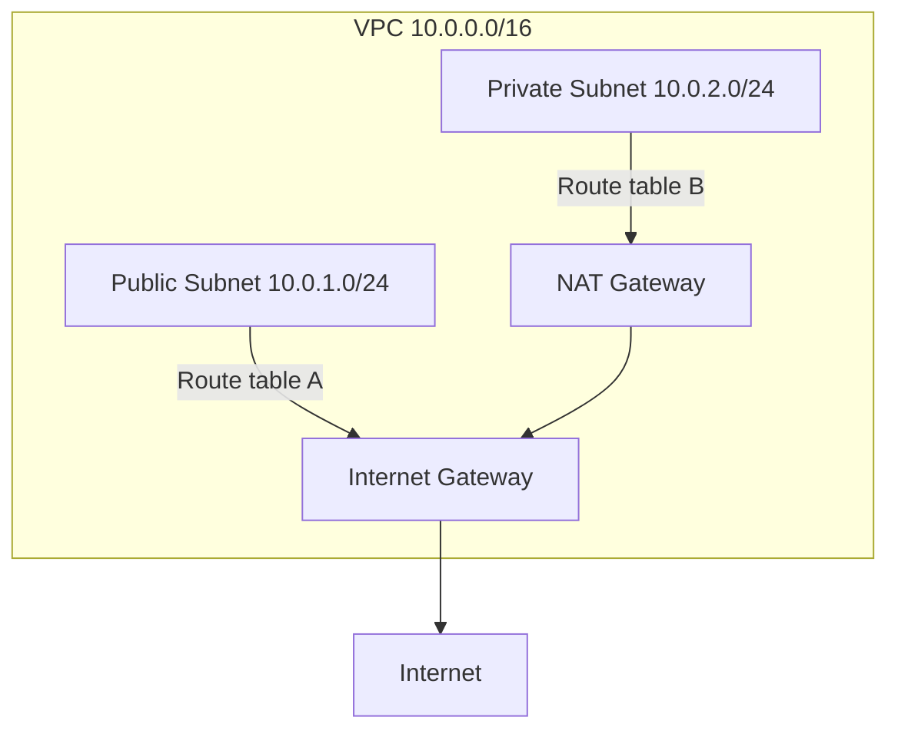

# How to Troubleshoot VPC Subnet Routing Issues

Author: [nawazdhandala](https://github.com/nawazdhandala)

Tags: AWS, VPC, Networking, Troubleshooting

Description: Practical guide to diagnosing and fixing VPC subnet routing problems including route table misconfigurations, NAT gateway issues, and connectivity failures.

---

VPC subnet routing issues are one of the most frustrating problems in AWS. Your EC2 instance can't reach the internet. Your Lambda in a VPC can't talk to DynamoDB. Two subnets in the same VPC can't communicate. The symptoms are always the same - timeouts and connection refused errors - but the causes vary widely. Let's systematically troubleshoot the most common scenarios.

## Understanding VPC Routing Basics

Every subnet in a VPC is associated with a route table. The route table determines where network traffic is directed. By default, all subnets share the VPC's main route table, which has one route:

```
Destination       Target
10.0.0.0/16       local
```

This `local` route means traffic within the VPC is routed automatically. You can't delete it. Everything else needs explicit routes.



## Step 1: Identify Which Route Table Is Associated

The first thing to check is which route table your subnet actually uses:

```bash
# Find the route table associated with a specific subnet
aws ec2 describe-route-tables \
  --filters "Name=association.subnet-id,Values=subnet-abc123" \
  --query 'RouteTables[0].{RouteTableId:RouteTableId,Routes:Routes[*].{Dest:DestinationCidrBlock,Target:GatewayId||NatGatewayId||TransitGatewayId||VpcPeeringConnectionId||NetworkInterfaceId}}'
```

If this returns nothing, the subnet is using the main route table:

```bash
# Check the main route table for the VPC
aws ec2 describe-route-tables \
  --filters "Name=vpc-id,Values=vpc-abc123" "Name=association.main,Values=true" \
  --query 'RouteTables[0].Routes'
```

## Step 2: Common Routing Problems and Fixes

### Problem: Instance in Public Subnet Can't Reach the Internet

Symptoms: Timeouts when trying to reach external services, can't install packages, can't reach APIs.

Checklist:

```bash
# 1. Check if the subnet route table has a route to the internet gateway
aws ec2 describe-route-tables \
  --filters "Name=association.subnet-id,Values=subnet-abc123" \
  --query 'RouteTables[0].Routes[?DestinationCidrBlock==`0.0.0.0/0`]'

# 2. Check if the instance has a public IP or Elastic IP
aws ec2 describe-instances \
  --instance-ids i-0abc123 \
  --query 'Reservations[0].Instances[0].{PublicIp:PublicIpAddress,PrivateIp:PrivateIpAddress}'

# 3. Check the security group allows outbound traffic
aws ec2 describe-security-groups \
  --group-ids sg-abc123 \
  --query 'SecurityGroups[0].IpPermissionsEgress'

# 4. Check the network ACL allows outbound and inbound traffic
aws ec2 describe-network-acls \
  --filters "Name=association.subnet-id,Values=subnet-abc123" \
  --query 'NetworkAcls[0].Entries'
```

Fix - add an internet gateway route if missing:

```bash
# Add a route to the internet gateway
aws ec2 create-route \
  --route-table-id rtb-abc123 \
  --destination-cidr-block 0.0.0.0/0 \
  --gateway-id igw-abc123
```

Fix - if the instance lacks a public IP:

```bash
# Allocate and associate an Elastic IP
aws ec2 allocate-address --domain vpc
aws ec2 associate-address \
  --instance-id i-0abc123 \
  --allocation-id eipalloc-abc123
```

### Problem: Instance in Private Subnet Can't Reach the Internet

Symptoms: Same as above, but the instance is in a private subnet (no direct internet access by design).

```bash
# Check for NAT gateway route
aws ec2 describe-route-tables \
  --filters "Name=association.subnet-id,Values=subnet-private123" \
  --query 'RouteTables[0].Routes[?DestinationCidrBlock==`0.0.0.0/0`]'

# Check NAT gateway status
aws ec2 describe-nat-gateways \
  --nat-gateway-ids nat-abc123 \
  --query 'NatGateways[0].{State:State,SubnetId:SubnetId}'
```

The NAT gateway must be:
1. In a **public** subnet (with a route to an IGW)
2. In `available` state
3. Referenced in the private subnet's route table

```bash
# Add NAT gateway route to private subnet's route table
aws ec2 create-route \
  --route-table-id rtb-private123 \
  --destination-cidr-block 0.0.0.0/0 \
  --nat-gateway-id nat-abc123
```

Common mistake: putting the NAT gateway in a private subnet. It needs to be in a public subnet to work.

### Problem: Two Subnets in the Same VPC Can't Communicate

This shouldn't happen because of the `local` route, but it still does sometimes:

```bash
# Check NACLs on both subnets - they might be blocking traffic
aws ec2 describe-network-acls \
  --filters "Name=association.subnet-id,Values=subnet-abc123" \
  --query 'NetworkAcls[0].Entries'

# Check security groups on both instances
aws ec2 describe-security-groups \
  --group-ids sg-source123 \
  --query 'SecurityGroups[0].IpPermissionsEgress'

aws ec2 describe-security-groups \
  --group-ids sg-dest456 \
  --query 'SecurityGroups[0].IpPermissions'
```

The issue is almost always NACLs or security groups, not routing. NACLs are stateless, so you need both inbound and outbound rules. Security groups are stateful but you still need the inbound rule on the destination.

### Problem: VPC Peering Traffic Not Routing

Symptoms: Instances in peered VPCs can't communicate even though the peering connection is active.

```bash
# Check peering connection status
aws ec2 describe-vpc-peering-connections \
  --vpc-peering-connection-ids pcx-abc123 \
  --query 'VpcPeeringConnections[0].Status'

# Check for routes to the peered VPC CIDR
aws ec2 describe-route-tables \
  --filters "Name=association.subnet-id,Values=subnet-abc123" \
  --query 'RouteTables[0].Routes'
```

Both VPCs need routes added:

```bash
# In VPC A, add a route to VPC B's CIDR via the peering connection
aws ec2 create-route \
  --route-table-id rtb-vpc-a \
  --destination-cidr-block 10.1.0.0/16 \
  --vpc-peering-connection-id pcx-abc123

# In VPC B, add a route to VPC A's CIDR via the peering connection
aws ec2 create-route \
  --route-table-id rtb-vpc-b \
  --destination-cidr-block 10.0.0.0/16 \
  --vpc-peering-connection-id pcx-abc123
```

Also check that DNS resolution is enabled on the peering connection if you're using private DNS names.

## Step 3: Use VPC Reachability Analyzer

AWS's Reachability Analyzer can automatically trace the path between two resources and identify blocking issues:

```bash
# Create a network insights path
aws ec2 create-network-insights-path \
  --source i-source123 \
  --destination i-dest456 \
  --destination-port 443 \
  --protocol TCP

# Analyze the path
aws ec2 start-network-insights-analysis \
  --network-insights-path-id nip-abc123

# Get the analysis results
aws ec2 describe-network-insights-analyses \
  --network-insights-analysis-ids nia-abc123 \
  --query 'NetworkInsightsAnalyses[0].{Reachable:NetworkPathFound,Explanations:Explanations}'
```

The analysis tells you exactly which component is blocking the traffic - route table, security group, NACL, or something else.

## Step 4: Use VPC Flow Logs for Deep Debugging

When other tools don't reveal the issue, flow logs show you what's happening at the packet level:

```bash
# Enable VPC flow logs to CloudWatch
aws ec2 create-flow-log \
  --resource-type VPC \
  --resource-id vpc-abc123 \
  --traffic-type ALL \
  --log-destination-type cloud-watch-logs \
  --log-group-name /vpc/flow-logs \
  --deliver-logs-permission-arn arn:aws:iam::123456789012:role/VPCFlowLogRole
```

Then query the logs:

```
# CloudWatch Logs Insights query for rejected traffic
fields @timestamp, srcAddr, dstAddr, srcPort, dstPort, action
| filter action = "REJECT"
| filter dstAddr = "10.0.2.50"
| sort @timestamp desc
| limit 50
```

Flow logs show you whether packets are being accepted or rejected, which helps you narrow down whether it's a routing issue (packets never arrive) or a security issue (packets arrive but are rejected).

## Quick Reference: Route Table Requirements

| Scenario | Required Route |
|----------|---------------|
| Public internet access | 0.0.0.0/0 -> igw |
| Private subnet internet | 0.0.0.0/0 -> nat-gw |
| VPC peering | peer-CIDR -> pcx |
| Transit Gateway | destination-CIDR -> tgw |
| VPN | on-prem-CIDR -> vgw |
| VPC endpoint (gateway) | service-prefix-list -> vpce |

## Summary

VPC routing issues come down to a small set of problems: missing routes, misconfigured NACLs, overly restrictive security groups, or resources in the wrong subnet type. Start by checking the route table association, verify the specific routes exist, then check NACLs and security groups. Use Reachability Analyzer for automated diagnosis and flow logs for deep packet-level debugging. Most issues are caused by a NAT gateway in a private subnet, a missing peering route, or a NACL blocking return traffic.
