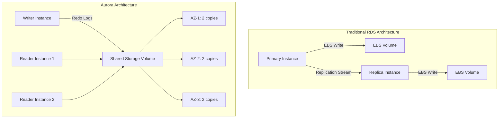
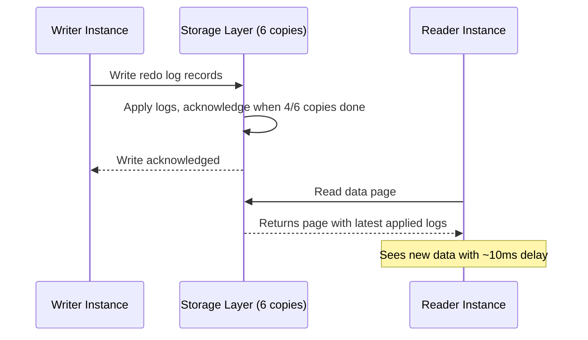

# How to Understand Aurora Architecture and Storage

Author: [nawazdhandala](https://github.com/nawazdhandala)

Tags: AWS, Aurora, Architecture, Database, Storage

Description: A deep dive into Amazon Aurora's distributed storage architecture, replication model, and how it achieves high availability and performance.

---

Aurora looks like MySQL or PostgreSQL from the application's perspective, but underneath, it's a fundamentally different database architecture. Understanding how it works isn't just academic - it directly impacts how you design your application, plan capacity, troubleshoot performance, and handle failure scenarios.

Most Aurora documentation focuses on "what to click." Let's instead focus on "how it works and why it matters."

## The Big Architectural Difference

Traditional databases (including standard RDS) follow a monolithic architecture: the database engine and storage are on the same machine. When you write data, the engine writes to local EBS volumes. Replication copies data from the primary to replicas over the network.

Aurora decouples the database engine from the storage layer. The compute instances (writer and readers) run the database engine, while storage is handled by a separate distributed system. This separation is what enables most of Aurora's advantages.



## The Storage Layer

Aurora's storage is a distributed, fault-tolerant system that spans three Availability Zones. Here's what makes it special:

### Six Copies Across Three AZs

Every piece of data you write is replicated six times: two copies in each of three AZs. This is significantly more redundant than standard RDS (which does two copies for Multi-AZ).

Aurora uses a quorum-based protocol:
- **Writes succeed** when 4 out of 6 copies acknowledge
- **Reads succeed** when 3 out of 6 copies acknowledge

This means Aurora can tolerate:
- The loss of an entire AZ (losing 2 copies) without affecting writes
- The loss of an entire AZ plus one additional node (losing 3 copies) without affecting reads
- Up to 2 copies failing simultaneously without any data loss

### 10 GB Protection Groups

The storage volume is divided into 10 GB segments called protection groups. Each protection group is independently replicated across six storage nodes. If a segment fails, only 10 GB needs to be repaired, not the entire volume.

This segmented approach means repair operations are fast. Rebuilding a 10 GB segment over a 10 Gbps network takes about 10 seconds. Compare that to rebuilding an entire multi-terabyte EBS volume, which could take hours.

### Log-Structured Storage

Here's a detail that surprises many people: Aurora doesn't write full data pages to the storage layer. It only writes redo log records.

In a traditional database:
1. The engine modifies a data page in memory
2. The engine writes the full data page (typically 8-16 KB) to storage
3. The engine also writes redo log entries for crash recovery

In Aurora:
1. The engine modifies a data page in memory
2. The engine sends only the redo log records to the storage layer
3. The storage layer applies the redo logs to reconstruct data pages

This dramatically reduces network I/O. Instead of sending full pages across the network, Aurora sends compact log records. AWS reports this reduces network I/O by up to 30x compared to standard MySQL, which is a big reason Aurora achieves higher throughput.

### Automatic Storage Scaling

Aurora storage auto-scales in 10 GB increments up to 128 TB. You never need to provision storage or worry about running out of disk space (well, until 128 TB). There's no equivalent of the RDS "storage full" emergency.

Storage billing is based on the high-water mark - the maximum storage used. However, if you delete a large amount of data, the storage allocation can eventually shrink.

## How Replication Works

This is where Aurora really differs from traditional replication.

### Traditional MySQL Replication
The primary sends a stream of binary log events to each replica. The replica receives these events, writes them to its own relay log, and then replays them. This is asynchronous, so replicas can fall behind.

### Aurora Replication
Since all instances (writer and readers) share the same storage volume, there's no data replication in the traditional sense. The writer sends redo log records to the storage layer. Readers see the new data as soon as the storage layer applies those records.

The result: Aurora replica lag is typically 10-20 milliseconds, compared to seconds or even minutes with traditional replication. In practice, for many use cases, reads from Aurora replicas return data that's effectively real-time.



## Buffer Cache and Warm Reads

Each Aurora instance maintains its own buffer cache (in-memory pages). When you add a reader, it starts with a cold cache and needs to warm up by reading pages from storage. This can cause temporarily higher read latency on new reader instances.

One feature that helps: during a failover, Aurora can use the surviving instance's buffer cache. If reader-1 gets promoted to writer, it already has a warm cache from serving reads, so performance impact is minimal compared to a cold start.

## Failover Mechanics

Aurora failover is faster than standard RDS for several reasons:

1. **No data replication needed**: The new writer already has access to all data through the shared storage layer.
2. **No crash recovery replay**: The storage layer ensures data durability, so the new writer doesn't need to replay a long transaction log.
3. **DNS update**: Aurora updates the cluster endpoint DNS to point to the new writer.

Typical failover times:
- **With existing readers**: 15-30 seconds. Aurora promotes a reader to writer.
- **Without readers**: 2-5 minutes. Aurora needs to create a new instance.

This is why you should always have at least one reader instance in your Aurora cluster, even if you don't need read scaling.

## Storage Costs

Aurora storage pricing differs from standard RDS:

- **Standard RDS**: You provision a fixed amount of storage (e.g., 500 GB) and pay for that regardless of usage.
- **Aurora**: You pay per GB-month for what you actually use, plus per million I/O requests.

For small databases, Aurora can be more expensive because the per-GB rate is higher. For large databases with variable storage needs, Aurora can be cheaper because you don't have to over-provision.

As of 2026, Aurora storage pricing is approximately:
- Storage: $0.10 per GB-month
- I/O: $0.20 per million requests (standard), or included with Aurora I/O-Optimized

### Aurora I/O-Optimized

If your workload is I/O-intensive, consider Aurora I/O-Optimized. This configuration eliminates per-I/O charges and replaces them with a higher storage rate (roughly $0.225 per GB-month). For workloads where I/O costs exceed 25% of your total Aurora bill, I/O-Optimized saves money.

```bash
# Switch to I/O-Optimized storage
aws rds modify-db-cluster \
  --db-cluster-identifier my-aurora-cluster \
  --storage-type aurora-iopt1 \
  --apply-immediately
```

## Backtracking (Aurora MySQL Only)

Aurora MySQL has a unique feature called Backtracking that lets you "rewind" the database to a previous point in time without restoring from a snapshot:

```bash
# Enable backtracking when creating the cluster (Aurora MySQL only)
aws rds create-db-cluster \
  --db-cluster-identifier my-cluster \
  --engine aurora-mysql \
  --backtrack-window 86400 \
  ...

# Backtrack to a specific time
aws rds backtrack-db-cluster \
  --db-cluster-identifier my-cluster \
  --backtrack-to "2026-02-12T10:30:00Z"
```

This works because Aurora's storage keeps redo log records that can be applied in reverse. Backtracking takes seconds, compared to minutes or hours for a snapshot restore.

## Performance Considerations

Understanding the architecture helps you optimize performance:

**Write throughput**: Aurora's log-structured writes reduce I/O amplification, but the writer is still a single instance. If you need more write throughput, you need to shard at the application level.

**Read throughput**: Scale horizontally by adding reader instances. They're cheap to add since they share storage. See our guide on [setting up Aurora read replicas](https://oneuptime.com/blog/post/2026-02-12-set-up-aurora-read-replicas/view).

**Latency**: Aurora's read latency depends heavily on buffer cache hit ratio. Monitor this metric. If it drops below 95-99%, your working set is larger than available memory and you should consider a larger instance class.

**I/O patterns**: Aurora performs best with workloads that have high read-to-write ratios. The shared storage architecture is optimized for this pattern.

## When to Choose Aurora vs. Standard RDS

Choose Aurora when:
- You need very low replica lag
- You want fast, automatic failover
- You don't want to manage storage provisioning
- Your database might grow unpredictably
- You need more than 5 read replicas

Choose standard RDS when:
- You have a small database (< 100 GB) and want to minimize cost
- You need a database engine not supported by Aurora (SQL Server, Oracle)
- You want more control over the storage layer (specific IOPS, specific storage type)

Aurora's architecture is what makes it more than "just RDS but faster." The distributed storage, log-based replication, and quorum writes give it durability and availability characteristics that are genuinely difficult to achieve with traditional database architectures. Understanding these internals helps you make better decisions about when to use it and how to get the most out of it.
