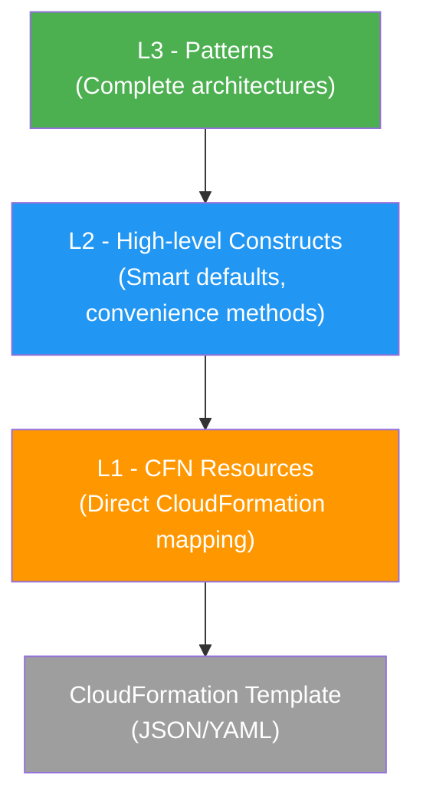

# How to Understand CDK Constructs (L1, L2, L3)

Author: [nawazdhandala](https://github.com/nawazdhandala)

Tags: AWS, CDK, Infrastructure as Code, TypeScript

Description: A clear explanation of CDK construct levels L1, L2, and L3, with practical examples showing when and why to use each abstraction layer in your CDK applications.

---

CDK constructs come in three flavors - L1, L2, and L3. Understanding the differences between these levels is crucial for writing effective CDK code. Pick the wrong level and you're either fighting unnecessary complexity or missing out on useful features.

Let's break down each level with real examples so you can see the practical differences.

## What Are Constructs?

Every resource in CDK is a construct. A construct is just a class that represents a cloud component. Constructs can contain other constructs, forming a tree structure. Your App contains Stacks, Stacks contain Constructs, and Constructs can contain other Constructs.

The three levels represent different abstraction heights above raw CloudFormation.



## L1 Constructs - The CFN Layer

L1 constructs are direct, one-to-one mappings to CloudFormation resources. They're auto-generated from the CloudFormation resource specification, which means every property name and type matches exactly what you'd write in a CloudFormation template.

L1 constructs are prefixed with `Cfn` - so an S3 bucket becomes `CfnBucket`, an EC2 instance becomes `CfnInstance`.

Here's an S3 bucket as an L1 construct.

```typescript
// L1 Construct - CfnBucket maps directly to AWS::S3::Bucket
import * as cdk from 'aws-cdk-lib';
import { CfnBucket } from 'aws-cdk-lib/aws-s3';

const bucket = new CfnBucket(this, 'MyBucket', {
  bucketName: 'my-example-bucket',
  versioningConfiguration: {
    status: 'Enabled',
  },
  publicAccessBlockConfiguration: {
    blockPublicAcls: true,
    blockPublicPolicy: true,
    ignorePublicAcls: true,
    restrictPublicBuckets: true,
  },
  lifecycleConfiguration: {
    rules: [
      {
        id: 'ExpireOldObjects',
        status: 'Enabled',
        expirationInDays: 90,
        transitions: [
          {
            storageClass: 'STANDARD_IA',
            transitionInDays: 30,
          },
        ],
      },
    ],
  },
  tags: [
    { key: 'Environment', value: 'production' },
    { key: 'Team', value: 'backend' },
  ],
});
```

This is verbose. You're specifying every detail, using the exact property names from the CloudFormation spec. There are no smart defaults, no convenience methods, and no helper functions.

**When to use L1 constructs:**
- When the L2 construct doesn't expose a property you need
- When you need precise control over the CloudFormation output
- When you're working with a very new AWS resource that doesn't have an L2 construct yet

## L2 Constructs - The Sweet Spot

L2 constructs are hand-written by the CDK team. They wrap L1 constructs with sensible defaults, convenience methods, and higher-level abstractions. This is where most of your CDK code should live.

Here's the same S3 bucket as an L2 construct.

```typescript
// L2 Construct - Bucket provides smart defaults and convenience methods
import * as s3 from 'aws-cdk-lib/aws-s3';
import * as cdk from 'aws-cdk-lib';

const bucket = new s3.Bucket(this, 'MyBucket', {
  bucketName: 'my-example-bucket',
  versioned: true,
  // blockPublicAccess is BLOCK_ALL by default - no need to specify
  lifecycleRules: [
    {
      id: 'ExpireOldObjects',
      expiration: cdk.Duration.days(90),
      transitions: [
        {
          storageClass: s3.StorageClass.INFREQUENT_ACCESS,
          transitionAfter: cdk.Duration.days(30),
        },
      ],
    },
  ],
});

// L2 constructs have convenience methods
bucket.addToResourcePolicy(/* ... */);  // Add bucket policies easily
bucket.grantRead(myLambdaFunction);      // Grant IAM permissions in one line
bucket.addEventNotification(/* ... */);  // Set up S3 event notifications
```

Look at the differences. The L2 construct uses `versioned: true` instead of `versioningConfiguration: { status: 'Enabled' }`. Duration values use `cdk.Duration.days(90)` instead of raw numbers. Public access is blocked by default. And you get methods like `grantRead()` that handle IAM permissions automatically.

Let's see a more complex example - an RDS database.

```typescript
// L2 RDS construct - handles subnet groups, security groups, and secrets automatically
import * as rds from 'aws-cdk-lib/aws-rds';
import * as ec2 from 'aws-cdk-lib/aws-ec2';

const database = new rds.DatabaseInstance(this, 'Database', {
  engine: rds.DatabaseInstanceEngine.postgres({
    version: rds.PostgresEngineVersion.VER_15,
  }),
  instanceType: ec2.InstanceType.of(
    ec2.InstanceClass.T3,
    ec2.InstanceSize.MEDIUM,
  ),
  vpc: myVpc,
  vpcSubnets: { subnetType: ec2.SubnetType.PRIVATE_ISOLATED },
  // CDK automatically creates a Secrets Manager secret for the password
  credentials: rds.Credentials.fromGeneratedSecret('postgres'),
  multiAz: true,
  allocatedStorage: 100,
  maxAllocatedStorage: 500,
  deletionProtection: true,
});

// Grant access to a Lambda function - CDK handles security groups and IAM
database.connections.allowFrom(myLambdaFunction, ec2.Port.tcp(5432));
database.grantConnect(myLambdaFunction);
```

Behind the scenes, CDK creates the DB subnet group, a security group, a Secrets Manager secret, and the proper IAM policies. With L1 constructs, you'd have to create each of those resources manually and wire them together.

## L3 Constructs - Patterns

L3 constructs (also called Patterns) represent complete architectural patterns. They combine multiple L2 constructs into opinionated, ready-to-use architectures.

```typescript
// L3 Construct - LambdaRestApi creates API Gateway + Lambda + permissions
import * as apigw from 'aws-cdk-lib/aws-apigateway';
import * as lambda from 'aws-cdk-lib/aws-lambda';

const handler = new lambda.Function(this, 'Handler', {
  runtime: lambda.Runtime.NODEJS_20_X,
  handler: 'index.handler',
  code: lambda.Code.fromAsset('lambda'),
});

// This single line creates an API Gateway REST API wired to the Lambda
const api = new apigw.LambdaRestApi(this, 'Api', {
  handler: handler,
  proxy: true,
});
```

The `LambdaRestApi` construct creates an API Gateway, configures the Lambda integration, sets up permissions, creates deployment and stage - all from three lines of configuration.

Here's another L3 pattern from the `aws-cdk-lib/aws-ecs-patterns` module.

```typescript
// L3 Pattern - ApplicationLoadBalancedFargateService
// Creates ALB + Fargate service + ECS cluster + log groups + IAM roles
import * as ecsPatterns from 'aws-cdk-lib/aws-ecs-patterns';
import * as ecs from 'aws-cdk-lib/aws-ecs';

const service = new ecsPatterns.ApplicationLoadBalancedFargateService(
  this, 'WebService', {
    taskImageOptions: {
      image: ecs.ContainerImage.fromAsset('./docker'),
      containerPort: 8080,
      environment: {
        DATABASE_URL: 'postgresql://...',
      },
    },
    desiredCount: 3,
    cpu: 512,
    memoryLimitMiB: 1024,
    publicLoadBalancer: true,
  },
);

// You can still customize the underlying resources
service.targetGroup.configureHealthCheck({
  path: '/health',
  interval: cdk.Duration.seconds(30),
});
```

That single construct creates a VPC (if none is provided), an ECS cluster, a Fargate task definition, an ALB, target groups, security groups, IAM roles, CloudWatch log groups, and more. It's dozens of resources from a few lines of code.

## Mixing Levels

You're not locked into one level. In practice, most CDK apps use a mix of L2 and L3 constructs, with occasional drops down to L1 when needed.

```typescript
// Mix of L2 and L1 in the same stack
const bucket = new s3.Bucket(this, 'Bucket', {
  versioned: true,
});

// Access the underlying L1 construct to set properties not exposed by L2
const cfnBucket = bucket.node.defaultChild as s3.CfnBucket;
cfnBucket.analyticsConfigurations = [
  {
    id: 'FullAnalytics',
    storageClassAnalysis: {
      dataExport: {
        destination: {
          bucketArn: analyticsBucket.bucketArn,
          format: 'CSV',
        },
        outputSchemaVersion: 'V_1',
      },
    },
  },
];
```

This technique of accessing the L1 construct from an L2 construct is called an "escape hatch." It's covered in more detail in the post about [CDK escape hatches](https://oneuptime.com/blog/post/2026-02-12-cdk-escape-hatches-access-l1-constructs/view).

## The Decision Framework

Here's how to pick the right level.

Start with L3 patterns when they exist and match your architecture. They get you running fast and encode best practices.

Drop to L2 constructs when you need more customization than the pattern allows. This is where you'll spend most of your time.

Use L1 constructs only when L2 doesn't expose what you need, or when working with brand-new AWS services.

The construct levels aren't about skill - they're about choosing the right tool for the job. A senior engineer uses L3 patterns for standard architectures and L1 constructs when precision matters. For a hands-on introduction to CDK, check out the [getting started guide](https://oneuptime.com/blog/post/2026-02-12-get-started-with-aws-cdk/view). To learn about building your own reusable constructs, read about [creating custom CDK constructs](https://oneuptime.com/blog/post/2026-02-12-create-custom-cdk-constructs/view).
