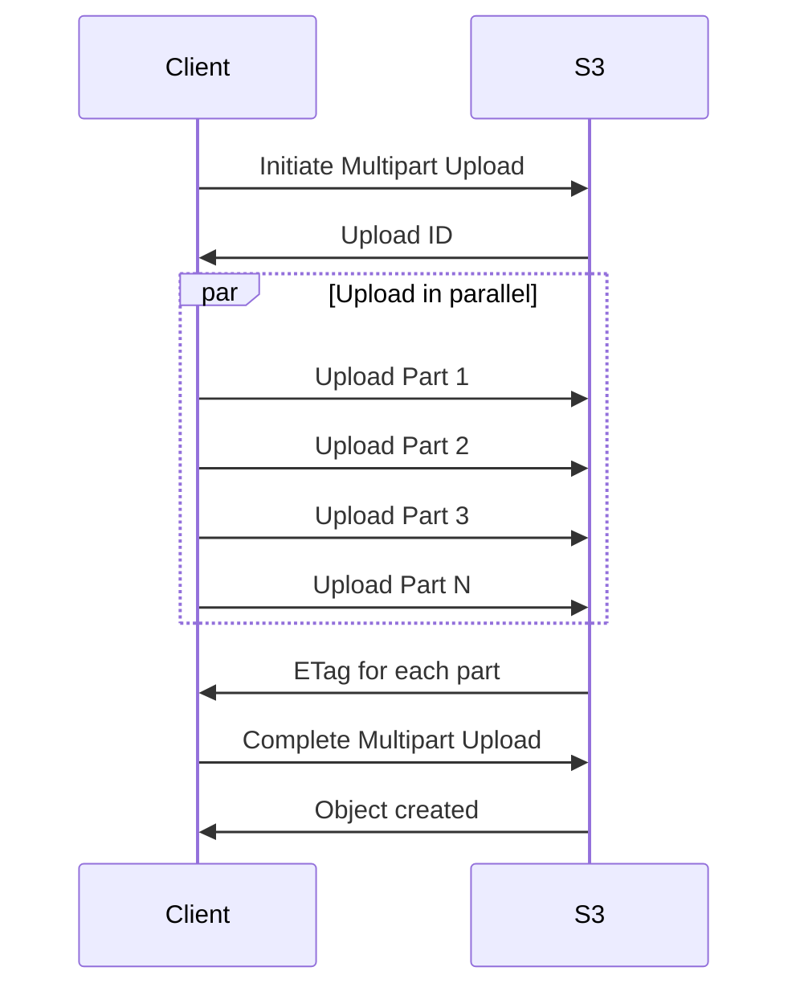

# How to Upload Large Files to S3 Using Multipart Upload

Author: [nawazdhandala](https://github.com/nawazdhandala)

Tags: AWS, S3, CLI, Storage

Description: Learn how to upload large files to Amazon S3 using multipart upload for reliability and performance, with both CLI and SDK examples.

---

Uploading a 50 GB database dump or a multi-gigabyte video file to S3 with a single PUT request is a recipe for frustration. If the upload fails at 90%, you start over from scratch. Multipart upload solves this by breaking large files into smaller chunks, uploading them in parallel, and assembling them on S3's side. If one chunk fails, you only re-upload that chunk.

The AWS CLI handles multipart uploads automatically for files above a certain size threshold, but understanding how it works under the hood gives you more control and helps you debug when things go sideways.

## How Multipart Upload Works

The process has three phases:

1. **Initiate** - Tell S3 you're starting a multipart upload. S3 returns an upload ID.
2. **Upload parts** - Upload chunks in parallel. Each part must be at least 5 MB (except the last one). Maximum 10,000 parts.
3. **Complete** - Tell S3 to assemble all the parts into a single object.



## Automatic Multipart with the CLI

The AWS CLI automatically uses multipart upload for files above the threshold. You can configure when it kicks in.

Configure the CLI's multipart upload behavior:

```bash
# Set the threshold for when multipart kicks in (default is 8MB)
aws configure set default.s3.multipart_threshold 100MB

# Set the chunk size for each part
aws configure set default.s3.multipart_chunksize 64MB

# Set the number of parallel upload threads
aws configure set default.s3.max_concurrent_requests 10

# Now just upload normally - multipart happens automatically
aws s3 cp large-file.tar.gz s3://my-bucket/backups/large-file.tar.gz
```

For a 10 GB file with 64 MB chunks and 10 concurrent threads, you'll get roughly 156 parts uploading 10 at a time. That's significantly faster than a single stream and much more resilient to network hiccups.

## Manual Multipart Upload with the CLI

Sometimes you want full control over the multipart process - maybe you're resuming a failed upload or building a custom upload pipeline.

### Step 1: Split the file

Split a large file into chunks:

```bash
# Split a 10GB file into 100MB chunks
split -b 100m large-file.tar.gz large-file-part-

# List the parts
ls -la large-file-part-*
# large-file-part-aa (100MB)
# large-file-part-ab (100MB)
# large-file-part-ac (100MB)
# ... and so on
```

### Step 2: Initiate the upload

Start the multipart upload and get the upload ID:

```bash
# Initiate the multipart upload
UPLOAD_ID=$(aws s3api create-multipart-upload \
    --bucket my-bucket \
    --key backups/large-file.tar.gz \
    --query "UploadId" --output text)

echo "Upload ID: $UPLOAD_ID"
```

### Step 3: Upload each part

Upload the parts and save their ETags:

```bash
# Upload each part and capture the ETag
PART_NUM=1
PARTS_JSON="["

for PART_FILE in large-file-part-*; do
    echo "Uploading part $PART_NUM: $PART_FILE"

    ETAG=$(aws s3api upload-part \
        --bucket my-bucket \
        --key backups/large-file.tar.gz \
        --upload-id "$UPLOAD_ID" \
        --part-number $PART_NUM \
        --body "$PART_FILE" \
        --query "ETag" --output text)

    if [ $PART_NUM -gt 1 ]; then
        PARTS_JSON="$PARTS_JSON,"
    fi
    PARTS_JSON="$PARTS_JSON{\"ETag\":$ETAG,\"PartNumber\":$PART_NUM}"

    echo "  Part $PART_NUM uploaded, ETag: $ETAG"
    PART_NUM=$((PART_NUM + 1))
done

PARTS_JSON="$PARTS_JSON]"
echo "All parts uploaded!"
```

### Step 4: Complete the upload

Tell S3 to assemble the parts:

```bash
# Complete the multipart upload
aws s3api complete-multipart-upload \
    --bucket my-bucket \
    --key backups/large-file.tar.gz \
    --upload-id "$UPLOAD_ID" \
    --multipart-upload "{\"Parts\":$PARTS_JSON}"

echo "Upload complete!"
```

## Handling Failed Uploads

If something goes wrong during upload, you can list and resume or abort incomplete uploads.

Manage incomplete multipart uploads:

```bash
# List all incomplete multipart uploads for a bucket
aws s3api list-multipart-uploads \
    --bucket my-bucket \
    --query "Uploads[*].[Key,UploadId,Initiated]" \
    --output table

# List parts that were successfully uploaded for a specific upload
aws s3api list-parts \
    --bucket my-bucket \
    --key backups/large-file.tar.gz \
    --upload-id "$UPLOAD_ID" \
    --query "Parts[*].[PartNumber,Size,ETag]" \
    --output table

# Abort a failed upload (to clean up and free storage)
aws s3api abort-multipart-upload \
    --bucket my-bucket \
    --key backups/large-file.tar.gz \
    --upload-id "$UPLOAD_ID"
```

Important: incomplete multipart uploads still consume storage and you get charged for it. Set up a lifecycle rule to automatically clean them up.

Configure automatic cleanup of incomplete multipart uploads:

```bash
# Create a lifecycle rule to abort incomplete uploads after 7 days
aws s3api put-bucket-lifecycle-configuration \
    --bucket my-bucket \
    --lifecycle-configuration '{
        "Rules": [
            {
                "ID": "cleanup-incomplete-uploads",
                "Status": "Enabled",
                "Filter": {},
                "AbortIncompleteMultipartUpload": {
                    "DaysAfterInitiation": 7
                }
            }
        ]
    }'
```

## Multipart Upload with Python (boto3)

For more sophisticated upload logic, use the Python SDK with its built-in transfer manager.

Upload large files using boto3's transfer manager:

```python
import boto3
from boto3.s3.transfer import TransferConfig

# Configure the transfer
config = TransferConfig(
    multipart_threshold=100 * 1024 * 1024,  # 100 MB
    multipart_chunksize=64 * 1024 * 1024,   # 64 MB
    max_concurrency=10,
    use_threads=True
)

s3 = boto3.client('s3')

# Upload with progress callback
class ProgressTracker:
    def __init__(self, filename):
        import os
        self._filename = filename
        self._size = os.path.getsize(filename)
        self._seen = 0

    def __call__(self, bytes_transferred):
        self._seen += bytes_transferred
        pct = (self._seen / self._size) * 100
        print(f"\rProgress: {pct:.1f}% ({self._seen / 1024 / 1024:.0f} MB)", end="")

# Upload the file
progress = ProgressTracker("large-file.tar.gz")
s3.upload_file(
    "large-file.tar.gz",
    "my-bucket",
    "backups/large-file.tar.gz",
    Config=config,
    Callback=progress
)
print("\nUpload complete!")
```

## Multipart Upload with Node.js

Here's the equivalent using the AWS SDK for JavaScript:

```javascript
const { S3Client, CreateMultipartUploadCommand,
        UploadPartCommand, CompleteMultipartUploadCommand } = require("@aws-sdk/client-s3");
const { Upload } = require("@aws-sdk/lib-storage");
const fs = require("fs");

const s3 = new S3Client({ region: "us-east-1" });

async function uploadLargeFile(filePath, bucket, key) {
    const fileStream = fs.createReadStream(filePath);

    // The Upload class handles multipart automatically
    const upload = new Upload({
        client: s3,
        params: {
            Bucket: bucket,
            Key: key,
            Body: fileStream
        },
        // Configure chunk size and concurrency
        queueSize: 4,          // concurrent uploads
        partSize: 64 * 1024 * 1024  // 64 MB chunks
    });

    // Track progress
    upload.on("httpUploadProgress", (progress) => {
        const pct = ((progress.loaded / progress.total) * 100).toFixed(1);
        process.stdout.write(`\rProgress: ${pct}%`);
    });

    await upload.done();
    console.log("\nUpload complete!");
}

uploadLargeFile("large-file.tar.gz", "my-bucket", "backups/large-file.tar.gz");
```

## Optimizing Multipart Upload Performance

A few tips to get the best upload speed:

**Choose the right chunk size.** Smaller chunks mean more parallelism but more HTTP overhead. Larger chunks are more efficient per-request but offer less parallelism. For most cases, 64-100 MB chunks are a good balance.

**Match concurrency to your bandwidth.** If you have a 1 Gbps connection, you can push about 125 MB/s. With 64 MB chunks and 10 concurrent threads, you'll keep that pipe full.

**Use Transfer Acceleration for distant uploads.** If your bucket is in us-east-1 but you're uploading from Asia, [S3 Transfer Acceleration](https://oneuptime.com/blog/post/2026-02-12-enable-s3-transfer-acceleration-faster-uploads/view) routes traffic through CloudFront edge locations for faster transfers.

Calculate optimal settings for your network:

```bash
# Test your upload speed to S3
dd if=/dev/urandom bs=1M count=100 | aws s3 cp - s3://my-bucket/speed-test.bin

# Time it
time aws s3 cp /tmp/100mb-test s3://my-bucket/speed-test.bin

# Based on your speed, calculate optimal settings:
# If upload is 50 MB/s:
#   - 64 MB chunks, 5 concurrent = 320 MB buffer (reasonable)
#   - Each chunk takes ~1.3 seconds
#   - 10 GB file = 156 parts, ~40 seconds wall time
```

## Verifying Upload Integrity

S3 uses MD5 checksums for each part. You can also verify the complete object.

Verify a multipart upload's integrity:

```bash
# Get the ETag of the uploaded object
aws s3api head-object \
    --bucket my-bucket \
    --key backups/large-file.tar.gz \
    --query "[ContentLength,ETag]" \
    --output text

# Note: multipart ETags look different from single-upload ETags
# A multipart ETag ends with -N where N is the number of parts
# Example: "d41d8cd98f00b204e9800998ecf8427e-156"
```

Multipart upload is one of those features that works invisibly most of the time but becomes essential when you're dealing with large files. The CLI handles it automatically, but knowing the manual process means you can recover from failures, build custom pipelines, and optimize for your specific network conditions.
