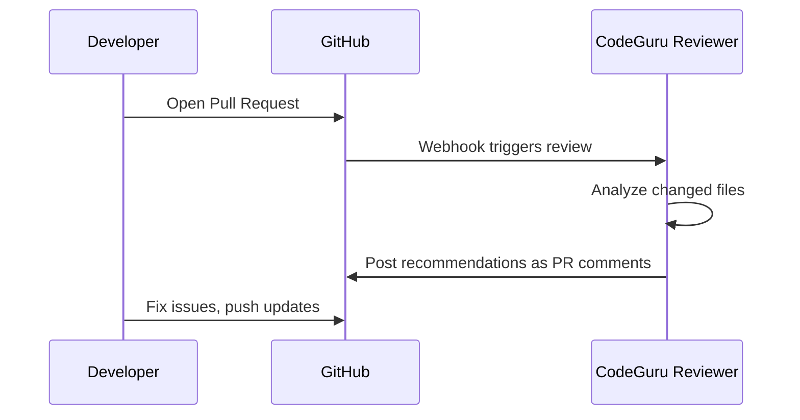

# How to Use Amazon CodeGuru Reviewer for Code Quality

Author: [nawazdhandala](https://github.com/nawazdhandala)

Tags: AWS, CodeGuru, Code Review, DevOps, Code Quality

Description: A hands-on guide to setting up Amazon CodeGuru Reviewer for automated code reviews, catching bugs, security issues, and performance problems in your codebase.

---

Code reviews catch bugs. That's not controversial. What is controversial is how much time developers spend doing them and how many issues still slip through. Amazon CodeGuru Reviewer uses machine learning to automatically review your code and flag potential problems - security vulnerabilities, resource leaks, concurrency issues, and more.

It's not replacing human reviewers. It's catching the stuff humans tend to miss because they're focused on logic and design rather than scanning for subtle resource handling patterns.

## What CodeGuru Reviewer Does

CodeGuru Reviewer analyzes your code for:

- **Security vulnerabilities** - Hardcoded credentials, SQL injection, insecure cryptography
- **AWS SDK best practices** - Inefficient API usage, missing pagination, incorrect error handling
- **Code quality** - Resource leaks, concurrency bugs, null pointer dereferences
- **Performance issues** - Inefficient algorithms, unnecessary object creation

It supports Java and Python today, with recommendations powered by models trained on millions of code reviews from Amazon's internal codebase and open source projects.

## Setting It Up

CodeGuru Reviewer integrates directly with your repository. It supports:

- GitHub
- GitHub Enterprise
- Bitbucket
- AWS CodeCommit

### Associating a Repository

In the CodeGuru console, navigate to "Reviewer" and click "Associate repository."

Or do it programmatically:

```python
# Associate a GitHub repository with CodeGuru Reviewer
import boto3

codeguru = boto3.client('codeguru-reviewer', region_name='us-east-1')

response = codeguru.associate_repository(
    Repository={
        'GitHubEnterpriseServer': {
            'Name': 'my-app',
            'ConnectionArn': 'arn:aws:codestar-connections:us-east-1:YOUR_ACCOUNT:connection/CONNECTION_ID',
            'Owner': 'your-org'
        }
    }
)

association_arn = response['RepositoryAssociation']['AssociationArn']
print(f"Association ARN: {association_arn}")
```

For GitHub repositories, you'll need an AWS CodeStar connection. Set that up first in the Developer Tools console.

Once associated, CodeGuru Reviewer automatically kicks in on every pull request. You'll see its recommendations appear as PR comments, just like a human reviewer.

## How the Review Process Works



CodeGuru reviews only the changed files in a PR, not the entire codebase. This keeps reviews focused and fast - typically completing in 5-15 minutes depending on the size of the change.

## Running a Full Repository Analysis

Beyond PR reviews, you can run a full repository analysis to scan your entire codebase:

```python
# Trigger a full repository analysis
response = codeguru.create_code_review(
    Name='full-scan-2025-02',
    RepositoryAssociationArn=association_arn,
    Type={
        'RepositoryAnalysis': {
            'RepositoryHead': {
                'BranchName': 'main'
            }
        }
    }
)

code_review_arn = response['CodeReview']['CodeReviewArn']
print(f"Code review ARN: {code_review_arn}")
```

This is useful when you first set up CodeGuru on an existing project. It finds issues that accumulated before you started using automated reviews.

Check the status:

```python
# Check the status of the code review
review = codeguru.describe_code_review(
    CodeReviewArn=code_review_arn
)

print(f"Status: {review['CodeReview']['State']}")
print(f"Metrics: {review['CodeReview'].get('Metrics', {})}")
```

## Understanding Recommendations

Once a review completes, fetch the recommendations:

```python
# List recommendations from a code review
recommendations = codeguru.list_recommendations(
    CodeReviewArn=code_review_arn
)

for rec in recommendations['RecommendationSummaries']:
    print(f"File: {rec['FilePath']}")
    print(f"Lines: {rec['StartLine']} - {rec['EndLine']}")
    print(f"Description: {rec['Description']}")
    print(f"Severity: {rec.get('Severity', 'N/A')}")
    print(f"Recommendation ID: {rec['RecommendationId']}")
    print()
```

Each recommendation includes:
- The exact file and line numbers
- A plain-English description of the issue
- The severity (Critical, High, Medium, Low, Info)
- Often a suggested fix

## Common Issues CodeGuru Catches

### Resource Leaks

CodeGuru is particularly good at catching resource leaks. Consider this Java code:

```java
// BEFORE: Resource leak - connection might not be closed on exception
public String getData(String url) throws IOException {
    HttpURLConnection conn = (HttpURLConnection) new URL(url).openConnection();
    conn.setRequestMethod("GET");
    BufferedReader reader = new BufferedReader(
        new InputStreamReader(conn.getInputStream())
    );
    String line;
    StringBuilder result = new StringBuilder();
    while ((line = reader.readLine()) != null) {
        result.append(line);
    }
    return result.toString();
    // Missing: reader.close() and conn.disconnect()
}
```

CodeGuru would flag this and suggest using try-with-resources:

```java
// AFTER: Properly manages resources with try-with-resources
public String getData(String url) throws IOException {
    HttpURLConnection conn = (HttpURLConnection) new URL(url).openConnection();
    conn.setRequestMethod("GET");
    try (BufferedReader reader = new BufferedReader(
            new InputStreamReader(conn.getInputStream()))) {
        String line;
        StringBuilder result = new StringBuilder();
        while ((line = reader.readLine()) != null) {
            result.append(line);
        }
        return result.toString();
    } finally {
        conn.disconnect();
    }
}
```

### Hardcoded Credentials

```python
# FLAGGED: Hardcoded credentials detected
db_password = "SuperSecret123!"
connection = psycopg2.connect(
    host="db.example.com",
    password=db_password
)
```

CodeGuru would recommend using AWS Secrets Manager or environment variables instead.

### AWS SDK Issues

```python
# FLAGGED: Missing pagination - only returns first page of results
s3 = boto3.client('s3')
response = s3.list_objects_v2(Bucket='my-bucket')
objects = response['Contents']
# What about objects beyond the first 1000?
```

CodeGuru would suggest using a paginator:

```python
# FIXED: Using paginator to handle all pages of results
s3 = boto3.client('s3')
paginator = s3.get_paginator('list_objects_v2')
objects = []
for page in paginator.paginate(Bucket='my-bucket'):
    objects.extend(page.get('Contents', []))
```

## Providing Feedback

CodeGuru learns from your feedback. When you see a recommendation on a PR, you can mark it as helpful or not helpful. This feedback trains the model to give better recommendations over time.

```python
# Provide feedback on a recommendation
codeguru.put_recommendation_feedback(
    CodeReviewArn=code_review_arn,
    RecommendationId='recommendation-id-123',
    Reactions=['ThumbsUp']  # or 'ThumbsDown'
)
```

## Integrating with CI/CD

While CodeGuru automatically reviews PRs, you can also trigger reviews from your CI/CD pipeline:

```yaml
# GitHub Actions workflow that triggers CodeGuru analysis
name: CodeGuru Review
on:
  pull_request:
    branches: [main]

jobs:
  review:
    runs-on: ubuntu-latest
    steps:
      - uses: actions/checkout@v4
        with:
          fetch-depth: 0

      - name: Configure AWS Credentials
        uses: aws-actions/configure-aws-credentials@v4
        with:
          role-to-assume: arn:aws:iam::YOUR_ACCOUNT:role/CodeGuruCIRole
          aws-region: us-east-1

      - name: CodeGuru Reviewer
        uses: aws-actions/codeguru-reviewer@v1
        with:
          s3_bucket: codeguru-reviewer-artifacts
          build_path: ./build
```

## CodeGuru Reviewer vs CodeGuru Profiler

Don't confuse the two. CodeGuru has two services:

- **Reviewer** - Static code analysis during code reviews (what we covered here)
- **Profiler** - Runtime performance profiling in production

Profiler is a separate tool that instruments your running application and identifies the most expensive lines of code. It's useful for finding performance bottlenecks in production.

## Cost Considerations

CodeGuru Reviewer pricing is based on the number of lines of code analyzed:

- First 100K lines per month per repository are included in the associated repository fee
- Additional lines are charged per line

The associated repository fee is relatively modest. For most teams, it's significantly cheaper than the developer time it saves by catching issues early.

## Monitoring Your Reviews

Track CodeGuru metrics through CloudWatch to understand its impact:

- Number of recommendations generated
- Recommendation types (security vs. quality vs. performance)
- Feedback ratios (helpful vs. not helpful)

This data helps you measure ROI and tune your usage. For broader application monitoring and operational insights, take a look at [Amazon DevOps Guru](https://oneuptime.com/blog/post/2026-02-12-use-amazon-devops-guru-for-operational-insights/view).

## Wrapping Up

CodeGuru Reviewer won't replace your senior engineers, but it'll catch the issues they miss when they're reviewing 15 PRs on a Friday afternoon. The security and AWS best practice recommendations alone make it worth trying. Set it up on one repository, see what it finds, and expand from there.
