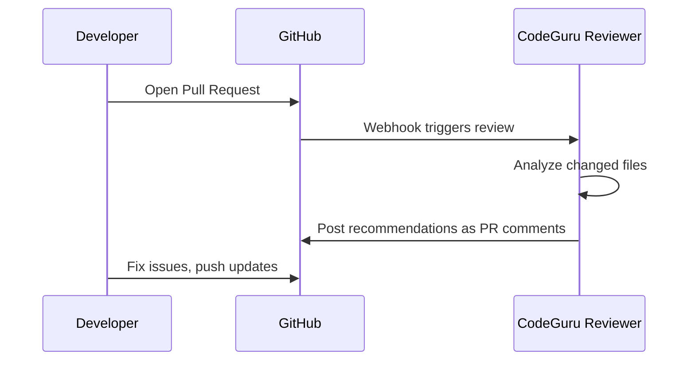

# How to Use Amazon CodeGuru Reviewer for Code Quality

Author: [nawazdhandala](https://github.com/nawazdhandala)

Tags: AWS, CodeGuru, Code Review, DevOps, Code Quality

Description: A hands-on guide to setting up Amazon CodeGuru Reviewer for automated code reviews, catching bugs, security issues, and performance problems in your codebase.

---

Code reviews catch bugs. That's not controversial. What is controversial is how much time developers spend doing them and how many issues still slip through. Amazon CodeGuru Reviewer uses program analysis and machine learning to automatically review your code and flag potential problems - security vulnerabilities, resource leaks, concurrency issues, and more.

As of November 7, 2025, AWS no longer lets you create new repository associations in CodeGuru Reviewer. You can still use CodeGuru Reviewer with repository associations that already exist; for new repositories, AWS points teams to Amazon Q Developer for code reviews and Amazon Inspector for code security scanning.

It's not replacing human reviewers. It's catching the stuff humans tend to miss because they're focused on logic and design rather than scanning for subtle resource handling patterns.

## What CodeGuru Reviewer Does

CodeGuru Reviewer analyzes your code for:

- **Security vulnerabilities** - Hardcoded credentials, SQL injection, insecure cryptography
- **AWS SDK best practices** - Inefficient API usage, missing pagination, incorrect error handling
- **Code quality** - Resource leaks, concurrency bugs, null pointer dereferences
- **Performance issues** - Inefficient algorithms, unnecessary object creation

It supports Java and Python today, with recommendations powered by models trained on millions of lines of Java and Python code from Amazon's internal codebase and other sources.

## Setting It Up

CodeGuru Reviewer integrates directly with an existing repository association. It supports:

- GitHub
- GitHub Enterprise
- Bitbucket
- AWS CodeCommit

### Associating a Repository

If your AWS account already has a supported repository association, you can work with it from the CodeGuru console. New repository associations can no longer be created.

For existing GitHub Enterprise Server or Bitbucket workflows that already rely on this API shape, repository association used this pattern:

```python
# Associate a GitHub Enterprise Server repository with CodeGuru Reviewer

import boto3

codeguru = boto3.client('codeguru-reviewer', region_name='us-east-1')

response = codeguru.associate_repository(
    Repository={
        'GitHubEnterpriseServer': {
            'Name': 'my-app',
            'ConnectionArn': 'arn:aws:codestar-connections:us-east-1:YOUR_ACCOUNT:connection/CONNECTION_ID',
            'Owner': 'your-org'
        }
    }
)

association_arn = response['RepositoryAssociation']['AssociationArn']
print(f"Association ARN: {association_arn}")
```

GitHub Enterprise Server and Bitbucket repository associations used an AWS CodeStar connection. GitHub.com repositories could not be associated through the SDK or AWS CLI; AWS required the console for that setup.

For repositories that are already associated, CodeGuru Reviewer automatically kicks in on every pull request. You'll see its recommendations appear as PR comments, just like a human reviewer.

## How the Review Process Works


```mermaid
sequenceDiagram
    participant Dev as Developer
    participant GH as GitHub
    participant CG as CodeGuru Reviewer

    Dev->>GH: Open Pull Request
    GH->>CG: Webhook triggers review
    CG->>CG: Analyze changed files
    CG->>GH: Post recommendations as PR comments
    Dev->>GH: Fix issues, push updates
```

CodeGuru reviews the changed code in a PR, not the entire codebase. This keeps reviews focused, with completion time depending on the size of the change.

## Running a Full Repository Analysis

Beyond PR reviews, you can run a full repository analysis on an existing repository association to scan your entire codebase:

```python
# Trigger a full repository analysis
response = codeguru.create_code_review(
    Name='full-scan-2025-02',
    RepositoryAssociationArn=association_arn,
    Type={
        'RepositoryAnalysis': {
            'RepositoryHead': {
                'BranchName': 'main'
            }
        }
    }
)

code_review_arn = response['CodeReview']['CodeReviewArn']
print(f"Code review ARN: {code_review_arn}")
```

This is useful when you first start using CodeGuru on an already-associated project. It finds issues that accumulated before you started using automated reviews.

Check the status:

```python
# Check the status of the code review
review = codeguru.describe_code_review(
    CodeReviewArn=code_review_arn
)

print(f"Status: {review['CodeReview']['State']}")
print(f"Metrics: {review['CodeReview'].get('Metrics', {})}")
```

## Understanding Recommendations

Once a review completes, fetch the recommendations:

```python
# List recommendations from a code review
recommendations = codeguru.list_recommendations(
    CodeReviewArn=code_review_arn
)

for rec in recommendations['RecommendationSummaries']:
    print(f"File: {rec['FilePath']}")
    print(f"Lines: {rec['StartLine']} - {rec['EndLine']}")
    print(f"Description: {rec['Description']}")
    print(f"Severity: {rec.get('Severity', 'N/A')}")
    print(f"Recommendation ID: {rec['RecommendationId']}")
    print()
```

Each recommendation includes:
- The exact file and line numbers
- A plain-English description of the issue
- The severity (Critical, High, Medium, Low, Info)
- Often a suggested fix

## Common Issues CodeGuru Catches

Resource Leaks

CodeGuru is particularly good at catching resource leaks. Consider this Java code:

```java
// BEFORE: Resource leak - connection might not be closed on exception
public String getData(String url) throws IOException {
    HttpURLConnection conn = (HttpURLConnection) new URL(url).openConnection();
    conn.setRequestMethod("GET");
    BufferedReader reader = new BufferedReader(
        new InputStreamReader(conn.getInputStream())
    );
    String line;
    StringBuilder result = new StringBuilder();
    while ((line = reader.readLine()) != null) {
        result.append(line);
    }
    return result.toString();
    // Missing: reader.close() and conn.disconnect()
}
```

CodeGuru would flag this and suggest using try-with-resources:

```java
// AFTER: Properly manages resources with try-with-resources
public String getData(String url) throws IOException {
    HttpURLConnection conn = (HttpURLConnection) new URL(url).openConnection();
    conn.setRequestMethod("GET");
    try (BufferedReader reader = new BufferedReader(
            new InputStreamReader(conn.getInputStream()))) {
        String line;
        StringBuilder result = new StringBuilder();
        while ((line = reader.readLine()) != null) {
            result.append(line);
        }
        return result.toString();
    } finally {
        conn.disconnect();
    }
}
```

### Hardcoded Credentials

```python
# FLAGGED: Hardcoded credentials detected
db_password = "SuperSecret123!"
connection = psycopg2.connect(
    host="db.example.com",
    password=db_password
)
```

CodeGuru would recommend using AWS Secrets Manager or environment variables instead.

### AWS SDK Issues

```python
# FLAGGED: Missing pagination - only returns first page of results
s3 = boto3.client('s3')
response = s3.list_objects_v2(Bucket='my-bucket')
objects = response['Contents']
# What about objects beyond the first 1000?
```

CodeGuru would suggest using a paginator:

```python
# FIXED: Using paginator to handle all pages of results
s3 = boto3.client('s3')
paginator = s3.get_paginator('list_objects_v2')
objects = []
for page in paginator.paginate(Bucket='my-bucket'):
    objects.extend(page.get('Contents', []))
```

## Providing Feedback

CodeGuru learns from your feedback. When you see a recommendation on a PR, you can mark it as helpful or not helpful. This feedback trains the model to give better recommendations over time.

```python
# Provide feedback on a recommendation
codeguru.put_recommendation_feedback(
    CodeReviewArn=code_review_arn,
    RecommendationId='recommendation-id-123',
    Reactions=['ThumbsUp']  # or 'ThumbsDown'
)
```

## Integrating with CI/CD

While CodeGuru automatically reviews PRs for existing repository associations, existing CI/CD workflows can also trigger reviews:

```yaml
# GitHub Actions workflow that triggers CodeGuru analysis
name: CodeGuru Review
on:
  pull_request:
    branches: [main]

jobs:
  review:
    runs-on: ubuntu-latest
    steps:
      - uses: actions/checkout@v4
        with:
          fetch-depth: 0

      - name: Configure AWS Credentials
        uses: aws-actions/configure-aws-credentials@v4
        with:
          role-to-assume: arn:aws:iam::YOUR_ACCOUNT:role/CodeGuruCIRole
          aws-region: us-east-1

      - name: CodeGuru Reviewer
        uses: aws-actions/codeguru-reviewer@v1.1
        with:
          s3_bucket: codeguru-reviewer-artifacts
          build_path: ./build
```

## CodeGuru Reviewer vs CodeGuru Profiler

Don't confuse the two. CodeGuru has two services:

- **Reviewer** - Static code analysis during code reviews (what we covered here)
- **Profiler** - Runtime performance profiling in production

Profiler is a separate tool that instruments your running application and identifies the most expensive lines of code. It's useful for finding performance bottlenecks in production.

## Cost Considerations

CodeGuru Reviewer pricing is based on a monthly fixed rate determined by the aggregate number of lines of code across onboarded repositories:

- The free tier lasts 90 days for up to 100K lines of code in onboarded repositories per AWS account
- Standard pricing includes incremental reviews and up to two full repository scans per month for each onboarded repository
- Additional full repository scans are charged per 100K lines of code

For teams with existing CodeGuru Reviewer associations, compare the monthly repository-size-based cost with the developer time it saves by catching issues early.

## Monitoring Your Reviews

Track CodeGuru metrics through CloudWatch to understand its impact:

- Number of recommendations generated
- Recommendation counts by provider type, code review type, or repository name

This data helps you measure ROI and tune your usage. For broader application monitoring and operational insights, take a look at [Amazon DevOps Guru](https://oneuptime.com/blog/post/2026-02-12-use-amazon-devops-guru-for-operational-insights/view).

## Wrapping Up

CodeGuru Reviewer won't replace your senior engineers, but for teams that already have repository associations, it'll catch the issues they miss when they're reviewing 15 PRs on a Friday afternoon. The security and AWS best practice recommendations alone can still make those existing associations worth using.
