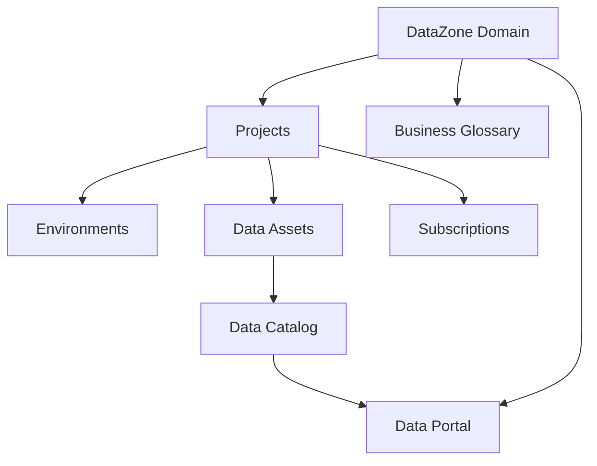

# How to Use Amazon DataZone for Data Governance

Author: [nawazdhandala](https://github.com/nawazdhandala)

Tags: AWS, DataZone, Data Governance, Data Catalog, Analytics

Description: A hands-on guide to setting up Amazon DataZone for data governance, covering domain creation, data portals, publishing and subscribing to data assets, and managing access across teams.

---

Data governance sounds like one of those things that only matters at huge enterprises, but even mid-size companies hit the point where nobody knows what data exists, who owns it, or whether it's safe to use. Amazon DataZone is AWS's answer to this problem. It provides a data catalog, a self-service portal for discovering and accessing data, and a governance layer for managing who can use what.

Think of DataZone as a marketplace for your organization's data. Data producers publish their datasets with descriptions and metadata, and data consumers browse, request access, and subscribe to the data they need. An approval workflow sits in the middle to ensure governance.

## Core Concepts

Before we dive into setup, here's how DataZone's concepts map together.



- **Domain**: The top-level container. Usually one per organization.
- **Projects**: Groups of people working together. Like teams.
- **Environments**: Technical configurations (Athena workgroups, Redshift connections).
- **Assets**: Published data (tables, files, dashboards).
- **Glossary**: Shared business terminology definitions.

## Step 1: Create a DataZone Domain

The domain is your governance boundary. Everything lives inside it.

```bash
# Create a DataZone domain
aws datazone create-domain \
  --name "my-company-data" \
  --description "Central data governance domain for all company data" \
  --domain-execution-role "arn:aws:iam::123456789012:role/DataZoneDomainRole"

# The response includes the domain ID - save it
# Example: dzd-abc123def456
```

You need an execution role for DataZone to manage resources on your behalf.

```bash
# Create the DataZone domain execution role
cat > datazone-trust.json << 'EOF'
{
  "Version": "2012-10-17",
  "Statement": [{
    "Effect": "Allow",
    "Principal": {
      "Service": "datazone.amazonaws.com"
    },
    "Action": "sts:AssumeRole",
    "Condition": {
      "StringEquals": {
        "aws:SourceAccount": "123456789012"
      }
    }
  }]
}
EOF

aws iam create-role \
  --role-name DataZoneDomainRole \
  --assume-role-policy-document file://datazone-trust.json

# Attach the managed policy
aws iam attach-role-policy \
  --role-name DataZoneDomainRole \
  --policy-arn arn:aws:iam::aws:policy/service-role/AmazonDataZoneDomainExecutionRolePolicy
```

## Step 2: Set Up the Data Portal

DataZone comes with a web-based data portal where users browse and request data. Enable SSO for your organization so users can log in with their existing credentials.

```bash
# Enable the data portal with IAM Identity Center (SSO)
aws datazone update-domain \
  --identifier dzd-abc123def456 \
  --single-sign-on '{
    "type": "IAM_IDC",
    "userAssignment": "AUTOMATIC"
  }'
```

## Step 3: Create Projects for Teams

Projects represent teams or workgroups. Each project has its own members, environments, and access controls.

```bash
# Create a project for the data engineering team
aws datazone create-project \
  --domain-identifier dzd-abc123def456 \
  --name "Data Engineering" \
  --description "Data engineering team - manages ETL pipelines and data lake"

# Create a project for the analytics team
aws datazone create-project \
  --domain-identifier dzd-abc123def456 \
  --name "Analytics" \
  --description "Business analytics team - dashboards and reporting"

# Create a project for data science
aws datazone create-project \
  --domain-identifier dzd-abc123def456 \
  --name "Data Science" \
  --description "ML and data science team"
```

Add members to projects.

```bash
# Add a member to the Data Engineering project
aws datazone create-project-membership \
  --domain-identifier dzd-abc123def456 \
  --project-identifier prj-eng123 \
  --member '{
    "userIdentifier": "user@mycompany.com"
  }' \
  --designation PROJECT_OWNER

# Add an analyst as a contributor
aws datazone create-project-membership \
  --domain-identifier dzd-abc123def456 \
  --project-identifier prj-analytics456 \
  --member '{
    "userIdentifier": "analyst@mycompany.com"
  }' \
  --designation PROJECT_CONTRIBUTOR
```

## Step 4: Create Environments

Environments connect DataZone to actual AWS analytics services. They define where data consumers will access the data.

```bash
# Create an Athena environment for the analytics project
aws datazone create-environment \
  --domain-identifier dzd-abc123def456 \
  --project-identifier prj-analytics456 \
  --name "Analytics Athena Environment" \
  --environment-profile-identifier "DefaultDataLake" \
  --description "Athena-based environment for querying the data lake"
```

## Step 5: Create a Business Glossary

A business glossary ensures everyone uses the same terminology. When someone says "revenue," does that include returns? Does "active user" mean logged in this month or this quarter?

```bash
# Create a glossary
aws datazone create-glossary \
  --domain-identifier dzd-abc123def456 \
  --owning-project-identifier prj-eng123 \
  --name "Business Terms" \
  --description "Standard business terminology definitions"

# Add glossary terms
aws datazone create-glossary-term \
  --domain-identifier dzd-abc123def456 \
  --glossary-identifier gls-abc123 \
  --name "Revenue" \
  --short-description "Total gross revenue before returns and refunds" \
  --long-description "Revenue represents the total amount billed to customers before any deductions for returns, refunds, or discounts. This includes one-time purchases and recurring subscription charges. It does NOT include tax."

aws datazone create-glossary-term \
  --domain-identifier dzd-abc123def456 \
  --glossary-identifier gls-abc123 \
  --name "Active User" \
  --short-description "User who performed at least one meaningful action in the past 30 days" \
  --long-description "An active user is defined as any registered user who has logged in AND performed at least one action (page view, purchase, or API call) within the trailing 30-day period. Bot accounts and service accounts are excluded."

aws datazone create-glossary-term \
  --domain-identifier dzd-abc123def456 \
  --glossary-identifier gls-abc123 \
  --name "Churn Rate" \
  --short-description "Percentage of customers who cancel within a billing period" \
  --long-description "Monthly churn rate is calculated as: (customers at start of month - customers at end of month) / customers at start of month * 100. Only applies to subscription customers. Trial users who never converted are excluded."
```

## Step 6: Publish Data Assets

Data producers publish their datasets to the catalog so others can discover them.

```bash
# Create a data source that connects to your Glue catalog
aws datazone create-data-source \
  --domain-identifier dzd-abc123def456 \
  --project-identifier prj-eng123 \
  --name "Data Lake Glue Catalog" \
  --type GLUE \
  --environment-identifier env-athena123 \
  --configuration '{
    "glueRunConfiguration": {
      "relationalFilterConfigurations": [{
        "databaseName": "analytics_db",
        "filterExpressions": [{
          "type": "INCLUDE",
          "expression": "*"
        }]
      }]
    }
  }' \
  --enable-setting ENABLED \
  --schedule '{
    "schedule": "cron(0 6 * * ? *)",
    "timezone": "UTC"
  }'

# Run the data source to discover assets
aws datazone start-data-source-run \
  --domain-identifier dzd-abc123def456 \
  --data-source-identifier ds-glue123
```

## Step 7: Subscribe to Data

When a consumer finds interesting data in the catalog, they request a subscription. The data owner approves or rejects the request.

```bash
# Create a subscription request (as a data consumer)
aws datazone create-subscription-request \
  --domain-identifier dzd-abc123def456 \
  --subscribed-principals '[{
    "project": {
      "identifier": "prj-analytics456"
    }
  }]' \
  --subscribed-listings '[{
    "identifier": "lst-customers123"
  }]' \
  --request-reason "Need customer data for quarterly business review dashboard"

# Accept the subscription request (as a data owner)
aws datazone accept-subscription-request \
  --domain-identifier dzd-abc123def456 \
  --identifier sr-request123 \
  --decision-comment "Approved for Q1 business review"
```

## Step 8: Search and Discover Data

The search API lets users find data programmatically (though most will use the portal).

```bash
# Search for data assets
aws datazone search \
  --domain-identifier dzd-abc123def456 \
  --search-scope ASSET \
  --search-text "customer revenue"

# Search with filters
aws datazone search \
  --domain-identifier dzd-abc123def456 \
  --search-scope ASSET \
  --search-text "orders" \
  --filters '{
    "and": [
      {
        "filter": {
          "attribute": "owningProjectId",
          "value": "prj-eng123"
        }
      }
    ]
  }'
```

## Monitoring Governance

Track data access patterns and governance compliance.

```bash
# List all subscriptions in a domain
aws datazone list-subscriptions \
  --domain-identifier dzd-abc123def456 \
  --status APPROVED

# List subscription requests that are pending
aws datazone list-subscription-requests \
  --domain-identifier dzd-abc123def456 \
  --status PENDING
```

DataZone integrates with CloudTrail for audit logging, so every data access request, approval, and subscription is tracked. For alerting on governance events, set up [CloudWatch monitoring](https://oneuptime.com/blog/post/2026-02-12-set-up-cloudwatch-alarms-for-ec2-cpu-and-memory/view) to notify you when subscription requests pile up or data source runs fail.

DataZone won't solve all your governance problems overnight, but it gives you the framework to manage data access at scale. Start with a single domain, get one team publishing and subscribing successfully, then expand from there.
