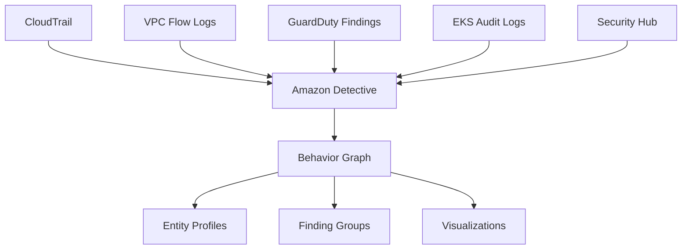

# How to Use Amazon Detective for Security Investigation

Author: [nawazdhandala](https://github.com/nawazdhandala)

Tags: AWS, Amazon Detective, Security, Investigation

Description: Guide to using Amazon Detective for security investigations, covering setup, behavior analysis, finding correlation, VPC flow log analysis, and integration with GuardDuty and Security Hub.

---

When a security alert fires, the clock starts ticking. You need to figure out what happened, what's affected, and how to contain it - fast. The problem is that the data you need is scattered across CloudTrail logs, VPC Flow Logs, GuardDuty findings, and dozens of other sources. Correlating this data manually under pressure is slow and error-prone.

Amazon Detective does the correlation for you. It automatically ingests security data from across your AWS environment, builds a graph model of relationships between resources, and provides visualizations that let you investigate findings in minutes instead of hours.

## What Detective Analyzes

Detective automatically ingests and analyzes:

- **AWS CloudTrail logs**: API calls across your account
- **Amazon VPC Flow Logs**: Network traffic patterns
- **Amazon GuardDuty findings**: Threat detection alerts
- **Amazon EKS audit logs**: Kubernetes API activity
- **AWS Security Hub findings**: Aggregated security alerts



## Enabling Detective

Detective needs to be enabled and given time to build its behavior graph. The graph improves over two weeks as it establishes baseline behavior.

```bash
# Enable Amazon Detective
aws detective create-graph \
    --tags '{"Environment": "production"}'

# Get your graph ARN
aws detective list-graphs
```

Detective automatically starts ingesting data from CloudTrail and VPC Flow Logs. If you're using GuardDuty (and you should be), its findings are also ingested.

### Prerequisites

Before enabling Detective:

- GuardDuty must be enabled (Detective uses its findings)
- CloudTrail must be enabled (it is by default)
- VPC Flow Logs should be enabled for your VPCs

```bash
# Verify GuardDuty is enabled
aws guardduty list-detectors

# Enable VPC Flow Logs if not already
aws ec2 create-flow-logs \
    --resource-type VPC \
    --resource-ids vpc-abc123 \
    --traffic-type ALL \
    --log-destination-type cloud-watch-logs \
    --log-group-name "vpc-flow-logs" \
    --deliver-logs-permission-arn "arn:aws:iam::123456789:role/VPCFlowLogsRole"
```

## Multi-Account Setup

For organizations, enable Detective across all accounts using the administrator account.

```bash
# From the administrator account, invite member accounts
aws detective create-members \
    --graph-arn "arn:aws:detective:us-east-1:123456789:graph:abc123" \
    --accounts '[
        {"AccountId": "111111111111", "EmailAddress": "security@member1.example.com"},
        {"AccountId": "222222222222", "EmailAddress": "security@member2.example.com"}
    ]'
```

Member accounts need to accept the invitation.

```bash
# From the member account
aws detective accept-invitation \
    --graph-arn "arn:aws:detective:us-east-1:123456789:graph:abc123"
```

## Investigating a GuardDuty Finding

The most common workflow is investigating a GuardDuty finding. When GuardDuty detects something suspicious, Detective provides the context to understand it.

### Example: Unusual API Call

GuardDuty fires `Recon:IAMUser/MaliciousIPCaller`. An IAM user made API calls from a known malicious IP.

```python
# investigate.py - Programmatic investigation with Detective
import boto3
from datetime import datetime, timedelta

detective = boto3.client('detective', region_name='us-east-1')

GRAPH_ARN = "arn:aws:detective:us-east-1:123456789:graph:abc123"

def investigate_iam_user(username, hours_back=24):
    """Investigate an IAM user's recent activity."""

    # Get the entity profile for the IAM user
    # This shows baseline behavior vs recent activity

    end_time = datetime.utcnow()
    start_time = end_time - timedelta(hours=hours_back)

    # List indicators for the entity
    response = detective.list_indicators(
        GraphArn=GRAPH_ARN,
        InvestigationId="inv-abc123",  # From the finding
        MaxResults=50
    )

    for indicator in response.get('Indicators', []):
        print(f"Type: {indicator['IndicatorType']}")
        detail = indicator.get('IndicatorDetail', {})
        print(f"Detail: {detail}")
        print("---")

def get_finding_details(finding_arn):
    """Get detailed investigation data for a GuardDuty finding."""
    response = detective.get_investigation(
        GraphArn=GRAPH_ARN,
        InvestigationId="inv-abc123"
    )

    print(f"Status: {response['Status']}")
    print(f"Severity: {response['Severity']}")
    print(f"Entity: {response['EntityArn']}")
    print(f"Created: {response['CreatedTime']}")

investigate_iam_user("compromised-user")
```

## Understanding the Behavior Graph

Detective's behavior graph connects entities (IAM users, EC2 instances, IP addresses, S3 buckets) through observed relationships. This is what makes investigation fast - you can see at a glance who accessed what, from where, and when.

### Entity Types

- **AWS accounts**: Which accounts are involved
- **IAM users and roles**: Who performed actions
- **EC2 instances**: Which instances were involved
- **IP addresses**: Source of API calls and network connections
- **S3 buckets**: Data access patterns
- **EKS clusters**: Kubernetes activity

### Relationship Types

- IAM user assumed role X
- EC2 instance communicated with IP address Y
- IAM role accessed S3 bucket Z
- API calls originated from IP address W

## Common Investigation Scenarios

### Compromised Credentials

When GuardDuty detects `UnauthorizedAccess:IAMUser/MaliciousIPCaller`:

1. Open the finding in Detective
2. Check the IAM user's profile - compare recent API calls to baseline
3. Look at IP addresses - are they from expected locations?
4. Check what resources were accessed
5. Look for lateral movement - did the user assume other roles?

```bash
# Get recent API activity for the investigation
# Detective provides this through its console visualizations
# For programmatic access:
aws detective start-investigation \
    --graph-arn "arn:aws:detective:us-east-1:123456789:graph:abc123" \
    --entity-arn "arn:aws:iam::123456789:user/suspicious-user" \
    --scope-start-time "2026-02-11T00:00:00Z" \
    --scope-end-time "2026-02-12T00:00:00Z"
```

### Cryptocurrency Mining

When GuardDuty detects `CryptoCurrency:EC2/BitcoinTool.B`:

1. Open the finding in Detective
2. Check the EC2 instance's network profile - look for connections to mining pools
3. Look at who launched or modified the instance
4. Check if other instances have similar patterns
5. Identify the initial compromise vector

### Data Exfiltration

When unusual data transfer patterns are detected:

1. Check VPC Flow Log analysis for the source instance
2. Look at destination IPs - are they known data exfiltration endpoints?
3. Check the volume of data transferred compared to baseline
4. Identify which IAM credentials were used to access the data
5. Trace back to how the credentials were obtained

## Working with Finding Groups

Detective automatically groups related findings that may be part of the same security incident.

```python
# finding_groups.py - Work with finding groups
def list_finding_groups():
    """List finding groups that Detective has identified."""
    response = detective.list_investigations(
        GraphArn=GRAPH_ARN,
        FilterCriteria={
            'Severity': {
                'Value': 'CRITICAL'
            },
            'Status': {
                'Value': 'RUNNING'
            }
        }
    )

    for investigation in response.get('InvestigationDetails', []):
        print(f"Investigation: {investigation['InvestigationId']}")
        print(f"  Entity: {investigation['EntityArn']}")
        print(f"  Severity: {investigation['Severity']}")
        print(f"  Status: {investigation['Status']}")
        print(f"  Created: {investigation['CreatedTime']}")
        print()
```

Finding groups help you see the bigger picture. What looks like isolated events - a login from a new IP, an unusual API call, increased data transfer - might be stages of a coordinated attack.

## VPC Flow Log Analysis

Detective's network analysis shows communication patterns for your EC2 instances.

Key things to look for:

- **New destinations**: Connections to IP addresses not seen in the baseline period
- **Port anomalies**: Communication on unusual ports
- **Volume spikes**: Significant increase in data transfer
- **Protocol changes**: Unexpected protocol usage

```python
# Analyze network patterns for an instance
def check_network_anomalies(instance_id):
    """Check for network anomalies on an EC2 instance."""
    response = detective.list_indicators(
        GraphArn=GRAPH_ARN,
        InvestigationId="inv-abc123",
        IndicatorType="SUSPICIOUS_NETWORK"
    )

    for indicator in response.get('Indicators', []):
        detail = indicator.get('IndicatorDetail', {})
        if 'TTPsObservedDetail' in detail:
            ttp = detail['TTPsObservedDetail']
            print(f"TTP: {ttp.get('Tactic')} / {ttp.get('Technique')}")
            print(f"  Observed: {ttp.get('Procedure')}")
```

## Automating Investigation Response

Combine Detective with Lambda for automated initial triage.

```python
# auto_triage.py - Automated security investigation triage
import boto3
import json

detective = boto3.client('detective')
sns = boto3.client('sns')

def lambda_handler(event, context):
    """Triggered by GuardDuty finding via EventBridge."""
    finding = event['detail']
    severity = finding['severity']
    finding_type = finding['type']

    # Start an investigation in Detective
    investigation = detective.start_investigation(
        GraphArn=GRAPH_ARN,
        EntityArn=finding['resource']['instanceDetails']['instanceId'],
        ScopeStartTime=finding['createdAt'],
        ScopeEndTime=finding['updatedAt']
    )

    # For critical findings, notify immediately
    if severity >= 7:
        sns.publish(
            TopicArn='arn:aws:sns:us-east-1:123456789:security-critical',
            Subject=f'Critical Security Finding: {finding_type}',
            Message=json.dumps({
                'finding_type': finding_type,
                'severity': severity,
                'investigation_id': investigation['InvestigationId'],
                'console_link': f"https://console.aws.amazon.com/detective/home?region=us-east-1#investigations/{investigation['InvestigationId']}"
            }, indent=2)
        )

    return {
        'investigation_id': investigation['InvestigationId'],
        'severity': severity
    }
```

Set up the EventBridge rule to trigger this.

```bash
# Create EventBridge rule for GuardDuty findings
aws events put-rule \
    --name "guardduty-to-detective" \
    --event-pattern '{
        "source": ["aws.guardduty"],
        "detail-type": ["GuardDuty Finding"],
        "detail": {
            "severity": [{"numeric": [">=", 4]}]
        }
    }'

aws events put-targets \
    --rule "guardduty-to-detective" \
    --targets '[{
        "Id": "auto-triage",
        "Arn": "arn:aws:lambda:us-east-1:123456789:function:auto-triage"
    }]'
```

## Cost Considerations

Detective pricing is based on the volume of data ingested:

- CloudTrail events
- VPC Flow Log records
- GuardDuty findings
- EKS audit logs

The first 30 days are free. After that, costs scale with data volume. For most accounts, it's a few hundred dollars per month - well worth it compared to the cost of a prolonged security incident.

## Best Practices

**Enable Detective in all regions** where you have resources. An attacker will find and exploit resources in regions you're not monitoring.

**Integrate with your incident response process.** Detective should be the first tool your security team opens when investigating a finding.

**Let the behavior graph mature.** Detective needs two weeks to establish good baselines. Don't overreact to findings during the initial period.

**Use finding groups for context.** Individual findings tell part of the story. Finding groups show the full attack chain.

**Automate initial triage.** Not every finding needs immediate human attention. Use Lambda to categorize and route findings based on severity and type.

## Wrapping Up

Amazon Detective turns security investigation from a multi-hour log-crawling exercise into a guided analysis workflow. The behavior graph automatically correlates data from CloudTrail, VPC Flow Logs, and GuardDuty, so you can focus on understanding the incident rather than finding the data.

Start by enabling Detective and letting it build its behavior graph. When the next GuardDuty finding fires, use Detective to investigate instead of manually querying logs. The time savings during an actual incident are substantial.
