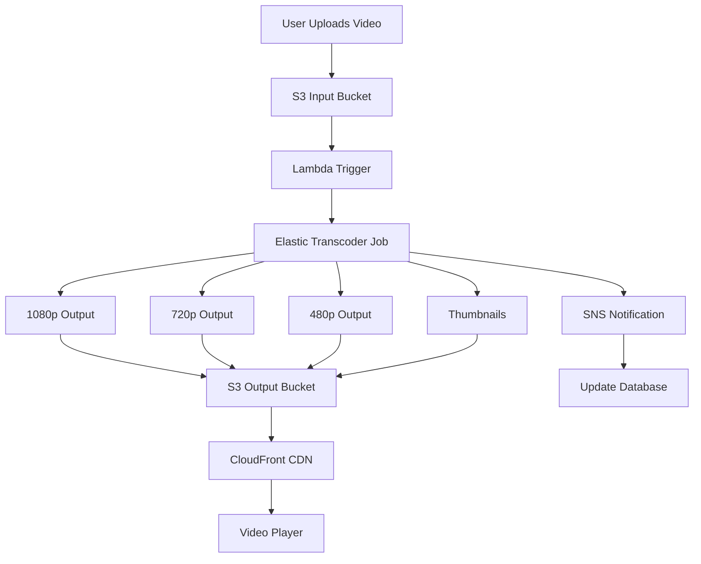

# How to Use Amazon Elastic Transcoder for Video Conversion

Author: [nawazdhandala](https://github.com/nawazdhandala)

Tags: AWS, Elastic Transcoder, Video, Media Processing, Transcoding, S3

Description: Learn how to use Amazon Elastic Transcoder to convert video files between formats and optimize them for playback on different devices and platforms.

---

Video content comes in all shapes and sizes. A video uploaded by a user might be a 4K MOV file from an iPhone, a 1080p AVI from a screen recorder, or a 720p MKV from a game capture tool. To deliver these videos reliably across devices, you need to transcode them into standard formats at multiple quality levels. Amazon Elastic Transcoder handles this by converting videos stored in S3 into formats optimized for playback on web, mobile, and TV platforms.

This guide covers setting up Elastic Transcoder pipelines, creating transcoding jobs, using presets for common output formats, and building automated transcoding workflows.

## What Is Amazon Elastic Transcoder?

Elastic Transcoder is a managed media transcoding service. You give it a video file in S3, tell it what output format and quality you want, and it produces the transcoded output in S3. It handles:

- Format conversion (MP4, WebM, MPEG-TS, FLV, etc.)
- Resolution scaling (4K down to mobile-friendly sizes)
- Bitrate optimization
- Audio transcoding
- Thumbnail generation
- HLS segmentation for adaptive streaming
- Watermarking and captioning

## When to Use Elastic Transcoder vs. MediaConvert

AWS offers two transcoding services. Here is when to use each:

| Feature | Elastic Transcoder | MediaConvert |
|---------|-------------------|--------------|
| Complexity | Simple | Full-featured |
| Pricing | Per minute of output | Per minute of output |
| Codec support | H.264, VP8, VP9 | H.264, H.265/HEVC, VP8, VP9, AV1 |
| DRM | Limited | Full (SPEKE) |
| HDR | No | Yes |
| Best for | Simple transcoding, HLS output | Professional broadcast workflows |

Elastic Transcoder is the simpler option. If you need H.265, HDR, or advanced DRM, use MediaConvert instead.

## Prerequisites

- An AWS account with Elastic Transcoder permissions
- S3 buckets for input and output files
- Video files uploaded to your input S3 bucket

## Step 1: Create a Pipeline

A pipeline connects your input S3 bucket, output S3 bucket, and IAM role:

```bash
# Create a transcoding pipeline
aws elastictranscoder create-pipeline \
  --name "video-processing" \
  --input-bucket "my-video-uploads-123456789012" \
  --output-bucket "my-video-outputs-123456789012" \
  --role "arn:aws:iam::123456789012:role/ElasticTranscoderRole" \
  --notifications '{
    "Progressing": "arn:aws:sns:us-east-1:123456789012:transcoder-progress",
    "Completed": "arn:aws:sns:us-east-1:123456789012:transcoder-completed",
    "Warning": "arn:aws:sns:us-east-1:123456789012:transcoder-warnings",
    "Error": "arn:aws:sns:us-east-1:123456789012:transcoder-errors"
  }'
```

Create the IAM role:

```json
{
  "Version": "2012-10-17",
  "Statement": [
    {
      "Effect": "Allow",
      "Action": [
        "s3:GetObject",
        "s3:ListBucket"
      ],
      "Resource": [
        "arn:aws:s3:::my-video-uploads-123456789012",
        "arn:aws:s3:::my-video-uploads-123456789012/*"
      ]
    },
    {
      "Effect": "Allow",
      "Action": [
        "s3:PutObject",
        "s3:ListBucket"
      ],
      "Resource": [
        "arn:aws:s3:::my-video-outputs-123456789012",
        "arn:aws:s3:::my-video-outputs-123456789012/*"
      ]
    },
    {
      "Effect": "Allow",
      "Action": "sns:Publish",
      "Resource": "arn:aws:sns:us-east-1:123456789012:transcoder-*"
    }
  ]
}
```

## Step 2: Understand System Presets

Elastic Transcoder comes with system presets for common output formats. Here are the most useful ones:

| Preset ID | Description |
|-----------|-------------|
| 1351620000001-000001 | Generic 1080p |
| 1351620000001-000010 | Generic 720p |
| 1351620000001-000020 | Generic 480p 16:9 |
| 1351620000001-000030 | Generic 480p 4:3 |
| 1351620000001-000040 | Generic 360p 16:9 |
| 1351620000001-000061 | Full HD 1080i |
| 1351620000001-200010 | HLS 2M |
| 1351620000001-200020 | HLS 1.5M |
| 1351620000001-200030 | HLS 1M |
| 1351620000001-200040 | HLS 600K |
| 1351620000001-200050 | HLS 400K |

```bash
# List all available system presets
aws elastictranscoder list-presets \
  --query 'Presets[?Type==`System`].{Id:Id,Name:Name,Description:Description}'
```

## Step 3: Create a Simple Transcoding Job

Convert a video to 720p MP4:

```bash
# Create a transcoding job
aws elastictranscoder create-job \
  --pipeline-id "1234567890123-abcdef" \
  --input '{
    "Key": "uploads/raw-video.mov",
    "FrameRate": "auto",
    "Resolution": "auto",
    "AspectRatio": "auto",
    "Interlaced": "auto",
    "Container": "auto"
  }' \
  --output '{
    "Key": "processed/video-720p.mp4",
    "PresetId": "1351620000001-000010",
    "ThumbnailPattern": "processed/thumbnails/video-{count}",
    "Rotate": "auto"
  }'
```

## Step 4: Create Multi-Output Jobs

For adaptive bitrate streaming, create a job with multiple outputs:

```bash
# Create a job with multiple output resolutions
aws elastictranscoder create-job \
  --pipeline-id "1234567890123-abcdef" \
  --input '{
    "Key": "uploads/raw-video.mov",
    "FrameRate": "auto",
    "Resolution": "auto",
    "AspectRatio": "auto",
    "Interlaced": "auto",
    "Container": "auto"
  }' \
  --outputs '[
    {
      "Key": "processed/video-1080p.mp4",
      "PresetId": "1351620000001-000001",
      "ThumbnailPattern": "processed/thumbnails/1080p-{count}",
      "Rotate": "auto"
    },
    {
      "Key": "processed/video-720p.mp4",
      "PresetId": "1351620000001-000010",
      "Rotate": "auto"
    },
    {
      "Key": "processed/video-480p.mp4",
      "PresetId": "1351620000001-000020",
      "Rotate": "auto"
    },
    {
      "Key": "processed/video-360p.mp4",
      "PresetId": "1351620000001-000040",
      "Rotate": "auto"
    }
  ]'
```

## Step 5: Create HLS Adaptive Bitrate Output

For HTTP Live Streaming (HLS), use the HLS presets with a playlist:

```bash
# Create an HLS transcoding job with adaptive bitrate
aws elastictranscoder create-job \
  --pipeline-id "1234567890123-abcdef" \
  --input '{
    "Key": "uploads/raw-video.mov",
    "FrameRate": "auto",
    "Resolution": "auto",
    "AspectRatio": "auto",
    "Interlaced": "auto",
    "Container": "auto"
  }' \
  --outputs '[
    {
      "Key": "hls/video-2m",
      "PresetId": "1351620000001-200010",
      "SegmentDuration": "6"
    },
    {
      "Key": "hls/video-1.5m",
      "PresetId": "1351620000001-200020",
      "SegmentDuration": "6"
    },
    {
      "Key": "hls/video-1m",
      "PresetId": "1351620000001-200030",
      "SegmentDuration": "6"
    },
    {
      "Key": "hls/video-600k",
      "PresetId": "1351620000001-200040",
      "SegmentDuration": "6"
    }
  ]' \
  --playlists '[
    {
      "Format": "HLSv3",
      "Name": "hls/master-playlist",
      "OutputKeys": [
        "hls/video-2m",
        "hls/video-1.5m",
        "hls/video-1m",
        "hls/video-600k"
      ]
    }
  ]'
```

The master playlist is what your video player loads. It lists all available quality levels, and the player automatically switches between them based on the viewer's bandwidth.

## Step 6: Create Custom Presets

When the system presets do not meet your needs, create custom ones:

```bash
# Create a custom preset for social media vertical video
aws elastictranscoder create-preset \
  --name "Social-Vertical-1080" \
  --description "1080x1920 vertical video for social media" \
  --container "mp4" \
  --video '{
    "Codec": "H.264",
    "CodecOptions": {
      "Profile": "high",
      "Level": "4.1",
      "MaxReferenceFrames": "3",
      "InterlacedMode": "Progressive"
    },
    "KeyframesMaxDist": "90",
    "FixedGOP": "true",
    "BitRate": "5000",
    "FrameRate": "30",
    "MaxWidth": "1080",
    "MaxHeight": "1920",
    "SizingPolicy": "ShrinkToFit",
    "PaddingPolicy": "NoPad",
    "DisplayAspectRatio": "9:16"
  }' \
  --audio '{
    "Codec": "AAC",
    "SampleRate": "44100",
    "BitRate": "128",
    "Channels": "2"
  }' \
  --thumbnails '{
    "Format": "png",
    "Interval": "30",
    "MaxWidth": "540",
    "MaxHeight": "960",
    "SizingPolicy": "ShrinkToFit",
    "PaddingPolicy": "NoPad"
  }'
```

## Step 7: Automate Transcoding with Lambda

Set up automatic transcoding when videos are uploaded to S3:

```python
# Lambda function triggered by S3 uploads
import boto3
import os
import json

transcoder = boto3.client('elastictranscoder')

PIPELINE_ID = os.environ['PIPELINE_ID']

# Presets for different output qualities
PRESETS = {
    '1080p': '1351620000001-000001',
    '720p': '1351620000001-000010',
    '480p': '1351620000001-000020',
}

def lambda_handler(event, context):
    """Automatically transcode videos uploaded to S3."""

    for record in event['Records']:
        bucket = record['s3']['bucket']['name']
        key = record['s3']['object']['key']

        # Only process files in the uploads/ prefix
        if not key.startswith('uploads/'):
            continue

        # Extract the filename without extension
        filename = os.path.splitext(os.path.basename(key))[0]

        # Build outputs for each quality level
        outputs = []
        for quality, preset_id in PRESETS.items():
            outputs.append({
                'Key': f'processed/{filename}/{filename}-{quality}.mp4',
                'PresetId': preset_id,
                'ThumbnailPattern': f'processed/{filename}/thumbnails/{quality}-{{count}}',
                'Rotate': 'auto'
            })

        # Create the transcoding job
        response = transcoder.create_job(
            PipelineId=PIPELINE_ID,
            Input={
                'Key': key,
                'FrameRate': 'auto',
                'Resolution': 'auto',
                'AspectRatio': 'auto',
                'Interlaced': 'auto',
                'Container': 'auto'
            },
            Outputs=outputs
        )

        job_id = response['Job']['Id']
        print(f"Created transcoding job {job_id} for {key}")

    return {
        'statusCode': 200,
        'body': json.dumps('Transcoding jobs created')
    }
```

Set up the S3 trigger:

```bash
# Add S3 notification to trigger Lambda on file upload
aws s3api put-bucket-notification-configuration \
  --bucket my-video-uploads-123456789012 \
  --notification-configuration '{
    "LambdaFunctionConfigurations": [
      {
        "LambdaFunctionArn": "arn:aws:lambda:us-east-1:123456789012:function:auto-transcode",
        "Events": ["s3:ObjectCreated:*"],
        "Filter": {
          "Key": {
            "FilterRules": [
              {"Name": "prefix", "Value": "uploads/"},
              {"Name": "suffix", "Value": ".mp4"}
            ]
          }
        }
      }
    ]
  }'
```

## Transcoding Workflow



## Step 8: Monitor Transcoding Jobs

Track job progress and handle failures:

```python
# Check transcoding job status
import boto3

transcoder = boto3.client('elastictranscoder')

def check_job_status(job_id):
    """Check the status of a transcoding job."""
    response = transcoder.read_job(Id=job_id)
    job = response['Job']

    print(f"Job ID: {job['Id']}")
    print(f"Status: {job['Status']}")
    print(f"Pipeline: {job['PipelineId']}")

    for output in job['Outputs']:
        print(f"  Output: {output['Key']}")
        print(f"  Status: {output['Status']}")
        if output.get('StatusDetail'):
            print(f"  Detail: {output['StatusDetail']}")
        if output.get('Duration'):
            print(f"  Duration: {output['Duration']}s")

    return job['Status']
```

## Handling Notifications

Process SNS notifications for job completion:

```python
# Lambda function to handle transcoding completion notifications
import json
import boto3

dynamodb = boto3.resource('dynamodb')
table = dynamodb.Table('video-metadata')

def lambda_handler(event, context):
    """Process Elastic Transcoder SNS notifications."""

    for record in event['Records']:
        message = json.loads(record['Sns']['Message'])

        job_id = message['jobId']
        state = message['state']
        input_key = message['input']['key']

        if state == 'COMPLETED':
            # Update the database with output locations
            outputs = []
            for output in message['outputs']:
                outputs.append({
                    'key': output['key'],
                    'duration': output.get('duration', 0),
                    'width': output.get('width', 0),
                    'height': output.get('height', 0)
                })

            table.update_item(
                Key={'videoId': input_key},
                UpdateExpression='SET #s = :status, outputs = :outputs, transcodedAt = :ts',
                ExpressionAttributeNames={'#s': 'status'},
                ExpressionAttributeValues={
                    ':status': 'ready',
                    ':outputs': outputs,
                    ':ts': message['jobId']
                }
            )
            print(f"Video {input_key} transcoded successfully with {len(outputs)} outputs")

        elif state == 'ERROR':
            print(f"Transcoding failed for {input_key}: {message.get('errorCode', 'Unknown')}")
            table.update_item(
                Key={'videoId': input_key},
                UpdateExpression='SET #s = :status, errorMessage = :err',
                ExpressionAttributeNames={'#s': 'status'},
                ExpressionAttributeValues={
                    ':status': 'failed',
                    ':err': message.get('messageDetails', 'Unknown error')
                }
            )
```

## Best Practices

1. **Use auto settings for input.** Set FrameRate, Resolution, AspectRatio, and Container to "auto". Elastic Transcoder detects these from the input file.

2. **Generate multiple output sizes.** Always produce at least 3 quality levels (1080p, 720p, 480p) so viewers on slow connections still get a good experience.

3. **Use HLS for web delivery.** HLS with adaptive bitrate switching gives viewers the best experience. The player automatically selects the right quality.

4. **Generate thumbnails.** Include thumbnail generation in every job. Thumbnails are essential for video galleries and previews.

5. **Set up notifications.** Use SNS notifications to track job completion and update your application's database automatically.

6. **Validate input files.** Check file size and format before submitting to Elastic Transcoder. Invalid inputs waste processing time and money.

## Wrapping Up

Amazon Elastic Transcoder provides a straightforward way to convert videos for multi-device delivery without managing encoding infrastructure. The combination of system presets for common formats, custom presets for specific needs, and S3-triggered automation means you can build a complete video processing pipeline that scales automatically with your upload volume. Start with the system presets and the Lambda automation pattern, and customize from there as your requirements evolve.
