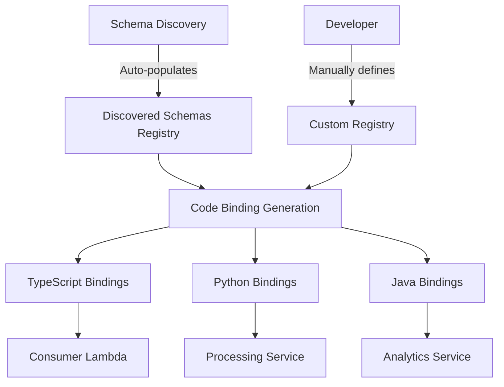

# How to Use Amazon EventBridge Schema Registry

Author: [nawazdhandala](https://github.com/nawazdhandala)

Tags: AWS, EventBridge, Schema Registry, Event-Driven Architecture, Serverless

Description: A practical guide to using Amazon EventBridge Schema Registry for managing, versioning, and sharing event schemas across your applications.

---

Event-driven architectures are powerful, but they introduce a coordination challenge: every producer and consumer needs to agree on the shape of events. Without a central place to define and share those shapes, teams drift apart, events break consumers, and debugging becomes a nightmare. Amazon EventBridge Schema Registry is the answer to this problem. It gives you a centralized, versioned repository of event schemas that your entire organization can reference.

This guide walks through creating custom registries, managing schemas, generating code bindings, and integrating the registry into your development workflow.

## What Is the EventBridge Schema Registry?

The Schema Registry is a component of Amazon EventBridge that stores JSON Schema definitions for your events. It comes with two built-in registries:

- **aws.events** - Contains schemas for all AWS service events (S3, EC2, etc.)
- **discovered-schemas** - Populated automatically when you enable schema discovery

You can also create custom registries to organize schemas by team, domain, or application. Each schema in a registry can have multiple versions, giving you a history of how event structures evolve.

If you are new to schema discovery, check out our guide on [setting up EventBridge Schema Discovery](https://oneuptime.com/blog/post/2026-02-12-set-up-amazon-eventbridge-schema-discovery/view) first.

## Prerequisites

- AWS account with IAM permissions for EventBridge Schemas
- AWS CLI v2 configured with appropriate credentials
- Familiarity with JSON Schema basics (helpful but not required)

## Step 1: Create a Custom Schema Registry

While the built-in registries are useful, you will want custom registries for your own application events. This keeps things organized and lets you control access with IAM policies.

```bash
# Create a custom registry for your order processing domain
aws schemas create-registry \
  --registry-name "order-processing" \
  --description "Schemas for order processing events"
```

You can create as many registries as you need. A common pattern is one registry per bounded context or domain in your architecture.

## Step 2: Define and Register a Schema

Now let us add a schema to our new registry. You define schemas using JSON Schema (Draft 4) or the OpenAPI 3.0 schema format.

```bash
# Register an OrderCreated event schema
aws schemas create-schema \
  --registry-name "order-processing" \
  --schema-name "OrderCreated" \
  --type "JSONSchemaDraft4" \
  --content '{
    "openapi": "3.0.0",
    "info": {
      "title": "OrderCreated",
      "version": "1.0.0"
    },
    "paths": {},
    "components": {
      "schemas": {
        "OrderCreated": {
          "type": "object",
          "required": ["orderId", "customerId", "amount"],
          "properties": {
            "orderId": {
              "type": "string",
              "description": "Unique order identifier"
            },
            "customerId": {
              "type": "string",
              "description": "Customer who placed the order"
            },
            "amount": {
              "type": "number",
              "description": "Total order amount"
            },
            "currency": {
              "type": "string",
              "default": "USD"
            },
            "items": {
              "type": "array",
              "items": {
                "type": "object",
                "properties": {
                  "sku": {"type": "string"},
                  "quantity": {"type": "integer"}
                }
              }
            }
          }
        }
      }
    }
  }'
```

## Step 3: Update a Schema (Versioning)

When your event structure changes, update the schema. EventBridge automatically creates a new version:

```bash
# Update the schema to add a shippingAddress field
aws schemas update-schema \
  --registry-name "order-processing" \
  --schema-name "OrderCreated" \
  --type "JSONSchemaDraft4" \
  --content '{
    "openapi": "3.0.0",
    "info": {
      "title": "OrderCreated",
      "version": "2.0.0"
    },
    "paths": {},
    "components": {
      "schemas": {
        "OrderCreated": {
          "type": "object",
          "required": ["orderId", "customerId", "amount"],
          "properties": {
            "orderId": {"type": "string"},
            "customerId": {"type": "string"},
            "amount": {"type": "number"},
            "currency": {"type": "string", "default": "USD"},
            "shippingAddress": {
              "type": "object",
              "properties": {
                "street": {"type": "string"},
                "city": {"type": "string"},
                "state": {"type": "string"},
                "zip": {"type": "string"}
              }
            },
            "items": {
              "type": "array",
              "items": {
                "type": "object",
                "properties": {
                  "sku": {"type": "string"},
                  "quantity": {"type": "integer"}
                }
              }
            }
          }
        }
      }
    }
  }'
```

List all versions to see the history:

```bash
# List all versions of the OrderCreated schema
aws schemas list-schema-versions \
  --registry-name "order-processing" \
  --schema-name "OrderCreated"
```

## Step 4: Generate Code Bindings

This is where the Schema Registry really pays off. Instead of writing event model classes by hand, generate them from the schema:

```bash
# Request code binding generation for TypeScript
aws schemas put-code-binding \
  --registry-name "order-processing" \
  --schema-name "OrderCreated" \
  --language "TypeScript3"

# Check the status of code binding generation
aws schemas describe-code-binding \
  --registry-name "order-processing" \
  --schema-name "OrderCreated" \
  --language "TypeScript3"

# Download the generated code once ready
aws schemas get-code-binding-source \
  --registry-name "order-processing" \
  --schema-name "OrderCreated" \
  --language "TypeScript3" \
  bindings.zip
```

Supported languages include Python36, Java8, TypeScript3, and Go1. The generated code includes typed event classes, marshalling logic, and sometimes helper functions for creating events.

## Step 5: Search and Browse Schemas

As your registry grows, you need to find schemas quickly:

```bash
# Search for schemas by keyword across all registries
aws schemas search-schemas \
  --keywords "Order"

# List all schemas in a specific registry
aws schemas list-schemas \
  --registry-name "order-processing"

# Get full details of a specific schema version
aws schemas describe-schema \
  --registry-name "order-processing" \
  --schema-name "OrderCreated" \
  --schema-version "2"
```

## Step 6: Export and Share Schemas

You can export schemas for use in other tools, documentation generators, or validation libraries:

```bash
# Export a schema and save it to a file
aws schemas describe-schema \
  --registry-name "order-processing" \
  --schema-name "OrderCreated" \
  --query 'Content' \
  --output text > order-created-schema.json
```

This exported schema can be used with any JSON Schema-compatible validation library in your application code.

## Architecture: Schema Registry in Your Workflow

Here is how the Schema Registry fits into a typical development workflow:



## Managing Registry Access with IAM

In a multi-team organization, you want to control who can read and write schemas. Use IAM policies to grant fine-grained access:

```json
{
  "Version": "2012-10-17",
  "Statement": [
    {
      "Effect": "Allow",
      "Action": [
        "schemas:DescribeSchema",
        "schemas:ListSchemas",
        "schemas:SearchSchemas",
        "schemas:GetCodeBindingSource"
      ],
      "Resource": "arn:aws:schemas:us-east-1:123456789012:schema/order-processing/*"
    },
    {
      "Effect": "Allow",
      "Action": [
        "schemas:CreateSchema",
        "schemas:UpdateSchema"
      ],
      "Resource": "arn:aws:schemas:us-east-1:123456789012:schema/order-processing/*",
      "Condition": {
        "StringEquals": {
          "aws:PrincipalTag/Team": "order-team"
        }
      }
    }
  ]
}
```

This policy lets anyone read schemas from the order-processing registry but restricts writes to the order team.

## CloudFormation Template

For infrastructure as code, here is a complete CloudFormation setup:

```yaml
# CloudFormation template for Schema Registry resources
AWSTemplateFormatVersion: '2010-09-09'

Resources:
  OrderProcessingRegistry:
    Type: AWS::EventSchemas::Registry
    Properties:
      RegistryName: order-processing
      Description: Schemas for order processing domain

  OrderCreatedSchema:
    Type: AWS::EventSchemas::Schema
    Properties:
      RegistryName: !Ref OrderProcessingRegistry
      SchemaName: OrderCreated
      Type: JSONSchemaDraft4
      Content: |
        {
          "openapi": "3.0.0",
          "info": {"title": "OrderCreated", "version": "1.0.0"},
          "paths": {},
          "components": {
            "schemas": {
              "OrderCreated": {
                "type": "object",
                "required": ["orderId", "customerId", "amount"],
                "properties": {
                  "orderId": {"type": "string"},
                  "customerId": {"type": "string"},
                  "amount": {"type": "number"}
                }
              }
            }
          }
        }
```

## Best Practices

1. **One registry per domain.** Keep schemas grouped by business domain rather than by team. This makes it easier for consumers to find the schemas they need.

2. **Treat schemas as contracts.** When you change a schema, think of it as changing an API contract. Avoid removing required fields or changing types on existing fields.

3. **Use schema discovery in staging.** Let discovery populate schemas from real traffic, then promote the stable ones to a curated custom registry.

4. **Automate code binding generation.** Include code binding generation in your CI/CD pipeline so that consumer services always have up-to-date typed models.

5. **Tag your schemas.** Use AWS tags on registries and schemas to track ownership, cost allocation, and lifecycle stage.

## Wrapping Up

The EventBridge Schema Registry brings order to the chaos of event-driven development. By centralizing your event definitions, versioning them automatically, and generating code bindings on demand, it removes the friction of keeping producers and consumers in sync. Start with a custom registry for your most active domain, register a few key schemas, and build from there. Once your team gets used to having a single source of truth for event shapes, you will wonder how you ever lived without it.
