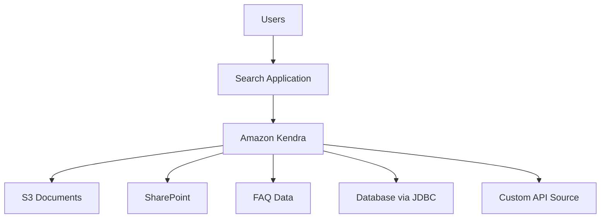

# How to Use Amazon Kendra for Intelligent Search

Author: [nawazdhandala](https://github.com/nawazdhandala)

Tags: AWS, Amazon Kendra, Search, Machine Learning, NLP

Description: Learn how to set up Amazon Kendra for intelligent enterprise search, including index creation, data source configuration, and querying with natural language.

---

Enterprise search is one of those problems that sounds simple but isn't. You've got documents scattered across S3 buckets, SharePoint sites, databases, and wikis. Users want to type a question in plain English and get an actual answer - not a list of 500 documents that might contain what they're looking for.

Amazon Kendra is AWS's answer to this. It's a machine learning-powered search service that understands natural language queries and returns precise answers extracted from your documents. Think of it as Google for your internal data.

## How Kendra Works

Unlike traditional keyword-based search engines, Kendra uses NLP to understand the meaning behind queries. When someone asks "What is our vacation policy?" Kendra doesn't just find documents containing those words. It reads the documents, understands the content, and extracts the specific passage that answers the question.

Kendra supports three types of results:

- **Factoid answers** - Direct answers extracted from documents ("Employees get 20 days of paid vacation per year")
- **FAQ answers** - Matched from a curated Q&A list
- **Document results** - Ranked list of relevant documents with highlighted excerpts

## Creating a Kendra Index

The index is the core resource. It's where Kendra stores and searches your content.

```python
# Create a Kendra index for enterprise document search
import boto3

kendra = boto3.client('kendra', region_name='us-east-1')

response = kendra.create_index(
    Name='company-knowledge-base',
    RoleArn='arn:aws:iam::YOUR_ACCOUNT_ID:role/KendraIndexRole',
    Edition='DEVELOPER_EDITION',  # Use ENTERPRISE_EDITION for production
    Description='Internal company knowledge base search'
)

index_id = response['Id']
print(f"Index ID: {index_id}")
```

There are two editions:

- **Developer Edition** - Up to 10,000 documents, good for testing and small deployments
- **Enterprise Edition** - Up to 500,000 documents, higher availability, and more capacity

The index takes about 15-30 minutes to become active:

```python
# Check index status
status = kendra.describe_index(Id=index_id)
print(f"Status: {status['Status']}")
# CREATING -> ACTIVE
```

## Adding Data Sources

Kendra can pull documents from many sources. Let's start with S3, the most common option.

### S3 Data Source

First, organize your documents in S3. Kendra supports PDF, HTML, Word, PowerPoint, plain text, and more.

```python
# Create an S3 data source connector
s3_data_source = kendra.create_data_source(
    IndexId=index_id,
    Name='company-docs-s3',
    Type='S3',
    Configuration={
        'S3Configuration': {
            'BucketName': 'company-documents',
            'InclusionPrefixes': ['policies/', 'procedures/', 'guides/'],
            'ExclusionPatterns': ['*.tmp', '*.bak', 'archive/*']
        }
    },
    RoleArn='arn:aws:iam::YOUR_ACCOUNT_ID:role/KendraS3DataSourceRole',
    Schedule='cron(0 2 * * ? *)'  # Sync daily at 2 AM
)

data_source_id = s3_data_source['Id']
```

The schedule parameter sets up automatic syncing. Every time it runs, Kendra checks for new, modified, or deleted documents and updates the index accordingly.

Trigger the first sync manually:

```python
# Start the initial data source sync
kendra.start_data_source_sync_job(
    Id=data_source_id,
    IndexId=index_id
)
```

### Other Supported Data Sources

Kendra has native connectors for:

- SharePoint Online
- Salesforce
- ServiceNow
- OneDrive
- Google Workspace Drive
- Confluence
- Databases (via JDBC)
- Web crawlers
- Custom data sources via the API

Each connector handles authentication and document extraction automatically.

## Adding FAQ Data

For common questions with known answers, add an FAQ data source. Create a CSV file:

```csv
_question,_answer
What is our vacation policy?,Full-time employees receive 20 days of paid vacation per year. Part-time employees receive a prorated amount.
How do I reset my password?,Go to the IT portal at https://it.company.com and click 'Reset Password'. You'll need your employee ID.
What are the office hours?,Our offices are open Monday through Friday from 8 AM to 6 PM local time.
```

Upload it to S3 and create the FAQ:

```python
# Add an FAQ data source for common questions
faq_response = kendra.create_faq(
    IndexId=index_id,
    Name='company-faq',
    S3Path={
        'Bucket': 'company-documents',
        'Key': 'faq/company-faq.csv'
    },
    RoleArn='arn:aws:iam::YOUR_ACCOUNT_ID:role/KendraS3DataSourceRole',
    FileFormat='CSV'
)
```

FAQ answers get boosted in search results, so they'll appear before document-extracted answers for matching questions.

## Querying the Index

Now for the fun part. Let's search:

```python
# Query the Kendra index with a natural language question
response = kendra.query(
    IndexId=index_id,
    QueryText='How many vacation days do employees get?'
)

# Process the results
for result in response['ResultItems']:
    result_type = result['Type']

    if result_type == 'ANSWER':
        print(f"[ANSWER] {result['DocumentExcerpt']['Text']}")
    elif result_type == 'QUESTION_ANSWER':
        print(f"[FAQ] {result['DocumentExcerpt']['Text']}")
    elif result_type == 'DOCUMENT':
        print(f"[DOC] {result['DocumentTitle']['Text']}")
        print(f"  Excerpt: {result['DocumentExcerpt']['Text']}")

    print(f"  Relevance: {result.get('ScoreAttributes', {}).get('ScoreConfidence', 'N/A')}")
    print()
```

Notice you're asking in natural language - "How many vacation days do employees get?" instead of keyword searching "vacation days policy count." Kendra understands both, but the natural language capability is what sets it apart.

## Attribute Filters

You can filter results based on document attributes:

```python
# Query with attribute filters to narrow results
response = kendra.query(
    IndexId=index_id,
    QueryText='security best practices',
    AttributeFilter={
        'AndAllFilters': [
            {
                'EqualsTo': {
                    'Key': '_category',
                    'Value': {'StringValue': 'security'}
                }
            },
            {
                'GreaterThan': {
                    'Key': '_last_updated_at',
                    'Value': {'DateValue': '2025-01-01T00:00:00Z'}
                }
            }
        ]
    }
)
```

This finds security-related documents updated after January 2025. Attribute filters work on both built-in attributes (prefixed with underscore) and custom attributes you define.

## Custom Document Attributes

Add metadata to your documents for better filtering and relevance:

```python
# Update the index to include custom document attributes
kendra.update_index(
    Id=index_id,
    DocumentMetadataConfigurationUpdates=[
        {
            'Name': 'Department',
            'Type': 'STRING_VALUE',
            'Search': {
                'Facetable': True,
                'Searchable': True,
                'Displayable': True
            }
        },
        {
            'Name': 'SecurityLevel',
            'Type': 'STRING_VALUE',
            'Search': {
                'Facetable': True,
                'Searchable': False,
                'Displayable': True
            }
        }
    ]
)
```

When indexing documents via the API (instead of a data source connector), you can set these attributes:

```python
# Index a document with custom attributes
kendra.batch_put_document(
    IndexId=index_id,
    Documents=[{
        'Id': 'doc-001',
        'Title': 'Remote Work Policy',
        'Blob': b'Full text of the policy document...',
        'ContentType': 'PLAIN_TEXT',
        'Attributes': [
            {
                'Key': 'Department',
                'Value': {'StringValue': 'HR'}
            },
            {
                'Key': 'SecurityLevel',
                'Value': {'StringValue': 'internal'}
            }
        ]
    }]
)
```

## Relevance Tuning

Kendra lets you boost certain fields or attributes to influence ranking:

```python
# Tune relevance by boosting certain attributes
kendra.update_index(
    Id=index_id,
    DocumentMetadataConfigurationUpdates=[
        {
            'Name': '_last_updated_at',
            'Type': 'DATE_VALUE',
            'Relevance': {
                'Freshness': True,  # Boost newer documents
                'RankOrder': 'DESCENDING',
                'Duration': '2592000s'  # 30-day freshness window
            }
        }
    ]
)
```

Enabling freshness means recently updated documents rank higher. This is useful when you want current information to surface over older content.

## Access Control

Kendra supports document-level access control. You can restrict who sees what in search results:

```python
# Index a document with access control
kendra.batch_put_document(
    IndexId=index_id,
    Documents=[{
        'Id': 'confidential-doc-001',
        'Title': 'Executive Compensation Plan',
        'S3Path': {
            'Bucket': 'company-documents',
            'Key': 'confidential/exec-comp.pdf'
        },
        'AccessControlList': [
            {
                'Name': 'hr-leadership',
                'Type': 'GROUP',
                'Access': 'ALLOW'
            }
        ]
    }]
)
```

When querying, pass user context so Kendra filters results based on permissions:

```python
# Query with user context for access-controlled results
response = kendra.query(
    IndexId=index_id,
    QueryText='compensation plans',
    UserContext={
        'Groups': ['hr-leadership', 'all-employees']
    }
)
```

## Monitoring and Costs

Kendra is not cheap. Developer Edition starts around $800/month and Enterprise Edition is significantly more. Monitor your usage through CloudWatch metrics:

- `IndexQueryCount` - Number of queries
- `DocumentsIndexed` - Total documents in the index
- `DataSourceSyncJobsSucceeded/Failed` - Sync job health

For your overall AWS monitoring needs, including Kendra and every other service, consider a unified observability platform. Check out how [Amazon DevOps Guru can surface operational insights](https://oneuptime.com/blog/post/use-amazon-devops-guru-for-operational-insights/view) across your infrastructure.

## Architecture Overview



## Wrapping Up

Amazon Kendra transforms enterprise search from a "search and scroll" experience into a "ask and answer" one. The ML-powered understanding of natural language queries is genuinely impressive, and the pre-built connectors make it straightforward to index content from various sources.

The main consideration is cost. Kendra isn't a budget service, so make sure you have a solid use case and enough content to justify the investment. For many organizations, reducing the time employees spend searching for information easily pays for itself.
