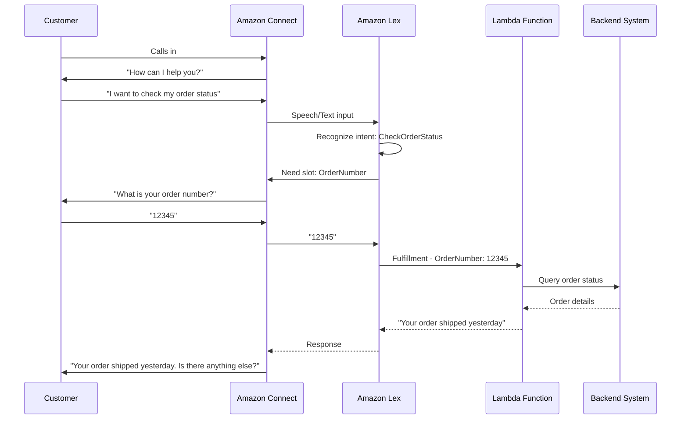
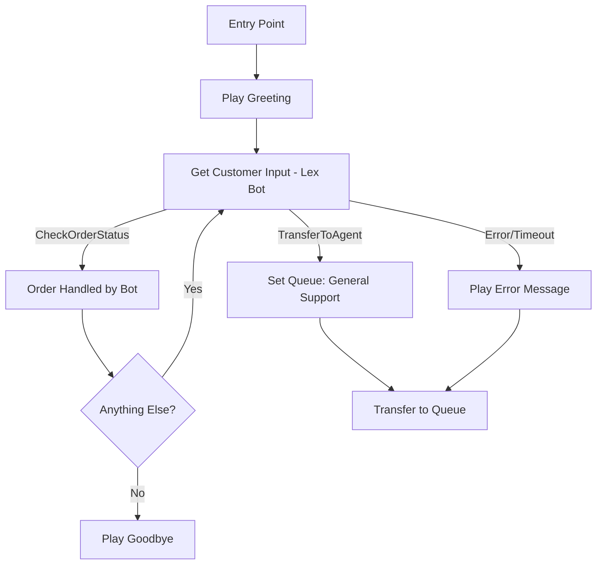

# How to Use Amazon Lex with Amazon Connect for IVR

Author: [nawazdhandala](https://github.com/nawazdhandala)

Tags: AWS, Amazon Lex, Amazon Connect, IVR, Conversational AI, Contact Center

Description: Integrate Amazon Lex with Amazon Connect to build intelligent IVR systems that use natural language understanding instead of rigid touch-tone menus.

---

Traditional IVR (Interactive Voice Response) systems are universally hated. "Press 1 for billing, press 2 for support, press 3 for more options." Customers get stuck navigating menu trees that never quite match what they need. The result is frustration, longer handle times, and more calls that end up with an agent anyway.

Amazon Lex changes this by adding natural language understanding to your contact center. Instead of pressing buttons, customers can just say what they need. "I want to check my account balance" or "I need to change my shipping address." Lex understands the intent, gathers the required information through conversation, and either resolves the request automatically or routes to the right agent with context already collected.

## How Lex and Connect Work Together



The flow is:

1. Customer calls your Amazon Connect number
2. A contact flow block sends the caller's speech to Lex
3. Lex identifies what the customer wants (intent) and what information is needed (slots)
4. Lex asks follow-up questions to fill in missing slots
5. Once all slots are filled, Lex calls a Lambda function for fulfillment
6. The response is played back to the caller
7. If the bot cannot handle the request, it transfers to a human agent

## Step 1: Build a Lex Bot

First, create a Lex V2 bot with the intents your IVR needs to handle.

```bash
# Create a Lex V2 bot
aws lexv2-models create-bot \
  --bot-name "ContactCenterBot" \
  --description "IVR bot for customer service" \
  --role-arn "arn:aws:iam::123456789012:role/LexBotRole" \
  --data-privacy '{"childDirected": false}' \
  --idle-session-ttl-in-seconds 300

# Create a bot locale for English
aws lexv2-models create-bot-locale \
  --bot-id "BOT_ID" \
  --bot-version "DRAFT" \
  --locale-id "en_US" \
  --nlu-intent-confidence-threshold 0.4
```

## Step 2: Define Intents

Intents represent what the customer wants to do. Each intent has:
- Sample utterances (different ways a customer might express the intent)
- Slots (information needed to fulfill the intent)
- Fulfillment (what to do once all slots are filled)

### Check Order Status Intent

```bash
# Create the CheckOrderStatus intent
aws lexv2-models create-intent \
  --bot-id "BOT_ID" \
  --bot-version "DRAFT" \
  --locale-id "en_US" \
  --intent-name "CheckOrderStatus" \
  --description "Customer wants to check the status of an order" \
  --sample-utterances '[
    {"utterance": "I want to check my order status"},
    {"utterance": "Where is my order"},
    {"utterance": "Track my order"},
    {"utterance": "What is the status of my order"},
    {"utterance": "I need to find my order"},
    {"utterance": "Can you tell me where my package is"},
    {"utterance": "Order status for {OrderNumber}"},
    {"utterance": "Track order {OrderNumber}"}
  ]' \
  --fulfillment-code-hook '{"enabled": true}'
```

### Add Slots to the Intent

```bash
# Create a custom slot type for order numbers
aws lexv2-models create-slot-type \
  --bot-id "BOT_ID" \
  --bot-version "DRAFT" \
  --locale-id "en_US" \
  --slot-type-name "OrderNumberType" \
  --value-selection-setting '{
    "resolutionStrategy": "ORIGINAL_VALUE",
    "regexFilter": {
      "pattern": "[0-9]{5,10}"
    }
  }'

# Add the OrderNumber slot to the intent
aws lexv2-models create-slot \
  --bot-id "BOT_ID" \
  --bot-version "DRAFT" \
  --locale-id "en_US" \
  --intent-id "INTENT_ID" \
  --slot-name "OrderNumber" \
  --slot-type-id "SLOT_TYPE_ID" \
  --value-elicitation-setting '{
    "slotConstraint": "Required",
    "promptSpecification": {
      "messageGroups": [
        {
          "message": {
            "plainTextMessage": {
              "value": "What is your order number?"
            }
          }
        }
      ],
      "maxRetries": 3
    }
  }'
```

### Transfer to Agent Intent

You need a fallback intent that transfers to a human agent when the bot cannot help:

```bash
# Create an intent for agent transfer
aws lexv2-models create-intent \
  --bot-id "BOT_ID" \
  --bot-version "DRAFT" \
  --locale-id "en_US" \
  --intent-name "TransferToAgent" \
  --description "Customer wants to speak with a human agent" \
  --sample-utterances '[
    {"utterance": "I want to talk to a person"},
    {"utterance": "Transfer me to an agent"},
    {"utterance": "Let me speak to someone"},
    {"utterance": "Human please"},
    {"utterance": "I need help from a real person"},
    {"utterance": "Agent"},
    {"utterance": "Representative"}
  ]'
```

## Step 3: Build the Fulfillment Lambda

The Lambda function handles the actual business logic when Lex has gathered all the needed information:

```python
# lambda_function.py - fulfillment handler for the IVR bot
import json
import boto3

dynamodb = boto3.resource('dynamodb')
orders_table = dynamodb.Table('Orders')

def lambda_handler(event, context):
    """Handle Lex V2 fulfillment requests."""
    intent_name = event['sessionState']['intent']['name']

    if intent_name == 'CheckOrderStatus':
        return handle_check_order(event)
    elif intent_name == 'ResetPassword':
        return handle_reset_password(event)
    else:
        return close_intent(event, "Sorry, I could not process that request.")

def handle_check_order(event):
    """Look up order status and return it to the caller."""
    slots = event['sessionState']['intent']['slots']
    order_number = slots['OrderNumber']['value']['interpretedValue']

    # Look up the order
    try:
        response = orders_table.get_item(Key={'order_id': order_number})
        if 'Item' in response:
            order = response['Item']
            status = order.get('status', 'unknown')
            message = f"Your order {order_number} is currently {status}."

            if status == 'shipped':
                tracking = order.get('tracking_number', '')
                message += f" The tracking number is {tracking}."
            elif status == 'processing':
                message += " It should ship within 1 to 2 business days."

            return close_intent(event, message)
        else:
            return close_intent(event,
                f"I could not find an order with number {order_number}. "
                "Please check the number and try again, or I can transfer you to an agent.")
    except Exception as e:
        return close_intent(event,
            "I am having trouble looking up that order right now. "
            "Let me transfer you to an agent who can help.")

def close_intent(event, message):
    """Return a response that closes the intent."""
    return {
        'sessionState': {
            'dialogAction': {
                'type': 'Close'
            },
            'intent': {
                'name': event['sessionState']['intent']['name'],
                'state': 'Fulfilled'
            }
        },
        'messages': [
            {
                'contentType': 'PlainText',
                'content': message
            }
        ]
    }
```

## Step 4: Build and Deploy the Bot

```bash
# Build the bot locale (trains the NLU model)
aws lexv2-models build-bot-locale \
  --bot-id "BOT_ID" \
  --bot-version "DRAFT" \
  --locale-id "en_US"

# Create a bot version
aws lexv2-models create-bot-version \
  --bot-id "BOT_ID" \
  --bot-version-locale-specification '{
    "en_US": {
      "sourceBotVersion": "DRAFT"
    }
  }'

# Create an alias for Connect to reference
aws lexv2-models create-bot-alias \
  --bot-id "BOT_ID" \
  --bot-alias-name "Production" \
  --bot-version "1"
```

## Step 5: Integrate with Amazon Connect

Add the Lex bot to your Amazon Connect instance:

```bash
# Associate the Lex bot with your Connect instance
aws connect associate-lex-bot \
  --instance-id "connect-instance-id" \
  --lex-bot '{
    "LexRegion": "us-east-1",
    "Name": "ContactCenterBot"
  }'
```

Then in your contact flow, add a "Get customer input" block configured to use the Lex bot. The block sends the caller's speech to Lex and branches based on the returned intent.

Your contact flow should look something like this:



## Testing and Tuning

After deploying, monitor your bot's performance:

```bash
# Check bot analytics
aws lexv2-models list-utterance-analytics-data \
  --bot-id "BOT_ID" \
  --start-date-time "2026-02-11T00:00:00Z" \
  --end-date-time "2026-02-12T00:00:00Z" \
  --sort-by '{
    "name": "UtteranceTimestamp",
    "order": "Descending"
  }'
```

Look for:
- **Missed utterances** - things customers said that the bot did not understand
- **Slot elicitation failures** - times the bot could not get the information it needed
- **Fulfillment errors** - Lambda function failures
- **Transfer rates** - how often the bot hands off to an agent

Add missed utterances to your intent training data and rebuild the bot regularly to improve accuracy.

## Best Practices

**Start with a small number of intents.** Two or three well-trained intents are better than twenty poorly trained ones. Expand gradually based on actual call data.

**Always provide an agent transfer option.** Never trap customers in a bot loop. Make it easy to say "agent" and get transferred.

**Use session attributes to pass context.** When the bot transfers to an agent, pass the collected information (order number, intent, etc.) so the agent does not have to ask again.

**Test with real speech, not just text.** Speech recognition introduces variability that text testing will not catch. Say things in different accents, with background noise, and at different speeds.

## Wrapping Up

Amazon Lex transforms your Amazon Connect IVR from a rigid menu tree into a conversational experience. Customers get faster resolution for common requests, and agents receive calls with context already collected. The key to success is starting simple, monitoring real interactions, and continuously improving the bot's understanding based on what actual customers say.
