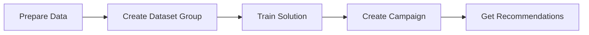

# How to Use Amazon Personalize for Recommendations

Author: [nawazdhandala](https://github.com/nawazdhandala)

Tags: AWS, Amazon Personalize, Machine Learning, Recommendations

Description: Learn how to build a real-time recommendation engine with Amazon Personalize, including data preparation, training models, and getting live recommendations via the API.

---

Recommendation engines are everywhere. Netflix suggests what to watch next, Amazon shows you products you might like, and Spotify builds playlists tailored to your taste. Building one from scratch is a massive undertaking, but Amazon Personalize lets you get production-quality recommendations without needing a machine learning team.

Personalize uses the same technology that powers Amazon.com's recommendation engine. You feed it your data, it trains models, and you get real-time personalized recommendations through a simple API call.

## How Amazon Personalize Works

The workflow has four main stages:



1. **Data preparation** - Format your interaction data, item metadata, and user metadata
2. **Dataset group** - Import your data into Personalize
3. **Solution** - Train a model using one of the built-in recipes
4. **Campaign** - Deploy the model for real-time inference

Let's walk through each step.

## Preparing Your Data

Personalize works with three types of datasets:

**Interactions (required)** - Records of users interacting with items. This is your bread and butter - clicks, purchases, views, ratings.

**Items (optional)** - Metadata about your items like category, price, genre, etc.

**Users (optional)** - Metadata about your users like age group, membership tier, location.

The interactions dataset is the minimum requirement. Here's what it looks like as a CSV:

```csv
USER_ID,ITEM_ID,TIMESTAMP,EVENT_TYPE
user_001,item_123,1707350400,click
user_001,item_456,1707350500,purchase
user_002,item_123,1707350600,click
user_002,item_789,1707350700,click
user_003,item_456,1707350800,purchase
```

Upload this to an S3 bucket. Personalize reads directly from S3.

## Setting Up with the SDK

Let's do everything programmatically with boto3. First, create a dataset group:

```python
# Create a dataset group - the top-level container for your recommendation system
import boto3

personalize = boto3.client('personalize', region_name='us-east-1')

response = personalize.create_dataset_group(
    name='ecommerce-recommendations'
)

dataset_group_arn = response['datasetGroupArn']
print(f"Dataset group ARN: {dataset_group_arn}")
```

## Creating the Schema and Dataset

Before importing data, you need to define a schema that describes your CSV structure:

```python
# Define the schema for the interactions dataset
import json

interactions_schema = {
    "type": "record",
    "name": "Interactions",
    "namespace": "com.amazonaws.personalize.schema",
    "fields": [
        {"name": "USER_ID", "type": "string"},
        {"name": "ITEM_ID", "type": "string"},
        {"name": "TIMESTAMP", "type": "long"},
        {"name": "EVENT_TYPE", "type": "string"}
    ],
    "version": "1.0"
}

schema_response = personalize.create_schema(
    name='ecommerce-interactions-schema',
    schema=json.dumps(interactions_schema)
)

schema_arn = schema_response['schemaArn']
```

Now create the dataset and import job:

```python
# Create the interactions dataset
dataset_response = personalize.create_dataset(
    name='ecommerce-interactions',
    datasetGroupArn=dataset_group_arn,
    datasetType='Interactions',
    schemaArn=schema_arn
)

dataset_arn = dataset_response['datasetArn']

# Create a dataset import job to load data from S3
import_response = personalize.create_dataset_import_job(
    jobName='initial-interactions-import',
    datasetArn=dataset_arn,
    dataSource={
        'dataLocation': 's3://your-bucket/interactions.csv'
    },
    roleArn='arn:aws:iam::YOUR_ACCOUNT_ID:role/PersonalizeS3Role'
)

print(f"Import job ARN: {import_response['datasetImportJobArn']}")
```

The import job runs asynchronously. You can check its status:

```python
# Check the status of the import job
status = personalize.describe_dataset_import_job(
    datasetImportJobArn=import_response['datasetImportJobArn']
)

print(f"Status: {status['datasetImportJob']['status']}")
# Will be: CREATE PENDING -> CREATE IN_PROGRESS -> ACTIVE
```

## Choosing a Recipe

Recipes are pre-built algorithms optimized for different use cases:

| Recipe | Use Case |
|--------|----------|
| `aws-user-personalization` | Personalized recommendations for each user |
| `aws-similar-items` | "Customers who liked X also liked Y" |
| `aws-personalized-ranking` | Re-rank a list of items for a specific user |
| `aws-trending-now` | Currently popular items |
| `aws-popularity-count` | Most popular items overall (baseline) |

For most recommendation engines, `aws-user-personalization` is the go-to recipe. It balances exploitation (recommending items similar to what the user has interacted with) and exploration (surfacing new items to gather data).

## Training a Solution

A "solution" in Personalize terminology is a trained model:

```python
# Create a solution using the user-personalization recipe
solution_response = personalize.create_solution(
    name='ecommerce-user-personalization',
    datasetGroupArn=dataset_group_arn,
    recipeArn='arn:aws:personalize:::recipe/aws-user-personalization',
    solutionConfig={
        'eventValueThreshold': '0.5',
        'hpoConfig': {
            'hpoObjective': {
                'type': 'MAXIMIZE',
                'metricName': 'precision_at_25'
            }
        }
    }
)

solution_arn = solution_response['solutionArn']

# Create a solution version (this triggers the actual training)
version_response = personalize.create_solution_version(
    solutionArn=solution_arn,
    trainingMode='FULL'
)

solution_version_arn = version_response['solutionVersionArn']
```

Training takes anywhere from 30 minutes to several hours depending on your data size. You can monitor progress:

```python
# Check training status
version_status = personalize.describe_solution_version(
    solutionVersionArn=solution_version_arn
)

print(f"Status: {version_status['solutionVersion']['status']}")
```

## Evaluating the Model

Once training completes, check the metrics:

```python
# Get solution version metrics to evaluate model quality
metrics = personalize.get_solution_metrics(
    solutionVersionArn=solution_version_arn
)

for key, value in metrics['metrics'].items():
    print(f"{key}: {value}")
```

Key metrics to look at:
- **precision_at_K** - What percentage of recommended items are relevant
- **normalized_discounted_cumulative_gain_at_K** - How well the model ranks relevant items higher
- **mean_reciprocal_rank_at_K** - How high the first relevant item appears on average

## Creating a Campaign

To get real-time recommendations, you need a campaign (basically a hosted endpoint):

```python
# Create a campaign to serve real-time recommendations
campaign_response = personalize.create_campaign(
    name='ecommerce-recommendations-campaign',
    solutionVersionArn=solution_version_arn,
    minProvisionedTPS=1  # Minimum transactions per second
)

campaign_arn = campaign_response['campaignArn']
```

The `minProvisionedTPS` controls the minimum throughput. Start low and increase as needed - you're billed based on this plus actual usage.

## Getting Recommendations

Now the fun part - getting actual recommendations:

```python
# Get personalized recommendations for a specific user
personalize_runtime = boto3.client('personalize-runtime', region_name='us-east-1')

response = personalize_runtime.get_recommendations(
    campaignArn=campaign_arn,
    userId='user_001',
    numResults=10
)

print("Recommended items:")
for item in response['itemList']:
    print(f"  Item: {item['itemId']}, Score: {item['score']:.4f}")
```

You can also filter recommendations. Say you don't want to recommend items the user already purchased:

```python
# Get recommendations with a filter to exclude already-purchased items
response = personalize_runtime.get_recommendations(
    campaignArn=campaign_arn,
    userId='user_001',
    numResults=10,
    filterArn='arn:aws:personalize:us-east-1:YOUR_ACCOUNT:filter/exclude-purchased'
)
```

## Real-Time Events

To keep recommendations fresh, send real-time events as users interact with your app:

```python
# Send a real-time event to keep recommendations up to date
personalize_events = boto3.client('personalize-events', region_name='us-east-1')

personalize_events.put_events(
    trackingId='YOUR_TRACKING_ID',
    userId='user_001',
    sessionId='session-abc-123',
    eventList=[{
        'sentAt': 1707350900,
        'eventType': 'click',
        'itemId': 'item_999'
    }]
)
```

These events are incorporated into recommendations within about two seconds, so the user sees updated suggestions almost immediately.

## Cost Considerations

Personalize pricing has several components:

- **Data ingestion** - Per GB of data processed
- **Training** - Per training hour
- **Real-time inference** - Per TPS-hour for campaigns
- **Batch inference** - Per recommendation

For small to medium workloads, the campaign cost is usually the biggest line item. If you don't need real-time recommendations, consider batch inference instead - it's significantly cheaper.

## Monitoring

Keep an eye on your campaign's performance. CloudWatch metrics for Personalize include `GetRecommendations` latency and error rates. As your user base grows, you may need to increase your provisioned TPS.

For end-to-end monitoring of your recommendation pipeline, from data ingestion through to the user-facing API, consider using a comprehensive monitoring solution. You can learn more about [monitoring operational insights with DevOps Guru](https://oneuptime.com/blog/post/2026-02-12-use-amazon-devops-guru-for-operational-insights/view) to keep track of how your ML services are performing in production.

## Wrapping Up

Amazon Personalize takes what would normally be months of ML engineering and turns it into a manageable workflow: import data, train a model, deploy a campaign, get recommendations. The hardest part is usually getting your interaction data clean and comprehensive enough.

Start with the `aws-user-personalization` recipe, measure your metrics, and iterate. As you add more interaction data over time, retrain your solution versions to keep recommendations accurate and relevant.
