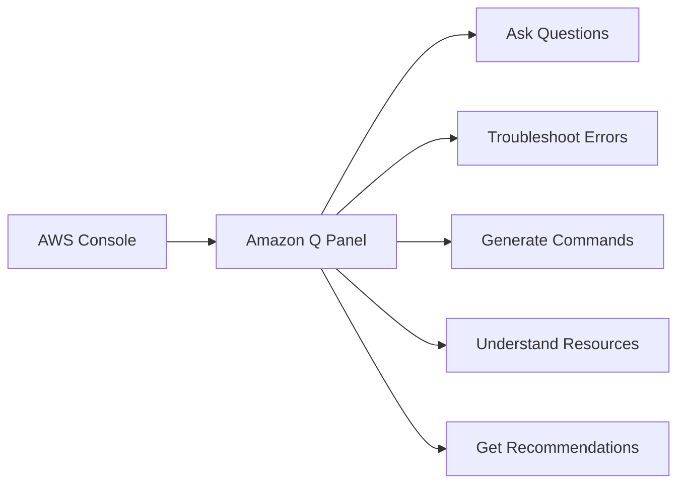

# How to Use Amazon Q Developer for AWS Console Assistance

Author: [nawazdhandala](https://github.com/nawazdhandala)

Tags: AWS, Amazon Q, Console Assistance, AI, Developer Tools, Cloud Management

Description: Use Amazon Q Developer in the AWS Console to get instant answers about your AWS resources, troubleshoot issues, and generate CLI commands with natural language.

---

The AWS Console has hundreds of services, thousands of configuration options, and documentation that spans millions of pages. Finding the right setting, understanding an error message, or figuring out why your Lambda function is timing out can eat up hours. Amazon Q Developer in the AWS Console gives you an AI assistant that knows AWS inside and out and can see your actual resources to provide contextual help.

Unlike the IDE version that helps you write code, the console version of Amazon Q helps you operate and troubleshoot your AWS environment. You ask questions in natural language, and it responds with answers that are aware of your account's resources and configuration.

## Accessing Amazon Q in the Console

Amazon Q is available in the AWS Console as a chat panel. Look for the Amazon Q icon in the bottom-right corner of the console, or press Ctrl+Q (Cmd+Q on Mac) to open it.



No additional setup is required. If your IAM user or role has permission to use Amazon Q, the chat panel is available across all console pages.

### IAM Permissions

To use Amazon Q in the console, your IAM identity needs the appropriate permissions:

```json
// IAM policy to allow Amazon Q console access
{
  "Version": "2012-10-17",
  "Statement": [
    {
      "Effect": "Allow",
      "Action": [
        "q:SendMessage",
        "q:StartConversation",
        "q:GetConversation",
        "q:ListConversations"
      ],
      "Resource": "*"
    }
  ]
}
```

For administrators who want to control access:

```json
// Deny policy to restrict Amazon Q access
{
  "Version": "2012-10-17",
  "Statement": [
    {
      "Effect": "Deny",
      "Action": "q:*",
      "Resource": "*"
    }
  ]
}
```

## Common Use Cases

### 1. Troubleshooting Errors

When you hit an error in the console, ask Q about it:

```
You: My Lambda function is returning "Task timed out after 3.00 seconds"

Q: This error means your Lambda function didn't complete within its
configured timeout of 3 seconds. Here are common causes and fixes:

1. The function is making network calls that are slow. Check if it's
   connecting to resources in a VPC without a NAT Gateway.

2. The function's memory is too low, causing slow execution. Try
   increasing the memory allocation - Lambda allocates CPU proportionally
   to memory.

3. Cold starts can contribute to timeouts, especially with VPC-attached
   functions. Consider using provisioned concurrency.

To increase the timeout:
- Go to your function's Configuration tab
- Under General configuration, click Edit
- Increase the Timeout value (max 900 seconds)

Would you like me to help you diagnose which of these is causing
your specific timeout?
```

### 2. Understanding Your Resources

Ask Q about the current state of your resources:

```
You: How many EC2 instances are running in us-east-1?

Q: Based on your account, you have 12 EC2 instances currently in the
"running" state in us-east-1:

- 4 instances of type t3.medium (tagged as "web-tier")
- 3 instances of type m5.large (tagged as "api-tier")
- 2 instances of type r5.xlarge (tagged as "database")
- 2 instances of type c5.2xlarge (tagged as "batch-processing")
- 1 instance of type t3.micro (tagged as "bastion")

You also have 3 stopped instances that you might want to review
for cost savings.
```

### 3. Generating CLI Commands

Instead of looking up CLI syntax in documentation:

```
You: Give me the AWS CLI command to create an S3 bucket with
versioning enabled and default encryption using KMS

Q: Here's the CLI command to create the bucket and configure it:

aws s3api create-bucket \
  --bucket my-secure-bucket \
  --region us-east-1

aws s3api put-bucket-versioning \
  --bucket my-secure-bucket \
  --versioning-configuration Status=Enabled

aws s3api put-bucket-encryption \
  --bucket my-secure-bucket \
  --server-side-encryption-configuration '{
    "Rules": [
      {
        "ApplyServerSideEncryptionByDefault": {
          "SSEAlgorithm": "aws:kms",
          "KMSMasterKeyID": "alias/my-key"
        },
        "BucketKeyEnabled": true
      }
    ]
  }'
```

### 4. Cost Analysis

```
You: What are my highest cost EC2 instances this month?

Q: Based on your recent usage data, here are your highest-cost
EC2 instances:

1. i-abc123 (r5.4xlarge) - approximately $487/month
   - Running 24/7, tagged "production-db"
   - Consider Reserved Instances or Savings Plans

2. i-def456 (c5.4xlarge) - approximately $394/month
   - Running 24/7, tagged "ml-training"
   - This instance shows low CPU utilization on weekends

3. i-ghi789 (m5.2xlarge) - approximately $234/month
   - Running 24/7, tagged "staging-api"
   - Consider stopping outside business hours

Would you like recommendations for reducing these costs?
```

### 5. Security Guidance

```
You: Is my S3 bucket "company-reports" publicly accessible?

Q: Let me check the configuration of your "company-reports" bucket.

The bucket has:
- Block Public Access: All settings ENABLED (good)
- Bucket Policy: No public access statements
- ACL: Private (no public grants)

Your bucket is NOT publicly accessible. The Block Public Access
settings prevent any accidental public exposure even if a policy
or ACL change were made.

However, I notice the bucket does not have:
- Default encryption configured
- Versioning enabled
- Access logging enabled

Would you like guidance on enabling these security best practices?
```

### 6. Service Comparisons

```
You: Should I use SQS or SNS for my use case? I need to process
orders asynchronously with multiple consumers.

Q: For asynchronous order processing with multiple consumers,
here's how the two services compare for your case:

SQS (Simple Queue Service):
- Pull-based: consumers poll for messages
- Each message processed by ONE consumer
- Built-in retry and dead-letter queue
- Best for: work distribution across workers

SNS (Simple Notification Service):
- Push-based: publishes to all subscribers
- Each message goes to ALL subscribers
- Fan-out pattern
- Best for: broadcasting events

For your use case with multiple consumers that each need to
process the same order, use SNS + SQS (fan-out pattern):
1. Order comes in -> publish to SNS topic
2. Each consumer has its own SQS queue subscribed to the topic
3. Each queue gets a copy of every order
4. Each consumer processes from its own queue independently

This gives you the broadcast of SNS with the reliability of SQS.
```

## Using Q for Network Troubleshooting

Amazon Q can help diagnose VPC and networking issues:

```
You: My EC2 instance i-abc123 cannot connect to the internet

Q: Let me check the networking configuration for i-abc123.

I found the following issues:

1. The instance is in subnet subnet-private1a, which is a private
   subnet (no route to an Internet Gateway).

2. The subnet's route table routes 0.0.0.0/0 to a NAT Gateway
   (nat-abc123), but that NAT Gateway is in a "deleted" state.

To fix this:
- Create a new NAT Gateway in a public subnet
- Update the route table for subnet-private1a to point 0.0.0.0/0
  to the new NAT Gateway

Alternatively, if this instance needs direct internet access,
move it to a public subnet with an Internet Gateway route and
assign an Elastic IP.
```

## Using Q with CloudFormation

When working with CloudFormation stacks:

```
You: My CloudFormation stack "web-app-stack" failed to create.
What went wrong?

Q: I checked the events for your "web-app-stack" stack. The
failure occurred at these resources:

1. ALBListener (AWS::ElasticLoadBalancingV2::Listener)
   Error: "A listener already exists on this port for the
   load balancer"

   Your template tries to create a listener on port 443, but
   the ALB already has a listener on that port from a previous
   deployment.

Fix: Either delete the existing listener first, or import the
existing ALB into your CloudFormation stack using resource import.

Here's the CloudFormation command to delete and retry:

aws cloudformation delete-stack --stack-name web-app-stack
# Wait for deletion to complete, then:
aws cloudformation create-stack --stack-name web-app-stack \
  --template-body file://template.yaml
```

## Best Practices for Getting Good Answers

**Be specific.** "Why is my Lambda slow?" will get a generic answer. "Why is my Lambda function 'process-orders' in us-east-1 timing out when calling DynamoDB?" will get a much more targeted response.

**Include resource identifiers.** Mention specific instance IDs, function names, bucket names, or stack names so Q can look at actual configurations.

**Ask follow-up questions.** Q maintains conversation context, so you can drill down into its recommendations without repeating background information.

**Use it on the relevant console page.** When you are on the EC2 console and ask about an instance, Q has additional context about what you are looking at.

## Limitations

Amazon Q in the console has some limitations to be aware of:

- It cannot make changes to your resources directly (it can only suggest actions)
- Response quality depends on the specificity of your question
- It may not have real-time data for very recent changes (there can be a small delay)
- Complex multi-service architectures may require multiple questions to fully diagnose

## Wrapping Up

Amazon Q in the AWS Console is like having a senior AWS architect available at all times. It is especially valuable for operators who are new to AWS, teams working with unfamiliar services, and anyone who would rather ask a question than search through documentation. The fact that it is context-aware of your actual resources makes its answers much more useful than generic documentation. Use it as your first stop when troubleshooting issues, understanding configurations, or looking up CLI syntax.
