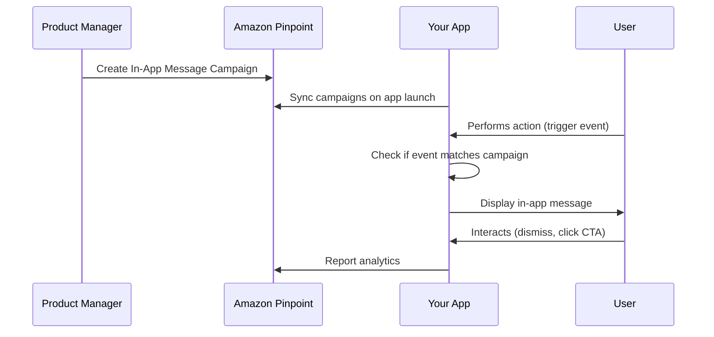

# How to Use Amplify In-App Messaging

Author: [nawazdhandala](https://github.com/nawazdhandala)

Tags: AWS, Amplify, In-App Messaging, Pinpoint, Engagement, Mobile

Description: Implement targeted in-app messages using Amplify In-App Messaging backed by Amazon Pinpoint for user engagement and feature announcements.

---

Push notifications get users back into your app, but in-app messages reach them while they are already engaged. Amplify In-App Messaging lets you display targeted messages, banners, modals, and carousels inside your application based on user behavior, segments, and events. It is backed by Amazon Pinpoint, so you get the same targeting and analytics capabilities used by large-scale consumer apps.

This guide covers setting up in-app messaging, defining campaigns in Pinpoint, displaying messages in your React app, and handling user interactions.

## How In-App Messaging Works

The flow has three parts: you define campaigns in Amazon Pinpoint, your app syncs those campaigns on launch, and when user actions match campaign triggers, the appropriate message is displayed.



## Prerequisites

- An Amplify project with authentication
- Amazon Pinpoint project (created automatically by Amplify or manually)
- React or React Native project
- Node.js 16 or later

## Step 1: Install Dependencies

```bash
# Install the in-app messaging package
npm install aws-amplify @aws-amplify/notifications
```

## Step 2: Configure Amplify with Pinpoint

If you are using the Amplify CLI, add analytics and notifications:

```bash
# Add Pinpoint analytics (required for in-app messaging)
amplify add analytics
amplify add notifications
amplify push
```

For manual configuration:

```typescript
// src/amplify-config.ts
import { Amplify } from 'aws-amplify';

Amplify.configure({
  Auth: {
    Cognito: {
      userPoolId: 'us-east-1_XXXXX',
      userPoolClientId: 'xxxxxxxx',
      identityPoolId: 'us-east-1:xxxxxxxx-xxxx-xxxx-xxxx-xxxxxxxxxxxx',
    },
  },
  Notifications: {
    InAppMessaging: {
      AWSPinpoint: {
        appId: 'your-pinpoint-app-id',
        region: 'us-east-1',
      },
    },
  },
});
```

## Step 3: Initialize In-App Messaging

Initialize the messaging service when your app starts:

```typescript
// src/App.tsx - Initialize in-app messaging on app load
import { initializeInAppMessaging, syncMessages } from '@aws-amplify/notifications';

// Call this once when the app loads
async function setupInAppMessaging() {
  // Initialize the in-app messaging module
  initializeInAppMessaging();

  // Sync campaigns from Pinpoint
  // This fetches the latest campaigns and caches them locally
  await syncMessages();

  console.log('In-app messaging initialized and synced');
}

// Call during app initialization
setupInAppMessaging();
```

## Step 4: Create a Campaign in Amazon Pinpoint

Through the Pinpoint console or CLI, create an in-app message campaign.

```bash
# Create an in-app message campaign via CLI
aws pinpoint create-campaign \
  --application-id your-pinpoint-app-id \
  --write-campaign-request '{
    "Name": "Welcome New Users",
    "Description": "Show welcome message to new users",
    "MessageConfiguration": {
      "InAppMessage": {
        "Content": [
          {
            "BackgroundColor": "#FFFFFF",
            "BodyConfig": {
              "Alignment": "CENTER",
              "Body": "Welcome to our app! Check out these features to get started.",
              "TextColor": "#333333"
            },
            "HeaderConfig": {
              "Alignment": "CENTER",
              "Header": "Welcome!",
              "TextColor": "#000000"
            },
            "ImageUrl": "https://example.com/welcome-image.png",
            "PrimaryBtn": {
              "DefaultConfig": {
                "BackgroundColor": "#4CAF50",
                "BorderRadius": 8,
                "ButtonAction": "DEEP_LINK",
                "Link": "myapp://onboarding",
                "Text": "Get Started",
                "TextColor": "#FFFFFF"
              }
            },
            "SecondaryBtn": {
              "DefaultConfig": {
                "BackgroundColor": "#CCCCCC",
                "BorderRadius": 8,
                "ButtonAction": "CLOSE",
                "Text": "Maybe Later",
                "TextColor": "#333333"
              }
            }
          }
        ],
        "Layout": "MIDDLE_BANNER"
      }
    },
    "Schedule": {
      "EventFilter": {
        "Dimensions": {
          "EventType": {
            "DimensionType": "INCLUSIVE",
            "Values": ["app_launched"]
          }
        },
        "FilterType": "ENDPOINT"
      },
      "Frequency": "ONCE",
      "StartTime": "2026-02-12T00:00:00Z"
    }
  }'
```

The campaign is configured to show when the `app_launched` event is triggered, and it only shows once per user (`Frequency: ONCE`).

## Step 5: Trigger Events to Show Messages

In-app messages display when your app records events that match campaign triggers. Record events using the Amplify Analytics module:

```typescript
// Record events that can trigger in-app messages
import { record } from '@aws-amplify/analytics';
import { dispatchEvent } from '@aws-amplify/notifications';

// When the app launches, record the event
function onAppLaunch() {
  // Record the event with Amplify Analytics
  record({
    name: 'app_launched',
  });

  // Dispatch the event to the in-app messaging module
  dispatchEvent({ name: 'app_launched' });
}

// When a user completes a purchase
function onPurchaseComplete(amount: number) {
  const event = {
    name: 'purchase_completed',
    attributes: {
      category: 'electronics',
    },
    metrics: {
      amount: amount,
    },
  };

  record(event);
  dispatchEvent(event);
}

// When a user views a product
function onProductView(productId: string) {
  const event = {
    name: 'product_viewed',
    attributes: {
      productId: productId,
    },
  };

  record(event);
  dispatchEvent(event);
}
```

## Step 6: Create a Custom Message Renderer

Amplify provides default UI for in-app messages, but you can customize the rendering:

```tsx
// components/CustomInAppMessage.tsx
import React from 'react';
import {
  useInAppMessaging,
  InAppMessageDisplay,
} from '@aws-amplify/notifications/react';

// Custom banner component
function CustomBannerMessage({ message, onDismiss, onAction }: any) {
  return (
    <div
      style={{
        position: 'fixed',
        top: 0,
        left: 0,
        right: 0,
        backgroundColor: message.content[0]?.backgroundColor || '#4CAF50',
        padding: '16px',
        zIndex: 1000,
        display: 'flex',
        alignItems: 'center',
        justifyContent: 'space-between',
      }}
    >
      <div>
        <h3 style={{ margin: 0, color: '#fff' }}>
          {message.content[0]?.header?.content}
        </h3>
        <p style={{ margin: '4px 0 0', color: '#fff' }}>
          {message.content[0]?.body?.content}
        </p>
      </div>
      <div style={{ display: 'flex', gap: '8px' }}>
        {message.content[0]?.primaryButton && (
          <button
            onClick={() => onAction(message.content[0].primaryButton)}
            style={{
              padding: '8px 16px',
              backgroundColor: '#fff',
              border: 'none',
              borderRadius: '4px',
              cursor: 'pointer',
            }}
          >
            {message.content[0].primaryButton.title}
          </button>
        )}
        <button
          onClick={onDismiss}
          style={{
            padding: '8px 16px',
            backgroundColor: 'transparent',
            border: '1px solid #fff',
            color: '#fff',
            borderRadius: '4px',
            cursor: 'pointer',
          }}
        >
          Dismiss
        </button>
      </div>
    </div>
  );
}

// Use the custom renderer
function InAppMessageProvider({ children }: { children: React.ReactNode }) {
  return (
    <>
      <InAppMessageDisplay
        components={{
          BannerMessage: CustomBannerMessage,
        }}
      />
      {children}
    </>
  );
}

export default InAppMessageProvider;
```

## Step 7: Handle Message Actions

When users interact with in-app messages, you need to handle the actions:

```typescript
// Handle in-app message interactions
import { onMessageReceived, onMessageDismissed, onMessageActionTaken } from '@aws-amplify/notifications';

// Called when a message is displayed
onMessageReceived((message) => {
  console.log('Message shown to user:', message.id);
  // Track impression in your analytics
});

// Called when the user dismisses the message
onMessageDismissed((message) => {
  console.log('Message dismissed:', message.id);
  // User chose not to engage
});

// Called when the user clicks a CTA button
onMessageActionTaken((message, action) => {
  console.log('User clicked action:', action);

  // Handle different action types
  switch (action.actionType) {
    case 'DEEP_LINK':
      // Navigate to the deep link URL
      window.location.href = action.url;
      break;
    case 'LINK':
      // Open external URL
      window.open(action.url, '_blank');
      break;
    case 'CLOSE':
      // Just close the message
      break;
  }
});
```

## Step 8: Segment-Based Targeting

Pinpoint lets you target messages based on user segments. Define segments based on user attributes, behavior, or custom attributes:

```bash
# Create a segment for users who signed up in the last 7 days
aws pinpoint create-segment \
  --application-id your-pinpoint-app-id \
  --write-segment-request '{
    "Name": "New Users (Last 7 Days)",
    "SegmentGroups": {
      "Groups": [
        {
          "Dimensions": [
            {
              "UserAttributes": {
                "CreatedDate": {
                  "AttributeType": "AFTER",
                  "Values": ["2026-02-05"]
                }
              }
            }
          ],
          "SourceType": "ALL"
        }
      ],
      "Include": "ALL"
    }
  }'
```

Then associate the segment with your campaign to only show messages to that user group.

## Campaign Types

Pinpoint supports several in-app message layouts:

- **TOP_BANNER**: Fixed banner at the top of the screen
- **BOTTOM_BANNER**: Fixed banner at the bottom
- **MIDDLE_BANNER**: Centered banner
- **FULL_SCREEN**: Takes over the entire screen
- **CAROUSEL**: Swipeable multi-page message
- **MODAL**: Centered dialog with overlay

Choose the layout based on the urgency and importance of the message. Full screen for critical updates, banners for gentle nudges.

## Best Practices

**Limit frequency**: Do not bombard users with messages. Use Pinpoint's frequency controls (once, once per day, once per session) to keep things reasonable.

**Test before launch**: Use Pinpoint's campaign testing feature to preview messages on test devices before rolling out to all users.

**Track engagement**: Monitor campaign analytics in Pinpoint to see impression rates, click-through rates, and dismissal rates. Use this data to improve your messaging.

**Respect user preferences**: Give users a way to opt out of in-app messages in your settings screen.

**Keep messages short**: In-app messages should be scannable in 2-3 seconds. Put details behind the CTA button.

## Wrapping Up

Amplify In-App Messaging gives you a complete solution for targeted user engagement without building your own messaging infrastructure. The Pinpoint backend handles targeting, scheduling, and analytics, while the Amplify frontend library handles rendering and event handling. It is a solid choice for feature announcements, onboarding flows, and promotional messages.

For more Amplify engagement features, check out [Amplify PubSub for real-time data](https://oneuptime.com/blog/post/2026-02-12-use-amplify-pubsub-for-real-time-data/view). For AI-powered features in your app, see [Amplify Predictions for AI/ML features](https://oneuptime.com/blog/post/2026-02-12-use-amplify-predictions-for-aiml-features/view).
