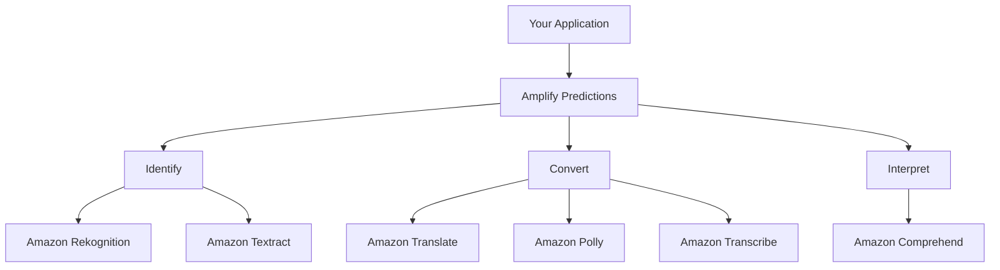

# How to Use Amplify Predictions for AI/ML Features

Author: [nawazdhandala](https://github.com/nawazdhandala)

Tags: AWS, Amplify, AI, ML, Predictions, Rekognition, Textract, Comprehend

Description: Add AI and ML features to your app using Amplify Predictions for image recognition, text extraction, language translation, and sentiment analysis.

---

Adding AI and ML features to your application usually means figuring out which AWS service to use (Rekognition? Comprehend? Textract?), setting up IAM permissions, and writing integration code. Amplify Predictions wraps all of that behind a clean API. You can add image labeling, text extraction, language translation, and sentiment analysis to your frontend app with a few lines of code.

Under the hood, Predictions uses Amazon Rekognition, Amazon Textract, Amazon Translate, Amazon Polly, and Amazon Comprehend. You get the power of these services without managing the infrastructure.

## What Amplify Predictions Offers

Predictions is organized into categories:

- **Identify**: Detect labels, faces, and text in images (Rekognition, Textract)
- **Convert**: Translate text between languages, text-to-speech, speech-to-text (Translate, Polly, Transcribe)
- **Interpret**: Analyze text for sentiment, entities, key phrases, and language (Comprehend)



## Prerequisites

- An Amplify project initialized (or a standalone project with the Amplify JS library)
- AWS credentials configured (through Amplify Auth or manually)
- Node.js 16 or later

## Step 1: Install Dependencies

```bash
# Install the Amplify libraries
npm install aws-amplify @aws-amplify/predictions
```

## Step 2: Configure Predictions

If you are using the Amplify CLI, add predictions to your project:

```bash
# Add predictions categories
amplify add predictions
```

The CLI walks you through selecting which categories you want. For a manual setup, configure it directly:

```typescript
// src/amplify-config.ts
import { Amplify } from 'aws-amplify';

Amplify.configure({
  Auth: {
    Cognito: {
      userPoolId: 'us-east-1_XXXXX',
      userPoolClientId: 'xxxxxxxx',
      identityPoolId: 'us-east-1:xxxxxxxx-xxxx-xxxx-xxxx-xxxxxxxxxxxx',
    },
  },
  Predictions: {
    identify: {
      identifyLabels: {
        region: 'us-east-1',
        proxy: false,
        defaults: {
          type: 'LABELS',
        },
      },
      identifyText: {
        region: 'us-east-1',
        proxy: false,
        defaults: {
          format: 'PLAIN',
        },
      },
      identifyEntities: {
        region: 'us-east-1',
        proxy: false,
        defaults: {
          collectionId: '',
          maxEntities: 10,
        },
      },
    },
    convert: {
      translateText: {
        region: 'us-east-1',
        proxy: false,
        defaults: {
          sourceLanguage: 'en',
          targetLanguage: 'es',
        },
      },
      speechGenerator: {
        region: 'us-east-1',
        proxy: false,
        defaults: {
          VoiceId: 'Joanna',
        },
      },
    },
    interpret: {
      interpretText: {
        region: 'us-east-1',
        proxy: false,
        defaults: {
          type: 'ALL',
        },
      },
    },
  },
});
```

## Step 3: Image Label Detection

Detect objects, scenes, and concepts in images. This is powered by Amazon Rekognition.

```typescript
// Detect labels in an uploaded image
import { Predictions } from '@aws-amplify/predictions';

async function detectLabels(imageFile: File) {
  try {
    const result = await Predictions.identify({
      labels: {
        source: {
          file: imageFile,
        },
        type: 'LABELS',
      },
    });

    // result.labels contains detected labels with confidence scores
    console.log('Detected labels:');
    result.labels.forEach((label) => {
      console.log(`  ${label.name}: ${label.confidence.toFixed(1)}%`);
    });

    return result.labels;
  } catch (error) {
    console.error('Label detection failed:', error);
    throw error;
  }
}
```

Here is a React component that lets users upload an image and see detected labels:

```tsx
// React component for image label detection
import React, { useState } from 'react';
import { Predictions } from '@aws-amplify/predictions';

function ImageAnalyzer() {
  const [labels, setLabels] = useState<Array<{name: string; confidence: number}>>([]);
  const [loading, setLoading] = useState(false);

  async function handleFileUpload(event: React.ChangeEvent<HTMLInputElement>) {
    const file = event.target.files?.[0];
    if (!file) return;

    setLoading(true);
    try {
      const result = await Predictions.identify({
        labels: {
          source: { file },
          type: 'LABELS',
        },
      });
      setLabels(result.labels || []);
    } catch (err) {
      console.error('Analysis failed:', err);
    }
    setLoading(false);
  }

  return (
    <div>
      <h2>Image Analyzer</h2>
      <input type="file" accept="image/*" onChange={handleFileUpload} />
      {loading && <p>Analyzing image...</p>}
      {labels.length > 0 && (
        <ul>
          {labels.map((label, i) => (
            <li key={i}>
              {label.name} - {label.confidence.toFixed(1)}% confidence
            </li>
          ))}
        </ul>
      )}
    </div>
  );
}

export default ImageAnalyzer;
```

## Step 4: Text Extraction from Images

Extract text from photos of documents, receipts, or signs using Amazon Textract.

```typescript
// Extract text from an image of a document
async function extractText(imageFile: File) {
  const result = await Predictions.identify({
    text: {
      source: {
        file: imageFile,
      },
      format: 'PLAIN', // Use 'FORM' for structured documents
    },
  });

  // result.text.fullText contains all extracted text
  console.log('Extracted text:', result.text.fullText);

  // result.text.lines contains individual lines with bounding boxes
  result.text.lines.forEach((line) => {
    console.log(`Line: "${line.text}" at position (${line.boundingBox.left}, ${line.boundingBox.top})`);
  });

  return result.text;
}
```

For structured documents like forms, use the `FORM` format to get key-value pairs:

```typescript
// Extract form data from a document image
async function extractFormData(imageFile: File) {
  const result = await Predictions.identify({
    text: {
      source: { file: imageFile },
      format: 'FORM',
    },
  });

  // Key-value pairs from the form
  result.text.keyValues.forEach((kv) => {
    console.log(`${kv.key}: ${kv.value.text}`);
  });

  return result.text.keyValues;
}
```

## Step 5: Language Translation

Translate text between languages using Amazon Translate.

```typescript
// Translate text from English to Spanish
async function translateText(text: string, targetLanguage: string = 'es') {
  const result = await Predictions.convert({
    translateText: {
      source: {
        text: text,
        language: 'en',
      },
      targetLanguage: targetLanguage,
    },
  });

  console.log('Translated text:', result.text);
  return result.text;
}

// Example usage
const spanish = await translateText('Hello, how are you?', 'es');
// Output: "Hola, como estas?"
```

## Step 6: Sentiment Analysis

Analyze text to determine if it is positive, negative, neutral, or mixed.

```typescript
// Analyze sentiment of user feedback
async function analyzeSentiment(text: string) {
  const result = await Predictions.interpret({
    text: {
      source: { text },
      type: 'ALL', // Gets sentiment, entities, key phrases, language
    },
  });

  // Sentiment analysis
  const sentiment = result.textInterpretation.sentiment;
  console.log(`Sentiment: ${sentiment.predominant}`);
  console.log(`  Positive: ${(sentiment.positive * 100).toFixed(1)}%`);
  console.log(`  Negative: ${(sentiment.negative * 100).toFixed(1)}%`);
  console.log(`  Neutral: ${(sentiment.neutral * 100).toFixed(1)}%`);
  console.log(`  Mixed: ${(sentiment.mixed * 100).toFixed(1)}%`);

  // Key phrases
  const phrases = result.textInterpretation.keyPhrases;
  console.log('Key phrases:', phrases.map((p) => p.text).join(', '));

  // Named entities
  const entities = result.textInterpretation.entities;
  entities.forEach((e) => {
    console.log(`Entity: ${e.text} (${e.type})`);
  });

  return result.textInterpretation;
}
```

## Step 7: Text-to-Speech

Convert text to audio using Amazon Polly.

```typescript
// Convert text to speech
async function textToSpeech(text: string) {
  const result = await Predictions.convert({
    textToSpeech: {
      source: { text },
      voiceId: 'Joanna', // US English female voice
    },
  });

  // result.speech.url contains a URL to the audio file
  // result.speech.audioStream contains the raw audio data

  // Play the audio in the browser
  const audio = new Audio(result.speech.url);
  audio.play();

  return result.speech;
}
```

## Practical Example: Customer Review Analyzer

Here is a complete example that combines multiple predictions features to analyze customer reviews:

```typescript
// Analyze a customer review with multiple AI features
async function analyzeReview(reviewText: string) {
  // Step 1: Detect the language
  const interpretation = await Predictions.interpret({
    text: {
      source: { text: reviewText },
      type: 'ALL',
    },
  });

  const language = interpretation.textInterpretation.language;
  const sentiment = interpretation.textInterpretation.sentiment;
  const keyPhrases = interpretation.textInterpretation.keyPhrases;

  // Step 2: If not in English, translate it
  let englishText = reviewText;
  if (language !== 'en') {
    const translation = await Predictions.convert({
      translateText: {
        source: { text: reviewText, language },
        targetLanguage: 'en',
      },
    });
    englishText = translation.text;
  }

  return {
    originalText: reviewText,
    translatedText: englishText,
    language,
    sentiment: sentiment.predominant,
    sentimentScores: {
      positive: sentiment.positive,
      negative: sentiment.negative,
      neutral: sentiment.neutral,
    },
    keyPhrases: keyPhrases.map((p) => p.text),
  };
}
```

## IAM Permissions

The Identity Pool role needs permissions for each service. Here is a policy that covers all predictions categories:

```json
// IAM policy for Amplify Predictions
{
  "Version": "2012-10-17",
  "Statement": [
    {
      "Effect": "Allow",
      "Action": [
        "rekognition:DetectLabels",
        "rekognition:DetectFaces",
        "rekognition:DetectText",
        "rekognition:RecognizeCelebrities"
      ],
      "Resource": "*"
    },
    {
      "Effect": "Allow",
      "Action": [
        "textract:DetectDocumentText",
        "textract:AnalyzeDocument"
      ],
      "Resource": "*"
    },
    {
      "Effect": "Allow",
      "Action": ["translate:TranslateText"],
      "Resource": "*"
    },
    {
      "Effect": "Allow",
      "Action": ["comprehend:DetectSentiment", "comprehend:DetectEntities", "comprehend:DetectKeyPhrases", "comprehend:DetectDominantLanguage"],
      "Resource": "*"
    },
    {
      "Effect": "Allow",
      "Action": ["polly:SynthesizeSpeech"],
      "Resource": "*"
    }
  ]
}
```

## Wrapping Up

Amplify Predictions makes it surprisingly easy to add AI and ML capabilities to your application. The API is consistent across all categories, so once you learn the pattern for one feature, the rest follow the same structure. You do not need to be an ML engineer to add image recognition, translation, or sentiment analysis to your app.

For more Amplify features, check out our guides on [Amplify PubSub for real-time data](https://oneuptime.com/blog/post/use-amplify-pubsub-for-real-time-data/view) and [Amplify In-App Messaging](https://oneuptime.com/blog/post/use-amplify-in-app-messaging/view).
