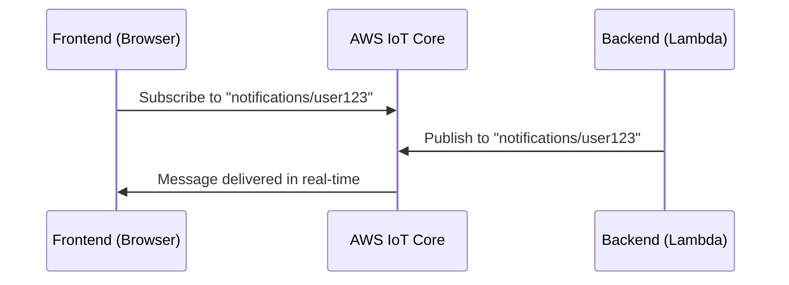

# How to Use Amplify PubSub for Real-Time Data

Author: [nawazdhandala](https://github.com/nawazdhandala)

Tags: AWS, Amplify, PubSub, Real-Time, IoT, MQTT, WebSocket

Description: Implement real-time data streaming in your application using Amplify PubSub with AWS IoT Core for live updates and event-driven features.

---

Real-time features like live notifications, chat, stock tickers, and IoT dashboards need a publish-subscribe (PubSub) messaging system. Amplify PubSub provides a clean API for publishing and subscribing to real-time messages, backed by AWS IoT Core's MQTT broker. Your frontend can subscribe to topics and receive messages the moment they are published, with no polling required.

This guide covers setting up Amplify PubSub, publishing messages, subscribing to topics, and building real-time features.

## How Amplify PubSub Works

Amplify PubSub uses AWS IoT Core as the message broker. IoT Core supports MQTT over WebSocket, which works natively in web browsers. When your frontend subscribes to a topic, it opens a WebSocket connection to IoT Core. Messages published to that topic are delivered instantly.



## Prerequisites

- An AWS account with IoT Core access
- Amplify project with authentication configured (Cognito)
- Node.js 16 or later

## Step 1: Install Dependencies

```bash
# Install Amplify PubSub and related packages
npm install aws-amplify @aws-amplify/pubsub
```

## Step 2: Configure IoT Core Endpoint

You need your IoT Core endpoint. Every AWS account has a unique endpoint.

```bash
# Get your IoT Core endpoint
aws iot describe-endpoint --endpoint-type iot:Data-ATS
```

This returns something like `xxxxx-ats.iot.us-east-1.amazonaws.com`.

## Step 3: Set Up IAM Permissions

The Cognito Identity Pool authenticated role needs permission to connect to IoT Core and subscribe/publish to topics.

```json
// IAM policy for PubSub access via IoT Core
{
  "Version": "2012-10-17",
  "Statement": [
    {
      "Effect": "Allow",
      "Action": "iot:Connect",
      "Resource": "arn:aws:iot:us-east-1:123456789012:client/${cognito-identity.amazonaws.com:sub}"
    },
    {
      "Effect": "Allow",
      "Action": "iot:Subscribe",
      "Resource": [
        "arn:aws:iot:us-east-1:123456789012:topicfilter/notifications/*",
        "arn:aws:iot:us-east-1:123456789012:topicfilter/chat/*"
      ]
    },
    {
      "Effect": "Allow",
      "Action": "iot:Receive",
      "Resource": [
        "arn:aws:iot:us-east-1:123456789012:topic/notifications/*",
        "arn:aws:iot:us-east-1:123456789012:topic/chat/*"
      ]
    },
    {
      "Effect": "Allow",
      "Action": "iot:Publish",
      "Resource": [
        "arn:aws:iot:us-east-1:123456789012:topic/chat/*"
      ]
    }
  ]
}
```

Notice the fine-grained access control. The `Connect` permission uses the Cognito identity sub as the client ID, ensuring each user gets a unique connection. The `Subscribe` and `Receive` permissions control which topics the user can listen to, and `Publish` controls where they can send messages.

## Step 4: Configure Amplify PubSub

```typescript
// src/pubsub-config.ts
import { Amplify } from 'aws-amplify';
import { PubSub } from '@aws-amplify/pubsub';

Amplify.configure({
  Auth: {
    Cognito: {
      userPoolId: 'us-east-1_XXXXX',
      userPoolClientId: 'xxxxxxxx',
      identityPoolId: 'us-east-1:xxxxxxxx-xxxx-xxxx-xxxx-xxxxxxxxxxxx',
    },
  },
});

// Configure PubSub with IoT Core
const pubsub = new PubSub({
  region: 'us-east-1',
  endpoint: 'wss://xxxxx-ats.iot.us-east-1.amazonaws.com/mqtt',
});

export default pubsub;
```

## Step 5: Subscribe to Topics

Subscribing to a topic returns an Observable that emits messages as they arrive.

```typescript
// Subscribe to notifications for the current user
import pubsub from './pubsub-config';

function subscribeToNotifications(userId: string) {
  const subscription = pubsub.subscribe({
    topics: [`notifications/${userId}`],
  }).subscribe({
    next: (message) => {
      console.log('Received notification:', message);
      // Handle the notification in your UI
      displayNotification(message.value);
    },
    error: (error) => {
      console.error('Subscription error:', error);
    },
    complete: () => {
      console.log('Subscription completed');
    },
  });

  // Return the subscription so it can be unsubscribed later
  return subscription;
}

// Clean up when component unmounts
function cleanup(subscription) {
  subscription.unsubscribe();
}
```

## Step 6: Publish Messages

Publishing sends a message to a topic. All subscribers to that topic receive the message.

```typescript
// Publish a chat message
import pubsub from './pubsub-config';

async function sendChatMessage(roomId: string, message: string, sender: string) {
  await pubsub.publish({
    topics: [`chat/${roomId}`],
    message: {
      sender: sender,
      text: message,
      timestamp: new Date().toISOString(),
    },
  });

  console.log('Message sent to room:', roomId);
}
```

## Step 7: Build a Real-Time Chat Component

Here is a complete React component for a real-time chat room:

```tsx
// React component for real-time chat
import React, { useState, useEffect, useRef } from 'react';
import pubsub from './pubsub-config';

interface ChatMessage {
  sender: string;
  text: string;
  timestamp: string;
}

function ChatRoom({ roomId, currentUser }: { roomId: string; currentUser: string }) {
  const [messages, setMessages] = useState<ChatMessage[]>([]);
  const [inputText, setInputText] = useState('');
  const messagesEndRef = useRef<HTMLDivElement>(null);

  useEffect(() => {
    // Subscribe to the chat room topic
    const subscription = pubsub.subscribe({
      topics: [`chat/${roomId}`],
    }).subscribe({
      next: (data) => {
        const message = data.value as ChatMessage;
        setMessages((prev) => [...prev, message]);
      },
      error: (err) => console.error('Chat error:', err),
    });

    // Cleanup on unmount
    return () => subscription.unsubscribe();
  }, [roomId]);

  // Auto-scroll to the latest message
  useEffect(() => {
    messagesEndRef.current?.scrollIntoView({ behavior: 'smooth' });
  }, [messages]);

  async function handleSend() {
    if (!inputText.trim()) return;

    await pubsub.publish({
      topics: [`chat/${roomId}`],
      message: {
        sender: currentUser,
        text: inputText,
        timestamp: new Date().toISOString(),
      },
    });

    setInputText('');
  }

  return (
    <div style={{ maxWidth: '600px', margin: '0 auto' }}>
      <h2>Chat Room: {roomId}</h2>
      <div style={{ height: '400px', overflowY: 'scroll', border: '1px solid #ccc', padding: '10px' }}>
        {messages.map((msg, i) => (
          <div key={i} style={{ marginBottom: '10px' }}>
            <strong>{msg.sender}</strong>
            <span style={{ color: '#666', fontSize: '0.8em', marginLeft: '8px' }}>
              {new Date(msg.timestamp).toLocaleTimeString()}
            </span>
            <p style={{ margin: '4px 0' }}>{msg.text}</p>
          </div>
        ))}
        <div ref={messagesEndRef} />
      </div>
      <div style={{ display: 'flex', marginTop: '10px' }}>
        <input
          type="text"
          value={inputText}
          onChange={(e) => setInputText(e.target.value)}
          onKeyPress={(e) => e.key === 'Enter' && handleSend()}
          style={{ flex: 1, padding: '8px' }}
          placeholder="Type a message..."
        />
        <button onClick={handleSend} style={{ padding: '8px 16px' }}>Send</button>
      </div>
    </div>
  );
}

export default ChatRoom;
```

## Step 8: Publish from the Backend

Your backend services (Lambda, ECS, etc.) can also publish messages to IoT Core using the AWS SDK:

```python
# Lambda function that publishes notifications via IoT Core
import json
import boto3

iot_client = boto3.client('iot-data')

def handler(event, context):
    user_id = event['userId']
    notification = event['notification']

    # Publish to the user's notification topic
    iot_client.publish(
        topic=f'notifications/{user_id}',
        qos=1,
        payload=json.dumps({
            'type': notification['type'],
            'title': notification['title'],
            'body': notification['body'],
            'timestamp': notification['timestamp'],
        })
    )

    return {'statusCode': 200}
```

## Topic Design Patterns

How you structure your topics matters for scalability and access control:

```
# Per-user notifications
notifications/{userId}

# Chat rooms
chat/{roomId}

# Live data feeds
feeds/{feedId}/updates

# IoT device telemetry
devices/{deviceId}/telemetry

# Broadcast to all users
broadcast/announcements
```

Keep topics specific. Avoid subscribing to wildcard topics like `#` (all topics), as this defeats the purpose of fine-grained access control and can overwhelm the client with irrelevant messages.

## Handling Disconnections

WebSocket connections can drop due to network issues. Amplify PubSub handles reconnection automatically, but you should handle the gap in messages:

```typescript
// Resubscribe and fetch missed messages after reconnection
function setupResilientSubscription(topic: string, onMessage: (msg: any) => void) {
  let lastMessageTime = new Date().toISOString();

  const subscription = pubsub.subscribe({
    topics: [topic],
  }).subscribe({
    next: (data) => {
      lastMessageTime = new Date().toISOString();
      onMessage(data.value);
    },
    error: (err) => {
      console.error('Connection error, will auto-reconnect:', err);
      // After reconnection, fetch missed messages from your API
      fetchMissedMessages(topic, lastMessageTime).then((missed) => {
        missed.forEach(onMessage);
      });
    },
  });

  return subscription;
}
```

## Cost Considerations

IoT Core pricing is based on connectivity minutes, messages sent, and messages received. For most web applications, the cost is minimal. However, high-frequency publishing (like streaming sensor data at 1-second intervals) can add up. Consider batching messages or reducing frequency for cost-sensitive applications.

## Wrapping Up

Amplify PubSub with IoT Core gives you production-grade real-time messaging without managing WebSocket servers or message brokers. The MQTT protocol is efficient, the IAM integration is solid, and the Amplify API is straightforward. Whether you are building chat, live notifications, or IoT dashboards, this is a solid foundation.

For more Amplify features, check out [Amplify Predictions for AI/ML features](https://oneuptime.com/blog/post/2026-02-12-use-amplify-predictions-for-aiml-features/view) and [Amplify In-App Messaging](https://oneuptime.com/blog/post/2026-02-12-use-amplify-in-app-messaging/view).
