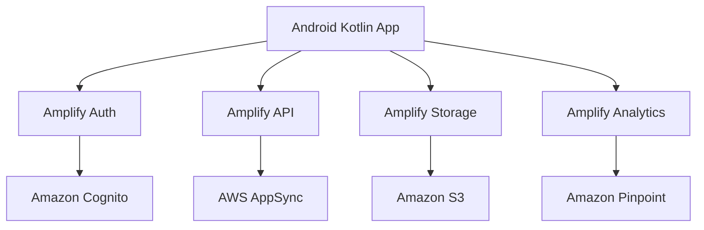

# How to Use Amplify with Android (Kotlin)

Author: [nawazdhandala](https://github.com/nawazdhandala)

Tags: AWS, Amplify, Android, Kotlin, Mobile Development, Jetpack Compose

Description: Integrate AWS Amplify with your Android Kotlin application for authentication, GraphQL APIs, S3 storage, and analytics with Jetpack Compose.

---

Android development has moved to Kotlin and Jetpack Compose, and AWS Amplify for Android has kept pace. The Amplify Android library gives you Kotlin-native APIs with coroutine support, making it straightforward to add cloud services like authentication, APIs, and storage to your Android app.

This guide covers the full setup: configuring Amplify in a Kotlin project, implementing Cognito authentication, connecting to a GraphQL API, and using S3 for file storage, all with Jetpack Compose UI examples.

## What Amplify for Android Provides

The Amplify Android library includes:

- **Auth**: Cognito-based sign-up, sign-in, MFA, and social providers
- **API**: GraphQL (AppSync) and REST (API Gateway) with model generation
- **Storage**: S3 file operations with transfer progress
- **Analytics**: Pinpoint user analytics
- **DataStore**: Offline-first data with cloud sync
- **Geo**: Maps and location (Amazon Location Service)
- **Predictions**: AI/ML features



## Prerequisites

- Android Studio (latest stable version)
- Kotlin 1.9 or later
- Minimum Android SDK 24
- An AWS account
- Amplify CLI installed (`npm install -g @aws-amplify/cli`)

## Step 1: Create the Backend

```bash
# Navigate to your Android project
cd MyAndroidApp

# Initialize Amplify
amplify init
# ? Enter a name for the project: myandroidapp
# ? Choose the type of app: android
# ? Res directory path: app/src/main/res

# Add authentication
amplify add auth
# Default configuration with email sign-in

# Add GraphQL API
amplify add api
# GraphQL with Cognito authorization

# Add storage
amplify add storage
# Content storage (Images, audio, video)

# Deploy
amplify push
```

This generates `amplifyconfiguration.json` and `awsconfiguration.json` in your `app/src/main/res/raw/` directory.

## Step 2: Add Gradle Dependencies

Update your module-level `build.gradle.kts`:

```kotlin
// app/build.gradle.kts
plugins {
    id("com.android.application")
    id("kotlin-android")
}

android {
    compileSdk = 34
    defaultConfig {
        minSdk = 24
        targetSdk = 34
    }
    // Required for Amplify
    compileOptions {
        isCoreLibraryDesugaringEnabled = true
        sourceCompatibility = JavaVersion.VERSION_11
        targetCompatibility = JavaVersion.VERSION_11
    }
}

dependencies {
    // Core Amplify library
    implementation("com.amplifyframework:core-kotlin:2.14.0")

    // Auth plugin
    implementation("com.amplifyframework:aws-auth-cognito:2.14.0")

    // API plugin
    implementation("com.amplifyframework:aws-api:2.14.0")

    // Storage plugin
    implementation("com.amplifyframework:aws-storage-s3:2.14.0")

    // Required for Java 8+ APIs on older Android versions
    coreLibraryDesugaring("com.android.tools:desugar_jdk_libs:2.0.4")

    // Jetpack Compose
    implementation("androidx.compose.ui:ui:1.6.0")
    implementation("androidx.compose.material3:material3:1.2.0")
    implementation("androidx.activity:activity-compose:1.8.2")
    implementation("androidx.lifecycle:lifecycle-viewmodel-compose:2.7.0")
}
```

## Step 3: Configure Amplify in Your Application Class

```kotlin
// app/src/main/java/com/example/myapp/MyApplication.kt
package com.example.myapp

import android.app.Application
import android.util.Log
import com.amplifyframework.AmplifyException
import com.amplifyframework.api.aws.AWSApiPlugin
import com.amplifyframework.auth.cognito.AWSCognitoAuthPlugin
import com.amplifyframework.core.Amplify
import com.amplifyframework.storage.s3.AWSS3StoragePlugin

class MyApplication : Application() {
    override fun onCreate() {
        super.onCreate()
        try {
            // Add the plugins
            Amplify.addPlugin(AWSCognitoAuthPlugin())
            Amplify.addPlugin(AWSApiPlugin())
            Amplify.addPlugin(AWSS3StoragePlugin())

            // Configure Amplify
            Amplify.configure(applicationContext)

            Log.i("MyApp", "Amplify configured successfully")
        } catch (error: AmplifyException) {
            Log.e("MyApp", "Could not configure Amplify", error)
        }
    }
}
```

Register the Application class in `AndroidManifest.xml`:

```xml
<!-- AndroidManifest.xml -->
<application
    android:name=".MyApplication"
    android:allowBackup="true"
    android:label="@string/app_name"
    android:theme="@style/Theme.MyApp">
    <!-- ... activities ... -->
</application>
```

## Step 4: Implement Authentication

### Sign Up Screen

```kotlin
// ui/screens/SignUpScreen.kt
package com.example.myapp.ui.screens

import androidx.compose.foundation.layout.*
import androidx.compose.material3.*
import androidx.compose.runtime.*
import androidx.compose.ui.Alignment
import androidx.compose.ui.Modifier
import androidx.compose.ui.text.input.PasswordVisualTransformation
import androidx.compose.ui.unit.dp
import com.amplifyframework.auth.AuthUserAttributeKey
import com.amplifyframework.auth.options.AuthSignUpOptions
import com.amplifyframework.kotlin.core.Amplify
import kotlinx.coroutines.launch

@Composable
fun SignUpScreen(
    onSignUpComplete: () -> Unit,
    onNavigateToSignIn: () -> Unit
) {
    var email by remember { mutableStateOf("") }
    var password by remember { mutableStateOf("") }
    var confirmationCode by remember { mutableStateOf("") }
    var showConfirmation by remember { mutableStateOf(false) }
    var errorMessage by remember { mutableStateOf("") }
    var isLoading by remember { mutableStateOf(false) }
    val scope = rememberCoroutineScope()

    Column(
        modifier = Modifier
            .fillMaxSize()
            .padding(16.dp),
        horizontalAlignment = Alignment.CenterHorizontally,
        verticalArrangement = Arrangement.Center
    ) {
        Text("Create Account", style = MaterialTheme.typography.headlineMedium)
        Spacer(modifier = Modifier.height(24.dp))

        if (!showConfirmation) {
            // Email field
            OutlinedTextField(
                value = email,
                onValueChange = { email = it },
                label = { Text("Email") },
                modifier = Modifier.fillMaxWidth()
            )
            Spacer(modifier = Modifier.height(8.dp))

            // Password field
            OutlinedTextField(
                value = password,
                onValueChange = { password = it },
                label = { Text("Password") },
                visualTransformation = PasswordVisualTransformation(),
                modifier = Modifier.fillMaxWidth()
            )
            Spacer(modifier = Modifier.height(16.dp))

            // Sign up button
            Button(
                onClick = {
                    scope.launch {
                        isLoading = true
                        errorMessage = ""
                        try {
                            val options = AuthSignUpOptions.builder()
                                .userAttribute(AuthUserAttributeKey.email(), email)
                                .build()

                            val result = Amplify.Auth.signUp(email, password, options)

                            if (result.nextStep.signUpStep.name == "CONFIRM_SIGN_UP_STEP") {
                                showConfirmation = true
                            }
                        } catch (e: Exception) {
                            errorMessage = e.message ?: "Sign up failed"
                        }
                        isLoading = false
                    }
                },
                modifier = Modifier.fillMaxWidth(),
                enabled = !isLoading
            ) {
                if (isLoading) CircularProgressIndicator(modifier = Modifier.size(20.dp))
                else Text("Sign Up")
            }
        } else {
            // Confirmation code field
            OutlinedTextField(
                value = confirmationCode,
                onValueChange = { confirmationCode = it },
                label = { Text("Confirmation Code") },
                modifier = Modifier.fillMaxWidth()
            )
            Spacer(modifier = Modifier.height(16.dp))

            Button(
                onClick = {
                    scope.launch {
                        isLoading = true
                        try {
                            val result = Amplify.Auth.confirmSignUp(email, confirmationCode)
                            if (result.isSignUpComplete) {
                                onSignUpComplete()
                            }
                        } catch (e: Exception) {
                            errorMessage = e.message ?: "Confirmation failed"
                        }
                        isLoading = false
                    }
                },
                modifier = Modifier.fillMaxWidth(),
                enabled = !isLoading
            ) {
                Text("Confirm")
            }
        }

        if (errorMessage.isNotEmpty()) {
            Spacer(modifier = Modifier.height(8.dp))
            Text(errorMessage, color = MaterialTheme.colorScheme.error)
        }

        Spacer(modifier = Modifier.height(16.dp))
        TextButton(onClick = onNavigateToSignIn) {
            Text("Already have an account? Sign In")
        }
    }
}
```

### Sign In

```kotlin
// services/AuthService.kt
package com.example.myapp.services

import com.amplifyframework.kotlin.core.Amplify

object AuthService {
    // Sign in with email and password
    suspend fun signIn(email: String, password: String): Boolean {
        return try {
            val result = Amplify.Auth.signIn(email, password)
            result.isSignedIn
        } catch (e: Exception) {
            throw e
        }
    }

    // Check if user is currently signed in
    suspend fun isSignedIn(): Boolean {
        return try {
            val session = Amplify.Auth.fetchAuthSession()
            session.isSignedIn
        } catch (e: Exception) {
            false
        }
    }

    // Sign out
    suspend fun signOut() {
        Amplify.Auth.signOut()
    }

    // Get current user info
    suspend fun getCurrentUser(): String? {
        return try {
            val user = Amplify.Auth.getCurrentUser()
            user.username
        } catch (e: Exception) {
            null
        }
    }
}
```

## Step 5: Use the GraphQL API

```kotlin
// services/TodoService.kt
package com.example.myapp.services

import com.amplifyframework.api.graphql.SimpleGraphQLRequest
import com.amplifyframework.api.graphql.GraphQLResponse
import com.amplifyframework.kotlin.core.Amplify
import org.json.JSONObject

data class Todo(
    val id: String,
    val title: String,
    val description: String?,
    val completed: Boolean
)

object TodoService {
    // Create a new todo
    suspend fun createTodo(title: String, description: String?): Todo? {
        val mutation = """
            mutation CreateTodo(${'$'}input: CreateTodoInput!) {
                createTodo(input: ${'$'}input) {
                    id
                    title
                    description
                    completed
                }
            }
        """.trimIndent()

        val variables = mapOf(
            "input" to mapOf(
                "title" to title,
                "description" to (description ?: ""),
                "completed" to false
            )
        )

        val request = SimpleGraphQLRequest<String>(
            mutation,
            JSONObject(variables).toString(),
            String::class.java,
            null
        )

        val response = Amplify.API.mutate(request)
        val data = JSONObject(response.data)
        val todoJson = data.getJSONObject("createTodo")

        return Todo(
            id = todoJson.getString("id"),
            title = todoJson.getString("title"),
            description = todoJson.optString("description"),
            completed = todoJson.getBoolean("completed")
        )
    }

    // List all todos
    suspend fun listTodos(): List<Todo> {
        val query = """
            query ListTodos {
                listTodos {
                    items {
                        id
                        title
                        description
                        completed
                    }
                }
            }
        """.trimIndent()

        val request = SimpleGraphQLRequest<String>(
            query,
            String::class.java,
            null
        )

        val response = Amplify.API.query(request)
        val items = JSONObject(response.data)
            .getJSONObject("listTodos")
            .getJSONArray("items")

        return (0 until items.length()).map { i ->
            val item = items.getJSONObject(i)
            Todo(
                id = item.getString("id"),
                title = item.getString("title"),
                description = item.optString("description"),
                completed = item.getBoolean("completed")
            )
        }
    }
}
```

## Step 6: File Storage

```kotlin
// services/StorageService.kt
package com.example.myapp.services

import android.net.Uri
import com.amplifyframework.kotlin.core.Amplify
import com.amplifyframework.storage.StorageAccessLevel
import com.amplifyframework.storage.options.StorageUploadFileOptions
import java.io.File

object StorageService {
    // Upload a file to S3
    suspend fun uploadFile(
        file: File,
        key: String,
        onProgress: (Double) -> Unit = {}
    ): String {
        val options = StorageUploadFileOptions.builder()
            .accessLevel(StorageAccessLevel.PRIVATE)
            .build()

        val upload = Amplify.Storage.uploadFile(key, file, options)

        // Collect progress updates
        upload.progress().collect { progress ->
            onProgress(progress.fractionCompleted)
        }

        val result = upload.result()
        return result.key
    }

    // Get download URL for a file
    suspend fun getDownloadUrl(key: String): String {
        val result = Amplify.Storage.getUrl(key)
        return result.url.toString()
    }

    // Download a file
    suspend fun downloadFile(key: String, localFile: File): File {
        val download = Amplify.Storage.downloadFile(key, localFile)
        download.result()
        return localFile
    }
}
```

## Step 7: Jetpack Compose Todo List Screen

```kotlin
// ui/screens/TodoListScreen.kt
package com.example.myapp.ui.screens

import androidx.compose.foundation.layout.*
import androidx.compose.foundation.lazy.LazyColumn
import androidx.compose.foundation.lazy.items
import androidx.compose.material.icons.Icons
import androidx.compose.material.icons.filled.Add
import androidx.compose.material3.*
import androidx.compose.runtime.*
import androidx.compose.ui.Modifier
import androidx.compose.ui.unit.dp
import com.example.myapp.services.Todo
import com.example.myapp.services.TodoService
import kotlinx.coroutines.launch

@OptIn(ExperimentalMaterial3Api::class)
@Composable
fun TodoListScreen() {
    var todos by remember { mutableStateOf<List<Todo>>(emptyList()) }
    var isLoading by remember { mutableStateOf(true) }
    var showAddDialog by remember { mutableStateOf(false) }
    val scope = rememberCoroutineScope()

    // Load todos on first composition
    LaunchedEffect(Unit) {
        todos = TodoService.listTodos()
        isLoading = false
    }

    Scaffold(
        topBar = {
            TopAppBar(title = { Text("My Todos") })
        },
        floatingActionButton = {
            FloatingActionButton(onClick = { showAddDialog = true }) {
                Icon(Icons.Default.Add, contentDescription = "Add Todo")
            }
        }
    ) { padding ->
        if (isLoading) {
            Box(
                modifier = Modifier
                    .fillMaxSize()
                    .padding(padding),
                contentAlignment = androidx.compose.ui.Alignment.Center
            ) {
                CircularProgressIndicator()
            }
        } else {
            LazyColumn(
                modifier = Modifier
                    .fillMaxSize()
                    .padding(padding),
                contentPadding = PaddingValues(16.dp),
                verticalArrangement = Arrangement.spacedBy(8.dp)
            ) {
                items(todos) { todo ->
                    Card(
                        modifier = Modifier.fillMaxWidth()
                    ) {
                        Column(modifier = Modifier.padding(16.dp)) {
                            Text(
                                text = todo.title,
                                style = MaterialTheme.typography.titleMedium
                            )
                            if (!todo.description.isNullOrBlank()) {
                                Text(
                                    text = todo.description,
                                    style = MaterialTheme.typography.bodyMedium,
                                    color = MaterialTheme.colorScheme.onSurfaceVariant
                                )
                            }
                        }
                    }
                }
            }
        }
    }

    // Add todo dialog
    if (showAddDialog) {
        var title by remember { mutableStateOf("") }

        AlertDialog(
            onDismissRequest = { showAddDialog = false },
            title = { Text("New Todo") },
            text = {
                OutlinedTextField(
                    value = title,
                    onValueChange = { title = it },
                    label = { Text("Title") }
                )
            },
            confirmButton = {
                TextButton(onClick = {
                    scope.launch {
                        TodoService.createTodo(title, null)
                        todos = TodoService.listTodos()
                        showAddDialog = false
                    }
                }) {
                    Text("Add")
                }
            },
            dismissButton = {
                TextButton(onClick = { showAddDialog = false }) {
                    Text("Cancel")
                }
            }
        )
    }
}
```

## Best Practices

**Use Kotlin coroutines**: Amplify Android's Kotlin facade uses suspend functions natively. Always call Amplify operations inside coroutine scopes.

**Handle configuration in Application class**: Configure Amplify once in your Application's `onCreate()`. Never configure it in an Activity.

**Use private storage access**: For user-specific files, always use `StorageAccessLevel.PRIVATE`. This scopes files to the authenticated user.

**Test with the local mock server**: Amplify CLI provides `amplify mock` for testing API and storage locally without deploying to AWS.

**Handle auth state changes**: Listen for auth state changes to update your UI when tokens expire or the user signs out.

## Wrapping Up

Amplify for Android with Kotlin gives you a modern, coroutine-based API for integrating AWS services. Combined with Jetpack Compose, you can build reactive UIs that connect to a full cloud backend with minimal boilerplate. For cross-platform development, see our guide on [Amplify with Flutter](https://oneuptime.com/blog/post/2026-02-12-use-amplify-with-flutter/view). For the iOS counterpart, check out [Amplify with Swift](https://oneuptime.com/blog/post/2026-02-12-use-amplify-with-swift-ios/view).
