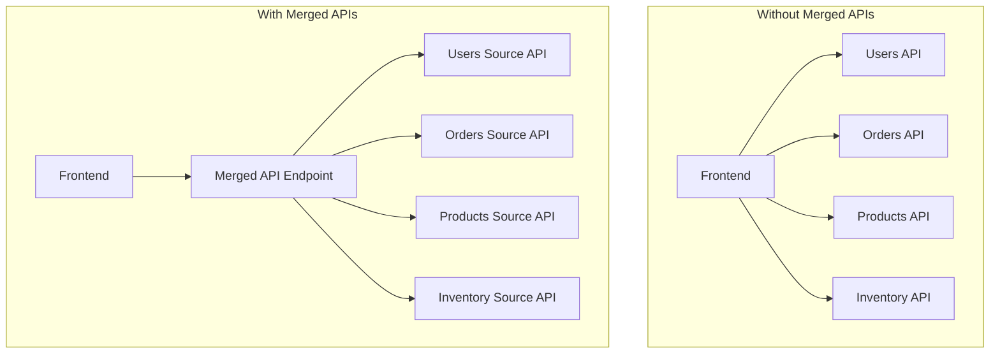

# How to Use Amplify with AWS AppSync Merged APIs

Author: [nawazdhandala](https://github.com/nawazdhandala)

Tags: AWS, Amplify, AppSync, GraphQL, Merged APIs, API Gateway, Backend

Description: Learn how to connect AWS Amplify frontend applications to AppSync Merged APIs for unified GraphQL endpoints across multiple teams

---

AWS AppSync Merged APIs let you combine multiple GraphQL APIs into a single endpoint. This is a game-changer for large organizations where different teams own different parts of the backend. Instead of your frontend application calling five different GraphQL endpoints, it calls one merged endpoint that routes queries to the correct source API behind the scenes.

When you pair AppSync Merged APIs with AWS Amplify on the frontend, you get a streamlined development experience with code generation, type safety, and automatic authentication handling. This guide walks through the full setup.

## What Are Merged APIs?

In a typical microservices architecture, each team builds their own API. The orders team has an Orders API, the users team has a Users API, and so on. Without Merged APIs, the frontend needs to know about each API endpoint individually.



The Merged API combines the schemas, resolvers, and data sources from multiple source APIs into one unified GraphQL schema.

## Prerequisites

Before starting, you need:

- An AWS account with AppSync and Amplify permissions
- At least two existing AppSync APIs to merge (or you will create them)
- An Amplify frontend project
- The AWS CLI and Amplify CLI installed

## Step 1: Create Source APIs

If you do not already have source APIs, create a couple for testing. Each source API has its own schema and resolvers.

**Users Source API schema**:

```graphql
# schema for the Users source API
type User {
  id: ID!
  name: String!
  email: String!
  createdAt: AWSDateTime!
}

type Query {
  getUser(id: ID!): User
  listUsers(limit: Int, nextToken: String): UserConnection
}

type UserConnection {
  items: [User]
  nextToken: String
}

type Mutation {
  createUser(input: CreateUserInput!): User
}

input CreateUserInput {
  name: String!
  email: String!
}
```

**Orders Source API schema**:

```graphql
# schema for the Orders source API
type Order {
  id: ID!
  userId: String!
  total: Float!
  status: OrderStatus!
  createdAt: AWSDateTime!
}

enum OrderStatus {
  PENDING
  PROCESSING
  SHIPPED
  DELIVERED
}

type Query {
  getOrder(id: ID!): Order
  listOrdersByUser(userId: String!): [Order]
}

type Mutation {
  createOrder(input: CreateOrderInput!): Order
  updateOrderStatus(id: ID!, status: OrderStatus!): Order
}

input CreateOrderInput {
  userId: String!
  total: Float!
}
```

## Step 2: Create the Merged API

Create the Merged API in the AppSync console or via the CLI:

```bash
# Create the Merged API
aws appsync create-graphql-api \
  --name "MyMergedAPI" \
  --api-type MERGED \
  --authentication-type AMAZON_COGNITO_USER_POOLS \
  --user-pool-config '{
    "userPoolId": "us-east-1_abc123",
    "awsRegion": "us-east-1",
    "defaultAction": "ALLOW"
  }'
```

Note the API ID from the response. You will need it to associate source APIs.

## Step 3: Associate Source APIs

Link your source APIs to the Merged API:

```bash
# Associate the Users source API
aws appsync start-schema-merge \
  --association-id "users-association" \
  --merged-api-identifier "merged-api-id"

# Associate the Orders source API
aws appsync start-schema-merge \
  --association-id "orders-association" \
  --merged-api-identifier "merged-api-id"
```

After association, the Merged API schema automatically includes types and operations from both source APIs. You can query users and orders through a single endpoint.

## Step 4: Configure Amplify to Use the Merged API

In your Amplify project, you need to point the frontend at the Merged API endpoint instead of individual source APIs.

For Amplify Gen 2, update your `amplify/backend.ts`:

```typescript
// amplify/backend.ts - Configure the Merged API
import { defineBackend } from '@aws-amplify/backend';

const backend = defineBackend({});

// Add the Merged API as a custom resource
backend.addOutput({
  custom: {
    GraphQLEndpoint: 'https://merged-api-id.appsync-api.us-east-1.amazonaws.com/graphql',
    GraphQLApiId: 'merged-api-id',
    GraphQLRegion: 'us-east-1',
  },
});
```

For Amplify Gen 1, update `aws-exports.js` or your Amplify configuration:

```javascript
// Configure Amplify to use the Merged API endpoint
import { Amplify } from 'aws-amplify';

Amplify.configure({
  API: {
    GraphQL: {
      endpoint: 'https://merged-api-id.appsync-api.us-east-1.amazonaws.com/graphql',
      region: 'us-east-1',
      defaultAuthMode: 'userPool',
    },
  },
  Auth: {
    Cognito: {
      userPoolId: 'us-east-1_abc123',
      userPoolClientId: 'client-id-here',
    },
  },
});
```

## Step 5: Generate TypeScript Types

One of the benefits of using Amplify with GraphQL is automatic type generation. Generate types from the Merged API schema:

```bash
# Download the merged schema
aws appsync get-introspection-schema \
  --api-id merged-api-id \
  --format SDL \
  --include-directives \
  schema.graphql

# Use Amplify codegen to generate TypeScript types
amplify codegen add --apiId merged-api-id
amplify codegen generate
```

This creates type-safe query and mutation functions you can import directly.

## Step 6: Query the Merged API from Your Frontend

Now you can query both users and orders through the single Merged API:

```typescript
// Querying users and orders through the Merged API
import { generateClient } from 'aws-amplify/api';
import { getUser, listOrdersByUser } from './graphql/queries';
import { createOrder } from './graphql/mutations';

const client = generateClient();

// Query from the Users source API
async function fetchUser(userId: string) {
  const result = await client.graphql({
    query: getUser,
    variables: { id: userId },
  });
  return result.data.getUser;
}

// Query from the Orders source API
async function fetchUserOrders(userId: string) {
  const result = await client.graphql({
    query: listOrdersByUser,
    variables: { userId },
  });
  return result.data.listOrdersByUser;
}

// Mutation on the Orders source API
async function placeOrder(userId: string, total: number) {
  const result = await client.graphql({
    query: createOrder,
    variables: {
      input: { userId, total },
    },
  });
  return result.data.createOrder;
}
```

The frontend code does not need to know which source API handles which operation. The Merged API routes everything automatically.

## Step 7: Handle Authentication Across Source APIs

Merged APIs support multiple authentication modes. You can configure different auth modes for different operations:

```typescript
// Use IAM auth for public queries, Cognito for mutations
const publicResult = await client.graphql({
  query: listProducts,
  authMode: 'iam',
});

const privateResult = await client.graphql({
  query: createOrder,
  variables: { input: orderData },
  authMode: 'userPool',
});
```

Each source API can have its own authorization configuration, and the Merged API respects those settings.

## Step 8: Handle Schema Conflicts

When merging schemas, type name conflicts can occur. If both source APIs define a `Status` enum, AppSync needs to know how to resolve the conflict.

There are three merge strategies:

1. **Auto merge**: AppSync automatically resolves conflicts by keeping the most recent definition
2. **Manual merge**: You manually resolve conflicts in the Merged API schema
3. **Namespace prefix**: Each source API's types get a prefix to avoid conflicts

```bash
# Configure the association with a merge strategy
aws appsync associate-source-graphql-api \
  --merged-api-identifier "merged-api-id" \
  --source-api-identifier "users-api-id" \
  --source-api-association-config '{
    "mergeType": "AUTO_MERGE"
  }'
```

For most teams, auto merge works fine as long as you coordinate type names across teams. Namespacing is the safest option for large organizations where teams work independently.

## Monitoring the Merged API

Track the health of your Merged API with CloudWatch metrics:

```bash
# Key metrics to monitor
# - Latency by source API
# - Error rates per source API
# - Total request count

aws cloudwatch get-metric-data \
  --metric-data-queries '[
    {
      "Id": "latency",
      "MetricStat": {
        "Metric": {
          "Namespace": "AWS/AppSync",
          "MetricName": "Latency",
          "Dimensions": [{"Name": "GraphQLAPIId", "Value": "merged-api-id"}]
        },
        "Period": 300,
        "Stat": "Average"
      }
    }
  ]' \
  --start-time 2026-02-12T00:00:00Z \
  --end-time 2026-02-12T23:59:59Z
```

For a deeper dive into monitoring, see our guide on [monitoring Amplify hosting with CloudWatch](https://oneuptime.com/blog/post/monitor-amplify-hosting-with-cloudwatch/view).

## Common Issues

**Schema merge fails**: Usually caused by conflicting type definitions. Check that shared types (like scalars and enums) have compatible definitions across source APIs.

**Authorization errors**: Make sure the Merged API's auth configuration includes all auth modes used by the source APIs. If a source API uses API key auth but the Merged API only allows Cognito, those operations will fail.

**High latency**: The Merged API adds a routing layer. If latency is a concern, make sure your source APIs are in the same region as the Merged API.

## Wrapping Up

AppSync Merged APIs solve the problem of API sprawl in microservices architectures. Combined with Amplify, you get a clean frontend development experience with a single GraphQL endpoint, automatic type generation, and unified authentication. The setup takes some upfront configuration, but once it is running, your frontend team never needs to worry about which backend team owns which API.
