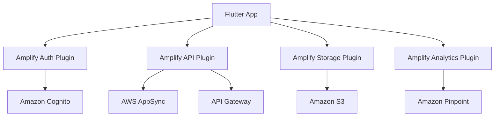

# How to Use Amplify with Flutter

Author: [nawazdhandala](https://github.com/nawazdhandala)

Tags: AWS, Amplify, Flutter, Dart, Mobile Development, Cross-Platform

Description: Integrate AWS Amplify with Flutter to add authentication, API, storage, and analytics to your cross-platform mobile application.

---

Flutter lets you build iOS and Android apps from a single codebase. AWS Amplify for Flutter brings cloud services into that equation. You get authentication, GraphQL and REST APIs, file storage, analytics, and push notifications - all with Dart-native APIs that feel natural in a Flutter project.

This guide walks through setting up Amplify in a Flutter project, adding authentication, connecting to an API, and using file storage.

## What Amplify for Flutter Provides

The Amplify Flutter library provides plugins for:

- **Auth**: Sign up, sign in, MFA, social sign-in (Cognito)
- **API**: GraphQL (AppSync) and REST (API Gateway)
- **Storage**: File upload and download (S3)
- **Analytics**: User behavior tracking (Pinpoint)
- **DataStore**: Offline-first data with sync
- **Notifications**: Push notifications (Pinpoint + FCM/APNs)



## Prerequisites

- Flutter SDK (3.0 or later)
- Dart (2.17 or later)
- An AWS account
- Amplify CLI installed (`npm install -g @aws-amplify/cli`)
- Android Studio or Xcode for running the app

## Step 1: Create a Flutter Project

```bash
# Create a new Flutter project
flutter create my_amplify_app
cd my_amplify_app
```

## Step 2: Add Amplify Dependencies

Add the Amplify packages to your `pubspec.yaml`:

```yaml
# pubspec.yaml - Add Amplify dependencies
dependencies:
  flutter:
    sdk: flutter
  # Core Amplify package
  amplify_flutter: ^2.0.0
  # Authentication plugin
  amplify_auth_cognito: ^2.0.0
  # API plugin for GraphQL and REST
  amplify_api: ^2.0.0
  # Storage plugin for S3
  amplify_storage_s3: ^2.0.0
  # Analytics plugin
  amplify_analytics_pinpoint: ^2.0.0
  # Pre-built Amplify Authenticator UI widget
  amplify_authenticator: ^2.0.0
```

```bash
# Install the packages
flutter pub get
```

## Step 3: Initialize Amplify Backend

```bash
# Initialize Amplify in your Flutter project
amplify init

# Follow the prompts:
# ? Enter a name for the project: myamplifyapp
# ? Initialize the project with the above configuration? Yes
# ? Select the authentication method you want to use: AWS profile
# ? Please choose the profile you want to use: default

# Add authentication
amplify add auth
# ? Do you want to use the default authentication configuration? Default configuration
# ? How do you want users to be able to sign in? Email

# Add an API
amplify add api
# ? Select from one of the below mentioned services: GraphQL
# ? Provide API name: myamplifyapp

# Push the backend resources
amplify push
```

This generates a `lib/amplifyconfiguration.dart` file with your resource configuration.

## Step 4: Configure Amplify in Your App

Initialize Amplify when your app starts:

```dart
// lib/main.dart
import 'package:flutter/material.dart';
import 'package:amplify_flutter/amplify_flutter.dart';
import 'package:amplify_auth_cognito/amplify_auth_cognito.dart';
import 'package:amplify_api/amplify_api.dart';
import 'package:amplify_storage_s3/amplify_storage_s3.dart';
import 'amplifyconfiguration.dart';

void main() {
  runApp(const MyApp());
}

class MyApp extends StatefulWidget {
  const MyApp({super.key});

  @override
  State<MyApp> createState() => _MyAppState();
}

class _MyAppState extends State<MyApp> {
  bool _amplifyConfigured = false;

  @override
  void initState() {
    super.initState();
    _configureAmplify();
  }

  Future<void> _configureAmplify() async {
    try {
      // Add the plugins
      await Amplify.addPlugins([
        AmplifyAuthCognito(),
        AmplifyAPI(),
        AmplifyStorageS3(),
      ]);

      // Configure Amplify with the generated config
      await Amplify.configure(amplifyconfig);

      setState(() {
        _amplifyConfigured = true;
      });

      safePrint('Amplify configured successfully');
    } on AmplifyAlreadyConfiguredException {
      safePrint('Amplify was already configured');
    } catch (e) {
      safePrint('Error configuring Amplify: $e');
    }
  }

  @override
  Widget build(BuildContext context) {
    return MaterialApp(
      title: 'Amplify Flutter App',
      home: _amplifyConfigured
          ? const HomePage()
          : const Scaffold(
              body: Center(child: CircularProgressIndicator()),
            ),
    );
  }
}
```

## Step 5: Add Authentication

Use the Amplify Authenticator widget for a complete sign-in/sign-up flow with minimal code:

```dart
// lib/screens/auth_screen.dart
import 'package:flutter/material.dart';
import 'package:amplify_authenticator/amplify_authenticator.dart';
import 'package:amplify_flutter/amplify_flutter.dart';

class AuthScreen extends StatelessWidget {
  const AuthScreen({super.key});

  @override
  Widget build(BuildContext context) {
    // The Authenticator widget handles the entire auth flow
    return Authenticator(
      child: MaterialApp(
        builder: Authenticator.builder(),
        home: const HomePage(),
      ),
    );
  }
}

class HomePage extends StatelessWidget {
  const HomePage({super.key});

  @override
  Widget build(BuildContext context) {
    return Scaffold(
      appBar: AppBar(
        title: const Text('My App'),
        actions: [
          // Sign out button
          IconButton(
            icon: const Icon(Icons.logout),
            onPressed: () async {
              await Amplify.Auth.signOut();
            },
          ),
        ],
      ),
      body: const Center(
        child: Text('Welcome! You are signed in.'),
      ),
    );
  }
}
```

For custom authentication flows:

```dart
// Custom sign-in with email and password
Future<void> signIn(String email, String password) async {
  try {
    final result = await Amplify.Auth.signIn(
      username: email,
      password: password,
    );

    if (result.isSignedIn) {
      safePrint('User signed in successfully');
    } else {
      safePrint('Additional step required: ${result.nextStep}');
    }
  } on AuthException catch (e) {
    safePrint('Sign in failed: ${e.message}');
  }
}

// Sign up a new user
Future<void> signUp(String email, String password, String name) async {
  try {
    final result = await Amplify.Auth.signUp(
      username: email,
      password: password,
      options: SignUpOptions(
        userAttributes: {
          AuthUserAttributeKey.email: email,
          AuthUserAttributeKey.name: name,
        },
      ),
    );

    if (result.isSignUpComplete) {
      safePrint('Sign up complete');
    } else {
      safePrint('Confirmation required');
    }
  } on AuthException catch (e) {
    safePrint('Sign up failed: ${e.message}');
  }
}

// Confirm sign up with verification code
Future<void> confirmSignUp(String email, String code) async {
  try {
    final result = await Amplify.Auth.confirmSignUp(
      username: email,
      confirmationCode: code,
    );

    safePrint('Confirmed: ${result.isSignUpComplete}');
  } on AuthException catch (e) {
    safePrint('Confirmation failed: ${e.message}');
  }
}
```

## Step 6: Use the GraphQL API

Query and mutate data through your AppSync GraphQL API:

```dart
// lib/services/api_service.dart
import 'package:amplify_flutter/amplify_flutter.dart';
import 'package:amplify_api/amplify_api.dart';

class ApiService {
  // Create a new Todo item
  static Future<void> createTodo(String title, String description) async {
    final mutation = '''
      mutation CreateTodo(\$input: CreateTodoInput!) {
        createTodo(input: \$input) {
          id
          title
          description
          completed
          createdAt
        }
      }
    ''';

    final request = GraphQLRequest<String>(
      document: mutation,
      variables: {
        'input': {
          'title': title,
          'description': description,
          'completed': false,
        },
      },
    );

    try {
      final response = await Amplify.API.mutate(request: request).response;
      safePrint('Created todo: ${response.data}');
    } on ApiException catch (e) {
      safePrint('Mutation failed: ${e.message}');
    }
  }

  // List all Todo items
  static Future<List<dynamic>> listTodos() async {
    const query = '''
      query ListTodos {
        listTodos {
          items {
            id
            title
            description
            completed
            createdAt
          }
        }
      }
    ''';

    final request = GraphQLRequest<String>(document: query);

    try {
      final response = await Amplify.API.query(request: request).response;
      final data = response.data;
      // Parse the JSON response
      if (data != null) {
        final parsed = jsonDecode(data);
        return parsed['listTodos']['items'] as List<dynamic>;
      }
      return [];
    } on ApiException catch (e) {
      safePrint('Query failed: ${e.message}');
      return [];
    }
  }
}
```

## Step 7: File Storage with S3

Upload and download files using the Storage plugin:

```dart
// lib/services/storage_service.dart
import 'dart:io';
import 'package:amplify_flutter/amplify_flutter.dart';
import 'package:amplify_storage_s3/amplify_storage_s3.dart';

class StorageService {
  // Upload a file to S3
  static Future<String?> uploadFile(File file, String key) async {
    try {
      final result = await Amplify.Storage.uploadFile(
        localFile: AWSFile.fromPath(file.path),
        key: key,
        options: const StorageUploadFileOptions(
          accessLevel: StorageAccessLevel.private,
        ),
        onProgress: (progress) {
          safePrint('Upload progress: ${progress.fractionCompleted * 100}%');
        },
      ).result;

      safePrint('File uploaded: ${result.uploadedItem.key}');
      return result.uploadedItem.key;
    } on StorageException catch (e) {
      safePrint('Upload failed: ${e.message}');
      return null;
    }
  }

  // Download a file from S3
  static Future<String?> getDownloadUrl(String key) async {
    try {
      final result = await Amplify.Storage.getUrl(
        key: key,
        options: const StorageGetUrlOptions(
          accessLevel: StorageAccessLevel.private,
        ),
      ).result;

      return result.url.toString();
    } on StorageException catch (e) {
      safePrint('Get URL failed: ${e.message}');
      return null;
    }
  }

  // List files in a path
  static Future<List<StorageItem>> listFiles(String path) async {
    try {
      final result = await Amplify.Storage.list(
        path: path,
        options: const StorageListOptions(
          accessLevel: StorageAccessLevel.private,
        ),
      ).result;

      return result.items;
    } on StorageException catch (e) {
      safePrint('List failed: ${e.message}');
      return [];
    }
  }
}
```

## Step 8: Build a Complete Screen

Here is a complete Flutter screen that ties together auth, API, and storage:

```dart
// lib/screens/home_screen.dart
import 'package:flutter/material.dart';
import 'package:amplify_flutter/amplify_flutter.dart';
import '../services/api_service.dart';

class HomeScreen extends StatefulWidget {
  const HomeScreen({super.key});

  @override
  State<HomeScreen> createState() => _HomeScreenState();
}

class _HomeScreenState extends State<HomeScreen> {
  List<dynamic> _todos = [];
  bool _loading = true;

  @override
  void initState() {
    super.initState();
    _loadTodos();
  }

  Future<void> _loadTodos() async {
    setState(() => _loading = true);
    final todos = await ApiService.listTodos();
    setState(() {
      _todos = todos;
      _loading = false;
    });
  }

  Future<void> _addTodo() async {
    final titleController = TextEditingController();

    await showDialog(
      context: context,
      builder: (context) => AlertDialog(
        title: const Text('New Todo'),
        content: TextField(
          controller: titleController,
          decoration: const InputDecoration(hintText: 'Todo title'),
        ),
        actions: [
          TextButton(
            onPressed: () => Navigator.pop(context),
            child: const Text('Cancel'),
          ),
          TextButton(
            onPressed: () async {
              await ApiService.createTodo(titleController.text, '');
              Navigator.pop(context);
              _loadTodos();
            },
            child: const Text('Add'),
          ),
        ],
      ),
    );
  }

  @override
  Widget build(BuildContext context) {
    return Scaffold(
      appBar: AppBar(title: const Text('My Todos')),
      body: _loading
          ? const Center(child: CircularProgressIndicator())
          : ListView.builder(
              itemCount: _todos.length,
              itemBuilder: (context, index) {
                final todo = _todos[index];
                return ListTile(
                  title: Text(todo['title'] ?? ''),
                  subtitle: Text(todo['description'] ?? ''),
                  leading: Icon(
                    todo['completed'] == true
                        ? Icons.check_circle
                        : Icons.circle_outlined,
                  ),
                );
              },
            ),
      floatingActionButton: FloatingActionButton(
        onPressed: _addTodo,
        child: const Icon(Icons.add),
      ),
    );
  }
}
```

## Platform-Specific Configuration

### Android

Update `android/app/build.gradle`:

```groovy
// Minimum SDK version for Amplify
android {
    defaultConfig {
        minSdkVersion 24
    }
}
```

### iOS

Update `ios/Podfile`:

```ruby
# Minimum iOS version for Amplify
platform :ios, '13.0'
```

## Best Practices

**Use the Authenticator widget**: It handles sign-in, sign-up, confirmation, password reset, and MFA out of the box. Do not rebuild this from scratch unless you need a very custom flow.

**Handle offline gracefully**: Flutter apps run on mobile devices that lose connectivity. Use Amplify DataStore for offline-first data that syncs when the device reconnects.

**Keep keys out of code**: Use `amplifyconfig` for configuration, not hardcoded strings. The Amplify CLI generates this file automatically.

**Test on both platforms**: Auth flows behave differently on iOS and Android (biometric prompts, keyboard behavior). Test on both.

## Wrapping Up

Amplify for Flutter gives you a production-ready cloud backend with native Dart APIs. The plugin system is modular, so you only include what you need. For iOS-specific integration, check out our guide on [Amplify with Swift](https://oneuptime.com/blog/post/2026-02-12-use-amplify-with-swift-ios/view). For Android Kotlin projects, see [Amplify with Android Kotlin](https://oneuptime.com/blog/post/2026-02-12-use-amplify-with-android-kotlin/view).
