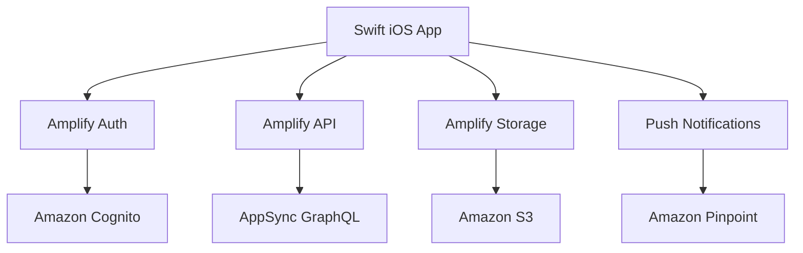

# How to Use Amplify with Swift (iOS)

Author: [nawazdhandala](https://github.com/nawazdhandala)

Tags: AWS, Amplify, Swift, iOS, Mobile Development, Apple

Description: Integrate AWS Amplify with your Swift iOS application to add authentication, APIs, storage, and push notifications using native Swift APIs.

---

Building an iOS app with a cloud backend means stitching together authentication, APIs, file storage, and push notifications. AWS Amplify for Swift provides native libraries that handle all of this with Swift-friendly APIs that support async/await, Combine, and SwiftUI. You get the power of AWS services without writing raw API calls or managing tokens manually.

This guide covers setting up Amplify in a Swift iOS project, implementing authentication, connecting to a GraphQL API, and adding file storage.

## What Amplify for Swift Includes

The Amplify Swift library provides these categories:

- **Auth**: Cognito-based authentication with sign-up, sign-in, MFA, and social providers
- **API**: GraphQL (AppSync) and REST (API Gateway) with code generation
- **Storage**: S3 file upload and download with progress tracking
- **Analytics**: User behavior tracking via Pinpoint
- **Geo**: Maps and location services
- **Predictions**: AI/ML features (text detection, translation, sentiment analysis)



## Prerequisites

- Xcode 15 or later
- iOS 16 or later deployment target
- An AWS account
- Amplify CLI installed (`npm install -g @aws-amplify/cli`)
- CocoaPods or Swift Package Manager

## Step 1: Create the Backend

Initialize Amplify and create the backend resources:

```bash
# Navigate to your Xcode project directory
cd MyiOSApp

# Initialize Amplify
amplify init

# Add authentication
amplify add auth
# Choose default configuration with email sign-in

# Add a GraphQL API
amplify add api
# Choose GraphQL, Amazon Cognito User Pool authorization

# Add storage
amplify add storage
# Choose Content (Images, audio, video, etc.)

# Deploy the backend
amplify push
```

This generates an `amplifyconfiguration.json` file and GraphQL model files.

## Step 2: Add Amplify via Swift Package Manager

In Xcode, go to File > Add Package Dependencies and add:

```
https://github.com/aws-amplify/amplify-swift
```

Select the packages you need:
- Amplify
- AWSCognitoAuthPlugin
- AWSAPIPlugin
- AWSS3StoragePlugin

## Step 3: Configure Amplify in Your App

Configure Amplify when the app launches:

```swift
// MyiOSAppApp.swift
import SwiftUI
import Amplify
import AWSCognitoAuthPlugin
import AWSAPIPlugin
import AWSS3StoragePlugin

@main
struct MyiOSAppApp: App {
    init() {
        configureAmplify()
    }

    var body: some Scene {
        WindowGroup {
            ContentView()
        }
    }

    private func configureAmplify() {
        do {
            // Add the auth plugin
            try Amplify.add(plugin: AWSCognitoAuthPlugin())

            // Add the API plugin
            try Amplify.add(plugin: AWSAPIPlugin(modelRegistration: AmplifyModels()))

            // Add the storage plugin
            try Amplify.add(plugin: AWSS3StoragePlugin())

            // Configure Amplify with the generated configuration
            try Amplify.configure()

            print("Amplify configured successfully")
        } catch {
            print("Failed to configure Amplify: \(error)")
        }
    }
}
```

## Step 4: Implement Authentication

### Sign Up

```swift
// Views/SignUpView.swift
import SwiftUI
import Amplify

struct SignUpView: View {
    @State private var email = ""
    @State private var password = ""
    @State private var confirmationCode = ""
    @State private var showConfirmation = false
    @State private var errorMessage = ""

    var body: some View {
        VStack(spacing: 20) {
            if !showConfirmation {
                TextField("Email", text: $email)
                    .textFieldStyle(.roundedBorder)
                    .autocapitalization(.none)
                    .keyboardType(.emailAddress)

                SecureField("Password", text: $password)
                    .textFieldStyle(.roundedBorder)

                Button("Sign Up") {
                    Task { await signUp() }
                }
                .buttonStyle(.borderedProminent)
            } else {
                TextField("Confirmation Code", text: $confirmationCode)
                    .textFieldStyle(.roundedBorder)
                    .keyboardType(.numberPad)

                Button("Confirm") {
                    Task { await confirmSignUp() }
                }
                .buttonStyle(.borderedProminent)
            }

            if !errorMessage.isEmpty {
                Text(errorMessage)
                    .foregroundColor(.red)
                    .font(.caption)
            }
        }
        .padding()
    }

    // Sign up with email and password
    private func signUp() async {
        do {
            let options = AuthSignUpRequest.Options(
                userAttributes: [AuthUserAttribute(.email, value: email)]
            )

            let result = try await Amplify.Auth.signUp(
                username: email,
                password: password,
                options: options
            )

            switch result.nextStep {
            case .confirmUser:
                showConfirmation = true
            case .done:
                print("Sign up complete")
            default:
                break
            }
        } catch let error as AuthError {
            errorMessage = error.errorDescription
        } catch {
            errorMessage = "Unexpected error: \(error)"
        }
    }

    // Confirm sign up with verification code
    private func confirmSignUp() async {
        do {
            let result = try await Amplify.Auth.confirmSignUp(
                for: email,
                confirmationCode: confirmationCode
            )

            if result.isSignUpComplete {
                print("Sign up confirmed successfully")
            }
        } catch let error as AuthError {
            errorMessage = error.errorDescription
        } catch {
            errorMessage = "Unexpected error: \(error)"
        }
    }
}
```

### Sign In

```swift
// Views/SignInView.swift
import SwiftUI
import Amplify

struct SignInView: View {
    @State private var email = ""
    @State private var password = ""
    @State private var isSignedIn = false
    @State private var errorMessage = ""

    var body: some View {
        if isSignedIn {
            HomeView()
        } else {
            VStack(spacing: 20) {
                TextField("Email", text: $email)
                    .textFieldStyle(.roundedBorder)
                    .autocapitalization(.none)

                SecureField("Password", text: $password)
                    .textFieldStyle(.roundedBorder)

                Button("Sign In") {
                    Task { await signIn() }
                }
                .buttonStyle(.borderedProminent)

                if !errorMessage.isEmpty {
                    Text(errorMessage).foregroundColor(.red)
                }
            }
            .padding()
            .task {
                await checkAuthSession()
            }
        }
    }

    private func signIn() async {
        do {
            let result = try await Amplify.Auth.signIn(
                username: email,
                password: password
            )

            if result.isSignedIn {
                isSignedIn = true
            }
        } catch let error as AuthError {
            errorMessage = error.errorDescription
        } catch {
            errorMessage = "Sign in failed: \(error)"
        }
    }

    // Check if user is already signed in
    private func checkAuthSession() async {
        do {
            let session = try await Amplify.Auth.fetchAuthSession()
            isSignedIn = session.isSignedIn
        } catch {
            print("Session check failed: \(error)")
        }
    }
}
```

## Step 5: Use the GraphQL API

Query and mutate data with Swift async/await:

```swift
// Services/TodoService.swift
import Amplify

struct Todo: Codable {
    let id: String
    let title: String
    let description: String?
    let completed: Bool
    let createdAt: String?
}

struct TodoConnection: Codable {
    let items: [Todo]
}

struct ListTodosResponse: Codable {
    let listTodos: TodoConnection
}

class TodoService {
    // Fetch all todos
    static func listTodos() async throws -> [Todo] {
        let query = """
        query ListTodos {
            listTodos {
                items {
                    id
                    title
                    description
                    completed
                    createdAt
                }
            }
        }
        """

        let request = GraphQLRequest<ListTodosResponse>(
            document: query,
            responseType: ListTodosResponse.self
        )

        let result = try await Amplify.API.query(request: request)

        switch result {
        case .success(let response):
            return response.listTodos.items
        case .failure(let error):
            throw error
        }
    }

    // Create a new todo
    static func createTodo(title: String, description: String?) async throws -> Todo {
        let mutation = """
        mutation CreateTodo($input: CreateTodoInput!) {
            createTodo(input: $input) {
                id
                title
                description
                completed
                createdAt
            }
        }
        """

        let variables: [String: Any] = [
            "input": [
                "title": title,
                "description": description ?? "",
                "completed": false
            ]
        ]

        let request = GraphQLRequest<Todo>(
            document: mutation,
            variables: variables,
            responseType: Todo.self,
            decodePath: "createTodo"
        )

        let result = try await Amplify.API.mutate(request: request)

        switch result {
        case .success(let todo):
            return todo
        case .failure(let error):
            throw error
        }
    }
}
```

## Step 6: File Storage

Upload and download files with progress tracking:

```swift
// Services/StorageService.swift
import Amplify
import Foundation

class StorageService {
    // Upload an image to S3
    static func uploadImage(
        data: Data,
        key: String,
        onProgress: ((Double) -> Void)? = nil
    ) async throws -> String {
        let task = Amplify.Storage.uploadData(
            key: key,
            data: data,
            options: .init(accessLevel: .private)
        )

        // Track upload progress
        for await progress in await task.progress {
            let fraction = progress.fractionCompleted
            onProgress?(fraction)
        }

        let result = try await task.value
        return result.key
    }

    // Get a download URL for a file
    static func getDownloadURL(key: String) async throws -> URL {
        let result = try await Amplify.Storage.getURL(
            key: key,
            options: .init(
                accessLevel: .private,
                expires: 3600 // URL valid for 1 hour
            )
        )
        return result
    }

    // Download file data
    static func downloadFile(key: String) async throws -> Data {
        let task = Amplify.Storage.downloadData(
            key: key,
            options: .init(accessLevel: .private)
        )

        let result = try await task.value
        return result
    }

    // List files in a path
    static func listFiles(path: String) async throws -> [Amplify.StorageListResult.Item] {
        let result = try await Amplify.Storage.list(
            options: .init(
                accessLevel: .private,
                path: path
            )
        )
        return result.items
    }
}
```

## Step 7: Build a SwiftUI View with Storage

```swift
// Views/PhotoUploadView.swift
import SwiftUI
import PhotosUI
import Amplify

struct PhotoUploadView: View {
    @State private var selectedItem: PhotosPickerItem?
    @State private var uploadProgress: Double = 0
    @State private var isUploading = false
    @State private var uploadedImageURL: URL?

    var body: some View {
        VStack(spacing: 20) {
            PhotosPicker(
                selection: $selectedItem,
                matching: .images
            ) {
                Label("Select Photo", systemImage: "photo")
            }

            if isUploading {
                ProgressView(value: uploadProgress)
                    .progressViewStyle(.linear)
                Text("\(Int(uploadProgress * 100))%")
            }

            if let url = uploadedImageURL {
                AsyncImage(url: url) { image in
                    image.resizable().scaledToFit()
                } placeholder: {
                    ProgressView()
                }
                .frame(maxHeight: 300)
            }
        }
        .padding()
        .onChange(of: selectedItem) { newItem in
            Task { await uploadPhoto(item: newItem) }
        }
    }

    private func uploadPhoto(item: PhotosPickerItem?) async {
        guard let item = item,
              let data = try? await item.loadTransferable(type: Data.self) else {
            return
        }

        isUploading = true
        let key = "photos/\(UUID().uuidString).jpg"

        do {
            let _ = try await StorageService.uploadImage(
                data: data,
                key: key,
                onProgress: { progress in
                    uploadProgress = progress
                }
            )

            // Get the download URL to display the image
            uploadedImageURL = try await StorageService.getDownloadURL(key: key)
            isUploading = false
        } catch {
            print("Upload failed: \(error)")
            isUploading = false
        }
    }
}
```

## Step 8: Sign Out

```swift
// Sign out the current user
func signOut() async {
    let result = await Amplify.Auth.signOut()

    guard let signOutResult = result as? AWSCognitoSignOutResult else {
        print("Sign out failed")
        return
    }

    switch signOutResult {
    case .complete:
        print("Signed out successfully")
    case .partial(revokeTokenError: let revokeTokenError,
                  globalSignOutError: let globalSignOutError,
                  hostedUIError: let hostedUIError):
        // Handle partial sign out
        if let revokeError = revokeTokenError {
            print("Revoke token error: \(revokeError)")
        }
    case .failed(let error):
        print("Sign out failed: \(error)")
    }
}
```

## Best Practices

**Use async/await throughout**: Amplify Swift fully supports Swift concurrency. Use async/await instead of callback-based patterns for cleaner code.

**Handle auth state with Combine**: Subscribe to Amplify's auth state publisher to reactively update your UI when the user signs in or out.

**Use private access level for user files**: Unless files need to be shared between users, use `.private` access level in Storage. This scopes files to the authenticated user.

**Enable background transfers**: For large file uploads, configure the Storage plugin to use background URLSession so uploads continue if the app goes to the background.

## Wrapping Up

Amplify for Swift gives you a native, type-safe way to integrate AWS services into your iOS app. The Swift async/await support makes the code clean and readable, and the SwiftUI compatibility means you can build modern, reactive UIs with minimal boilerplate. For cross-platform development with Flutter, see [Amplify with Flutter](https://oneuptime.com/blog/post/use-amplify-with-flutter/view). For Android, check out [Amplify with Android Kotlin](https://oneuptime.com/blog/post/use-amplify-with-android-kotlin/view).
