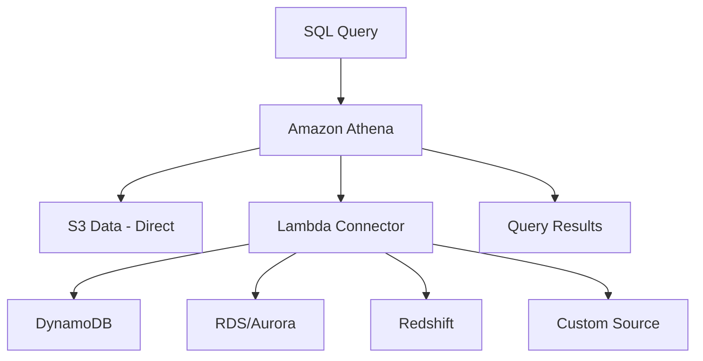

# How to Use Athena Federated Query to Query Multiple Data Sources

Author: [nawazdhandala](https://github.com/nawazdhandala)

Tags: AWS, Amazon Athena, Federated Query, SQL, Data Integration

Description: Learn how to use Athena Federated Query to run SQL queries across multiple data sources including DynamoDB, RDS, Redshift, and custom sources from a single query.

---

Your data lives everywhere. Some of it is in S3, some in DynamoDB, some in RDS, and maybe some in a third-party API. Normally, you'd have to extract everything into one place before you could join it together. Athena Federated Query lets you skip that step and query all these sources directly from Athena using standard SQL.

Instead of ETL-ing data into S3, you write a query that joins an S3 table with a DynamoDB table with an RDS database - all in one SQL statement. Athena handles the communication with each data source through connectors.

## How Federated Queries Work

Athena uses Lambda-based connectors to talk to external data sources. When your query references a federated table, Athena invokes the appropriate Lambda function to fetch the data, then processes it alongside your S3 data.



AWS provides pre-built connectors for many data sources. You can also build custom connectors using the Athena Query Federation SDK.

## Available Pre-Built Connectors

AWS maintains connectors for:

- Amazon DynamoDB
- Amazon RDS (MySQL, PostgreSQL)
- Amazon Redshift
- Amazon CloudWatch Logs
- Amazon CloudWatch Metrics
- Amazon DocumentDB
- Amazon Neptune
- Apache HBase
- Redis
- JDBC sources (generic)

Each connector is deployed as a Lambda function in your account.

## Setting Up a DynamoDB Connector

Let's set up the most common federated query scenario - querying DynamoDB from Athena.

### Deploy the Connector

The easiest way is through the AWS Serverless Application Repository:

```bash
# Deploy the DynamoDB connector from the Serverless Application Repository
aws serverlessrepo create-cloud-formation-change-set \
  --application-id arn:aws:serverlessrepo:us-east-1:292517598671:applications/AthenaDynamoDBConnector \
  --stack-name athena-dynamodb-connector \
  --capabilities CAPABILITY_IAM \
  --parameter-overrides '[
    {"name": "AthenaCatalogName", "value": "dynamodb_catalog"},
    {"name": "SpillBucket", "value": "my-athena-spill-bucket"},
    {"name": "DisableSpillEncryption", "value": "false"}
  ]'
```

The spill bucket is where the connector writes data that's too large to return in a single Lambda response.

### Register the Catalog

After deployment, register the data source in Athena:

```bash
# Register the DynamoDB connector as an Athena data catalog
aws athena create-data-catalog \
  --name dynamodb_catalog \
  --type LAMBDA \
  --parameters "function=arn:aws:lambda:us-east-1:YOUR_ACCOUNT:function:dynamodb_catalog"
```

### Query DynamoDB Tables

Now you can query DynamoDB tables directly:

```sql
-- Query a DynamoDB table through the federated connector
SELECT
    user_id,
    user_name,
    email,
    subscription_tier
FROM dynamodb_catalog.default.users
WHERE subscription_tier = 'premium';
```

The three-part naming is `catalog.schema.table`. For DynamoDB, the schema is always `default` and the table name matches your DynamoDB table name.

## Joining S3 Data with DynamoDB

Here's where it gets powerful - joining across data sources:

```sql
-- Join S3 event data with DynamoDB user profiles
SELECT
    e.event_type,
    e.event_time,
    u.user_name,
    u.subscription_tier,
    e.event_data
FROM analytics.events e
INNER JOIN dynamodb_catalog.default.users u
    ON e.user_id = u.user_id
WHERE e.year = '2025'
    AND e.month = '01'
    AND u.subscription_tier = 'premium';
```

This query reads events from Parquet files in S3 and user profiles from DynamoDB, joining them on `user_id`. The S3 data uses partition pruning (year/month), and the DynamoDB connector pushes down the subscription filter.

## Setting Up an RDS Connector

For relational databases, use the JDBC connector:

```bash
# Deploy the JDBC connector for RDS
aws serverlessrepo create-cloud-formation-change-set \
  --application-id arn:aws:serverlessrepo:us-east-1:292517598671:applications/AthenaJdbcConnector \
  --stack-name athena-rds-connector \
  --capabilities CAPABILITY_IAM \
  --parameter-overrides '[
    {"name": "AthenaCatalogName", "value": "rds_catalog"},
    {"name": "DefaultConnectionString", "value": "postgres://jdbc:postgresql://mydb.cluster-abc123.us-east-1.rds.amazonaws.com:5432/mydb?user=${rds_user}&password=${rds_password}"},
    {"name": "SpillBucket", "value": "my-athena-spill-bucket"},
    {"name": "SecretNamePrefix", "value": "athena-rds-"}
  ]'
```

Store credentials in AWS Secrets Manager:

```bash
# Store RDS credentials in Secrets Manager
aws secretsmanager create-secret \
  --name athena-rds-mydb \
  --secret-string '{"username":"analyst","password":"secure-password-here"}'
```

Register and query:

```sql
-- Query an RDS PostgreSQL table through the JDBC connector
SELECT
    order_id,
    customer_id,
    total_amount,
    order_status
FROM rds_catalog.public.orders
WHERE order_date >= DATE '2025-01-01'
LIMIT 1000;
```

## Cross-Source Analytics

Now join all three sources:

```sql
-- Three-way join across S3, DynamoDB, and RDS
WITH recent_events AS (
    SELECT user_id, COUNT(*) as event_count
    FROM analytics.events
    WHERE year = '2025' AND month = '02'
    GROUP BY user_id
),
active_users AS (
    SELECT
        u.user_id,
        u.user_name,
        u.subscription_tier,
        e.event_count
    FROM dynamodb_catalog.default.users u
    INNER JOIN recent_events e ON u.user_id = e.user_id
    WHERE e.event_count > 10
)
SELECT
    au.user_name,
    au.subscription_tier,
    au.event_count,
    SUM(o.total_amount) as total_spend
FROM active_users au
LEFT JOIN rds_catalog.public.orders o ON au.user_id = o.customer_id
GROUP BY au.user_name, au.subscription_tier, au.event_count
ORDER BY total_spend DESC;
```

This finds active users from S3 event logs, enriches them with DynamoDB profiles, and calculates their spending from RDS order data.

## Building a Custom Connector

If AWS doesn't have a pre-built connector for your data source, you can build one. The Athena Query Federation SDK provides a Java framework:

```java
// Custom connector handler for an external API
public class MyApiRecordHandler extends RecordHandler {

    @Override
    protected void readWithConstraint(
        BlockSpiller spiller,
        ReadRecordsRequest request,
        QueryStatusChecker queryStatusChecker
    ) throws Exception {
        // Fetch data from your custom source
        String tableName = request.getTableName().getTableName();
        Map<String, ValueSet> constraints = request.getConstraints().getSummary();

        // Apply any pushed-down filters
        List<Record> records = myApiClient.fetchRecords(tableName, constraints);

        // Write records to the spiller
        for (Record record : records) {
            spiller.writeRows((Block block, int rowNum) -> {
                block.setValue("id", rowNum, record.getId());
                block.setValue("name", rowNum, record.getName());
                block.setValue("value", rowNum, record.getValue());
                return 1;
            });
        }
    }
}
```

Deploy it as a Lambda function and register it just like the pre-built connectors.

## Performance Considerations

Federated queries have different performance characteristics than pure S3 queries:

**Lambda cold starts** can add latency. The first query after a period of inactivity might take a few extra seconds while the connector Lambda initializes.

**Network throughput** matters. Data from external sources travels through Lambda, which has bandwidth limits. For large result sets, consider materializing the data to S3 first.

**Predicate pushdown** varies by connector. The DynamoDB connector can push down key conditions, and the JDBC connector pushes down WHERE clauses. But complex expressions might not push down, causing more data to be fetched than necessary.

**Best practices for federated performance:**

1. Filter as much as possible in WHERE clauses - connectors push these down
2. Limit the columns you select from federated sources
3. Join large S3 tables with smaller federated tables (not the other way around)
4. Consider caching frequently queried federated data as materialized views in S3

```sql
-- Materialize federated data into S3 for faster repeated access
CREATE TABLE analytics.user_profiles_snapshot
WITH (format = 'PARQUET', external_location = 's3://my-bucket/snapshots/users/')
AS SELECT * FROM dynamodb_catalog.default.users;
```

Run this nightly and query the snapshot for most use cases. Use the live federated query only when you need real-time data.

## Cost Implications

Federated queries incur additional costs:

- Lambda invocation and duration charges for the connector
- Data transfer charges between the source and Lambda
- Standard Athena data scanning charges for S3 data in the same query

For moderate query volumes, these costs are minimal. But if you're running thousands of federated queries per day against large external tables, the Lambda costs can add up. Monitor them through CloudWatch.

For overall cost visibility across your AWS services, check out our post on [reducing Athena query costs](https://oneuptime.com/blog/post/reduce-athena-query-costs/view).

## Wrapping Up

Athena Federated Query eliminates the need for complex ETL pipelines just to run cross-source analytics. You can query DynamoDB, RDS, Redshift, and custom sources right alongside your S3 data using familiar SQL. The pre-built connectors cover most common scenarios, and the SDK lets you extend to any source you need.

Start with the pre-built connectors, optimize with predicate pushdown and column selection, and materialize hot data to S3 when performance matters.
