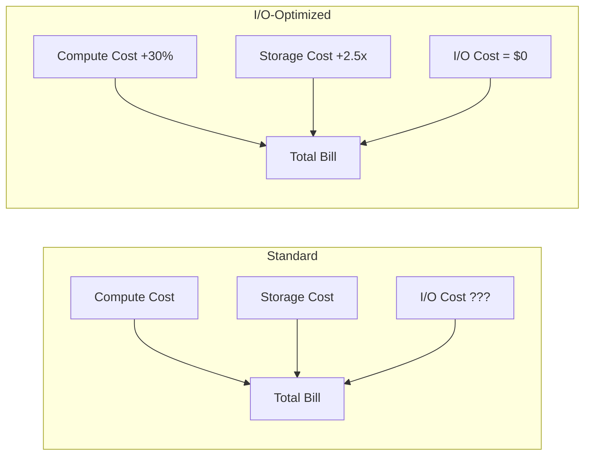

# How to Use Aurora I/O-Optimized for Predictable Pricing

Author: [nawazdhandala](https://github.com/nawazdhandala)

Tags: AWS, Aurora, Database, Cost Optimization, I/O-Optimized

Description: Learn when and how to switch to Aurora I/O-Optimized storage to eliminate unpredictable I/O charges and reduce database costs by up to 40 percent.

---

If you have ever been surprised by your Aurora bill, you are not alone. The standard Aurora pricing model charges separately for I/O operations, and those charges can be wildly unpredictable. A batch job that runs once a month, a poorly optimized query that causes extra page reads, or a traffic spike can all send your I/O costs through the roof.

Aurora I/O-Optimized is a storage configuration that eliminates per-I/O charges entirely. You pay a higher price for compute and storage, but you never see a separate I/O line item on your bill. For workloads where I/O costs represent 25% or more of your total Aurora spend, this can save you serious money.

## How Aurora Pricing Works

Let's break down the two models.

### Standard Aurora Pricing

- Compute: per instance-hour
- Storage: per GB-month
- I/O: per million I/O requests ($0.20 per million for reads, $0.20 per million for writes)

### I/O-Optimized Pricing

- Compute: per instance-hour (approximately 30% higher than standard)
- Storage: per GB-month (approximately 2.5x higher than standard)
- I/O: $0 (included)



## When Does I/O-Optimized Save Money?

The break-even point depends on your specific workload, but a good rule of thumb: if I/O charges make up more than 25% of your total Aurora bill, I/O-Optimized will likely save you money.

Here is a script to analyze your current Aurora costs and estimate savings.

```python
# Analyze Aurora costs and estimate I/O-Optimized savings
import boto3
from datetime import datetime, timedelta

ce = boto3.client('ce')

# Get last month's Aurora costs broken down by usage type
end_date = datetime.now().strftime('%Y-%m-01')
start_date = (datetime.now().replace(day=1) - timedelta(days=1)).strftime('%Y-%m-01')

response = ce.get_cost_and_usage(
    TimePeriod={'Start': start_date, 'End': end_date},
    Granularity='MONTHLY',
    Metrics=['BlendedCost'],
    Filter={
        'Dimensions': {
            'Key': 'SERVICE',
            'Values': ['Amazon Relational Database Service']
        }
    },
    GroupBy=[{'Type': 'DIMENSION', 'Key': 'USAGE_TYPE'}]
)

io_cost = 0
compute_cost = 0
storage_cost = 0

for group in response['ResultsByTime'][0]['Groups']:
    usage_type = group['Keys'][0]
    cost = float(group['Metrics']['BlendedCost']['Amount'])

    if 'Aurora:StorageIOUsage' in usage_type:
        io_cost += cost
    elif 'Aurora:ServerlessV2' in usage_type or 'InstanceUsage' in usage_type:
        compute_cost += cost
    elif 'Aurora:StorageUsage' in usage_type:
        storage_cost += cost

total = io_cost + compute_cost + storage_cost
io_percentage = (io_cost / total * 100) if total > 0 else 0

print(f"Current Aurora Costs (Monthly):")
print(f"  Compute:  ${compute_cost:,.2f}")
print(f"  Storage:  ${storage_cost:,.2f}")
print(f"  I/O:      ${io_cost:,.2f}")
print(f"  Total:    ${total:,.2f}")
print(f"  I/O %:    {io_percentage:.1f}%")
print()

# Estimate I/O-Optimized costs
io_opt_compute = compute_cost * 1.30  # 30% higher compute
io_opt_storage = storage_cost * 2.50  # 2.5x storage
io_opt_total = io_opt_compute + io_opt_storage

savings = total - io_opt_total
savings_pct = (savings / total * 100) if total > 0 else 0

print(f"Estimated I/O-Optimized Costs (Monthly):")
print(f"  Compute:  ${io_opt_compute:,.2f}")
print(f"  Storage:  ${io_opt_storage:,.2f}")
print(f"  I/O:      $0.00")
print(f"  Total:    ${io_opt_total:,.2f}")
print(f"  Savings:  ${savings:,.2f} ({savings_pct:.1f}%)")
```

## Switching to I/O-Optimized

### Check Current Storage Configuration

```bash
# Check if your cluster is on Standard or I/O-Optimized
aws rds describe-db-clusters \
  --db-cluster-identifier my-aurora-cluster \
  --query 'DBClusters[0].{Cluster:DBClusterIdentifier,StorageType:StorageType,Engine:Engine}'
```

If `StorageType` is `aurora` or empty, you are on Standard. If it is `aurora-iopt1`, you are on I/O-Optimized.

### Switch to I/O-Optimized

The switch is a simple modify command with zero downtime.

```bash
# Switch to I/O-Optimized storage - no downtime required
aws rds modify-db-cluster \
  --db-cluster-identifier my-aurora-cluster \
  --storage-type aurora-iopt1 \
  --apply-immediately
```

The change takes effect within a few minutes. There is no restart, no failover, and no connection interruption.

### Switch Back to Standard

If you find that I/O-Optimized is not saving you money, you can switch back. Note that you can only switch once every 30 days.

```bash
# Switch back to Standard storage
aws rds modify-db-cluster \
  --db-cluster-identifier my-aurora-cluster \
  --storage-type aurora \
  --apply-immediately
```

## Real-World Scenarios

### Scenario 1: OLTP Application with Heavy Reads

An e-commerce application doing 500 million read I/O operations per month.

Standard cost:
- Compute (db.r6g.2xlarge): $1,168/month
- Storage (500 GB): $50/month
- Read I/O (500M): $100/month
- Total: $1,318/month

I/O-Optimized cost:
- Compute: $1,518/month
- Storage: $125/month
- I/O: $0/month
- Total: $1,643/month

**Result:** I/O-Optimized costs more here. Standard is cheaper for moderate I/O workloads.

### Scenario 2: Analytics Workload with Heavy I/O

A reporting database running complex queries that scan large amounts of data, doing 5 billion I/O operations per month.

Standard cost:
- Compute (db.r6g.4xlarge): $2,336/month
- Storage (2 TB): $200/month
- I/O (5B): $1,000/month
- Total: $3,536/month

I/O-Optimized cost:
- Compute: $3,037/month
- Storage: $500/month
- I/O: $0/month
- Total: $3,537/month

**Result:** Almost break-even. At this I/O level, you get cost predictability without extra spend.

### Scenario 3: Write-Heavy Application

A logging application doing 10 billion write I/O operations per month.

Standard cost:
- Compute (db.r6g.4xlarge): $2,336/month
- Storage (5 TB): $500/month
- Write I/O (10B): $2,000/month
- Total: $4,836/month

I/O-Optimized cost:
- Compute: $3,037/month
- Storage: $1,250/month
- I/O: $0/month
- Total: $4,287/month

**Result:** I/O-Optimized saves $549/month (11.3%). The heavier your I/O, the more you save.

## Monitoring After the Switch

After switching, monitor your costs to verify the savings.

```bash
# Set up a CloudWatch alarm to track Aurora costs via billing metrics
aws cloudwatch put-metric-alarm \
  --alarm-name aurora-monthly-cost \
  --namespace AWS/Billing \
  --metric-name EstimatedCharges \
  --dimensions Name=ServiceName,Value="Amazon Relational Database Service" \
  --statistic Maximum \
  --period 86400 \
  --threshold 5000 \
  --comparison-operator GreaterThanThreshold \
  --evaluation-periods 1 \
  --alarm-actions arn:aws:sns:us-east-1:123456789012:BillingAlerts
```

Also monitor your I/O metrics to understand workload patterns, even though you are no longer paying per I/O.

```bash
# Check read and write IOPS to understand your workload patterns
aws cloudwatch get-metric-statistics \
  --namespace AWS/RDS \
  --metric-name ReadIOPS \
  --dimensions Name=DBClusterIdentifier,Value=my-aurora-cluster \
  --start-time $(date -u -d '24 hours ago' +%Y-%m-%dT%H:%M:%S) \
  --end-time $(date -u +%Y-%m-%dT%H:%M:%S) \
  --period 3600 \
  --statistics Average
```

## Best Practices

1. **Run the cost analysis first.** Do not switch blindly. Analyze at least 3 months of cost data to account for seasonal variations.

2. **Consider all clusters.** If you have multiple Aurora clusters, some might benefit from I/O-Optimized while others are cheaper on Standard. Evaluate each one individually.

3. **Watch out for the 30-day lock-in.** You can only change storage types once every 30 days. Make sure you are confident before switching.

4. **I/O-Optimized works with Aurora Serverless v2.** If you are using Serverless v2, the compute pricing still scales with ACUs, but you eliminate I/O charges.

5. **This is per-cluster, not per-instance.** All instances in a cluster share the same storage type.

## Summary

Aurora I/O-Optimized eliminates the most unpredictable part of your Aurora bill. For I/O-heavy workloads, it can save up to 40% on database costs. For lighter workloads, Standard pricing is still cheaper. The key is running the numbers on your specific workload before making the switch.

For more on Aurora cost optimization, check out our guide on [Aurora Limitless Database for horizontal scaling](https://oneuptime.com/blog/post/2026-02-12-set-up-aurora-limitless-database-for-horizontal-scaling/view) and [Aurora Zero-ETL integration with Redshift](https://oneuptime.com/blog/post/2026-02-12-use-aurora-zero-etl-integration-with-redshift/view).
