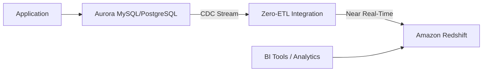

# How to Use Aurora Zero-ETL Integration with Redshift

Author: [nawazdhandala](https://github.com/nawazdhandala)

Tags: AWS, Aurora, Redshift, ETL, Analytics, Data Pipeline

Description: Set up Aurora Zero-ETL integration with Redshift to replicate transactional data for analytics without building or maintaining ETL pipelines.

---

Getting data from your transactional database into your analytics warehouse has always been a pain. You build ETL pipelines with tools like Glue or custom scripts, schedule them to run periodically, handle failures, deal with schema changes, and hope the data lands correctly. The whole process adds complexity, latency, and maintenance burden.

Aurora Zero-ETL integration with Redshift eliminates all of this. Once configured, Aurora automatically replicates data from your transactional database to Redshift in near real-time. No pipelines to build, no jobs to schedule, no data transformations to maintain. The data just shows up in Redshift, ready to query.

## How Zero-ETL Works

Aurora Zero-ETL uses change data capture (CDC) under the hood. When a row is inserted, updated, or deleted in Aurora, the change is captured and applied to Redshift automatically.



The replication is continuous and incremental. After the initial full load, only changes are replicated. Typical replication lag is seconds to minutes, depending on the volume of changes.

## Prerequisites

Before setting up Zero-ETL, you need:

- An Aurora MySQL-Compatible (version 3.05 or later) or Aurora PostgreSQL-Compatible (version 16.1 or later) cluster
- An Amazon Redshift Serverless workgroup or a provisioned Redshift cluster
- Both resources in the same AWS account and Region (cross-account is supported with additional setup)

## Step 1: Configure Aurora for Zero-ETL

Aurora needs enhanced binlog settings enabled for Zero-ETL. Create a custom cluster parameter group.

For Aurora MySQL:

```bash
# Create a parameter group with Zero-ETL settings enabled
aws rds create-db-cluster-parameter-group \
  --db-cluster-parameter-group-name aurora-zero-etl-params \
  --db-parameter-group-family aurora-mysql8.0 \
  --description "Parameter group for Zero-ETL integration"

# Enable binlog replication required for Zero-ETL
aws rds modify-db-cluster-parameter-group \
  --db-cluster-parameter-group-name aurora-zero-etl-params \
  --parameters \
    "ParameterName=aurora_enhanced_binlog,ParameterValue=1,ApplyMethod=pending-reboot" \
    "ParameterName=binlog_backup,ParameterValue=0,ApplyMethod=pending-reboot" \
    "ParameterName=binlog_format,ParameterValue=ROW,ApplyMethod=pending-reboot" \
    "ParameterName=binlog_row_image,ParameterValue=full,ApplyMethod=pending-reboot"
```

Apply the parameter group to your Aurora cluster.

```bash
# Apply the parameter group and reboot to activate
aws rds modify-db-cluster \
  --db-cluster-identifier my-aurora-cluster \
  --db-cluster-parameter-group-name aurora-zero-etl-params \
  --apply-immediately

# Reboot the cluster to apply the parameter changes
aws rds reboot-db-instance \
  --db-instance-identifier my-aurora-cluster-instance-1
```

## Step 2: Configure Redshift as a Target

Your Redshift cluster or serverless workgroup needs to allow incoming Zero-ETL integrations.

```bash
# For Redshift Serverless - update the workgroup to allow integrations
aws redshift-serverless update-workgroup \
  --workgroup-name my-analytics-workgroup \
  --config-parameters parameterKey=enable_case_sensitive_identifier,parameterValue=true
```

For provisioned Redshift clusters, you need to authorize the integration.

```bash
# Create a resource policy on the Redshift cluster to allow Zero-ETL
aws redshift create-integration-authorization \
  --cluster-identifier my-redshift-cluster \
  --authorized-integration-source arn:aws:rds:us-east-1:123456789012:cluster:my-aurora-cluster
```

## Step 3: Create the Zero-ETL Integration

```bash
# Create the Zero-ETL integration between Aurora and Redshift
aws rds create-integration \
  --integration-name aurora-to-redshift \
  --source-arn arn:aws:rds:us-east-1:123456789012:cluster:my-aurora-cluster \
  --target-arn arn:aws:redshift-serverless:us-east-1:123456789012:namespace/my-namespace-id \
  --tags Key=Environment,Value=production
```

This kicks off the initial data load. Depending on the size of your Aurora database, this can take anywhere from minutes to hours.

## Step 4: Create the Database in Redshift

After the integration is created, you need to create a database in Redshift that maps to the Aurora database.

```sql
-- In Redshift, create a database from the integration
CREATE DATABASE aurora_data FROM INTEGRATION '<integration-id>';
```

Replace `<integration-id>` with the integration ID from the create command output.

## Step 5: Query Your Data in Redshift

Once the initial load completes, your Aurora tables are available in Redshift.

```sql
-- Query transactional data that was automatically replicated from Aurora
SELECT
    DATE_TRUNC('day', order_date) as order_day,
    COUNT(*) as total_orders,
    SUM(total_amount) as revenue,
    AVG(total_amount) as avg_order_value
FROM aurora_data.public.orders
WHERE order_date >= '2026-01-01'
GROUP BY 1
ORDER BY 1;
```

The data is queryable using standard Redshift SQL. You can join it with other Redshift tables, create materialized views, and use it in your BI tools.

## Monitoring the Integration

### Check Integration Status

```bash
# Describe the integration to see its current status
aws rds describe-integrations \
  --integration-identifier aurora-to-redshift \
  --query 'Integrations[0].{Name:IntegrationName,Status:Status,Errors:Errors}'
```

### Monitor Replication Lag

```bash
# Check replication lag metrics in CloudWatch
aws cloudwatch get-metric-statistics \
  --namespace AWS/RDS \
  --metric-name ZeroETLIntegrationReplicationLatency \
  --dimensions Name=DBClusterIdentifier,Value=my-aurora-cluster \
  --start-time $(date -u -d '6 hours ago' +%Y-%m-%dT%H:%M:%S) \
  --end-time $(date -u +%Y-%m-%dT%H:%M:%S) \
  --period 300 \
  --statistics Average
```

### Set Up Alerts for Integration Issues

```bash
# Alert when replication lag exceeds 5 minutes
aws cloudwatch put-metric-alarm \
  --alarm-name zero-etl-lag-high \
  --namespace AWS/RDS \
  --metric-name ZeroETLIntegrationReplicationLatency \
  --dimensions Name=DBClusterIdentifier,Value=my-aurora-cluster \
  --statistic Average \
  --period 300 \
  --threshold 300 \
  --comparison-operator GreaterThanThreshold \
  --evaluation-periods 3 \
  --alarm-actions arn:aws:sns:us-east-1:123456789012:DataTeamAlerts
```

## Handling Schema Changes

One of the trickiest aspects of ETL pipelines is handling schema changes. Zero-ETL handles many schema changes automatically:

- **Adding columns** - New columns appear in Redshift automatically
- **Dropping columns** - Columns are removed from Redshift
- **Adding tables** - New tables are replicated automatically
- **Dropping tables** - Tables are removed from Redshift

Some changes require manual intervention:

```sql
-- If a schema change causes an issue, you can resync a specific table
ALTER DATABASE aurora_data INTEGRATION REFRESH TABLE public.orders;
```

## Filtering What Gets Replicated

You do not have to replicate everything. Use data filters to select specific databases or tables.

```bash
# Create an integration that only replicates specific tables
aws rds create-integration \
  --integration-name selective-replication \
  --source-arn arn:aws:rds:us-east-1:123456789012:cluster:my-aurora-cluster \
  --target-arn arn:aws:redshift-serverless:us-east-1:123456789012:namespace/my-namespace-id \
  --data-filter "include: mydb.orders, mydb.customers, mydb.products"
```

## Cost Considerations

Zero-ETL integration is free for the replication itself. You pay for:

- Aurora storage of the enhanced binlogs
- Redshift storage and compute for the replicated data
- Data transfer if cross-region (not recommended for latency reasons)

The enhanced binlog setting in Aurora increases storage by roughly 10-20% because Aurora needs to retain more change history. Factor this into your cost calculations.

## When to Use Zero-ETL vs. Traditional ETL

Zero-ETL is great for:
- Near real-time analytics on transactional data
- Removing ETL pipeline maintenance overhead
- Simple replication without transformation requirements

Traditional ETL (Glue, custom pipelines) is better for:
- Complex data transformations
- Aggregating data from multiple sources
- Data quality checks and validation before loading
- Cross-account or cross-region data movement

## Summary

Aurora Zero-ETL integration with Redshift removes one of the biggest headaches in data engineering - building and maintaining ETL pipelines to get transactional data into an analytics warehouse. The setup takes about 30 minutes, replication lag is typically under a minute, and schema changes are handled automatically. If you are running Aurora and Redshift in the same account and Region, there is very little reason not to use it.

For more on Aurora, check out our guides on [Aurora I/O-Optimized pricing](https://oneuptime.com/blog/post/2026-02-12-use-aurora-io-optimized-for-predictable-pricing/view) and [Aurora Limitless Database for horizontal scaling](https://oneuptime.com/blog/post/2026-02-12-set-up-aurora-limitless-database-for-horizontal-scaling/view).
