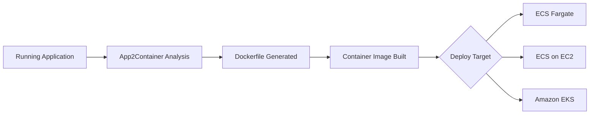

# How to Use AWS App2Container for Containerizing Java/.NET Apps

Author: [nawazdhandala](https://github.com/nawazdhandala)

Tags: AWS, App2Container, Docker, Java, .NET, ECS, Containers, Modernization

Description: Learn how to use AWS App2Container to automatically containerize Java and .NET applications and deploy them to ECS or EKS without rewriting code.

---

Containerizing existing Java and .NET applications usually means writing Dockerfiles from scratch, figuring out all the dependencies, and testing everything works in a container. AWS App2Container (A2C) automates this entire process. It analyzes your running application, generates a Dockerfile and container image, and creates the deployment artifacts for ECS or EKS. No code changes required.

This guide covers how to use App2Container to containerize and deploy your Java and .NET applications to AWS.

## What App2Container Supports

App2Container works with:
- **Java**: Applications running in Tomcat, JBoss, Spring Boot (standalone JAR), and other Java application servers
- **.NET**: Applications running in IIS on Windows
- **Operating Systems**: Amazon Linux, Ubuntu, RHEL, CentOS, Windows Server 2016+



## Prerequisites

Install App2Container on the server where your application runs:

### Linux Installation

```bash
# Download and install App2Container on Linux
curl -o AWSApp2Container-installer-linux.tar.gz \
  https://app2container-release-us-east-1.s3.us-east-1.amazonaws.com/latest/linux/AWSApp2Container-installer-linux.tar.gz

tar xvf AWSApp2Container-installer-linux.tar.gz

# Run the installer
sudo ./install.sh
```

### Windows Installation

```powershell
# Download and install App2Container on Windows
Invoke-WebRequest -Uri "https://app2container-release-us-east-1.s3.us-east-1.amazonaws.com/latest/windows/AWSApp2Container-installer-windows.zip" -OutFile "AWSApp2Container-installer-windows.zip"

Expand-Archive -Path AWSApp2Container-installer-windows.zip -DestinationPath C:\A2C

# Run the installer
C:\A2C\install.ps1
```

## Step 1: Initialize App2Container

Configure A2C with your AWS credentials and settings:

```bash
# Initialize App2Container
sudo app2container init

# This prompts for:
# - Workspace directory (where A2C stores artifacts)
# - AWS profile or credentials
# - S3 bucket for artifacts
# - Whether to collect usage metrics
```

The init command creates a configuration file at `/root/app2container/config.json`:

```json
{
  "workspace": "/root/app2container",
  "s3Bucket": "my-app2container-artifacts",
  "awsProfile": "default",
  "metricsReportDisabled": false
}
```

## Step 2: Discover Running Applications

App2Container inventory scans the server for running Java and .NET applications:

```bash
# Discover all containerizable applications
sudo app2container inventory
```

Output shows each discovered application with an ID:

```json
{
  "java-tomcat-6c7f2389": {
    "processId": 12345,
    "cmdline": "/usr/bin/java -Dcatalina.home=/opt/tomcat ...",
    "applicationType": "java-tomcat",
    "webApp": "myapp"
  },
  "java-springboot-a1b2c3d4": {
    "processId": 12346,
    "cmdline": "/usr/bin/java -jar /opt/myapp/app.jar",
    "applicationType": "java-generic",
    "webApp": ""
  }
}
```

For .NET on Windows:

```powershell
# Discover IIS applications on Windows
app2container inventory
```

```json
{
  "iis-mywebsite-abc123": {
    "siteName": "MyWebsite",
    "bindings": "http/*:80:",
    "applicationType": "iis",
    "dotnetVersion": "4.8"
  }
}
```

## Step 3: Analyze the Application

The analyze command performs a deep inspection of the application:

```bash
# Analyze a specific application
sudo app2container analyze --application-id java-tomcat-6c7f2389
```

This creates an analysis report at `/root/app2container/java-tomcat-6c7f2389/analysis.json`:

```json
{
  "analysisInfo": {
    "applicationId": "java-tomcat-6c7f2389",
    "applicationName": "myapp",
    "applicationPath": "/opt/tomcat",
    "javaVersion": "11.0.15",
    "serverType": "Tomcat",
    "serverVersion": "9.0.65"
  },
  "containerParameters": {
    "imageRepository": "java-tomcat-6c7f2389",
    "imageTag": "latest",
    "containerBaseImage": "amazoncorretto:11",
    "containerPort": 8080,
    "exposedPorts": [8080]
  },
  "deployTarget": "ECS",
  "ecsParameters": {
    "cpu": 2,
    "memory": 4096,
    "desiredCount": 2,
    "createEcsArtifacts": true
  }
}
```

Review and modify this file before containerization. You can adjust:
- Base image
- Container port
- CPU and memory allocation
- Deployment target (ECS or EKS)
- Desired container count

## Step 4: Containerize the Application

The containerize command builds the Docker image:

```bash
# Containerize the application
sudo app2container containerize --application-id java-tomcat-6c7f2389
```

This command:
1. Creates a Dockerfile based on the analysis
2. Copies application files, configurations, and dependencies
3. Builds the Docker container image
4. Runs basic validation

Here is an example of what the generated Dockerfile looks like:

```dockerfile
# Auto-generated by AWS App2Container
FROM amazoncorretto:11

# Install required system packages
RUN yum install -y shadow-utils procps

# Create application user
RUN groupadd -r tomcat && useradd -r -g tomcat tomcat

# Copy Tomcat installation
COPY --chown=tomcat:tomcat tomcat/ /opt/tomcat/

# Copy application WAR files
COPY --chown=tomcat:tomcat webapps/ /opt/tomcat/webapps/

# Copy configuration files
COPY --chown=tomcat:tomcat conf/ /opt/tomcat/conf/

# Set environment variables
ENV CATALINA_HOME=/opt/tomcat
ENV JAVA_OPTS="-Xmx2g -Xms512m"

# Expose application port
EXPOSE 8080

# Health check
HEALTHCHECK --interval=30s --timeout=10s --retries=3 \
    CMD curl -f http://localhost:8080/ || exit 1

USER tomcat

# Start Tomcat
CMD ["/opt/tomcat/bin/catalina.sh", "run"]
```

Verify the container works locally:

```bash
# Test the container locally
docker run -p 8080:8080 java-tomcat-6c7f2389:latest

# Test the application
curl http://localhost:8080/myapp/health
```

## Step 5: Generate Deployment Artifacts

Generate the CloudFormation templates and task definitions for deploying to ECS:

```bash
# Generate deployment artifacts
sudo app2container generate app-deployment --application-id java-tomcat-6c7f2389
```

This creates:
- ECS task definition
- ECS service definition
- CloudFormation template for the complete stack
- ECR repository configuration
- Application Load Balancer configuration
- Security groups and IAM roles

The generated CloudFormation template includes everything needed:

```yaml
# Generated CloudFormation template (simplified)
Resources:
  ECRRepository:
    Type: AWS::ECR::Repository
    Properties:
      RepositoryName: java-tomcat-6c7f2389

  ECSCluster:
    Type: AWS::ECS::Cluster
    Properties:
      ClusterName: a2c-java-tomcat-cluster

  TaskDefinition:
    Type: AWS::ECS::TaskDefinition
    Properties:
      Family: java-tomcat-6c7f2389
      Cpu: '2048'
      Memory: '4096'
      NetworkMode: awsvpc
      RequiresCompatibilities:
        - FARGATE
      ContainerDefinitions:
        - Name: java-tomcat-6c7f2389
          Image: !Sub '${AWS::AccountId}.dkr.ecr.${AWS::Region}.amazonaws.com/java-tomcat-6c7f2389:latest'
          PortMappings:
            - ContainerPort: 8080

  Service:
    Type: AWS::ECS::Service
    Properties:
      Cluster: !Ref ECSCluster
      TaskDefinition: !Ref TaskDefinition
      DesiredCount: 2
      LaunchType: FARGATE
```

## Step 6: Deploy to AWS

Push the container image and deploy the stack:

```bash
# Deploy everything to AWS
sudo app2container generate app-deployment \
  --application-id java-tomcat-6c7f2389 \
  --deploy
```

This command:
1. Pushes the container image to ECR
2. Deploys the CloudFormation stack
3. Creates the ECS cluster, service, load balancer, and networking
4. Starts the containerized application

Monitor the deployment:

```bash
# Check deployment status
aws cloudformation describe-stacks \
  --stack-name a2c-java-tomcat-6c7f2389 \
  --query 'Stacks[0].StackStatus'

# Check ECS service status
aws ecs describe-services \
  --cluster a2c-java-tomcat-cluster \
  --services java-tomcat-6c7f2389 \
  --query 'services[0].{desired: desiredCount, running: runningCount, status: status}'
```

## Containerizing .NET Applications on Windows

The process for IIS/.NET applications is similar:

```powershell
# Discover IIS applications
app2container inventory

# Analyze
app2container analyze --application-id iis-mywebsite-abc123

# Containerize
app2container containerize --application-id iis-mywebsite-abc123

# Generate deployment artifacts
app2container generate app-deployment --application-id iis-mywebsite-abc123
```

The generated Dockerfile for a .NET Framework application uses Windows Server Core:

```dockerfile
# Auto-generated Dockerfile for IIS/.NET application
FROM mcr.microsoft.com/dotnet/framework/aspnet:4.8-windowsservercore-ltsc2019

# Copy application files
COPY website/ /inetpub/wwwroot/

# Copy IIS configuration
COPY applicationHost.config /windows/system32/inetsrv/config/

# Install required Windows features
RUN powershell -Command \
    Install-WindowsFeature Web-Asp-Net45

EXPOSE 80

# IIS runs as a service, use ServiceMonitor
ENTRYPOINT ["C:\\ServiceMonitor.exe", "w3svc"]
```

## Handling Application Dependencies

A2C handles most dependencies automatically, but some need manual attention:

**Database connections**: Update connection strings to point to RDS or Aurora after deployment. Use environment variables or Secrets Manager.

**File system dependencies**: If the app writes to local disk, configure EFS volumes in the task definition.

**External service endpoints**: Update configuration to use AWS service endpoints or internal DNS names.

```bash
# Review and update the analysis.json for custom configurations
# before running containerize
sudo vim /root/app2container/java-tomcat-6c7f2389/analysis.json
```

## Setting Up CI/CD Pipeline

A2C can also generate a CI/CD pipeline:

```bash
# Generate pipeline artifacts
sudo app2container generate pipeline \
  --application-id java-tomcat-6c7f2389 \
  --pipeline-type CodePipeline
```

This creates a CodePipeline that automatically builds and deploys new versions when you push code changes.

## Monitoring After Deployment

After deploying your containerized application, set up monitoring to ensure it performs as well as or better than the original. CloudWatch Container Insights provides out-of-the-box metrics for ECS. For comprehensive application monitoring including uptime, performance, and incident management, [OneUptime](https://oneuptime.com/blog/post/2026-02-12-containerize-legacy-applications-for-aws/view) provides end-to-end visibility.

## Wrapping Up

AWS App2Container removes the manual work of containerizing Java and .NET applications. It analyzes your running application, generates a Dockerfile that captures all dependencies, builds the container image, and creates deployment artifacts for ECS or EKS. The entire process can take as little as an hour for straightforward applications. The key is reviewing the generated analysis.json before containerization to ensure the configuration matches your production requirements, and thoroughly testing the containerized application before switching production traffic.
