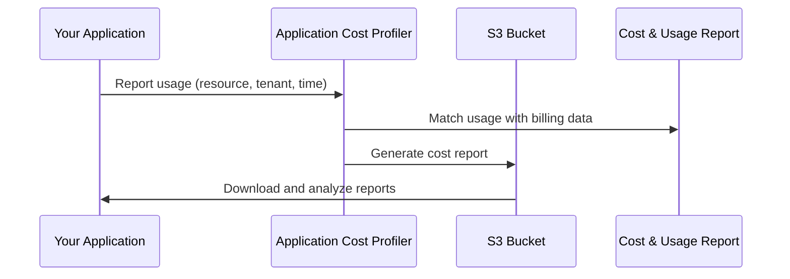

# How to Use AWS Application Cost Profiler

Author: [nawazdhandala](https://github.com/nawazdhandala)

Tags: AWS, Cost Management, Application Cost Profiler, FinOps, Cost Optimization

Description: Learn how to use AWS Application Cost Profiler to track and allocate costs at the application level for accurate chargeback and showback reporting.

---

Figuring out how much a specific application costs on AWS is one of the most common and frustrating challenges in cloud finance. Sure, you can look at Cost Explorer and filter by service, but when multiple applications share the same EC2 instances, databases, or other resources, cost allocation becomes a guessing game. AWS Application Cost Profiler tackles this by letting you report granular resource usage per application and tenant, then generates detailed cost reports you can use for chargeback and showback.

This guide covers how to set up Application Cost Profiler, instrument your applications to report usage, and interpret the cost reports it generates.

## What Is Application Cost Profiler?

Application Cost Profiler is an AWS service that takes usage data you provide and matches it with actual AWS costs to produce per-application (or per-tenant) cost breakdowns. The key difference from Cost Explorer is that you control the allocation logic.

Here is the flow:

1. Your application reports usage data to Application Cost Profiler (e.g., "Application A used this EC2 instance from 2:00 PM to 4:00 PM")
2. Application Cost Profiler matches that usage against your AWS bill
3. It produces a cost report showing how much each application or tenant consumed

This is particularly valuable for SaaS providers who need to understand per-tenant costs, or for organizations that run shared infrastructure and need to allocate costs back to business units.

## Use Cases

- **SaaS multi-tenant cost allocation:** Determine how much each customer costs you on AWS
- **Internal chargeback:** Bill internal teams for their actual infrastructure usage
- **Shared resource cost splitting:** Allocate costs of shared databases, caches, or compute clusters
- **Profitability analysis:** Understand which applications or customers are profitable

## How It Works



## Prerequisites

- An AWS account with Application Cost Profiler enabled
- An S3 bucket for receiving cost reports
- Your application instrumented to report resource usage
- AWS Cost and Usage Report (CUR) enabled in the same account

## Step 1: Set Up the Report Destination

First, create an S3 bucket where Application Cost Profiler will deliver reports:

```bash
# Create an S3 bucket for cost reports
aws s3 mb s3://my-app-cost-reports-123456789012

# Apply a bucket policy to allow Application Cost Profiler access
aws s3api put-bucket-policy \
  --bucket my-app-cost-reports-123456789012 \
  --policy '{
    "Version": "2012-10-17",
    "Statement": [
      {
        "Effect": "Allow",
        "Principal": {
          "Service": "application-cost-profiler.amazonaws.com"
        },
        "Action": [
          "s3:PutObject",
          "s3:GetBucketLocation"
        ],
        "Resource": [
          "arn:aws:s3:::my-app-cost-reports-123456789012",
          "arn:aws:s3:::my-app-cost-reports-123456789012/*"
        ]
      }
    ]
  }'
```

## Step 2: Configure the Report Definition

Create a report definition that specifies where and how often reports are generated:

```bash
# Create a report definition
aws application-cost-profiler put-report-definition \
  --report-id "tenant-cost-report" \
  --report-description "Monthly per-tenant cost allocation report" \
  --report-frequency MONTHLY \
  --format CSV \
  --destination-s3-location '{
    "bucket": "my-app-cost-reports-123456789012",
    "prefix": "reports/"
  }'
```

You can also generate reports on a daily basis for more granular tracking:

```bash
# Create a daily report for more granular tracking
aws application-cost-profiler put-report-definition \
  --report-id "daily-tenant-costs" \
  --report-description "Daily per-tenant cost allocation" \
  --report-frequency DAILY \
  --format CSV \
  --destination-s3-location '{
    "bucket": "my-app-cost-reports-123456789012",
    "prefix": "daily-reports/"
  }'
```

## Step 3: Instrument Your Application to Report Usage

This is the core integration step. Your application needs to report which resources are being used by which application or tenant, and for how long.

Here is a Python example that reports EC2 usage per tenant:

```python
# Python script to report resource usage to Application Cost Profiler
import boto3
import json
from datetime import datetime, timedelta

s3_client = boto3.client('s3')

def generate_usage_report(tenant_usage_data):
    """
    Generate a usage report file and upload to the import bucket.
    tenant_usage_data is a list of dicts with tenant, resource, start, end
    """
    lines = []
    for usage in tenant_usage_data:
        line = {
            "applicationId": usage["tenant_id"],
            "type": "Usage",
            "resourceId": usage["resource_id"],
            "usageAccountId": usage["account_id"],
            "startTime": usage["start_time"].isoformat() + "Z",
            "endTime": usage["end_time"].isoformat() + "Z",
            "usageQuantity": usage["usage_fraction"]
        }
        lines.append(json.dumps(line))

    report_content = "\n".join(lines)
    timestamp = datetime.utcnow().strftime("%Y%m%d%H%M%S")

    # Upload the usage report to the import bucket
    s3_client.put_object(
        Bucket="my-app-cost-profiler-import-123456789012",
        Key=f"usage-reports/{timestamp}-usage.json",
        Body=report_content
    )

# Example: Report that tenant-A used 60% and tenant-B used 40%
# of an EC2 instance during a specific hour
usage_data = [
    {
        "tenant_id": "tenant-A",
        "resource_id": "i-0123456789abcdef0",
        "account_id": "123456789012",
        "start_time": datetime(2026, 2, 12, 14, 0, 0),
        "end_time": datetime(2026, 2, 12, 15, 0, 0),
        "usage_fraction": 0.6
    },
    {
        "tenant_id": "tenant-B",
        "resource_id": "i-0123456789abcdef0",
        "account_id": "123456789012",
        "start_time": datetime(2026, 2, 12, 14, 0, 0),
        "end_time": datetime(2026, 2, 12, 15, 0, 0),
        "usage_fraction": 0.4
    }
]

generate_usage_report(usage_data)
print("Usage report uploaded successfully")
```

## Step 4: Automate Usage Reporting

For production use, you want usage reporting to happen automatically. Here is a Lambda function that runs on a schedule:

```python
# Lambda function to report hourly usage to Application Cost Profiler
import boto3
import json
from datetime import datetime, timedelta

def lambda_handler(event, context):
    """
    Runs hourly to report resource usage per tenant.
    Queries your application's usage tracking system and
    reports allocations to Application Cost Profiler.
    """
    dynamodb = boto3.resource('dynamodb')
    s3_client = boto3.client('s3')

    # Get usage data from your tracking table
    table = dynamodb.Table('resource-usage-tracking')
    end_time = datetime.utcnow().replace(minute=0, second=0, microsecond=0)
    start_time = end_time - timedelta(hours=1)

    response = table.scan(
        FilterExpression='#ts BETWEEN :start AND :end',
        ExpressionAttributeNames={'#ts': 'timestamp'},
        ExpressionAttributeValues={
            ':start': start_time.isoformat(),
            ':end': end_time.isoformat()
        }
    )

    # Build usage lines for each tenant-resource combination
    lines = []
    for item in response['Items']:
        line = {
            "applicationId": item['tenantId'],
            "type": "Usage",
            "resourceId": item['resourceId'],
            "usageAccountId": item['accountId'],
            "startTime": start_time.isoformat() + "Z",
            "endTime": end_time.isoformat() + "Z",
            "usageQuantity": float(item['usageFraction'])
        }
        lines.append(json.dumps(line))

    if lines:
        report_content = "\n".join(lines)
        key = f"usage/{end_time.strftime('%Y/%m/%d/%H')}-usage.json"
        s3_client.put_object(
            Bucket="my-app-cost-profiler-import-123456789012",
            Key=key,
            Body=report_content
        )

    return {
        'statusCode': 200,
        'body': f'Reported {len(lines)} usage records'
    }
```

Schedule this with an EventBridge rule:

```bash
# Create a scheduled rule to run the Lambda every hour
aws events put-rule \
  --name "hourly-usage-report" \
  --schedule-expression "rate(1 hour)" \
  --state ENABLED

# Add the Lambda as the target
aws events put-targets \
  --rule "hourly-usage-report" \
  --targets '[{
    "Id": "usage-reporter",
    "Arn": "arn:aws:lambda:us-east-1:123456789012:function:usage-reporter"
  }]'
```

## Step 5: Access and Analyze Reports

Reports are delivered to your S3 bucket based on the frequency you configured. The CSV reports contain columns like:

- Application ID (your tenant or application identifier)
- Resource ID
- Usage type
- Cost allocated
- Start and end time

You can analyze these reports using Amazon Athena for SQL queries:

```sql
-- Query to find total cost per tenant for the current month
SELECT
    application_id AS tenant,
    SUM(cost) AS total_cost,
    COUNT(DISTINCT resource_id) AS resources_used
FROM app_cost_reports
WHERE month = '2026-02'
GROUP BY application_id
ORDER BY total_cost DESC;
```

## Comparing with Other Cost Allocation Methods

| Method | Granularity | Effort | Accuracy |
|--------|-------------|--------|----------|
| AWS Tags | Resource-level | Low | Medium |
| Cost Categories | Service-level | Medium | Medium |
| Application Cost Profiler | Sub-resource | High | High |
| Split Cost Allocation | Container-level | Medium | High |

Application Cost Profiler gives you the highest accuracy because you define the exact allocation logic, but it requires the most instrumentation effort.

For container-specific cost allocation, you might also want to look at [AWS Split Cost Allocation for containers](https://oneuptime.com/blog/post/use-aws-split-cost-allocation-for-containers/view).

## Best Practices

1. **Start with your most expensive shared resources.** You do not need to instrument everything at once. Start with the big shared databases and compute clusters.

2. **Use consistent application IDs.** The application ID you report is how costs get grouped. Use the same IDs across all your usage reports.

3. **Report at least hourly.** More frequent reporting gives you more accurate cost allocation, especially for resources with variable pricing.

4. **Validate your allocation fractions.** Make sure usage fractions for a given resource and time period sum to 1.0 (or close to it). Missing allocation means unattributed costs.

5. **Combine with CUR data.** Use Application Cost Profiler reports alongside your Cost and Usage Report for a complete picture of both allocated and unallocated costs.

## Wrapping Up

AWS Application Cost Profiler fills a critical gap in cloud cost management by letting you allocate shared resource costs to specific applications or tenants with precision. While it requires more instrumentation than simple tagging, the accuracy of the resulting cost reports makes it invaluable for SaaS providers, shared service teams, and anyone who needs real chargeback or showback data. Start by instrumenting your most expensive shared resources and expand from there as you build confidence in your allocation model.
