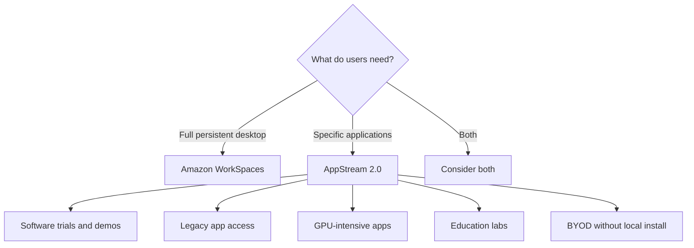

# How to Use AWS AppStream 2.0 for Application Streaming

Author: [nawazdhandala](https://github.com/nawazdhandala)

Tags: AWS, AppStream, Application Streaming, Remote Apps, SaaS, End User Computing

Description: Stream desktop applications to any device using AWS AppStream 2.0 without installing software locally or managing complex infrastructure.

---

Sometimes you do not need to give users a full virtual desktop. You just need them to access a specific application - maybe a CAD tool, a legacy Windows app, or a specialized analytics package. AppStream 2.0 streams individual applications to a browser or client, so users get the app they need without a full desktop environment and without installing anything on their local device.

This is different from Amazon WorkSpaces, which provides a full persistent desktop. AppStream is application-focused: users open a browser, launch the app they need, and start working. When they are done, the session ends. Think of it as making any desktop application available as a web app.

## When to Use AppStream vs WorkSpaces



AppStream shines when:
- Users only need one or two specific applications
- You want to deliver a software trial without installation
- Compliance requires the application and data to stay in the cloud
- The application needs GPU resources that user devices do not have
- You are running training labs or classrooms

## Step 1: Create an AppStream Image

An AppStream image contains the applications you want to stream. You build it using an Image Builder, which is basically a Windows instance where you install and configure your apps.

```bash
# Create an Image Builder instance to install your applications
aws appstream create-image-builder \
  --name "app-image-builder" \
  --description "Image builder for engineering applications" \
  --instance-type "stream.standard.large" \
  --image-name "AppStream-WinServer2022-02-12-2026" \
  --vpc-config '{
    "SubnetIds": ["subnet-abc123"],
    "SecurityGroupIds": ["sg-abc123"]
  }' \
  --enable-default-internet-access \
  --tags '{"Purpose": "ImageBuilding"}'
```

Once the Image Builder is running, connect to it via the AppStream console. Then:

1. Install your applications (CAD software, IDE, analytics tools, etc.)
2. Use the Image Assistant tool (on the desktop) to add each app to the catalog
3. Specify the app name, icon, and launch parameters
4. Create the image snapshot

```bash
# After configuring apps in the Image Assistant, the image is created
# Check image status
aws appstream describe-images \
  --names "engineering-apps-v1"
```

## Step 2: Create a Fleet

A fleet is a pool of streaming instances that serve your users. Each instance runs one user session.

```bash
# Create an always-on fleet for consistent availability
aws appstream create-fleet \
  --name "engineering-fleet" \
  --instance-type "stream.standard.large" \
  --fleet-type "ALWAYS_ON" \
  --image-name "engineering-apps-v1" \
  --compute-capacity '{"DesiredInstances": 5}' \
  --vpc-config '{
    "SubnetIds": ["subnet-abc123", "subnet-def456"],
    "SecurityGroupIds": ["sg-abc123"]
  }' \
  --max-user-duration-in-seconds 36000 \
  --disconnect-timeout-in-seconds 900 \
  --idle-disconnect-timeout-in-seconds 1800 \
  --enable-default-internet-access \
  --stream-view "APP" \
  --description "Fleet for engineering team applications"
```

Key fleet configurations:

**Fleet type** - `ALWAYS_ON` keeps instances running for instant availability. `ON_DEMAND` starts instances when users connect (cheaper but slower startup). `ELASTIC` auto-scales based on demand.

**Stream view** - `APP` shows only the application window. `DESKTOP` shows a full Windows desktop with the application.

**Disconnect timeout** - how long a disconnected session stays alive (so users can reconnect without losing work).

**Idle disconnect timeout** - disconnects idle users after the specified time.

### Auto-Scaling for Elastic Fleets

```bash
# Create an elastic fleet with auto-scaling
aws appstream create-fleet \
  --name "ondemand-engineering-fleet" \
  --instance-type "stream.standard.large" \
  --fleet-type "ELASTIC" \
  --image-name "engineering-apps-v1" \
  --compute-capacity '{"DesiredInstances": 2}' \
  --max-concurrent-sessions 20 \
  --vpc-config '{
    "SubnetIds": ["subnet-abc123", "subnet-def456"],
    "SecurityGroupIds": ["sg-abc123"]
  }' \
  --platform "WINDOWS_SERVER_2022" \
  --stream-view "APP"

# Set up scaling policies
aws appstream create-scaling-policy \
  --fleet-name "ondemand-engineering-fleet" \
  --policy-name "scale-out" \
  --policy-type "StepScaling" \
  --scaling-target-tracking-configuration '{
    "TargetValue": 75,
    "PredefinedMetricSpecification": {
      "PredefinedMetricType": "AppStreamAverageCapacityUtilization"
    },
    "ScaleInCooldown": 300,
    "ScaleOutCooldown": 60
  }'
```

## Step 3: Create a Stack

A stack ties together a fleet, user settings, and access policies:

```bash
# Create a stack with user settings
aws appstream create-stack \
  --name "engineering-stack" \
  --description "Engineering application access" \
  --storage-connectors '[
    {
      "ConnectorType": "HOMEFOLDERS",
      "ResourceIdentifier": ""
    },
    {
      "ConnectorType": "GOOGLE_DRIVE",
      "Domains": ["yourcompany.com"]
    }
  ]' \
  --user-settings '[
    {"Action": "CLIPBOARD_COPY_FROM_LOCAL_DEVICE", "Permission": "ENABLED"},
    {"Action": "CLIPBOARD_COPY_TO_LOCAL_DEVICE", "Permission": "ENABLED"},
    {"Action": "FILE_UPLOAD", "Permission": "ENABLED"},
    {"Action": "FILE_DOWNLOAD", "Permission": "ENABLED"},
    {"Action": "PRINTING_TO_LOCAL_DEVICE", "Permission": "ENABLED"}
  ]' \
  --application-settings '{
    "Enabled": true,
    "SettingsGroup": "engineering"
  }'
```

The `application-settings` with Enabled set to true makes application settings persistent across sessions. This means things like browser bookmarks, application preferences, and custom configurations are saved for the user.

### Associate Fleet with Stack

```bash
# Connect the fleet to the stack
aws appstream create-fleet-stack-association \
  --fleet-name "engineering-fleet" \
  --stack-name "engineering-stack"

# Start the fleet
aws appstream start-fleet --name "engineering-fleet"
```

## Step 4: Configure User Access

You can authenticate users via SAML (recommended for production) or create AppStream user pool accounts:

### SAML Authentication

```bash
# Set up SAML configuration for the stack
# This is typically done through the console by uploading
# your IdP's SAML metadata document

# The SAML assertion must include the stack name and other attributes
# Your IdP needs to be configured with the AppStream 2.0 relay state URL
```

### User Pool Authentication

```bash
# Create users in the AppStream user pool
aws appstream create-user \
  --user-name "jsmith@yourcompany.com" \
  --authentication-type "USERPOOL" \
  --first-name "Jane" \
  --last-name "Smith"

# Associate the user with a stack
aws appstream batch-associate-user-stack \
  --user-stack-associations '[
    {
      "StackName": "engineering-stack",
      "UserName": "jsmith@yourcompany.com",
      "AuthenticationType": "USERPOOL",
      "SendEmailNotification": true
    }
  ]'
```

The user will receive an email with instructions to set their password and connect.

## Step 5: Generate a Streaming URL

For programmatic access or embedded experiences, generate streaming URLs:

```bash
# Generate a streaming URL for a user session
aws appstream create-streaming-url \
  --stack-name "engineering-stack" \
  --fleet-name "engineering-fleet" \
  --user-id "jsmith@yourcompany.com" \
  --validity 300
```

This returns a URL that the user can open in a browser to immediately start streaming their applications. The URL is time-limited for security.

## Step 6: Monitor Usage

Track fleet utilization and user activity:

```bash
# Describe fleet sessions
aws appstream describe-sessions \
  --stack-name "engineering-stack" \
  --fleet-name "engineering-fleet" \
  --authentication-type "USERPOOL"

# Key CloudWatch metrics to watch:
# - CapacityUtilization - percentage of fleet instances in use
# - AvailableCapacity - number of instances ready for users
# - InsufficientCapacityError - users turned away due to no capacity
# - ActualCapacity - total running instances

# Set up alarm for capacity issues
aws cloudwatch put-metric-alarm \
  --alarm-name "AppStream-CapacityLow" \
  --namespace "AWS/AppStream" \
  --metric-name "AvailableCapacity" \
  --dimensions '[{"Name": "Fleet", "Value": "engineering-fleet"}]' \
  --statistic "Average" \
  --period 300 \
  --threshold 2 \
  --comparison-operator "LessThanThreshold" \
  --evaluation-periods 2 \
  --alarm-actions "arn:aws:sns:us-east-1:123456789012:ITAlerts"
```

## Cost Optimization

**Use ON_DEMAND or ELASTIC fleets** for applications that are not used continuously. Always-on fleets charge 24/7 regardless of usage.

**Right-size instance types.** Start with the smallest instance that runs your application smoothly. Use `stream.standard.medium` for basic apps and only go to GPU instances for CAD/3D workloads.

**Set aggressive idle timeouts.** If users typically need the app for 30-minute sessions, do not let idle sessions sit for hours.

**Use application settings persistence** selectively. It uses S3 storage under the hood, which adds cost. Only enable it for stacks where users actually benefit from persistent settings.

## Wrapping Up

AppStream 2.0 makes it possible to deliver any Windows application as a cloud-streamed service. It is simpler than full VDI when users only need specific apps, and it completely eliminates the installation and compatibility issues of traditional software deployment. The elastic fleet option with auto-scaling is particularly good for variable workloads like training sessions, software trials, or seasonal usage. Start with one application, test the user experience, and expand based on demand.
